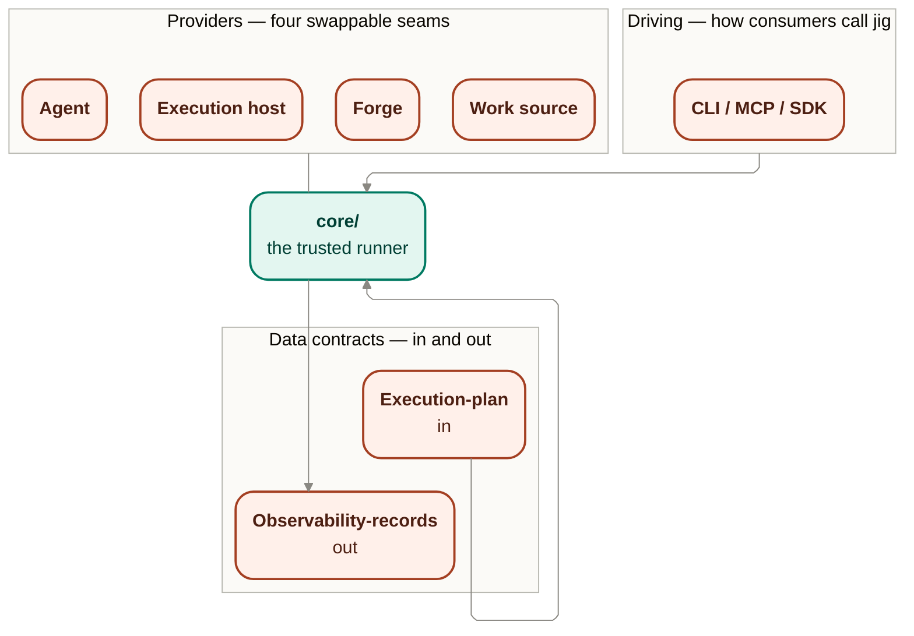

# Contracts — the boundary map

`contracts/` holds every interface at jig's edge, in three kinds: **driving** (how consumers
drive jig), **data** (what flows in and out), and **providers** (what plugs in). The fixed logic
behind all three lives in [`../core/`](../core/README.md); core is not a seam.

## Owns

- **Driving** — the CLI / MCP / SDK adapters consumers use to drive jig. See
  [`driving.md`](./driving.md).
- **Data** — the execution-plan contract in and the observability-records contract out, jig's
  one hard input and its durable output:
  [`execution-plan-contract-v0.md`](./execution-plan-contract-v0.md) and
  [`observability-records-contract-v0.md`](./observability-records-contract-v0.md).
- **Providers** — the four swappable seams (agent, execution host, forge, work source). See
  [`providers.md`](./providers.md).
- **Conformance boundary** — the provider adequacy suite is a future `jig-testkit` responsibility
  that tests SDK-owned ports and provider-facing types without entering the production runtime graph.

## Interface

This file is an index, not a port; see the linked files for the ports each boundary kind owns.

## Packaging and transport reconciliation

Two later design decisions refine how the seams above are packaged and adapted, without changing
the boundary kinds:

- [ADR 0027](../decisions/0027-packaging-sdk-boundary.md) settles the future internal package
  direction: `jig-sdk` owns the programmatic core/port/factory boundary, `jig-cli` is the terminal
  adapter, and `jig-testkit` owns conformance.
- [ADR 0033](../decisions/0033-mcp-adapter-package.md) places MCP in a private `jig-mcp` adapter
  package that depends on `jig-sdk`.
- [ADR 0028](../decisions/0028-codex-app-server-transport.md) settles the first Codex Agent adapter
  transport as an owned stdio app-server process with an internal session-observable seam. The public
  provider boundary remains `AgentPort`; app-server protocol objects do not become Jig contracts.

## Notes

- Jig owns the plan and records contracts as versioned seams: changing their shape is a breaking
  change for downstream consumers.
- **Product-posture disclaimer, stated once here.** The current repo is a private workspace with
  private `jig-sdk`, `jig-cli`, `jig-mcp`, and `jig-testkit` packages. There is still no public
  provider API, registry publication, manifest schema promise, MCP stability promise, or semver
  stability promise. Public-provider publication and public stability promises remain outside this
  index. `providers.md` and `driving.md` cross-reference this note rather than restating it.

## Reconciles to

- `STACK-2` — the four provider seams.
- `SEE-2` — records are a structured, machine-readable product surface.
- `docs/product/jig.md` — "The execution plan — Jig's one input."
- ADR 0027 — internal SDK/CLI/testkit package boundary.
- ADR 0028 — Codex app-server adapter remains internal to the Agent provider implementation.
