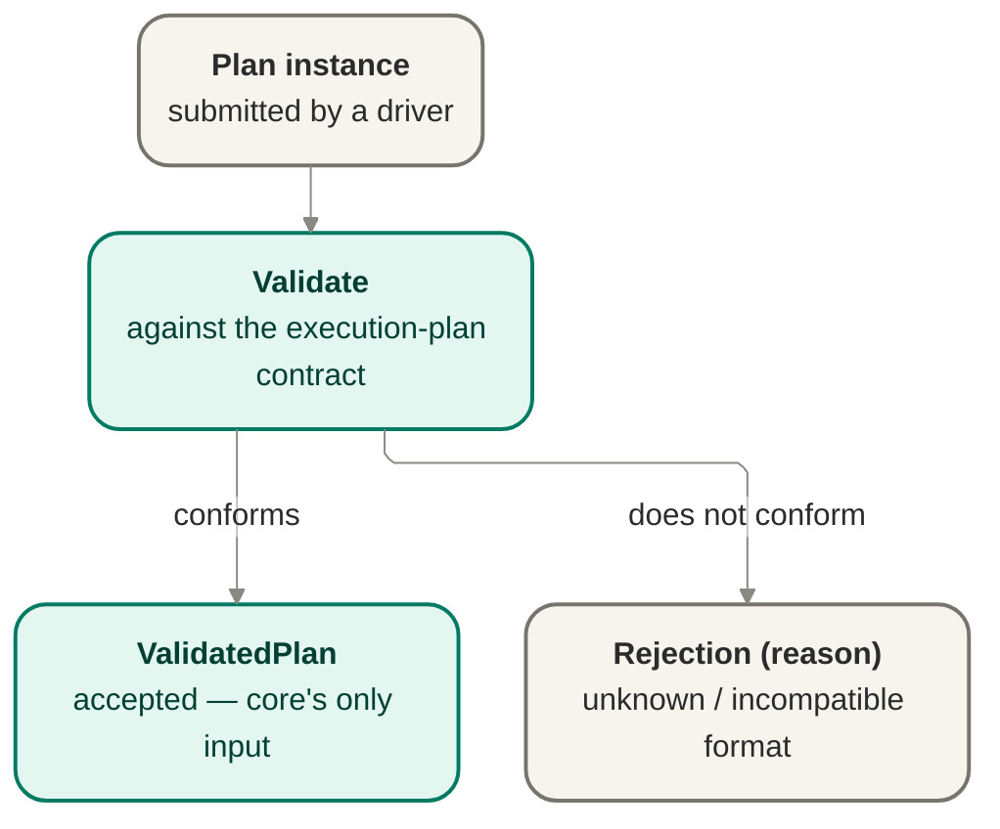

# Plan intake — parsing and validation

Plan intake parses a machine-readable plan instance and validates it against the execution-plan
contract, rejecting unknown or incompatible formats with a reason rather than guessing at
intent. It is the boundary [`bootstrap`](./bootstrap.md) calls before anything else can happen.

This doc is the home for the plan / policy / evidence design beneath the `PlanValidator` port: the
port surface and its diagram, plus the owned domain content underneath — parse/validate/reject
mechanics, the policy model, the evidence/attestation category model, acceptance/review
expectations, and the GUARD-2 rule declaration. The execution-plan v0 contract remains cited and
unfrozen; `authorization.md` remains the enforcement sibling, and `orchestration.md` remains the
pause-point sibling.

## Owns

- Parse the plan instance into an in-memory representation.
- Validate the parsed plan against the execution-plan contract shape.
- Reject with a named reason on unknown, malformed, or incompatible plan format.
- Guarantee no run is created from an invalid or rejected plan.

## Interface

- **`PlanValidator` port** — `validate(instance) → ValidatedPlan | Rejection(reason)`.
- Consumes the execution-plan data contract
  ([`../contracts/execution-plan-contract-v0.md`](../contracts/execution-plan-contract-v0.md)).

## Port boundary and anti-corruption stance

The interface and Mermaid diagram above are the boundary: the port remains the single plan-intake
boundary `bootstrap` calls before a run can begin, and the execution-plan contract remains cited,
not frozen or rewritten here.

The anti-corruption stance is validate once, at the boundary. A submitted plan instance may come
from an operator-driving surface or, in future, from a cited work-source path, but no supplier of a
raw plan instance gets to weaken or bypass the boundary. Core owns the intake contract, the
accept/reject semantics, and the meaning of "validated plan"; upstream producers supply an
instance, not a replacement definition of plan validity.

The boundary posture above is authoritative. The deeper sections below do not replace it; they make
explicit the domain content the boundary admits and the rule vocabulary downstream runtime behavior
later consumes.

## Owns / implements / must-not

### Core owns

- The `PlanValidator` port contract and its accept-or-reject semantics.
- Parse and validation against the cited execution-plan contract shape.
- The reject-unknown-format posture and the guarantee that no run is created from a rejected plan.
- The meaning of `ValidatedPlan` as core's only admitted runtime input.

### An adapter or caller implements

- Submission of a machine-readable plan instance to this boundary.
- Driver-surface behavior around how an operator or upstream tool supplies the instance for
  validation.

### Must not

- Treat a producer's self-description as sufficient proof of compatibility.
- Re-define plan semantics locally to fit a particular producer or source.
- Skip intake and hand a work item, plan fragment, or provider-originated payload directly to
  orchestration.
- Re-validate plan shape downstream as a second source of truth with different semantics.

## Source and context audit

This doc reconciles the plan-intake boundary to:

- [`../contracts/execution-plan-contract-v0.md`](../contracts/execution-plan-contract-v0.md) for the
  hard input seam shape intake validates against.
- [`../../product/guarantees.md`](../../../product/guarantees.md) for `MERGE-1`, `MERGE-3`,
  `MERGE-4`, `GUARD-1`, `GUARD-2`, `CFG-1`, `CFG-2`, `CFG-10`, `EARN-1`, and `EARN-2`.
- [`./orchestration.md`](./orchestration.md) for the already-settled run/work-item lifecycle
  surfaces that consume `ValidatedPlan`, evidence judgments, and any GUARD-2 pause.
- [`./authorization.md`](./authorization.md) for the cited-only Fence / Doorbell enforcement
  surface that later judges requests against the bound policy this doc defines.
- [`../notes/runtime-design-m5a.md`](../notes/runtime-design-m5a.md) for the continued
  validate-once and reject-unknown-format discipline (`INV-007`) and for keeping design-layer ID
  namespaces separate from product IDs.

No ownership is invented here beyond those sources. Policy content and evidence vocabulary are
owned here because jig owns policy type/shape/invariants while the owner authors instances;
authorization and pause mechanics remain in their sibling docs.

## Invocation point in the run lifecycle

This doc does not author any new state or transition. It names the already-settled invocation point
only: `PlanValidator` is invoked at launch from the cited preview/start path before orchestration
consumes a `ValidatedPlan`, consistent with [`orchestration.md`](./orchestration.md)'s existing
run-lifecycle prose and the validate-once-at-the-boundary scope.

The same boundary is also where a run first binds to policy-governed evidence expectations. Intake
admits a plan only once; later runtime phases consume the admitted result and the policy/evidence
vocabulary defined here rather than re-deriving plan validity from raw input.

## Domain model at this boundary

Plan intake owns one boundary decision and admits three linked domain constructs:

- **Plan intake mechanics** — the parse/validate/reject act over a submitted plan instance.
- **Policy** — the governance contract whose type/shape/invariants jig owns while an owner
  authors an instance for a track.
- **Evidence / attestation categories** — the vocabulary policy uses to judge whether a story's
  done conditions are satisfied before landing may proceed.

The output of this boundary is therefore not just "a syntactically acceptable blob." It is a
`ValidatedPlan` whose track binding, policy reference posture, evidence requirements, and declared
authority expectations are admitted as core-owned runtime inputs under a cited contract, with
unknown or incompatible submissions rejected before a run exists.

## Parse / validate / reject mechanics

Plan intake proceeds in three steps, each fail-closed:

1. **Parse the submitted instance.** Intake reads the machine-readable plan instance as submitted
   and extracts only the contract-level properties the seam already names: plan identity and
   provenance, track binding, story set, dependency/eligibility information, done/evidence
   requirements, authority/approval needs, policy/work-profile references, stack-seam
   requirements, and constraints/limits.
2. **Validate compatibility against the cited v0 seam.** Intake checks whether the instance's
   version/compatibility posture and declared properties are understandable under
   [`execution-plan-contract-v0.md`](../contracts/execution-plan-contract-v0.md). The contract is
   authoritative for required shape; this file does not mint field names or a frozen schema.
3. **Admit or reject.** Intake returns either a `ValidatedPlan` suitable for bootstrap and
   orchestration, or a terminal `Rejection(reason)` for that submitted instance.

Validation is structural and boundary-owned. It does not decide whether evidence is sufficient for
landing, whether a routed action should be approved, or whether a work item is currently eligible;
those are later runtime judgments over already-admitted inputs.

### Named rejection classes

The rejection surface is reason-bearing rather than ad hoc. At this altitude the required classes
are:

- **Unknown format** — the instance's version or compatibility posture is not understood.
- **Malformed instance** — the instance cannot be parsed into the plan shape at all.
- **Contract incompatibility** — required contract-level properties are absent, contradictory, or
  unusable at the v0 seam.
- **Track-binding incompatibility** — the plan's policy/work-profile/reference posture cannot be
  understood well enough to bind a run safely.
- **Authority-expectation incompatibility** — the submitted plan does not carry the authority /
  approval expectations needed for later fail-closed runtime authorization.

These are boundary outcomes, not downstream runtime states. A rejected submission produces no run,
no partial admission, and no local coercion.

## Relationship to the execution-plan v0 contract

`PlanValidator` carries the seam shape defined in
[`../contracts/execution-plan-contract-v0.md`](../contracts/execution-plan-contract-v0.md). That
contract stays v0, cited, and unfrozen here.

This file therefore names the relationship at contract altitude only:

- intake validates against the contract properties the seam owner has already declared;
- unknown or incompatible format is rejected with a reason rather than guessed through;
- a needed refinement to contract shape routes back to the contract owner instead of becoming a
  silent local intake rule.

This section does not mint field names, validation-language detail, or frozen schema.

The most important contract properties for this deepened design are:

- **Track binding** — a plan references policy and work profile by identity/version posture rather
  than embedding a mutable override.
- **Done and evidence requirements** — a plan carries evidence categories and references, while
  policy later judges sufficiency.
- **Acceptance / review expectations** — a plan can carry declared review needs, while
  owner-controlled policy/configuration selects the required acceptance strength before launch.
- **Authority and approval needs** — a plan declares expected reversible, privileged, and
  rule-governing touches so later authorization can fail closed.

## Policy model

Policy is the governance contract for a track. Jig owns policy's type/shape/invariants while the
owner authors instance content; this doc defines the shape that plan intake admits and runtime
later consumes.

### Policy owns

- **Gating posture** — how cautiously or aggressively runtime proceeds within the fixed category
  boundary promised by `CFG-10`.
- **Merge spectrum** — the evidence posture that must be satisfied before a story may move from
  done to landed.
- **Acceptance / review lane strength** — the review or verification posture required before
  landing, selected before launch and consumed as evidence rather than chosen by the worker,
  reviewer, or Forge provider mid-run.
- **Concurrency ceiling** — the highest concurrency the run may derive, subject to plan and other
  safety constraints.
- **Retry budget** — whether and how much retry behavior is allowed before a human checkpoint is
  required.
- **Required reviews** — what human or delegated review is mandatory for a story class before
  landing.
- **Escalation rules** — when runtime must route to the owner instead of proceeding.
- **Rule-governing surfaces** — the declared categories of project surfaces whose modification
  forces GUARD-2 re-approval and fresh evidence before completion is judged.

### Policy invariants

- **Policy is the governance contract, not the work profile.** Policy sets the safety floor;
  work profile tunes realization and may not lower that floor (`CFG-1`, `CFG-2`).
- **Policy is fixed at launch.** A run binds to policy at launch and does not silently widen or
  swap it mid-run (`GUARD-1`).
- **Acceptance strength is launch-bound.** Worker, reviewer, and Forge provider cannot downgrade the
  required acceptance/review lane after launch.
- **The `CFG-10` category boundary is fixed.** The reversible/non-privileged/non-rule-governing
  versus credentials/push-merge/rule-governing/irreversible split is a product promise, not a
  model-adjudicated runtime judgment.
- **Policy judges sufficiency by category, not by worker assertion.** The worker's self-report is
  never enough on its own to satisfy landing evidence (`MERGE-1`, `MERGE-3`).

### Policy does not own

- The exact classifier implementation that returns `grant | deny | route`; that remains in
  [`authorization.md`](./authorization.md).
- Work-item or run pause-state mechanics; those remain in [`orchestration.md`](./orchestration.md)'s
  settled lifecycle territory.
- Field-level plan schema; that remains with the cited v0 contract.
- Detailed acceptance-lane schema, reviewer taxonomy, or provider method signatures; those remain
  future implementation/design follow-up.

## Evidence / attestation category model

At product altitude, evidence falls into three categories. This doc turns those categories into the
runtime vocabulary policy consumes.

### Category 1 — automated checks

Automated checks are tests, builds, linters, type checks, or similar configured gates the runner
observes directly. Their category semantics are:

- they are evidence only when observed by jig's runtime, not merely described by the worker;
- policy decides which check families matter for a given story or track;
- a missing or failed required check leaves the story short of done-evidence, regardless of worker
  confidence.

### Category 2 — review / acceptance

Review / acceptance is a verdict or evidence assessment from the governed lane that policy
requires. The lane may be a mechanical evidence check, structured independent review, real code
review, owner review, or specialist review, but this doc does not turn those levels into a schema.
The lane boundary is settled in [ADR 0034](../decisions/0034-acceptance-review-lane.md): the
verifier/reviewer emits governed evidence, not lifecycle, Forge, authorization, or provider-seam
authority.
Its category semantics are:

- policy decides whether review is required and for which classes of change;
- policy/configuration select the required acceptance strength before launch, not during the run;
- review is durable evidence only when recorded through the runtime's owned approval / notice
  surfaces, not when asserted informally by the worker;
- review may satisfy part of a story's evidence posture without collapsing the done-versus-landed
  distinction.
- the reviewer/verifier emits an assessment; it does not land work, hold forge credentials,
  redefine policy, or select weaker criteria.

### Category 3 — capability proof

Capability proof is fresh attestation that a driver can safely perform what runtime is being asked
to trust. Its category semantics are:

- proof is specific to the driver and run context (`EARN-2`);
- proof must be fresh and positive to unlock autonomy (`EARN-1`);
- missing, stale, or failed proof reduces autonomy and increases human checkpoints rather than
  weakening the guarantee.

### Evidence sufficiency model

Policy judges what categories, and how much of each, a story needs before it may land. This file
therefore owns the **category model** and the **sufficiency vocabulary**, not the act of runtime
adjudication itself.

The required sufficiency rules are:

- no category is satisfied by worker self-report alone;
- policy may require one, two, or all three categories depending on story class and risk;
- `done` and `landed` remain separate milestones even when a story's evidence is already
  satisfied;
- a required review/acceptance lane must be satisfied by the governed verifier/reviewer verdict or
  assessment before it can contribute to `done`;
- capability proof never substitutes for unrelated automated checks or required review unless the
  policy explicitly treats it as evidence for that capability-specific trust question.

### Freshness / staleness discipline for capability proof

Capability proof is load-bearing enough to need explicit staleness language at this altitude:

- **fresh** means the proof is valid for the current driver and run context the policy is judging;
- **stale** means a once-valid proof can no longer justify autonomous trust for the current
  context;
- **missing** means no acceptable proof exists for the required capability in the current context.

Stale or missing proof is not a soft warning. It changes the evidence posture by forcing more human
checkpoints or routing, and it is the category model the execution-host seam must later consume
when it deepens capability attestation.

**Phase 6 realization ([ADR 0022](../decisions/0022-phase-6-real-driver-integration.md)).** With real
drivers the `fresh`/`stale`/`missing` decision is made by a **real clock** against real driver/host
timestamps, replacing the deterministic reference constant: proof past its policy-declared freshness
window is `stale` and treated as non-fresh by the Fence. The **decision procedure** is real; only the
test clock is controlled (an injected fixed clock plus a stale-window fixture), so goldens stay
deterministic. The proof itself now carries a **proven** isolation strength from an exercised
confinement check (`provenIsolationStrength`), which [`authorization.md`](./authorization.md) judges in
place of the host's reported strength.

## Evidence observation and producer closure

This design keeps one authority for what counts as evidence:

- **The runner and its owned runtime surfaces observe evidence directly.** Evidence is never taken
  from the worker's self-report alone.
- **The verifier/reviewer emits governed evidence input.** Its verdict can be consumed by the
  runner and policy, but it does not author lifecycle transitions or landing authority.
- **The records surface persists what was observed.** This file names the category vocabulary; it
  does not create a second persistence channel.
- **Authorization and lifecycle consume the resulting judgments.** This file does not move those
  mechanics into plan intake.

That split preserves `MERGE-1` and the design-layer rule that the records used to decide are the
records later inspected, without turning evidence into an informal narrative outside the owned
runtime trail.

## GUARD-2 rule declaration

This story owns the **rule** leg of GUARD-2, not the enforcement leg and not the pause-state
mechanics.

### What counts as a rule-governing surface

For policy and plan-intake purposes, a rule-governing surface is any declared project surface whose
change alters the safety, verification, or integration-safety rules a run is being judged by. At
minimum this includes:

- policy surfaces;
- verification surfaces;
- integration-safety surfaces;
- credential-bearing or credential-governing surfaces;
- any other per-story declared rule-governing files or areas carried in the plan's authority /
  approval expectations.

This file owns the declaration that such surfaces are a first-class policy concern and must be
named as such in plan/runtime vocabulary. It does not own the file-classifier or routing mechanism.

### What the rule requires

If work touches a declared rule-governing surface, completion pauses for explicit owner re-approval
and fresh evidence before `done` may be judged sufficient under policy. This is a policy-level
requirement against self-modifying runs: jig will not let a run quietly change its own rules and
then declare itself done.

### What this file does not own

- **Enforcement mechanism** — detecting the request/change and returning `grant | deny | route`
  remains with [`authorization.md`](./authorization.md).
- **Pause point in the lifecycle** — the run/work-item guard that checks for an unresolved
  GUARD-2 pause remains with [`orchestration.md`](./orchestration.md)'s settled lifecycle surface.
- **Residual sub-state design** — whether the pause uses a distinct sub-state or reuses the
  existing `parked` state remains open and is not resolved here.

## Failure posture

- Invalid, malformed, unknown, or incompatible submitted plans are rejected at the boundary with a
  named reason.
- Rejection is terminal for intake of that submitted instance: no run is created from it.
- Contract-shape mismatch is handled as a seam-governance issue, not as local silent coercion.
- Insufficient evidence, stale capability proof, missing capability proof, missing or inconclusive
  required acceptance/review evidence, or unresolved GUARD-2 re-approval are not parse failures;
  they are later runtime failure/judgment conditions defined by the policy/evidence model this file
  owns and consumed by sibling runtime docs.

## Port-boundary invariant candidates

These are unnumbered candidates only. If a future consolidated ledger needs numbering, the next
available invariant number is `INV-019`.

- **Validate once at the boundary.** Plan-shape acceptance happens at intake; downstream consumers
  rely on the validated result rather than re-defining validity later.
- **Reject unknown formats, never guess.** Intake rejects a plan whose compatibility posture is not
  understood instead of silently coping with it.
- **No second scheduling input.** No upstream source, including a future work-source path, bypasses
  validated plan intake and hands runtime scheduling input directly to core.

  **Phase 8 realization ([ADR 0024](../decisions/0024-phase-8-real-work-source.md)).** With a real
  work-source importer this stops being an identity coincidence and becomes a structural chokepoint.
  Today the composition root validates the operator-supplied **seed** plan, but the thing actually
  scheduled is `candidate.planInstance` from `WorkSourcePort.candidates()`; the reference adapter is
  seeded from that same object, so `candidate.planInstance === the validated seed` and identity masks the
  gap. A real importer builds fresh candidate plans from an external source that never crossed `validate`,
  so Phase 8 enforces the crossing at a **single intake chokepoint** that mints an **opaque
  runtime-verifiable validated wrapper** carrying an **unforgeable runtime marker** (a module-private
  `Symbol` / private field) only it can produce; the runtime scheduling API (`LocalHarness.run` /
  `LocalHarness.resume`) is narrowed to accept **only** that wrapper, never a raw plan. Two enforcement
  layers, both required: at **compile time** an unwrapped plan is a type error for typed callers; and
  because a type-level brand is **erased at runtime**, `run`/`resume` also **check the marker at runtime**,
  so an `any`-typed caller or a value crossing a deserialization boundary that lacks the marker is
  **refused fail-closed and recorded** — the runtime check is what makes the any-edge guarantee
  achievable. Both the run and resume paths obtain the wrapper from the same chokepoint. A candidate that
  fails validation is **rejected or held** and never scheduled (P8-AC-1); a bypass — a direct-harness call
  with a marker-less value included — fails closed and is recorded through the existing `rejected`/`denied`
  families, minting no new event family (P8-AC-2). The runtime marker lives on the in-memory wrapper and is
  never serialized, so the Phase-0..4 goldens stay byte-identical. The source is never a second scheduling
  or authorization authority; INV-007 holds structurally.

- **Evidence is observed, never self-certified.** A worker's self-report alone cannot satisfy the
  evidence posture policy requires for landing.
- **Acceptance strength is owner-bound.** Required review/verification strength is selected by
  policy/configuration before launch; worker, reviewer, and Forge provider cannot weaken it mid-run.
- **Capability proof must be fresh for the current driver/run context.** Missing or stale proof
  reduces autonomy rather than weakening the guarantee.
- **Touching a rule-governing surface forces pause-before-completion.** A run may not change the
  surfaces that govern policy, verification, or integration safety and then judge itself complete
  without re-approval and fresh evidence.

## Open questions

- Does the runtime use a distinct named sub-state for an unresolved GUARD-2 pause, or does it
  reuse the existing `parked` state? This file leaves the pause-state shape open and only owns the
  rule declaration.
- Does policy need an explicit taxonomy for different kinds of review evidence beyond the current
  category model, or is the category plus policy-instance requirements sufficient at this altitude?
  This file stays at category vocabulary, not reviewer-subtype schema.

## Risks and deferred decisions

- **Risk — contract drift pressure at the seam.** A producer may eventually want a contract shape
  this intake boundary does not yet admit. That is a seam-owner decision, not a local parsing
  exception.
- **Risk — policy instance ambiguity.** If a plan references a policy instance whose version /
  compatibility posture is unclear, intake must reject or surface incompatibility rather than infer
  a meaning for missing governance facts.
- **Risk — evidence inflation by narrative.** Without disciplined observation and recording, a
  worker narrative could appear to satisfy evidence informally. This doc rejects that posture, but
  later runtime docs must preserve it.
- **Risk — GUARD-2 boundary sprawl.** If rule-governing surfaces are declared too loosely or too
  vaguely, the pause rule can become either toothless or over-broad. This file therefore keeps the
  surface concept explicit and declared through plan/policy vocabulary rather than inferred ad hoc.
- **Deferred — field-level validation detail.** Exact field names, schema language, encoding, and
  versioning/migration strategy remain in the cited v0 contract's future evolution, not this doc.
- **Deferred — upstream source forms.** How different operator or tooling surfaces package and submit
  a plan instance is outside this port contract as long as they still enter through intake.
- **Deferred — authorization mechanics.** The Fence classifier, Doorbell durability, and capability
  attestation enforcement stay in [`authorization.md`](./authorization.md), not here.
- **Deferred — lifecycle pause mechanics.** The concrete guard wiring for unresolved GUARD-2
  pauses stays in [`orchestration.md`](./orchestration.md), not here.
- **Deferred — invariant-ledger consolidation.** Candidate invariants remain unnumbered in this
  file and are not appended to the invariant ledger here.

## Notes

- Reject-unknown-format is the same posture as "no silent legacy coping": jig refuses what it
  doesn't understand, with a reason, instead of coping silently.
- Validation happens once, at the boundary; nothing downstream re-validates plan shape.
- The v0 contract shape is not frozen. Refinements route back to the seam owner — they are
  never a silent, local change inside intake.
- Deferred: field-level schema, encoding format, and versioning/migration strategy across
  contract revisions.
- Policy owns the governance floor; work profile may tune execution style but not lower safety.
- Evidence categories are automated checks, review, and capability proof; policy decides required
  sufficiency, but no category is satisfied by worker self-report alone.
- GUARD-2's rule is owned here; its enforcement and pause-state mechanics are not.

## Reconciles to

- `docs/product/jig.md` — "The execution plan — Jig's one input"; "no silent legacy coping".
- `docs/design/contracts/execution-plan-contract-v0.md` — the contract this seam validates against.
- `INV-007` — reject unknown formats at the boundary; a plan whose compatibility posture is not
  understood is rejected rather than guessed through.
- `SURF-002` — `PlanValidator` as the cited plan-intake surface carrying
  `validate(instance) → ValidatedPlan | Rejection(reason)` at current altitude.
- `MERGE-1`, `MERGE-3`, `MERGE-4` — evidence gates landing, done conditions are policy-bound, and
  done remains distinct from landed.
- `GUARD-1`, `GUARD-2` — policy is fixed at launch, and rule-governing changes force re-approval
  plus fresh evidence before completion is judged.
- `CFG-1`, `CFG-2`, `CFG-10` — policy is the governance contract, work profile does not lower the
  floor, and the category boundary is fixed rather than model-adjudicated.
- `EARN-1`, `EARN-2` — capability proof must be fresh, positive, and specific to the driver/run
  context to unlock autonomy.
