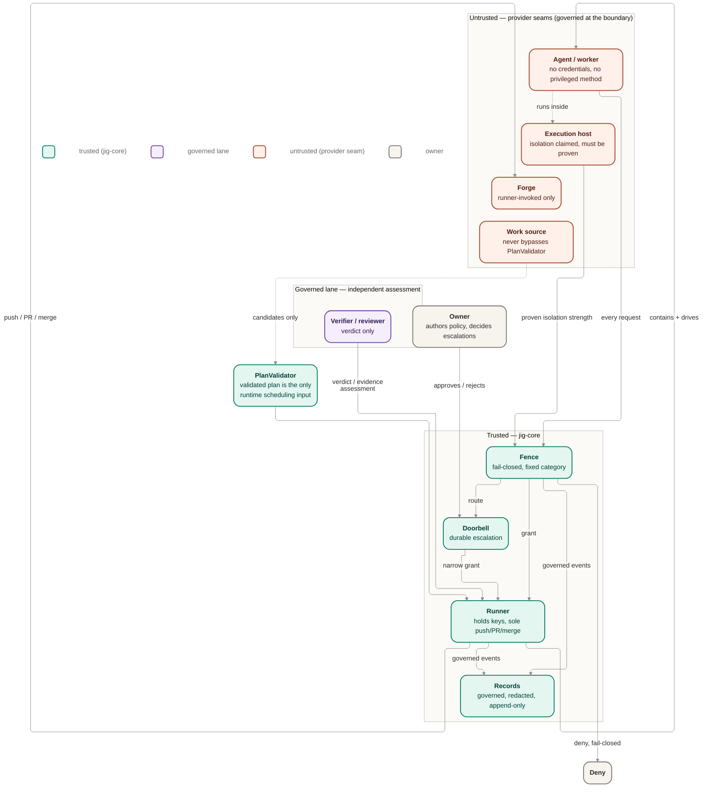

# Security model — trust boundaries and threat surfaces

This is the single cross-cutting cut through jig's security design. It consolidates design that
already exists — the fence, the doorbell, capability attestation, provider must-not rules, and the
conformance posture — into one place a reader can start from instead of assembling it from five
files. It invents no new control, policy, or guarantee: every claim here traces to an existing
product ID, an existing `core/` or `contracts/` doc, or an ADR, cited inline.

Product owns the guarantees ([`docs/product/guarantees.md`](../../product/guarantees.md), §1 "Control
& trust" and §1.6 "Security"); this doc owns how the design already satisfies them, read as one
threat-model view rather than per-seam prose.

## Trust model — who is trusted, who is not

| Party                                       | Trust status                            | Why                                                                                                                                                                                                                                                                                       |
| ------------------------------------------- | --------------------------------------- | ----------------------------------------------------------------------------------------------------------------------------------------------------------------------------------------------------------------------------------------------------------------------------------------- |
| Jig-core (runner, fence, doorbell, records) | Trusted                                 | The runner is jig's trusted orchestrator: it holds credentials, is the sole authority to push/PR/merge, and performs irreversible actions only under policy and evidence ([`core/README.md`](./core/README.md) §B; FENCE-3, MERGE-2, SEC-3).                                              |
| Agent / worker (Agent seam)                 | Untrusted                               | A contained coding agent: reads a work item, writes code, runs checks, reports — holds no credentials and cannot push/PR/merge or widen its own authority ([`contracts/providers.md`](./contracts/providers.md) "Agent port"; FENCE-3).                                                   |
| Verifier / reviewer                         | Governed evidence assessor              | Emits an acceptance verdict or evidence assessment when launch-bound policy requires an implemented review lane; it does not land work, hold forge credentials, redefine policy, or transition lifecycle directly ([`core/orchestration.md`](./core/orchestration.md); MERGE-1, MERGE-3). |
| Execution host                              | Untrusted until proven                  | Provides isolation/containment for the worker; its isolation strength is a claim until proven, judged by `provenIsolationStrength`, not `reportedIsolationStrength` ([`core/authorization.md`](./core/authorization.md) "Phase 6 realization"; DRIVE-3, ISO-4).                           |
| Forge (code host)                           | Untrusted, runner-invoked only          | Deterministic adapter for push/PR/status/comment/merge; respects branch protection and merge queues as real governing constraints; only the runner invokes it ([`contracts/providers.md`](./contracts/providers.md) "Forge port"; MERGE-2, MERGE-5).                                      |
| Work source                                 | Untrusted, never a scheduling authority | May supply provenance/import behavior, but the validated execution plan is jig's only runtime scheduling input; the seam never bypasses `PlanValidator` ([`contracts/providers.md`](./contracts/providers.md) "Work source port"; INV-007).                                               |
| Owner / operator                            | Trusted decision-maker                  | Authors policy and plan, and is the one party whose approval can grant a routed request or a re-approval ([`core/authorization.md`](./core/authorization.md) "Doorbell escalation"; DOOR-1..3).                                                                                           |

The single organizing idea: **jig-core is the only trusted party at runtime.** Every provider seam
(agent, execution host, forge, work source) is an untrusted, swappable boundary that jig-core
governs, never a party jig-core takes on faith ([`contracts/providers.md`](./contracts/providers.md)
"Contract stance"). Landing credentials and irreversible authority stay on the trusted side of that
line; they are never handed across it (STACK-5). A provider seam may still use a bounded,
manifest-governed read or transport credential where its job requires one, but never landing or
policy authority. The verifier/reviewer is separate from those seams: it can assess work or
evidence, but it cannot become the owner, runner, Forge provider, or execution host proof. That
boundary is settled by [ADR 0034](./decisions/0034-acceptance-review-lane.md).

## The fence + fail-closed authorization spine

The Fence authorizes every worker request before it executes, using a fixed CFG-10 category
boundary, not a model's judgment ([`core/authorization.md`](./core/authorization.md) "Fixed category
boundary"; FENCE-1, FENCE-2). Its decision order is:

1. Undeclared or out-of-approved-scope → `deny` (fail-closed; FENCE-1).
2. Credentials, push/merge, rule-governing touch, irreversible effect, ambiguity, or insufficient
   proof → `route` to the Doorbell.
   Missing, stale, self-reported, or inconclusive required acceptance/review evidence follows the
   same fail-closed posture.
3. Declared, reversible, non-privileged, and not rule-governing, with sufficient proof → `grant`
   candidate.
4. If the classifier cannot justify `grant` from the fixed rules, `route` — uncertainty never
   degrades to permissive behavior.

**Cannot be loosened mid-run.** Policy is bound at launch and stays fixed for the run's duration
(GUARD-1); the category boundary itself is fixed and not model-adjudicated (CFG-10). A worker
cannot negotiate a broader grant for itself mid-run (FENCE-2). The one place authority for a
resumed run is re-examined is the resume preflight's fail-closed split between a hard-refused
integrity break and a re-approvable, safety-relevant basis change — and even the re-approvable leg
only **re-confirms** the existing binding; it never rebinds, widens scope, or swaps policy
([`core/authorization.md`](./core/authorization.md) "Phase 9 realization"; ADR 0025).

A grant never reaches the worker directly: the runner is the only component that performs the
privileged action a grant authorizes ([`core/authorization.md`](./core/authorization.md) "Diagram";
FENCE-3).

## Capability attestation — earned trust, not assumed trust

Autonomy is gated on capability attestation, not on a driver's word (EARN-1, EARN-2, STACK-4,
DRIVE-1). The gate is positive-only:

- **Fresh** — proof must be within the policy-declared validity window; a real clock replaces the
  deterministic constant once real drivers exist ([`core/authorization.md`](./core/authorization.md)
  "Phase 6 realization").
- **Positive** — a missing or failed proof is never treated as neutral; it removes the request from
  the auto-grantable set.
- **Driver- and run-context-specific** — proof for one driver or run does not transfer to another
  (EARN-2).

A provider-reported isolation category or capability claim is **input to** this judgment, never a
substitute for it: a `strong` self-report with absent, stale, or overstated proof is judged unproven
and unlocks nothing beyond what the proof actually supports
([`core/authorization.md`](./core/authorization.md) "Capability-attestation gate"; DRIVE-3). Missing
or stale proof means **less autonomy, not a weaker guarantee** (EARN-2) — the system degrades toward
more human checkpoints, never toward silently trusting an unproven claim.

On resume, the Fence adjudicates against the **launch** capability attestation, recovered
launch-immutable, never a fresher, more permissive re-derivation
([`core/authorization.md`](./core/authorization.md) "Phase 6 realization"; DRIVE-1).

## Anti-gaming floor (GUARD-\*)

Two guarantees stop a run from quietly loosening the rules it is judged by:

- **GUARD-1 — policy fixed at launch.** The worker cannot loosen the rules it is being judged by
  mid-run; policy binds once, at launch.
- **GUARD-2 — rule-governing touch forces re-approval.** If work changes a surface that governs
  policy, verification, or integration safety, completion pauses for explicit owner re-approval and
  fresh evidence before `done` may be judged sufficient. This rule is deliberately split across
  three surfaces so no one file both declares and enforces it: [`core/plan-intake.md`](./core/plan-intake.md)
  owns what counts as a rule-governing surface, [`core/authorization.md`](./core/authorization.md)
  owns the enforcement leg (the Fence must not auto-grant a rule-governing touch and the Doorbell
  must route it), and [`core/orchestration.md`](./core/orchestration.md) owns the lifecycle pause
  point that consumes the routed decision.

Jig will not let a run change its own rules and then declare itself done
([`core/plan-intake.md`](./core/plan-intake.md) "GUARD-2 rule declaration").

## Credential ownership — the runner holds the keys

Only the runner holds landing credentials and the sole authority to push, open PRs, or merge
([`core/README.md`](./core/README.md) §B; FENCE-3, MERGE-2, SEC-3). Concretely:

- The **Agent (worker) seam** is structurally, not just policy-wise, non-privileged: `INV-002`
  records that the Agent port exposes request/observe behavior only, with no privileged
  push/PR/merge/credential path on the port at all — a forbidden-method sweep in the conformance
  suite checks this structurally rather than trusting the provider not to smuggle one in
  ([`contracts/providers.md`](./contracts/providers.md) "Agent port", "Phase 6 realization").
- The **Execution host** and **Work source** seams carry no landing path and no privileged or
  irreversible authority: landing credentials and irreversible authority stay with the Fence and
  runner, never with a provider seam ("Providers hold no privileged credentials" in
  [`contracts/providers.md`](./contracts/providers.md) "Cross-port invariant candidates"). This does
  not mean a seam holds no credential at all — a real work source may use a read/transport credential
  where its job needs one (for example the GitHub Issues work source reads a `GITHUB_TOKEN` /
  `GH_TOKEN` to fetch issues). Such a credential is governed as substrate — bounded by the immutable
  substrate manifest (DRIVE-2) and kept out of records by redaction (SEC-1) — and never confers
  landing, merge, or policy authority. Implementation work must still apply manifest governance and
  redaction to those provider-side tokens; the invariant they satisfy is separation of landing
  authority, not the absence of all credentials.
- The **Forge** seam is runner-invoked only, at the settled `done → landed` boundary; the worker
  never invokes landing authority directly, and a Forge adapter cannot become a second policy or
  state authority for merge decisions ([`contracts/providers.md`](./contracts/providers.md) "Forge
  port").
- The **Verifier/reviewer** lane never holds landing credentials and never invokes Forge directly;
  it emits an assessment the runner consumes under policy.

This is the same posture stated in the product guarantee: "the thing that writes code is not the
thing that ships it" (MERGE-2), and "the thing writing code is never the thing holding the keys"
(SEC-3).

## Isolation, containment, and no-phone-home

The no-phone-home guarantee (SEC-2) is carried by the Execution host seam's containment posture:
outbound network access is confined, and the confinement must be **proven**, not merely asserted by
the host or the worker ([`contracts/providers.md`](./contracts/providers.md) "Execution host port";
"Port invocation points"). Execution-host honesty is structural to the design:

- The host reports an isolation-strength category (`none` / `weak` / `strong`) honestly, including
  when it can only prove a weaker category than requested or cannot prove confinement at all
  ([`contracts/providers.md`](./contracts/providers.md) "Execution host port").
- Core judges autonomy on **proven** isolation strength, from an exercised confinement check (a
  termination/prove-empty step, a negative-probe egress check, a named containment mechanism), never
  on the reported strength alone; `reported > proven` is recorded as
  `isolation-strength-overstated` and unlocks nothing beyond what was proven
  ([`core/authorization.md`](./core/authorization.md) "Phase 6 realization"; DRIVE-3).
- **ISO-4** — parallel work cannot collide: each run/story works in its own isolated workspace
  (worktree-per-story), and a duplicate launch of the same work item is refused with
  `workspace-collision`.
- A separate, immutable **substrate manifest** (runtimes, argv, credentials, egress — DRIVE-2)
  bounds what a real driver may **request** at runtime; an out-of-tuple request is refused as a
  diagnosable stop. This is distinct from capability attestation: the manifest bounds what a driver
  may ask for, attestation proves what the host actually confines
  ([`core/authorization.md`](./core/authorization.md) "Phase 6 realization").

The verifier/reviewer lane does not carry SEC-2. It may assess evidence, but execution-host
confinement remains the host/core proof boundary; Forge remains the external-operation adapter.

The execution host is described in the design as "local-first today"
([`core/README.md`](./core/README.md) §C), so the honesty posture above is the guarantee that must
hold as hosting substrates change, not a claim that today's default host is strongly isolated.

## Conformance is adequacy, not proof

[ADR 0026](./decisions/0026-conformance-self-report-only.md) is the load-bearing decision for how
much weight a green conformance run is allowed to carry. Two settlements:

1. **`self-report-only` is an enumerated conformance-basis token.** A verdict uses it whenever the
   suite can only classify the subject's own claim and cannot point to independently observable
   behavior. It is not a pass and not equivalent to observed proof. The first required production
   path is execution-host isolation: a reported isolation strength or positive capability posture
   without a proven strength carries this basis.
2. **A green controlled-double suite does not prove real-provider truth.** The suite proves
   interface-shape conformance and specified responses under controlled doubles; it does not prove
   that a real provider actually confined a process, withheld credentials, avoided egress, or
   performed a forge/source effect truthfully — because **a mock can lie**. Future work must not
   cite a green conformance run as that proof unless the truth was independently observed through a
   real-provider proof or runtime evidence path.

This is the same posture the provider contract states in its own terms: conformance is an adequacy
bar for the port contract and controlled scenarios, not proof a real provider told the truth
([`contracts/providers.md`](./contracts/providers.md) "Provider extension and package posture").

## Redaction discipline

Secrets, credentials, tokens, and sensitive values are kept out of records, logs, artifacts, and
exports (SEC-1). This is enforced at the records boundary, not left to later surfacing:

- Redaction posture is recorded **per governed record**, as part of the governed append path itself,
  not an optional afterthought ([`core/records.md`](./core/records.md) "Redaction and evidence
  posture").
- A governed append lacking valid redaction/export posture, or carrying unknown or ambiguous
  posture, is **rejected rather than guessed through**; inspect and export are denied or constrained
  until valid posture exists.
- A finished run exports as a write-once, redacted-by-default artifact (SEE-6); a redacted export is
  a governed projection of the same evidence boundary, not a weaker side channel
  ([`core/records.md`](./core/records.md) "Projection and export posture").
- Real secret-scanning activates at the boundary real credentials first enter records, and a
  redaction ambiguity becomes a diagnosable stop rather than a silent pass-through
  ([`contracts/providers.md`](./contracts/providers.md) "Phase 6 realization";
  [`core/records.md`](./core/records.md) "Notes").
- The Phase 9 records-integrity sidecar keeps this posture unchanged under tampering: it stores
  digests and an HMAC, never the key or any sensitive value, and a detected integrity break still
  leaves records safe to keep and export ([`core/records.md`](./core/records.md) "Phase 9
  realization"; ADR 0025).

## Threat surfaces and how they are contained

| Threat surface                                                     | Containment                                                                                                                                                                                                                                                                                                                                                          |
| ------------------------------------------------------------------ | -------------------------------------------------------------------------------------------------------------------------------------------------------------------------------------------------------------------------------------------------------------------------------------------------------------------------------------------------------------------- |
| Worker tries to widen its own authority or act outside scope       | Fence denies by fixed CFG-10 category, fail-closed on anything undeclared or unapproved; the boundary is never model-adjudicated (FENCE-1, FENCE-2; [`core/authorization.md`](./core/authorization.md)).                                                                                                                                                             |
| Worker tries to push, open a PR, or merge directly                 | Structurally impossible: the Agent port has no privileged method (`INV-002`), checked by a conformance forbidden-method sweep; landing is runner-invoked only through the Forge seam (FENCE-3, MERGE-2; [`contracts/providers.md`](./contracts/providers.md)).                                                                                                       |
| Worker or reviewer tries to self-certify acceptance                | Required acceptance/review evidence must come from the governed lane policy selected before launch, not from worker self-report or reviewer-selected weaker criteria; missing or inconclusive proof routes/stops rather than lowering policy (MERGE-1, MERGE-3; [`core/plan-intake.md`](./core/plan-intake.md), [`core/orchestration.md`](./core/orchestration.md)). |
| Provider over-reports capability or isolation strength             | Capability attestation and execution-host proof are judged on **proven**, not reported, strength; an overstated report is recorded and unlocks nothing beyond what was proven (DRIVE-3, EARN-1/2; [`core/authorization.md`](./core/authorization.md)).                                                                                                               |
| A run tries to change its own governing rules and call itself done | GUARD-2: a rule-governing touch pauses completion for fresh owner re-approval and evidence, enforced by the Fence/Doorbell and consumed by the run lifecycle (GUARD-2; [`core/plan-intake.md`](./core/plan-intake.md), [`core/authorization.md`](./core/authorization.md)).                                                                                          |
| Secrets leak into records, logs, or exports                        | Redaction posture is governed per record at append time; unknown/ambiguous posture is rejected, and export stays write-once and redacted-by-default (SEC-1, SEE-6; [`core/records.md`](./core/records.md)).                                                                                                                                                          |
| Worker attempts outbound network access ("phone home")             | Execution-host confinement must be proven (exercised check), not merely reported; core judges on proven isolation strength (SEC-2, DRIVE-3; [`core/authorization.md`](./core/authorization.md), [`contracts/providers.md`](./contracts/providers.md)).                                                                                                               |
| A conformance-green mock is mistaken for a truthful real provider  | ADR 0026: `self-report-only` is a distinct, non-passing basis token; a green controlled-double suite is explicitly not proof of real-provider truth (ADR 0026).                                                                                                                                                                                                      |
| Resumed run tries to widen scope on a stale or changed basis       | Resume adjudicates against the **launch** attestation and policy binding; a broken integrity chain hard-refuses with no override, and a legitimate changed basis blocks pending fresh owner re-approval — never a silent rebind (GUARD-1; [`core/authorization.md`](./core/authorization.md) "Phase 9 realization"; ADR 0025).                                       |
| Work source or forge tries to bypass validated scheduling / policy | Work source candidates cross `PlanValidator` before reaching runtime scheduling (INV-007); Forge cannot re-judge evidence sufficiency or become a second policy authority (`contracts/providers.md`).                                                                                                                                                                |

## Trust-boundary diagram

## Honest edge

Jig protects the shape of trust; the substance of each gate is still the owner's responsibility. A
weak review, an empty verification command, or a vague plan remains weak — jig makes that weakness
visible instead of pretending it is proof (product guarantees §1.6 "Honest edge"). This design's
security posture is a fail-closed, proof-gated boundary, not a claim that every configuration an
owner assembles is automatically safe.

## Open questions / not-yet-proven

These are existing evidence gaps named in the source docs, not new questions invented for this
consolidation:

- **EVRUN-full is only partially closed.** EVRUN-partial remains the M7 baseline, and the later
  EVRUN-full combined smoke proves the real Codex / real-host / real GitHub `open-pr` path against
  a disposable sandbox. A later RESUME-3 smoke proves multi-run idempotency against a repeated real
  `open-pr` effect. The remaining EVRUN evidence gap is adversarial no-phone-home behavior
  ([`evidence/README.md`](./evidence/README.md);
  [`evidence/2026-07-06-evrun-full-smoke.md`](./evidence/2026-07-06-evrun-full-smoke.md);
  [`evidence/2026-07-06-resume-idempotency-smoke.md`](./evidence/2026-07-06-resume-idempotency-smoke.md)).
- **No-phone-home is not yet adversarially probed.** The design requires proven, not asserted,
  confinement, but red-team adversarial probing of the no-phone-home boundary remains later
  integration work, not yet exercised ([`contracts/providers.md`](./contracts/providers.md)
  "Execution host port"; ADR 0028's live evidence gates).
- **Windows / Git Bash behavior** is unproven and gated off by default until process-tree
  termination is proven there (ADR 0028).
- **Prompt-size / bounded-context behavior** has no evidence yet (ADR 0028).
- Process-tree cleanup, overlap/busy semantics, and the T14 contract freeze remain open evidence
  gates from ADR 0028 that bear directly on whether the containment and authorization posture above
  holds under real-driver conditions, not just at design altitude
  ([`contracts/providers.md`](./contracts/providers.md) "Codex app-server adapter posture").
- How fresh capability proof must be for each action class remains policy-shaped tuning, left open
  by [`core/authorization.md`](./core/authorization.md)'s own "Open questions".
- Whether owner override needs a narrower named subtype than approve/reject/override is left open
  in the same source.

This doc does not resolve any of the above; it names them here so the security posture is read
together with its known evidence gaps rather than as a completed proof.

## Reconciles to

- **Control & trust** — `FENCE-1`, `FENCE-2`, `FENCE-3`, `EARN-1`, `EARN-2`, `GUARD-1`, `GUARD-2`,
  `DOOR-1`, `DOOR-2`, `DOOR-3`, `MERGE-1`, `MERGE-2`, `MERGE-3`, `MERGE-4`, `MERGE-5`, `SEC-1`,
  `SEC-2`, `SEC-3`.
- **Configuration ownership** — `CFG-1`, `CFG-10`.
- **Resilience** — `ISO-4`, `RESUME-5`.
- **Stack portability** — `STACK-1`, `STACK-4`, `STACK-5`, `DRIVE-1`, `DRIVE-2`, `DRIVE-3`.
- **Observability** — `SEE-1`, `SEE-3`, `SEE-6`.
- **Design-layer invariants** — `INV-002` (Agent seam exposes no privileged method), `INV-007`
  (Work source never bypasses validated plan intake).

## Related

- [`core/authorization.md`](./core/authorization.md) — the Fence, Doorbell, and capability
  attestation design this doc consolidates from.
- [`core/README.md`](./core/README.md) — the system overview this doc's trust model and diagram
  theme follow.
- [`core/plan-intake.md`](./core/plan-intake.md) — the GUARD-2 rule declaration and the
  policy/evidence category model.
- [`core/records.md`](./core/records.md) — the redaction, append-only, and integrity-sidecar design
  this doc's redaction section consolidates from.
- [`contracts/providers.md`](./contracts/providers.md) — the four seams' owns/implements/must-not
  contracts, the source for the credential-ownership and containment sections.
- [`decisions/0026-conformance-self-report-only.md`](./decisions/0026-conformance-self-report-only.md) —
  the conformance-adequacy ADR this doc's "Conformance is adequacy, not proof" section is drawn from.
- [`docs/product/guarantees.md`](../../product/guarantees.md) — the product-level IDs this doc
  reconciles to.
