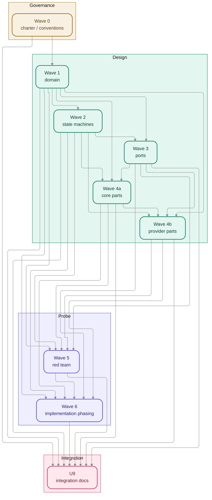

# Design-track dependency DAG

This is the U9 cross-wave dependency view for the design track. It follows each wave charter's
declared `depends_on_waves`, preserves the Wave 4 split into `wave-4a-core/` and
`wave-4b-providers/`, and adds U9 as the integration sink that consumes every committed wave.
U9 supersedes the temporary continuation handoff by carrying the durable dependency view here and
in [`waves.md`](./waves.md), [`traceability.md`](./traceability.md),
[`review-and-red-team.md`](./review-and-red-team.md), plus the committed wave decisions/stories.

Wave 0 is the track's governance substrate even where later charters do not repeat
`depends_on_waves: [0]`: the charter/conventions work flows forward through the session template,
`decisions.md` conventions, and later story ownership rules.

## Read order

| Step | Wave                                                                                | Why it waits                                                                 |
| ---- | ----------------------------------------------------------------------------------- | ---------------------------------------------------------------------------- |
| 1    | [`wave-0-charter/`](./waves/wave-0-charter/README.md)                               | Establishes charter, ID namespaces, and decision-log conventions.            |
| 2    | [`wave-1-domain/`](./waves/wave-1-domain/README.md)                                 | Names the domain entities later lifecycles and seams reconcile to.           |
| 3    | [`wave-2-state-machines/`](./waves/wave-2-state-machines/README.md)                 | Sequences the Wave 1 entities into guarded runtime behavior.                 |
| 4    | [`wave-3-ports/`](./waves/wave-3-ports/README.md)                                   | Deepens the seams that Wave 4 core and providers consume.                    |
| 5    | [`wave-4a-core/`](./waves/wave-4a-core/README.md)                                   | Owns the core contracts providers must consume read-only.                    |
| 6    | [`wave-4b-providers/`](./waves/wave-4b-providers/README.md)                         | Realizes provider designs against Wave 3 ports and Wave 4a contracts.        |
| 7    | [`wave-5-red-team/`](./waves/wave-5-red-team/README.md)                             | Probes contradictions and adversarial seams after the design surface exists. |
| 8    | [`wave-6-implementation-phasing/`](./waves/wave-6-implementation-phasing/README.md) | Sequences settled design and Wave 5 gates into later delivery phases.        |
| 9    | U9                                                                                  | Integrates the wave set into navigation, traceability, and review posture.   |

## Parallel vs. wait notes

- Waves 0-3 have no internal story DAGs.
- [`wave-4a-core/story-dag.md`](./waves/wave-4a-core/story-dag.md) is the only committed
  author-time story DAG: `w4-s1`, `w4-s2`, and `w4-s3` author in parallel; `w4-s4` waits on all
  three because it wires their settled shapes.
- Wave 4b has **no** `story-dag.md` by design. Per [`wave-4b-providers/decisions.md`](./waves/wave-4b-providers/decisions.md)
  D-006, the shared `docs/design/contracts/providers.md` file is contention, not a logical
  dependency.
- Waves 5 and 6 are intentionally light: they route findings and sequence implementation but do not
  deepen `docs/design/**` directly.

## Integration notes

- Wave 4 is permanently represented as two navigation units: `4a` core before `4b` providers.
- U9 depends on the committed wave artifacts, not on future authored design outputs that the story
  briefs only prescribe.
- The earlier temporary continuation note is superseded: Wave 5 and Wave 6 now cite committed
  track-local sources, and U9 owns the durable dependency view here.
