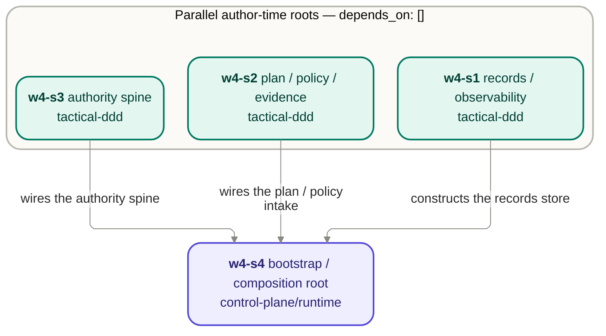

# Wave 4a — story DAG (author-time)

This is the author-time dependency graph for Wave 4a's four stories. It is the **first** wave in the
design track to carry a `story-dag.md`: Waves 0–3 had no internal author-time dependencies (their
stories ran parallel, seeded by the wave frame), so a DAG would have been a flat list. Wave 4a earns
one because `w4-s4` (bootstrap/composition root) **wires** the other three core parts at launch, so
it must be authored after their shapes settle (D-004).

The dependency is **author-time only**. At frame time all four parts consumed only Waves 1–3 (per the
per-part frames in [`frames/`](./frames/) and [`decisions.md`](./decisions.md) D-004), so framing ran
in one pass; this graph constrains the _authoring_ order, not the framing.

**Parallel vs. wait, in one line:** `w4-s1`, `w4-s2`, and `w4-s3` author in parallel (no shared
state-derivation; their one shared element, the GUARD-2 seam wording across s2/s3, is fixed by the
frames); `w4-s4` waits on all three, because it constructs the records store (`w4-s1`), wires the
plan/policy intake (`w4-s2`), and wires the authority spine (`w4-s3`) at launch and cites their
settled shapes.

## Edges

| From                          | To                                 | Author-time dependency                                                                                              |
| ----------------------------- | ---------------------------------- | ------------------------------------------------------------------------------------------------------------------- |
| `w4-s1-records-observability` | `w4-s4-bootstrap-composition-root` | `w4-s4` constructs and wires the records store `w4-s1` defines (the s1↔s4 records-store construction seam)          |
| `w4-s2-plan-policy-evidence`  | `w4-s4-bootstrap-composition-root` | `w4-s4` binds and wires the plan/policy intake `w4-s2` defines                                                      |
| `w4-s3-authority-spine`       | `w4-s4-bootstrap-composition-root` | `w4-s4` wires the Fence/Doorbell `w4-s3` defines with bound policy at launch (the s3↔s4 Fence/Doorbell wiring seam) |

## Related

- [`README.md`](./README.md) — the wave charter (Story order section carries the same DAG in prose).
- [`decisions.md`](./decisions.md) — D-004 (the author-time `depends_on` and the identically-worded
  cross-part seams) this graph encodes.
- [`frames/`](./frames/) — the four per-part frames; `w4-s4`'s frame states the author-time
  `depends_on` and that framing consumed only Waves 1–3.
