# Dependency DAG

`track.json` owns the complete per-story dependency list. This Mermaid view is a summarized
projection: it exposes the critical path, mandatory semantic-to-provider splits, and parallel
qualification lanes, but is not a substitute for the complete machine-readable DAG.

```mermaid
%%{init: {"theme": "base", "themeVariables": {"fontFamily": "Inter, ui-sans-serif, system-ui", "primaryTextColor": "#172033", "lineColor": "#65758b"}}}%%
flowchart LR
  subgraph P0["Phase 0 — substrate"]
    A1["GF-001"] -->|implementation| A2["GF-002"] -->|implementation| A3["GF-003"] -->|implementation| A4["GF-004"]
    A4 -. evidence .-> A5["GF-005"]
  end
  subgraph P1["Phase 1 — durable core"]
    B0["GF-010"] -->|implementation| B1["GF-011"] -->|implementation| B5["GF-015"]
    B0 -->|implementation| B2["GF-012"]
    B0 -->|implementation| B3["GF-013"] -->|implementation| B4["GF-014"] -->|implementation| B5
  end
  subgraph P2["Phase 2 — envelope and intake"]
    C0["GF-019 semantic source"] -->|implementation| C1["GF-020 file provider"]
    C2["GF-021 policy/profile"] -->|implementation| C3["GF-022 provider proof"]
    C3 -. evidence .-> C1
    C3 -. evidence .-> C25["GF-025 file ledger/registry/witness provider"]
    C3 -. evidence .-> C26["GF-026 file artifact provider"]
    C0 -->|implementation| C4["GF-023 preview/approvals"]
    C3 == decision ==> C4
    C4 == decision ==> C5["GF-024 intake"]
  end
  subgraph P3["Phase 3 — lifecycle and execution"]
    D0["GF-030 lifecycle"] -->|implementation| D1["GF-031 scheduler"] -->|implementation| D2["GF-032 bounds"]
    D1 -->|implementation| D3["GF-033 workspace semantic"] -->|implementation| D9["GF-039 local Git provider"]
    D1 -->|implementation| D4["GF-034 session semantic"] -->|implementation| D5["GF-035 candidates"] -->|implementation| D6["GF-036 Doorbell"] -->|implementation| D7["GF-037 Run control"]
    D6 -->|implementation| D8["GF-038 obligations"]
  end
  subgraph P4["Phase 4 — acceptance and delivery"]
    E1["GF-041 review-publication semantic"] -->|implementation| E0["GF-040 acceptance"] -->|implementation| E3["GF-043 finalizer"] -->|implementation| E4["GF-044 final-delivery semantic"]
    E2["GF-042 verification semantic"] -->|implementation| E7["GF-047 local verifier"]
    E4 -->|implementation| E5["GF-045 block surfacing"] -->|implementation| E6["GF-046 retirement"]
  end
  subgraph P5["Phase 5 — settlement and operator surfaces"]
    F0["GF-050 Settlement"] -->|implementation| F1["GF-051 projections"] -->|implementation| F2["GF-052 notices"] -->|implementation| F3["GF-053 export"] -->|implementation| F4["GF-054 SDK"]
    F4 -->|implementation| F5["GF-055 CLI"]
    F4 -->|implementation| F6["GF-056 MCP"]
  end
  subgraph P6["Phase 6 — provider closure"]
    G57["GF-057 GitHub review publication"]
    G0["GF-060 Codex"]
    G1["GF-061 GitHub final delivery"]
    G2["GF-062 exact closure"]
  end
  A5 -->|implementation| B0
  A4 -. evidence .-> C0
  B1 -->|implementation| C5
  B0 -->|implementation| C25
  B2 -->|implementation| C25
  B3 -->|implementation| C26
  B5 -->|implementation| D2
  C5 -->|implementation| D0
  C3 -. evidence .-> D9
  D1 -->|implementation| D4
  D7 -->|implementation| E0
  D8 -->|implementation| E5
  E2 -->|implementation| E3
  E6 -->|implementation| F0
  C3 -. evidence .-> G0
  C3 -. evidence .-> G57
  C3 -. evidence .-> G1
  E1 -->|implementation| G57
  D4 -->|implementation| G0
  E5 -->|implementation| G57
  E6 -->|implementation| G57
  E4 -->|implementation| G1
  F5 == merge ==> G2
  F6 == merge ==> G2
  D9 == merge ==> G2
  E7 == merge ==> G2
  G57 == merge ==> G2
  G0 == merge ==> G2
  G1 == merge ==> G2
  classDef semantic fill:#e8f1ff,stroke:#5a78a8,color:#172033
  classDef provider fill:#f3edff,stroke:#8a6eb0,color:#172033
  classDef gate fill:#fff6dd,stroke:#b8903a,color:#172033
  class B0,B3,C0,D3,D4,E1,E2,E4 semantic
  class C1,C25,C26,D9,E7,G57,G0,G1 provider
  class C5,E0,F0,G2 gate
```

**Legend:** every displayed arrow is labeled with its `track.json` `dependency_edges.type`.
Solid labeled arrows are **implementation** dependencies; dotted arrows are **evidence**
dependencies; thick arrows are **decision** or **merge** dependencies (the label distinguishes
those two types). The blue semantic nodes split from their purple provider nodes; each purple node
is an evidence-gated realization and is unconfigurable before its matching exact mechanism
conformance pass. Gold nodes are lifecycle gates. Decision edges require the named `DR-*`
constraint to be recorded; evidence edges require exact-subject conformance; merge edges require
the predecessor contained in the observed per-story execution base. Omitted arrows are still authoritative in
`track.json`; this rendering intentionally does not claim to be the complete DAG. Review each
shown endpoint and label against the target story's `dependency_edges` before changing this view.
The eight blue-to-purple split edges are the complete mandatory set. GF-041→GF-057 and
GF-044→GF-061 share `PORT-DELIVERY`/`CF-MECH-DELIVERY` but remain disjoint review-publication and
final-delivery authority subjects.

## Critical and parallel lanes

The DAG is the declared `track.json` graph. Phase orchestration may inspect it at phase start and
terminal story boundaries to derive a ready set, but it must not author edges, reinterpret edge
types, or wait for an unrelated blocked story. See [phase orchestration](./phase-orchestration.md).

There are exactly 12 maximum-length paths of 28 stories. One representative is `GF-001 → 002 →
003 → 004 → 005 → 010 → 013 → 014 → 023 → 024 → 030 → 031 → 032 → 035 → 036 → 037 → 040 →
043 → 044 → 045 → 046 → 050 → 051 → 052 → 053 → 054 → 055 → 062`. The 12 paths are the
cartesian product of three co-critical branch choices: GF-014/GF-022 before GF-023,
GF-032/GF-033/GF-034 before GF-035, and GF-055/GF-056 before GF-062. These are alternate dependency
edges, not sequential edges; every story still must complete because GF-062 joins all 47 predecessors.

Readiness follows each declared `dependency_edges` type: an `implementation` predecessor must be
contained in the execution base, an `evidence` edge needs exact current conformance evidence, a
`decision` edge needs its recorded owner/DR basis revalidated, and only a `merge` edge specifically
requires merge containment. Under those gates, source contract/composition may proceed beside the
durable core after GF-004; controller/recovery, registry, and artifacts after GF-010; and after the
recorded GF-022 decision plus their respective complete implementation prerequisites, GF-020
(GF-019), GF-025 (GF-010/GF-012), and GF-026 (GF-013) may qualify in parallel without blocking the
semantic-only GF-023→GF-024 development path. GF-030 may begin after GF-024 while those external
qualification lanes remain open, but no real provider, autonomous restore, full Phase 2 closure,
or supported-profile claim follows from that overlap. GF-031 only after GF-030/GF-012, then
bounds/workspace/session in parallel after GF-031
plus each lane's remaining prerequisites; GF-041 review publication after GF-015/GF-035, then
GF-040 acceptance after GF-041 plus its other prerequisites, while GF-042 verification semantics
may proceed independently before GF-043 joins GF-040/GF-042; GF-047 qualifies independently of
final delivery; CLI beside MCP after GF-054; and GF-057 review publication, GF-060 Codex, and
GF-061 final delivery independently in phase 6 before GF-062 joins every other story.

## Non-negotiable gate edges

- No port traffic before DR-1 framing; no implementation dispatch before GF-010, GF-011, GF-015.
- No provider reachability before GF-004, GF-022, and its exact `CF-MECH-*` pass.
- No Run before GF-024's witnessed acknowledgement; no acceptance before GF-041's typed fixed
  review-publication observation (including canonical explicit absence) and GF-040; no landing
  before GF-043/GF-044; no cleanup before GF-046.
- No product claim before GF-062's `CF-GATE-PRODUCT` pure conjunction: 39 recorded suite results
  plus every named element of the 44 settled product proof routes. Its broader supported-profile
  claim separately requires provider/profile evidence and the 56-import disposition audit; neither
  is an extra product-gate input.
