# Dependency DAG

`track.json` owns the complete per-story dependency list. This Mermaid view is a summarized
projection: it exposes the critical path, mandatory semantic-to-provider splits, and parallel
qualification lanes, but is not a substitute for the complete machine-readable DAG.

```mermaid
%%{init: {"theme": "base", "themeVariables": {"fontFamily": "Inter, ui-sans-serif, system-ui", "primaryTextColor": "#172033", "lineColor": "#65758b"}}}%%
flowchart LR
  subgraph P0["Phase 0 — substrate"]
    A1["GF-001"] --> A2["GF-002"] --> A3["GF-003"] --> A4["GF-004"] --> A5["GF-005"]
  end
  subgraph P1["Phase 1 — durable core"]
    B0["GF-010"] --> B1["GF-011"] --> B5["GF-015"]
    B0 --> B2["GF-012"]
    B0 --> B3["GF-013"] --> B4["GF-014"] --> B5
  end
  subgraph P2["Phase 2 — envelope and intake"]
    C0["GF-019 semantic source"] --> C1["GF-020 file provider"]
    C2["GF-021 policy/profile"] --> C3["GF-022 provider proof"] --> C1
    C1 --> C4["GF-023 preview/approvals"] --> C5["GF-024 intake"]
  end
  subgraph P3["Phase 3 — lifecycle and execution"]
    D0["GF-030 lifecycle"] --> D1["GF-031 scheduler"] --> D2["GF-032 bounds"]
    D3["GF-033 workspace semantic"] --> D9["GF-039 local Git provider"]
    D4["GF-034 sessions"] --> D5["GF-035 candidates"] --> D6["GF-036 Doorbell"] --> D7["GF-037 Run control"]
    D6 --> D8["GF-038 obligations"]
  end
  subgraph P4["Phase 4 — acceptance and delivery"]
    E0["GF-040 acceptance"] --> E3["GF-043 finalizer"] --> E4["GF-044 delivery"]
    E1["GF-041 review publication"]
    E2["GF-042 verification semantic"] --> E7["GF-047 local verifier"]
    E4 --> E5["GF-045 block surfacing"] --> E6["GF-046 retirement"]
  end
  subgraph P5["Phase 5 — settlement and operator surfaces"]
    F0["GF-050 Settlement"] --> F1["GF-051 projections"] --> F2["GF-052 notices"] --> F3["GF-053 export"] --> F4["GF-054 SDK"]
    F4 --> F5["GF-055 CLI"]
    F4 --> F6["GF-056 MCP"]
  end
  subgraph P6["Phase 6 — provider closure"]
    G0["GF-060 Codex"]
    G1["GF-061 GitHub"]
    G2["GF-062 exact closure"]
  end
  A5 --> B0
  A4 --> C0
  B1 --> C5
  B5 --> D2
  C5 --> D0
  C3 --> D9
  D1 --> D4
  D7 --> E0
  D8 --> E5
  E0 --> E1
  E2 --> E3
  E6 --> F0
  C3 --> G0
  C3 --> G1
  E1 --> G1
  E4 --> G1
  F5 --> G2
  F6 --> G2
  D9 --> G2
  E7 --> G2
  G0 --> G2
  G1 --> G2
  classDef semantic fill:#e8f1ff,stroke:#5a78a8,color:#172033
  classDef provider fill:#f3edff,stroke:#8a6eb0,color:#172033
  classDef gate fill:#fff6dd,stroke:#b8903a,color:#172033
  class C0,D3,E2 semantic
  class C1,D9,E7,G0,G1 provider
  class C5,E0,E4,F0,G2 gate
```

**Legend:** solid arrows shown in this summary are implementation dependencies. The blue semantic
nodes split from their purple provider nodes; each purple node is an evidence-gated realization and
is unconfigurable before its `CF-MECH-*` pass. Gold nodes are lifecycle gates. Decision edges
require the named `DR-*` constraint to be recorded; evidence edges require exact-subject
conformance; merge edges require the predecessor merged on the selected baseline. Omitted arrows
are still authoritative in `track.json`; this rendering intentionally does not claim to be the
complete DAG.

## Critical and parallel lanes

Longest path from the explicit story dependencies: `GF-001 → 002 → 003 → 004 → 005 → 010 → 013
→ 022 → 020 → 023 → 024 → 030 → 031 → 032 → 035 → 036 → 037 → 040 → 043 → 044 → 045 → 046 →
050 → 051 → 052 → 053 → 054 → 055 → 062`. `GF-056` is the co-critical sibling after GF-054:
it also must complete because GF-062 joins every prior story, but it is not an edge after GF-055.

Parallel work is allowed only after the complete listed dependencies in `track.json` are merged:
source contract/composition beside durable core after GF-004; controller/recovery, registry, and
artifacts after GF-010; scheduler/workspace/session after GF-030; review-publication beside
verification/finalization after GF-040; CLI beside MCP after GF-054; and Codex beside GitHub
qualification in phase 6.

## Non-negotiable gate edges

- No port traffic before DR-1 framing; no implementation dispatch before GF-010, GF-011, GF-015.
- No provider reachability before GF-004, GF-022, and its exact `CF-MECH-*` pass.
- No Run before GF-024's witnessed acknowledgement; no acceptance before GF-040; no landing
  before GF-043/GF-044; no cleanup before GF-046.
- No product claim before GF-062's pure conjunction.
