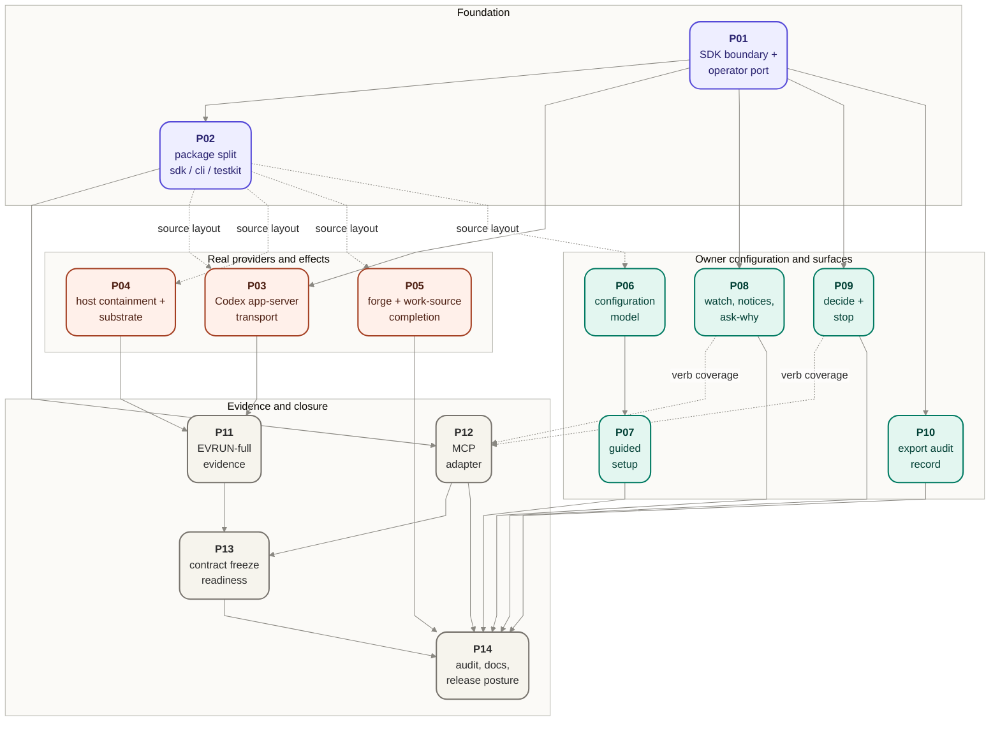

# Target-state implementation — delivery track

**Status: planned.** No phase has started. Phase statuses live in the [phase table](#phase-table)
below and in each phase doc's frontmatter.

## Overview

This track turns the current Jig implementation — a single private package with a fixture-backed
CLI (`jig preview`, `jig run`, `jig inspect`, `jig resume`) — into the target state described by
[`docs/product/`](../../product/README.md) and [`docs/design/`](../../design/README.md): the
three-package SDK/CLI/testkit shape of [ADR 0027](../../design/decisions/0027-packaging-sdk-boundary.md),
the real Codex app-server agent transport of
[ADR 0028](../../design/decisions/0028-codex-app-server-transport.md), proven execution-host
containment, the full owner-facing surface (guided setup, start, preview, watch, inspect,
ask-why, decide, stop, notices, export), and the EVRUN-full evidence that the whole real path
works.

The track is fourteen phases, each scoped to one reviewable PR. The phase docs under
[`phases/`](./phases/) carry the per-phase obligations; [`verification.md`](./verification.md)
carries the track-wide verification strategy.

## Why now

The docs sequence that ended at PR #53 left the repo in a deliberate position: the product and
design layers are reconciled **target truth**, the stale delivery/planning records are archived,
and no active delivery plan exists. The gap between target docs and current implementation is
now well-defined and stable enough to phase. Without an active track, implementation work would
either restart from archived plans (explicitly disallowed — they predate the reconciled target)
or improvise phase boundaries per PR.

## Current baseline

Verified against the repo at commit `f0d61db` (`docs: archive stale Jig housekeeping docs (#53)`):

- **One private package.** `@agentic-workflow-kit/jig-repo`, `private: true`, no `exports` map,
  flat `src/`, no workspace packages. `bin/jig.js` calls `dist/src/cli.js`.
- **Core lifecycle is implemented.** Plan intake (`src/plan-validator.ts`, `src/intake.ts` with a
  validated-candidate chokepoint), orchestration (`src/harness.ts`), fail-closed authorization
  (`src/authorization.ts`), append-only records with snapshots, redaction, and an HMAC integrity
  sidecar (`src/records.ts`, `src/redaction.ts`, `src/integrity.ts`), projection-based inspect
  and resume with no-double-effect replay (`src/projection.ts`, `src/resume.ts`).
- **Provider seams exist with mixed maturity.** Four ports in `src/ports.ts`; the composition
  root `src/bootstrap.ts` selects drivers by name and fails closed on unknown names. Forge
  (`git`/`gh`-based GitHub driver) and Work source (GitHub Issues importer) are **real and
  usable**. The Agent seam has a `CodexAgent` wrapper but **no production `CodexAgentSession`
  transport** — `agent: 'codex'` is unusable from the shipped CLI. The real Execution host wraps
  a confinement probe whose only concrete implementation is a **hardcoded always-strong stub**.
- **Conformance suite** lives at `src/conformance/provider-conformance.ts` inside the production
  tree, exercised from `tests/conformance/`.
- **CLI surface** is `preview`, `run`, `inspect`, `resume` only. Owner decisions are an
  interactive TTY prompt inside `jig run`. There is no setup, watch, ask-why, out-of-band
  decide, stop, notices, or export surface, no work-profile or repo-floors artifact, and no MCP
  or SDK consumer surface.
- **Evidence**: EVRUN-partial is committed
  ([evidence index](../../design/evidence/README.md)) — one real
  work-source → forge → records-integrity run with a **scripted** agent leg. EVRUN-full (real
  Codex leg, real confinement, adversarial no-phone-home, multi-run idempotency) remains open.

## Desired target state

- **Packages** (ADR 0027): `@agentic-workflow-kit/jig-sdk`, `jig-cli`, and `jig-testkit` as
  private workspace packages with the ADR's dependency matrix enforced; the root package stays a
  private coordination shell; no publish or stability promise is created.
- **Driving** ([driving contract](../../design/contracts/driving.md)): CLI, MCP, and SDK
  adapters as thin realizations of one operator-control port carrying start, preview, watch,
  inspect, ask-why, decide, and stop — one action, one control-plane call, one audit event.
- **Providers** ([providers contract](../../design/contracts/providers.md),
  [realization roadmap](../../design/contracts/provider-realization-roadmap.md)): a real Codex
  agent behind `AgentPort` over the owned stdio app-server (ADR 0028), an execution host with
  exercised, honestly-reported confinement proof, and completed Forge/Work-source behavior
  including blocked-PR surfacing (`MERGE-5`).
- **Owner configuration** ([guarantee 2](../../product/guarantees.md#2-configuration-ownership)):
  policy, work profile, and repo-level floors as understandable, validated, track-scoped
  artifacts, with guided setup and templates.
- **Observability** ([guarantee 5](../../product/guarantees.md#5-full-observability)): watch,
  notices with acknowledge/snooze, ask-why, and write-once redacted export, all answered from
  the run's own records.
- **Evidence**: EVRUN-full committed; contract-freeze readiness prepared for the contract
  owner's T14 decision.
- **Docs**: README, AGENTS.md, and docs indexes state the shipped surface truthfully at every
  phase boundary.

## Scope and non-goals

In scope: everything between the baseline and target state above, sliced into the phases below,
plus the per-phase docs updates that keep status claims truthful.

Out of scope for the whole track, with the owning source:

- **Publishing any package or creating a publish/stability promise** — the product boundary
  keeps "no public package, no external stability commitment today"
  ([`jig.md` — Product Boundaries](../../product/jig.md#product-boundaries)); ADR 0027 creates
  no publish promise. Phase 14 records the posture; it does not change it.
- **Remote execution hosts** — "Remote hosts are a ready seam with no shipped driver yet"
  ([`jig.md` — What Jig isn't (yet)](../../product/jig.md#what-jig-isnt-yet)).
- **Webhook/scheduler triggers** — driving stays operator-initiated
  ([`jig.md`](../../product/jig.md#what-jig-isnt-yet); [driving contract — risks and
  deferred](../../design/contracts/driving.md#risks-and-deferred-decisions)).
- **Hosted multi-tenant service** — "a tool you run, not a service you buy"
  ([`jig.md`](../../product/jig.md#what-jig-isnt-yet)).
- **Third-party provider ecosystem distribution** (registry, discovery, install UX, public
  provider packages) — an explicitly open product question
  ([`jig.md` — Open Questions](../../product/jig.md#open-questions); ADR 0027 open questions).
  Owner-authored compatible providers (`STACK-7`) are served by the existing ports plus the
  testkit conformance surface; no separate phase is needed beyond P02.
- **LLM-adjudicated approvals** — a product non-goal
  ([`jig.md`](../../product/jig.md#what-jig-isnt-yet)).
- **Windows/Git Bash support for the owned app-server path** — gated on evidence probe
  `N1A-P14`, which requires a Windows host
  ([evidence index](../../design/evidence/README.md#n1a-deferred-probes)); the transport phase
  fails closed on Windows instead.
- **Rewriting product or design docs.** Phases cite them; conflicts route back to the owning
  layer.

## Principles for phase sizing

- One phase equals one logical, independently reviewable PR. A phase may be large when the
  scope is one coherent domain (the package split, the Codex transport); it is never a bag of
  unrelated edits.
- Phase boundaries sit on domain or dependency gates: a package boundary, a provider seam, an
  evidence gate, a driving surface.
- Phases state obligations at component/artifact altitude for senior implementers. Exact code
  shape stays with the implementation PR unless a design doc already fixes it.
- Every phase preserves the gate (`pnpm check`) at full strength and declares its golden-record
  posture explicitly (byte-identical by default; a phase that must change goldens owns that
  change by name). See [`verification.md`](./verification.md).
- Docs that make status claims (README, AGENTS.md, indexes) are updated in the same PR as the
  behavior they describe.

## Dependency graph

Solid edges are hard sequential dependencies. Dashed edges are soft dependencies: work can
start in parallel, but source-layout churn or vocabulary coordination makes sequencing cheaper.
Phase P13 additionally requires a contract-owner decision (see the
[sequential gates](#sequential-gates)).

## Phase table

| ID  | Phase                                                                                      | Status  | Hard dependencies | Parallelization                                                         |
| --- | ------------------------------------------------------------------------------------------ | ------- | ----------------- | ----------------------------------------------------------------------- |
| P01 | [SDK boundary and operator-control surface](./phases/01-sdk-boundary-and-operator-port.md) | planned | —                 | First; everything else keys off this surface.                           |
| P02 | [Package split: jig-sdk, jig-cli, jig-testkit](./phases/02-package-split-workspace.md)     | planned | P01               | Sole occupant of its slot — it moves every source file.                 |
| P03 | [Codex app-server transport](./phases/03-codex-app-server-transport.md)                    | planned | P01               | Parallel with P04–P10 after P02 (soft).                                 |
| P04 | [Execution-host containment and substrate](./phases/04-execution-host-containment.md)      | planned | —                 | Parallel with P03, P05–P10 after P02 (soft).                            |
| P05 | [Forge and work-source completion](./phases/05-forge-and-work-source-completion.md)        | planned | —                 | Parallel with P03, P04, P06–P10 after P02 (soft).                       |
| P06 | [Owner configuration model](./phases/06-owner-configuration-model.md)                      | planned | —                 | Parallel with P03–P05, P08–P10 after P02 (soft).                        |
| P07 | [Guided setup](./phases/07-guided-setup.md)                                                | planned | P06               | Parallel with anything not touching config templates.                   |
| P08 | [Watch, notices, ask-why](./phases/08-observation-surfaces.md)                             | planned | P01               | Parallel with P03–P06, P09, P10; coordinate record vocabulary with P09. |
| P09 | [Decide and stop](./phases/09-owner-decision-and-run-control.md)                           | planned | P01               | Parallel with P03–P06, P08, P10; coordinate record vocabulary with P08. |
| P10 | [Export: write-once audit record](./phases/10-export-audit-record.md)                      | planned | P01               | Parallel with P03–P09.                                                  |
| P11 | [EVRUN-full evidence](./phases/11-evrun-full-evidence.md)                                  | planned | P03, P04          | Sequential after both provider phases; benefits from P05.               |
| P12 | [MCP driving adapter](./phases/12-mcp-adapter.md)                                          | planned | P02               | Parallel with P11; soft dependency on P08/P09 for verb coverage.        |
| P13 | [Contract v0 freeze readiness](./phases/13-contract-freeze-readiness.md)                   | planned | P11, P12          | Blocked: also requires a contract-owner freeze decision.                |
| P14 | [Target-state audit, docs, release posture](./phases/14-docs-and-release-readiness.md)     | planned | All other phases  | Last; closes the track.                                                 |

## What can run in parallel

- **After P01**: P03, P08, P09, and P10 are unblocked semantically, and P04–P06 have no hard
  prerequisite at all — but see the next bullet before starting any of them.
- **After P02**: P03, P04, P05, P06, P08, P09, and P10 can genuinely run in parallel. P02 moves
  every source file into packages, so starting these phases before P02 lands buys conflict
  churn, not time; the dashed edges in the graph are that warning. P08 and P09 both extend the
  doorbell/notice record vocabulary and should coordinate (or be assigned to one implementer in
  sequence).
- **After P06**: P07 joins the parallel pool.
- **After P02 + verb phases**: P12 can proceed while P11 runs. P13 waits for P12 because the
  MCP adapter is part of the first-party driving surface the freeze-readiness audit must cover.

## Sequential gates

1. **P01 → P02** — the SDK surface must exist before the split can move it (ADR 0027's own
   sequencing: boundary first, then the CLI consumes it, then conformance moves to testkit).
2. **P02 is exclusive** — no other phase should have PRs in flight while the source tree moves.
3. **P03 + P04 → P11** — EVRUN-full needs a real agent leg and a real confinement leg; running
   it earlier reproduces EVRUN-partial, which exists.
4. **P11 + P12 → P13** — the T14 v0 contract freeze is explicitly gated on the transport
   implementation/evidence path (ADR 0028, Consequences), and P13 audits the first-party
   driving surfaces including MCP. P13 additionally stops for the contract owner's freeze
   decision; readiness work is in scope, the freeze itself is not.
5. **Everything → P14** — the closing audit only means something when the surface has stopped
   moving.

## Cross-track verification strategy

[`verification.md`](./verification.md) defines the shared strategy: the `pnpm check` gate at
full strength in every phase, the golden-record byte-stability discipline and its explicit
ownership escape hatch, conformance/testkit posture under ADR 0026, the hermetic no-real-effects
guard, evidence-record requirements for the EVRUN gates, security/redaction checks, package
boundary enforcement from P02 on, docs checks, and the definition of "delivered" for the track.

## Known conflicts and open questions routed to phases

Per the escalation rule (product owns what/why; design reconciles to product; delivery names
conflicts rather than resolving them):

- **`MERGE-5` is promised but unproven.** The product guarantees blocked-PR surfacing; the
  EVRUN-partial record explicitly does not claim `MERGE-5`, and only unit-level coverage
  exercises the forge adapter's block-surfacing primitives — no end-to-end real-effect proof
  exists. P05 owns closing or explicitly re-scoping this gap.
- **GUARD-2 pause shape is an open design question** (distinct sub-state vs. reusing `parked`,
  raised in [`plan-intake.md`](../../design/core/plan-intake.md#open-questions);
  [`authorization.md`](../../design/core/authorization.md) explicitly declines to invent a new
  lifecycle state and defers the pause point to orchestration). P06 must stop and route this
  before minting any new lifecycle state — the orchestration transition tables are closed.
- **Evidence-gate-failure modeling** is flagged in
  [`orchestration.md`](../../design/core/orchestration.md) as "a modeling decision, not a
  source-settled rule". P08's notice vocabulary must not silently harden it.
- **Export encoding and replay-drift handling** are deferred in
  [`records.md`](../../design/core/records.md); P10 routes them to the records design owner
  before implementing.
- **Owner-facing setup, notices, and export placement are not settled as driving verbs.** The
  product wants guided setup, notice acknowledge/snooze, and export surfaces, but the active
  [driving contract](../../design/contracts/driving.md) currently names only start, preview,
  watch, inspect, ask-why, decide, and stop. P07, P08, P10, and P12 must route placement to the
  driving/records owners before treating setup, acknowledge/snooze, or export as
  operator-control port verbs.
- **MCP adapter package placement** is not settled by ADR 0027 (its matrix has no MCP package;
  the ADR only says CLI and MCP both call the SDK factory). P12 routes placement to a design
  decision.
- **ADR `applied` status does not mean implemented** — the
  [decision index](../../design/decisions/README.md) warns about this itself. This track's
  baseline was mapped from source and tests, not from ADR statuses.

## Reference map

| Area                                          | Read                                                                                                                                                                                                                                                      |
| --------------------------------------------- | --------------------------------------------------------------------------------------------------------------------------------------------------------------------------------------------------------------------------------------------------------- |
| Product commitments (IDs)                     | [`product/jig.md`](../../product/jig.md), [`product/guarantees.md`](../../product/guarantees.md), [`product/concepts.md`](../../product/concepts.md), [`product/use-cases.md`](../../product/use-cases.md)                                                |
| Driving boundary                              | [`design/contracts/driving.md`](../../design/contracts/driving.md)                                                                                                                                                                                        |
| Data contracts (v0)                           | [`design/contracts/execution-plan-contract-v0.md`](../../design/contracts/execution-plan-contract-v0.md), [`design/contracts/observability-records-contract-v0.md`](../../design/contracts/observability-records-contract-v0.md)                          |
| Provider seams                                | [`design/contracts/providers.md`](../../design/contracts/providers.md), [`design/contracts/provider-realization-roadmap.md`](../../design/contracts/provider-realization-roadmap.md)                                                                      |
| Core lifecycle                                | [`design/core/`](../../design/core/README.md) (bootstrap, plan-intake, orchestration, authorization, records)                                                                                                                                             |
| Domain model                                  | [`design/domain/configuration-and-work.md`](../../design/domain/configuration-and-work.md), [`design/domain/runtime-and-observation.md`](../../design/domain/runtime-and-observation.md)                                                                  |
| Security view                                 | [`design/security-model.md`](../../design/security-model.md)                                                                                                                                                                                              |
| Packaging / transport / conformance decisions | [ADR 0027](../../design/decisions/0027-packaging-sdk-boundary.md), [ADR 0028](../../design/decisions/0028-codex-app-server-transport.md), [ADR 0026](../../design/decisions/0026-conformance-self-report-only.md)                                         |
| Evidence gates                                | [`design/evidence/README.md`](../../design/evidence/README.md)                                                                                                                                                                                            |
| Current implementation                        | `src/` (ports, bootstrap, harness, authorization, records, projection, resume, providers, conformance), `tests/` (unit, integration, conformance, smoke, hermetic guard, `tests/fixtures/m5b-local-mvp/`), `scripts/`, `package.json`, `vitest.config.ts` |
| Historical provenance                         | [`docs/archive/delivery/`](../../archive/delivery/README.md) (M5b, M7 tracks — provenance only)                                                                                                                                                           |
