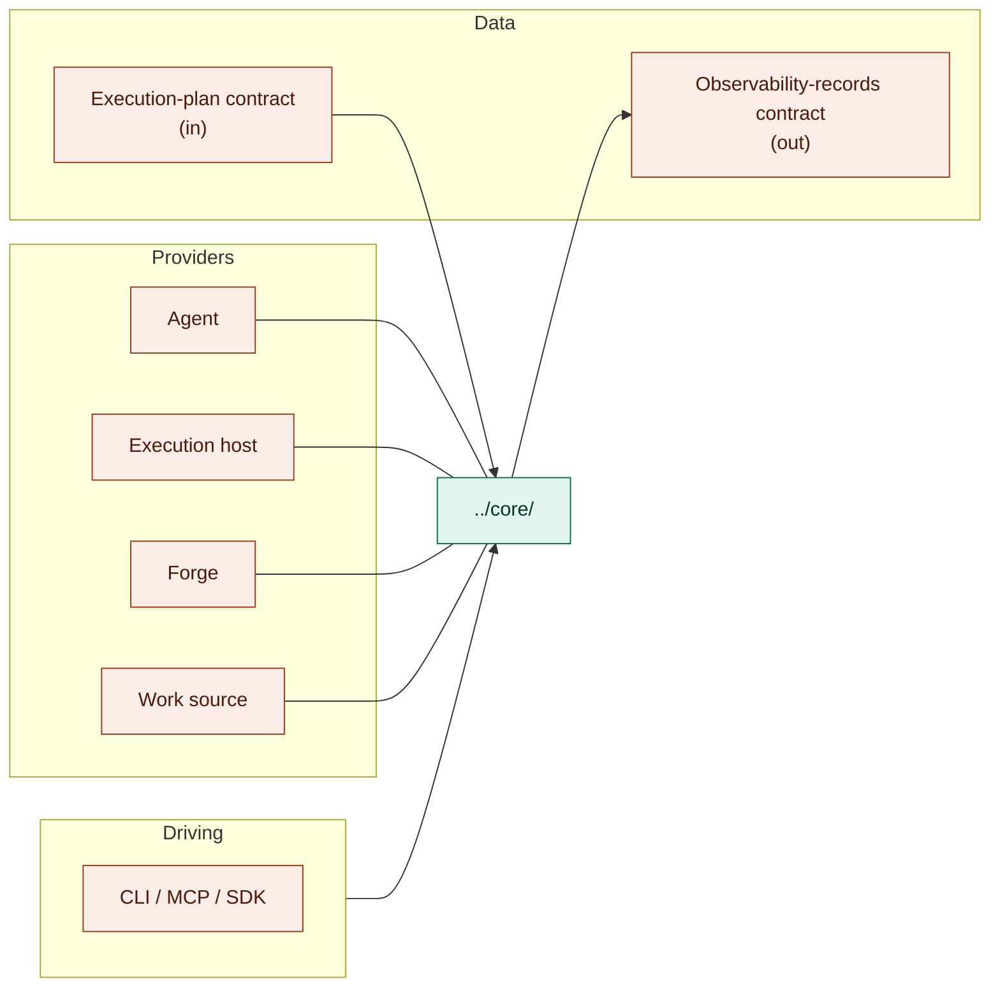

# Contracts — the boundary map

`contracts/` holds every interface at jig's edge, in three kinds: **driving** (how consumers
drive jig), **data** (what flows in and out), and **providers** (what plugs in). The fixed logic
behind all three lives in [`../core/`](../core/README.md); core is not a seam.

## Owns

- **Driving** — the CLI / MCP / SDK adapters consumers use to drive jig. See
  [`driving.md`](./driving.md).
- **Data** — the execution-plan contract in and the observability-records contract out, jig's
  one hard input and its durable output:
  [`execution-plan-contract-v0.md`](./execution-plan-contract-v0.md) and
  [`observability-records-contract-v0.md`](./observability-records-contract-v0.md).
- **Providers** — the four swappable seams (agent, execution host, forge, work source). See
  [`providers.md`](./providers.md).

## Interface

This file is an index, not a port; see the linked files for the ports each boundary kind owns.

## Notes

- Jig owns the plan and records contracts as versioned seams: changing their shape is a breaking
  change for downstream consumers.

## Reconciles to

- `STACK-2` — the four provider seams.
- `SEE-2` — records are a structured, machine-readable product surface.
- `docs/product/jig.md` — "The execution plan — Jig's one input."
