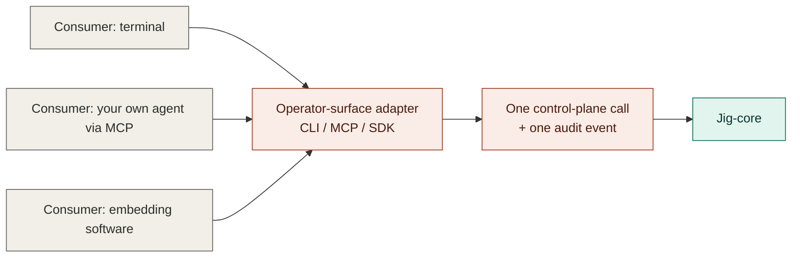

# Driving contracts — how consumers drive jig

The driving boundary is the operator surface realized as CLI / MCP / SDK adapters: one command
becomes one control-plane call and one audit event. The edge holds no run logic and imports no
provider contracts — it only calls into [`../core/`](../core/README.md).

## Owns

- The inbound driving interface jig is operated through.
- The deliberate driving actions: start, preview, watch, inspect, ask-why, decide, stop.
- The one-command / one-control-plane-call / one-audit-event invariant.
- Keeping the edge free of run logic — orchestration, eligibility, and authorization stay in
  core.

## Interface

- **Operator-control port** — the single port behind every adapter; each driving action maps to
  one call on this port.
- **CLI / MCP / SDK adapters** — thin realizations of the port for a terminal, your own agent (as
  a tool), or embedding software, respectively.

## Notes

- The edge holds no run logic and imports no provider contracts; all three adapters are thin
  realizations of the same operator-control port.
- Driving is operator-initiated today: a run starts because you start it. Webhook and scheduler
  triggers are deferred.
- Deferred: the exact method signatures of the operator-control port, and how `decide` (approve /
  reject / override / hand off) is represented across the three adapter forms.

## Reconciles to

- `docs/product/jig.md` — "Driving a run" (start, preview, watch, inspect, ask-why, decide, stop;
  "You run Jig from a terminal, drive it as a tool from your own agent, or embed it in your own
  software"); "Operator-initiated" (see "What Jig isn't (yet)").
- `SEE-1` — full run visibility, surfaced through inspect/ask-why.
