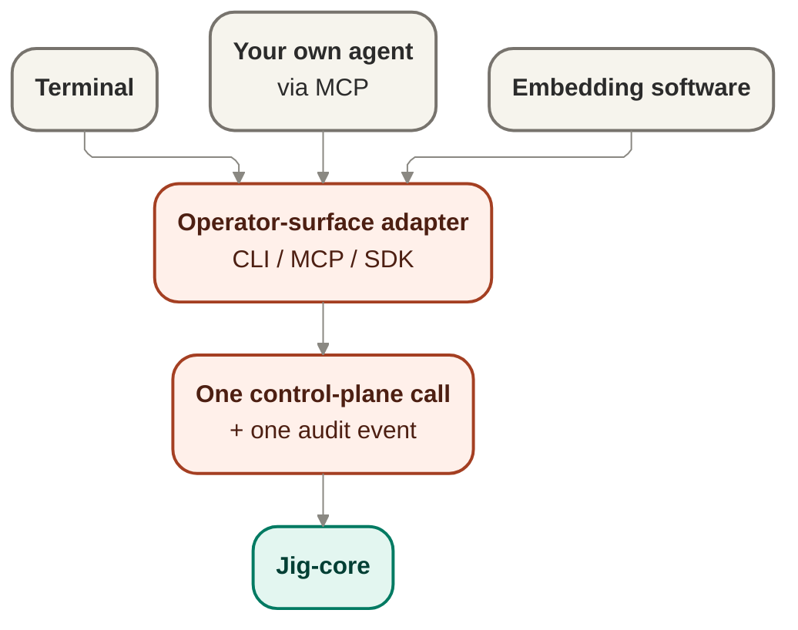

# Driving contracts — how consumers drive jig

The driving boundary is the operator surface realized as CLI / MCP / SDK adapters: one command
becomes one control-plane call and one audit event. The edge holds no run logic and imports no
provider contracts — it only calls into [`../core/`](../core/README.md). "SDK adapter" here names an
architectural edge realization; ADR 0027 separately settles the future internal `jig-sdk` package
boundary.

## Owns

- The inbound driving interface jig is operated through.
- The deliberate driving actions: start, preview, watch, inspect, ask-why, decide, stop.
- The one-command / one-control-plane-call / one-audit-event invariant.
- Keeping the edge free of run logic — orchestration, eligibility, and authorization stay in
  core.

## Interface

- **Operator-control port** — the single port behind every adapter; each driving action maps to
  one call on this port.
- **CLI / MCP / SDK adapters** — thin realizations of the port for a terminal, your own agent (as
  a tool), or embedding software, respectively.

## Port boundary and anti-corruption stance

The existing interface and Mermaid diagram above are the preserved seed for this boundary. Wave 3
deepens them in place rather than replacing them: the operator-control port remains the single
driving surface behind CLI, MCP, and SDK adapters, while core policy, authorization, orchestration,
and provider seams remain cited sources rather than edge-owned behavior.

The anti-corruption stance is different from the swappable provider seams. This edge is not where
run logic lives and it is not a place to redefine provider capability, authorization, or lifecycle
semantics. The edge translates operator intent into one control-plane call through the cited core
surface and records one audit event for that action; it does not reach around the port into core or
into provider contracts directly.

## SDK package reconciliation

[ADR 0027](../decisions/0027-packaging-sdk-boundary.md) uses "SDK" on a distribution axis. The future
`jig-sdk` package owns the programmatic core/records/plan-intake/authorization/factory/provider-port
boundary that first-party consumers call. That does not move run logic into the driving edge:

- the **SDK adapter** in this document remains a thin embedding realization of the operator-control
  port;
- the future **`jig-sdk` package** may physically contain core run logic and the factory, but its
  adapter module still calls the core boundary rather than becoming a second control plane;
- the future **`jig-cli` package** is the terminal adapter and should consume `jig-sdk`, not deep
  import provider or core internals;
- no public package, export map, semver stability, or publishing promise exists today.

The live implementation is still one private package. This contract describes the design boundary and
the target dependency direction, not shipped package files.

## Owns / implements / must-not

### Core owns

- The operator-control port contract and the deliberate driving-action vocabulary at the current
  altitude.
- The one-command / one-control-plane-call / one-audit-event invariant.
- The meaning of the control-plane calls once they enter core.
- The rule that orchestration, eligibility, authorization, and provider interaction remain out of
  the edge.

### An adapter implements

- Thin realization of the port for terminal, MCP/tool, or embedding use.
- Surface-specific packaging of operator intent into a call on the single port.
- Surface-specific presentation of results that come back from core.

### Must not

- Hold run logic, eligibility rules, or authorization decisions in the adapter layer.
- Import provider contracts or call provider seams directly from the edge.
- Bypass the cited core surfaces to perform privileged or lifecycle-significant work.
- Turn one operator action into multiple hidden control-plane operations with ambiguous audit
  posture.

## Driving actions at current altitude

The preserved seed action set remains: start, preview, watch, inspect, ask-why, decide, and stop.
This section stays at design altitude only. It names the deliberate actions the port carries without
freezing exact method signatures or adapter-specific representation.

## Invocation into cited core surfaces

This doc does not author any new state or transition. It names the already-settled invocation
relationship only: the driving edge calls into cited core surfaces, especially
[`../core/orchestration.md`](../core/orchestration.md), and cited authorization flow remains owned
by [`../core/authorization.md`](../core/authorization.md). The `decide` action surfaces an
owner-facing control through the same operator boundary; it does not redesign or bypass the Fence.

## Audit-event posture

- One operator action maps to one control-plane call and one audit event, including invalid input.
- Audit posture belongs to the driving boundary even when the requested action does not proceed.
- The edge contributes the operator-facing entry record, while the meaning and downstream effects of
  the call remain core-owned.

## Edge discipline and contract posture

- The driving edge imports no provider contracts and holds no run logic.
- CLI, MCP, and SDK remain thin realizations of the same port rather than separate control planes.
- The future internal `jig-sdk` package is the supported programmatic route; consumers should not
  rely on deep imports into core or provider modules.
- A future change to provider, authorization, or lifecycle semantics routes back to the owning core
  or provider seam rather than being hidden in an adapter.

## Port-boundary invariant candidates

These are unnumbered candidates only. If a future consolidated ledger needs numbering, the next
available invariant number is `INV-019`.

- **One action, one call, one audit event.** The operator boundary preserves a single deliberate
  driving act rather than fanning it into hidden multi-step control paths.
- **Edge holds no run logic.** Orchestration, eligibility, and authorization semantics remain in
  core.
- **Edge imports no provider contracts.** Driving adapters do not couple directly to swappable
  provider seams.
- **Owner decisions stay on the same operator boundary.** A routed decision returns through the
  operator surface rather than a second ad hoc control channel.

## Risks and deferred decisions

- **Risk — adapter drift.** CLI, MCP, and SDK surfaces may diverge in behavior if they grow local
  control logic instead of staying thin realizations of the same port.
- **Deferred — exact port signatures.** Method names, parameter representation, and adapter-specific
  shapes remain intentionally unfrozen here.
- **Deferred — package mechanics.** Package files, project references, export maps, dependency rules,
  and any public publish/stability promise are deferred to later package implementation work.
- **Deferred — future non-operator triggers.** Webhook or scheduler-triggered entry paths remain a
  separate design question and do not change the current operator-driven boundary.

## Notes

- The edge holds no run logic and imports no provider contracts; all three adapters are thin
  realizations of the same operator-control port.
- Driving is operator-initiated today: a run starts because you start it. Webhook and scheduler
  triggers are deferred.
- Deferred: the exact method signatures of the operator-control port, and how `decide` (approve /
  reject / override / hand off) is represented across the three adapter forms.

## Reconciles to

- `docs/product/jig.md` — "Driving a run" (start, preview, watch, inspect, ask-why, decide, stop;
  "You run Jig from a terminal, drive it as a tool from your own agent, or embed it in your own
  software"); "Operator-initiated" (see "What Jig isn't (yet)"); "Product boundaries" for no public
  package/export/stability promise today.
- ADR 0027 — the `jig-sdk` package boundary is distribution/dependency structure, while this document's
  SDK adapter remains a thin driving realization.
- `SEE-1` — full run visibility, surfaced through inspect/ask-why on the operator boundary.
- `SURF-001` — `OperatorControlPort` as the single operator entry surface behind CLI / MCP / SDK
  realizations.
- `ENF-001` — the edge imports no provider contracts and holds no run logic.
