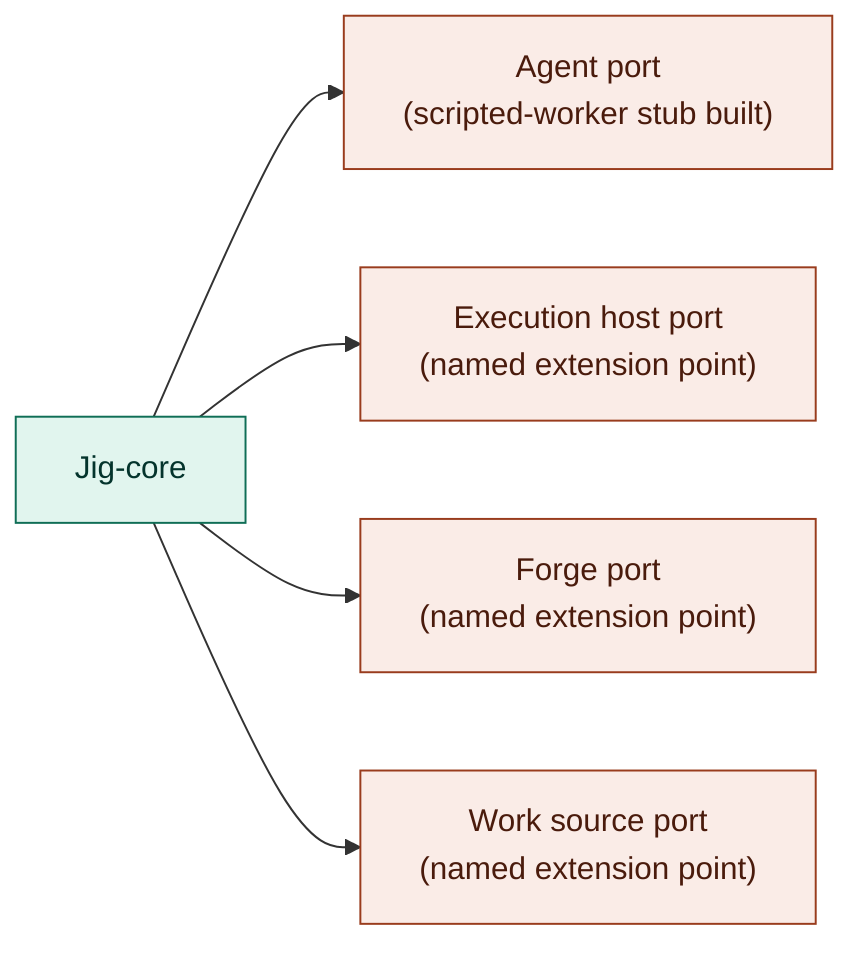

# Provider contracts — the four seams

The provider boundary is jig's stack-portability seam: four swappable ports behind which
drivers plug in. Swapping a driver moves no control, evidence, or recovery boundary — those stay
governed in [`../core/`](../core/README.md).

## Owns

- The **Agent** port — the contained worker: reads a work item, writes code, runs checks,
  reports; holds no credentials.
- The **Execution host** port — where the worker runs; provides isolation and reports its
  isolation strength honestly.
- The **Forge** port — the push / PR / merge target; respects branch protection and merge
  queues.
- The **Work source** port — where work items originate.
- The posture that seams are authority boundaries: credentials and irreversible authority stay
  where the fence and runner govern them, never with a provider.
- The posture that capabilities are attested, not assumed: a driver proves what it can do before
  jig grants it autonomy.

## Interface

- **Agent port** — abstracts the coding worker: request work, produce code, run checks, report
  progress.
- **Execution host port** — abstracts where the worker is contained.
- **Forge port** — abstracts the code host a run pushes to, opens PRs against, and merges
  through.
- **Work source port** — abstracts where work items originate.

## Notes

- A seam is not a shipped driver. Only the scripted-worker stub at the Agent port is built first;
  the real agent driver and the other three seams are named extension points.
- Until a driver proves a capability, expect reduced autonomy, not a weaker guarantee.
- Deferred: the conformance suite a new driver must pass, the manifest format a provider package
  declares (runtimes, network, credentials), and adapter implementations for Execution host,
  Forge, and Work source.

## Reconciles to

- `STACK-1` — guarantees do not depend on the vendor.
- `STACK-2` — Agent, Execution host, Forge, Work source as the four independently swappable
  seams.
- `STACK-5` — seams are authority boundaries; credentials and irreversible authority stay where
  policy and evidence gates govern them.
- `STACK-4` — capabilities are attested, not assumed.
- `DRIVE-1` — a driver earns its place via a conformance suite, not assertion.
- `DRIVE-2` — a provider manifest declares its scope; changes require fresh approval.
- `DRIVE-3` — execution hosts report containment strength honestly.
