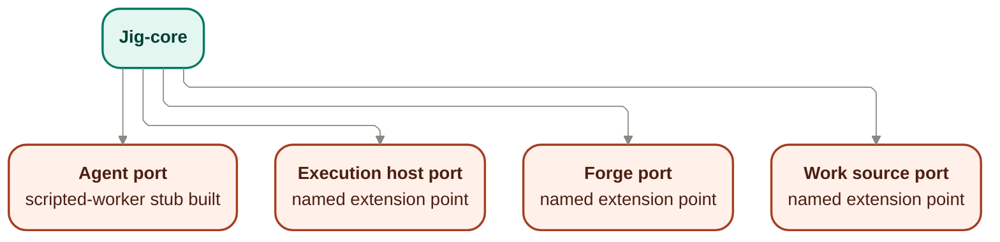

# Provider contracts — the four seams

The provider boundary is jig's stack-portability seam: four swappable ports behind which
drivers plug in. Swapping a driver moves no control, evidence, or recovery boundary — those stay
governed in [`../core/`](../core/README.md).

## Owns

- The **Agent** port — the contained worker: reads a work item, writes code, runs checks,
  reports; holds no credentials.
- The **Execution host** port — where the worker runs; provides isolation and reports its
  isolation strength honestly.
- The **Forge** port — the push / PR / merge target; respects branch protection and merge
  queues.
- The **Work source** port — where work items originate.
- The posture that seams are authority boundaries: credentials and irreversible authority stay
  where the fence and runner govern them, never with a provider.
- The posture that capabilities are attested, not assumed: a driver proves what it can do before
  jig grants it autonomy.

These seed statements remain the governing overview for this file and are deepened below rather
than replaced. The boundary split they imply is the load-bearing rule for all four seams: core owns
the port contract, its invariants, and its semantics; a provider implements behind the port; a
provider must not redefine policy, evidence, authorization, or state semantics the core already
owns. This follows the boundary map in [`README.md`](./README.md), the Fence authority model in
[`../core/authorization.md`](../core/authorization.md), the runner authority split in
[`../core/orchestration.md`](../core/orchestration.md), the composition-root wiring point in
[`../core/bootstrap.md`](../core/bootstrap.md), the product guarantees in
[`../../product/guarantees.md`](../../product/guarantees.md), and the existing runtime seam
inventory in [`../notes/runtime-design-m5a.md`](../notes/runtime-design-m5a.md).

## Interface

- **Agent port** — abstracts the coding worker: request work, produce code, run checks, report
  progress.
- **Execution host port** — abstracts where the worker is contained.
- **Forge port** — abstracts the code host a run pushes to, opens PRs against, and merges
  through.
- **Work source port** — abstracts where work items originate. It may supply provenance or
  future import/sync behavior, but the validated execution plan remains jig's only runtime
  scheduling input; the Work source seam never bypasses the plan.

The four one-line interface statements above and the diagram are preserved as the seed for the
port contracts below. The sections that follow re-project that seed into core-owned seam
responsibilities without changing the interface names, seam set, or boundary direction.

## Contract stance

The provider boundary is anti-corruption first, not adapter-definition first. Core owns the seam
names, the authority split, the guarantee-bearing invariants, and the meaning of the lifecycle
terms already settled elsewhere. A provider implements a concrete adapter behind one of these
ports, but it does not get to redefine:

- what counts as authorization or escalation;
- what counts as evidence or completion;
- what `done`, `landed`, `blocked`, or `parked` mean;
- where credentials and irreversible authority live;
- how work becomes eligible to run.

This file therefore describes each seam as an owns / implements / must-not contract, while leaving
adapter mechanics, schemas, and manifest detail for later work.

## Port invocation points

Wave 3 adds no new states or transitions. It names only the settled invocation points and source
relationships these seams participate in:

- The **Agent** port is invoked from the runner when a work item reaches `started`, with worker
  requests crossing the Fence's `authorize(request, boundPolicy) → grant | deny | route` decision
  from [`../core/authorization.md`](../core/authorization.md).
- The **Forge** port is invoked by the runner at the `done → landed` boundary named in
  [`../core/orchestration.md`](../core/orchestration.md); the worker does not invoke it.
- The **Work source** port may supply provenance or import/sync behavior before runtime execution,
  but it does not bypass validated plan intake; the validated execution plan remains jig's only
  runtime scheduling input.
- The **Execution host** port contains the worker environment the Agent port runs inside; its
  confinement posture is what carries the no-phone-home guarantee from
  [`../../product/guarantees.md`](../../product/guarantees.md).
- [`../core/bootstrap.md`](../core/bootstrap.md) is the composition root that wires provider
  implementations to these four seams; this file frames the ports it wires, not the wiring rules.

## Port contracts

### Agent port

Seed interface preserved: **Agent port** — abstracts the coding worker: request work, produce code,
run checks, report progress.

**Core owns**

- The meaning of the worker seam as a contained, non-privileged actor.
- The rule that every worker request is authorized before execution, fail-closed, through the Fence.
- The rule that the worker holds no forge credentials and no privileged landing authority.
- The semantics of work-item and run lifecycle terms the worker reports against.

**Provider implements**

- A concrete worker adapter that can carry out coding work, run checks, and report progress through
  the port.
- The request and observation behavior needed for the runner to drive a work item through this seam.
- Capability proof specific to the driver and run context before greater autonomy is granted.

**Provider must not**

- Expose or smuggle a privileged push, PR, merge, or credential-bearing path through the seam.
- Self-authorize a request or redefine what counts as grant, deny, or route.
- Treat self-report as sufficient evidence for completion or landing.
- Redefine lifecycle meaning or widen authority mid-run.

### Execution host port

Seed interface preserved: **Execution host port** — abstracts where the worker is contained.

**Core owns**

- The guarantee that confinement is real enough to preserve the no-phone-home boundary.
- The meaning of isolation-strength reporting and the policy consequences of weaker or missing proof.
- The rule that stronger autonomy unlocks only when containment is proven, not asserted.
- The fact that credentials and irreversible authority stay outside the worker environment.

**Provider implements**

- A concrete containment environment for the worker.
- Honest reporting about the isolation posture the environment actually provides.
- The host-side behavior needed to let the runner and worker operate within the declared boundary.

**Provider must not**

- Treat self-report as proof that confinement held.
- Redefine the no-phone-home guarantee as best-effort or informational only.
- Move privileged credentials into the worker environment.
- Reinterpret policy, evidence, or authorization semantics to compensate for weaker isolation.

### Forge port

Seed interface preserved: **Forge port** — abstracts the code host a run pushes to, opens PRs
against, and merges through.

**Core owns**

- The rule that push, PR creation, and merge are runner authority, never worker authority.
- The meaning of `done` versus `landed`, and the evidence gate that must already be satisfied before
  landing is attempted.
- The decision that branch protection, merge queues, and other forge-side controls are respected as
  governing constraints, not bypass targets.
- The record/evidence boundary for what is attempted, blocked, or landed.

**Provider implements**

- A concrete integration to the code host behind the runner-owned seam.
- The mechanics needed for the runner to push, open PRs, and merge through the forge.
- Truthful surfacing of forge-side constraints and outcomes back to the core.

**Provider must not**

- Let the worker invoke landing authority directly.
- Redefine what counts as evidence-met, done, or landed.
- Hide forge-side blockers or silently widen authority around branch protection or queues.
- Become a second policy or state authority for merge decisions.

### Work source port

Seed interface preserved: **Work source port** — abstracts where work items originate. It may
supply provenance or future import/sync behavior, but the validated execution plan remains jig's
only runtime scheduling input; the Work source seam never bypasses the plan.

**Core owns**

- The rule that the validated execution plan is jig's only runtime scheduling input.
- The meaning of plan-bound eligibility and dependency order once work enters runtime execution.
- The authority boundary between provenance/import behavior and runtime orchestration.
- The decision to reject unknown or incompatible plan shapes at the plan boundary, not guess.

**Provider implements**

- A concrete origin, import, or sync adapter that can supply candidate work provenance.
- The behavior needed to surface source context to planning or intake without becoming the runner.
- Honest representation of what came from the source versus what jig validated and scheduled.

**Provider must not**

- Hand work directly to the runner in a way that bypasses plan validation.
- Become a competing runtime scheduler or redefine dependency/eligibility semantics.
- Freeze contract fields locally to fit one source's needs.
- Reinterpret imported work as already authorized, eligible, or complete.

## Cross-port invariant candidates

These provider-boundary invariants are named here as unnumbered candidates only. They are not added
to the invariant ledger in this pass. If future numbering is needed, the next available slot is
`INV-019`.

- **Providers hold no privileged credentials.** Credentials and irreversible authority stay with the
  Fence and runner, never with a provider seam.
- **Agent seam exposes no privileged landing path.** The worker seam carries request/observe
  behavior only; landing authority stays runner-owned.
- **Execution-host confinement is proven, not trusted by self-report.** The no-phone-home guarantee
  is a core-owned boundary the host must substantiate.
- **Forge is runner-invoked only.** Push, PR, and merge pass through a runner-owned seam after
  policy-bound evidence gates, never directly from the worker.
- **Work source never bypasses validated plan intake.** Provenance can enter; runtime scheduling
  does not.
- **Capabilities are attested, not assumed.** Missing, stale, or failed proof reduces autonomy
  rather than weakening guarantees.
- **Core depends on ports, not adapters.** Provider implementations plug in behind core-owned seam
  contracts and do not redefine their vocabulary.

## Notes

- A seam is not a shipped driver. Only the scripted-worker stub at the Agent port is built first;
  the real agent driver and the other three seams are named extension points.
- Until a driver proves a capability, expect reduced autonomy, not a weaker guarantee.
- Deferred: the conformance suite a new driver must pass, the manifest format a provider package
  declares (runtimes, network, credentials), and adapter implementations for Execution host,
  Forge, and Work source.

## Deferred and out of scope

- Concrete adapter implementations for Agent, Execution host, Forge, or Work source.
- Provider manifests, conformance-suite design, or capability-proof schema detail.
- TypeScript interfaces, JSON Schema, event constants, or frozen field-level contract shapes.
- New lifecycle states, transition tables, or state-machine redesign.
- The Fence classifier internals in [`../core/authorization.md`](../core/authorization.md).
- Bootstrap's provider-selection and wiring internals in [`../core/bootstrap.md`](../core/bootstrap.md).
- Any change to the execution-plan or observability-records v0 contracts.

## Reconciles to

- `STACK-1` — guarantees do not depend on the vendor.
- `STACK-2` — Agent, Execution host, Forge, Work source as the four independently swappable
  seams.
- `STACK-3` — bring-your-own agent remains a work-profile choice behind the Agent seam rather than a
  change to core authority semantics.
- `STACK-5` — seams are authority boundaries; credentials and irreversible authority stay where
  policy and evidence gates govern them.
- `STACK-4` — capabilities are attested, not assumed.
- `DRIVE-1` — a driver earns its place via a conformance suite, not assertion.
- `DRIVE-2` — a provider manifest declares its scope; changes require fresh approval.
- `DRIVE-3` — execution hosts report containment strength honestly.
- `SEC-1` — secrets stay out of records, logs, artifacts, and exports; providers do not redefine
  that redaction boundary by moving sensitive material into seam traffic or provider-owned traces.
- `SEC-2` — no phone-home is a proven containment boundary, not a provider assertion.
- `SEC-3` — the worker never holds forge credentials.
- `FENCE-2` — a provider cannot widen its authority mid-run.
- `FENCE-3` — privileged actions remain runner-held, not worker-held.
- `EARN-1` and `EARN-2` — autonomy follows fresh capability proof, not assumption.
- `MERGE-2` — push, PR creation, and merge remain runner authority.
- `INV-002` — the Agent seam exposes no privileged method; landing authority remains outside the
  worker-facing port.
- `INV-007` — the Work source seam never bypasses validated plan intake, so unknown or incompatible
  plan shapes are rejected at the boundary rather than guessed through a provider path.
- `SURF-003` — the Agent port remains the worker seam for request/observe behavior only, with no
  privileged method added here.
- `SURF-006` — ExecutionHostPort, ForgePort, and WorkSourcePort remain design-level seams in this
  doc, without adapter implementation detail.
- `CTX-005` — the four driver seams are treated as ports, with only the Agent seam previously
  exercised by the scripted stub and the others remaining named extension points.
- `DEL-004` — this port contract surface matches the runtime slice that couples orchestration to the
  scripted-stub Agent seam while leaving real provider adapters out of scope.
- `ENF-004` — core depends on these seam contracts, not concrete adapters; provider implementations
  plug in behind the ports rather than redefining them.
