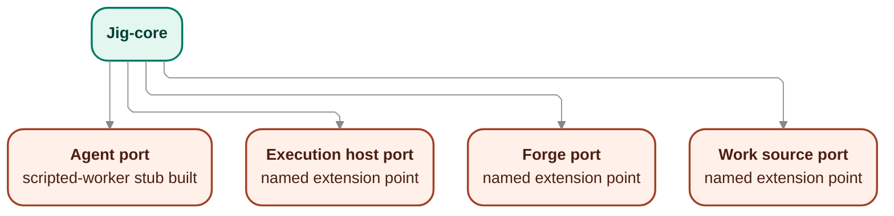

# Provider contracts — the four seams

The provider boundary is jig's stack-portability seam: four swappable ports behind which
drivers plug in. Swapping a driver moves no control, evidence, or recovery boundary — those stay
governed in [`../core/`](../core/README.md).

## Owns

- The **Agent** port — the contained worker: reads a work item, writes code, runs checks,
  reports; holds no credentials.
- The **Execution host** port — where the worker runs; provides isolation and reports its
  isolation strength honestly.
- The **Forge** port — the push / PR / merge target; respects branch protection and merge
  queues.
- The **Work source** port — where work items originate.
- The posture that seams are authority boundaries: credentials and irreversible authority stay
  where the fence and runner govern them, never with a provider.
- The posture that capabilities are attested, not assumed: a driver proves what it can do before
  jig grants it autonomy.

These seed statements remain the governing overview for this file and are deepened below rather
than replaced. The boundary split they imply is the load-bearing rule for all four seams: core owns
the port contract, its invariants, and its semantics; a provider implements behind the port; a
provider must not redefine policy, evidence, authorization, or state semantics the core already
owns. This follows the boundary map in [`README.md`](./README.md), the Fence authority model in
[`../core/authorization.md`](../core/authorization.md), the runner authority split in
[`../core/orchestration.md`](../core/orchestration.md), the composition-root wiring point in
[`../core/bootstrap.md`](../core/bootstrap.md), the product guarantees in
[`../../product/guarantees.md`](../../product/guarantees.md), and the existing runtime seam
inventory in [`../notes/runtime-design-m5a.md`](../notes/runtime-design-m5a.md).

## Interface

- **Agent port** — abstracts the coding worker: request work, produce code, run checks, report
  progress.
- **Execution host port** — abstracts where the worker is contained.
- **Forge port** — abstracts the code host a run pushes to, opens PRs against, and merges
  through.
- **Work source port** — abstracts where work items originate. It may supply provenance or
  future import/sync behavior, but the validated execution plan remains jig's only runtime
  scheduling input; the Work source seam never bypasses the plan.

The four one-line interface statements above and the diagram are preserved as the seed for the
port contracts below. The sections that follow re-project that seed into core-owned seam
responsibilities without changing the interface names, seam set, or boundary direction.

## Contract stance

The provider boundary is anti-corruption first, not adapter-definition first. Core owns the seam
names, the authority split, the guarantee-bearing invariants, and the meaning of the lifecycle
terms already settled elsewhere. A provider implements a concrete adapter behind one of these
ports, but it does not get to redefine:

- what counts as authorization or escalation;
- what counts as evidence or completion;
- what `done`, `landed`, `blocked`, or `parked` mean;
- where credentials and irreversible authority live;
- how work becomes eligible to run.

This file therefore describes each seam as an owns / implements / must-not contract, while leaving
adapter mechanics, schemas, and manifest detail for later work.

## Port invocation points

Wave 3 adds no new states or transitions. It names only the settled invocation points and source
relationships these seams participate in:

- The **Agent** port is invoked from the runner when a work item reaches `started`, with worker
  requests crossing the Fence's `authorize(request, boundPolicy) → grant | deny | route` decision
  from [`../core/authorization.md`](../core/authorization.md).
- The **Forge** port is invoked by the runner at the `done → landed` boundary named in
  [`../core/orchestration.md`](../core/orchestration.md); the worker does not invoke it.
- The **Work source** port may supply provenance or import/sync behavior before runtime execution,
  but it does not bypass validated plan intake; the validated execution plan remains jig's only
  runtime scheduling input.
- The **Execution host** port contains the worker environment the Agent port runs inside; its
  confinement posture is what carries the no-phone-home guarantee from
  [`../../product/guarantees.md`](../../product/guarantees.md).
- [`../core/bootstrap.md`](../core/bootstrap.md) is the composition root that wires provider
  implementations to these four seams; this file frames the ports it wires, not the wiring rules.

## Port contracts

### Agent port

Seed interface preserved: **Agent port** — abstracts the coding worker: request work, produce code,
run checks, report progress.

This section deepens the existing Agent seed in place rather than replacing it. The preserved port
line above, the file-level Owns / Interface / Notes / diagram, and the port-invocation points
remain the governing seed statements for this seam. The Agent provider implements behind that
port, consuming core contracts read-only: the Fence's authorization decision from
[`../core/authorization.md`](../core/authorization.md), the runner-owned lifecycle/orchestration
surface from [`../core/orchestration.md`](../core/orchestration.md), the capability/evidence model
framed in [`../core/plan-intake.md`](../core/plan-intake.md), and the records surface in
[`../core/records.md`](../core/records.md). It does not redefine policy, evidence sufficiency,
authorization, or state semantics those core surfaces already own.

**Core owns**

- The meaning of the worker seam as a contained, non-privileged actor.
- The rule that every worker request is authorized before execution, fail-closed, through the Fence.
- The rule that the worker holds no forge credentials and no privileged landing authority.
- The semantics of work-item and run lifecycle terms the worker reports against.
- The structural no-privileged-method guarantee already recorded as
  [`INV-002`](../notes/runtime-design-m5a.md): the Agent seam exposes request / observe behavior
  only, and a privileged push / PR / merge / credential path is outside the seam rather than merely
  disallowed by policy.
- The stub posture recorded in [`SURF-003`](../notes/runtime-design-m5a.md),
  [`CTX-005`](../notes/runtime-design-m5a.md), and
  [`DEL-004`](../notes/runtime-design-m5a.md): the scripted-worker stub is the one built adapter at
  this seam, while any real agent driver remains a named extension point behind the same port.

**Provider implements**

- A concrete worker adapter that can carry out coding work, run checks, and report progress through
  the port.
- The request and observation behavior needed for the runner to drive a work item through this seam.
- Capability proof specific to the driver and run context before greater autonomy is granted.
- A contained worker surface that runs inside the Execution host seam while staying only on the
  Agent side of that boundary: this seam assumes the worker is contained by the host, but it does
  not define the host's containment model, proof mechanism, or isolation-strength categories.
- A capability-attestation claim about what the adapter can safely do in the current driver/run
  context. The provider supplies the claim; core judges freshness and sufficiency before autonomy is
  widened, in line with [`EARN-1`](../../product/guarantees.md) and
  [`EARN-2`](../../product/guarantees.md).
- The visible stub-vs-real-driver posture of the seam: the scripted-worker stub may satisfy the
  port with predetermined request / observe behavior, while a future real driver must satisfy the
  same seam without changing its authority boundary.

**Provider must not**

- Expose or smuggle a privileged push, PR, merge, or credential-bearing path through the seam.
- Self-authorize a request or redefine what counts as grant, deny, or route.
- Treat self-report as sufficient evidence for completion or landing.
- Redefine lifecycle meaning or widen authority mid-run.
- Present capability attestation as self-certifying proof; freshness and sufficiency are judged by
  core, not by the provider.
- Recast the scripted-worker stub as a general-capability driver or blur the seam between the built
  stub and a future real adapter.
- Define the execution host's containment mechanism, no-phone-home proof, or isolation taxonomy from
  the Agent side of the seam.

### Execution host port

Seed interface preserved: **Execution host port** — abstracts where the worker is contained.

This section deepens the existing Execution-host seed in place rather than replacing it. The
preserved port line above, the file-level Owns / Interface / Notes / diagram, and the
port-invocation point that the Agent port runs inside this host remain the governing seed
statements for this seam. The Execution host provider implements behind that port, consuming the
Wave 4a core contracts read-only: the records/evidence surface from
[`../core/records.md`](../core/records.md), the evidence/attestation model from
[`../core/plan-intake.md`](../core/plan-intake.md), and the freshness/sufficiency judgment from
[`../core/authorization.md`](../core/authorization.md). It supplies containment proof and honest
reporting into those core-owned surfaces; it does not redefine policy, evidence taxonomy,
authorization, or log semantics they already own.

**Core owns**

- The guarantee that confinement is real enough to preserve the no-phone-home boundary: outbound
  network access is confined, and the confinement is proven rather than taken on the worker's or
  host's word.
- The containment-proof discipline this seam is held to: the host must supply evidence that the
  declared boundary actually held for the run context it is claiming, not merely report a posture.
- The meaning of isolation-strength reporting and the policy consequences of weaker, missing, stale,
  or overstated proof.
- The rule that stronger autonomy unlocks only when containment is proven, not asserted; the host
  supplies proof, while core judges whether that proof is fresh and sufficient.
- The fact that credentials and irreversible authority stay outside the worker environment.
- The host-side structural contribution to ISO-4: the worker runs in a run-scoped isolated
  workspace whose boundary prevents parallel runs from colliding through shared execution
  environment state.

**Provider implements**

- A concrete containment environment for the worker that contains the Agent port from the host side
  of the shared seam: the worker runs inside this host, but the host does not redefine the Agent
  port's request/observe behavior.
- A containment-proof discipline that produces a host-supplied claim rather than a self-certifying
  assertion. The proof must demonstrate the confinement boundary the host claims, for the run and
  driver context it claims, in a form the core evidence model can judge.
- An isolation-strength category catalog the host reports against honestly, with categories stated
  as host-reported strength claims rather than as automatic grants of autonomy. At minimum the seam
  must distinguish between: no meaningful confinement proof, confinement present but weaker than
  the strongest available boundary, and confinement strong enough to support the highest autonomy
  posture core may later allow.
- Honest reporting about the isolation posture the environment actually provides, including when the
  host can only prove a weaker category than requested or cannot prove confinement at all.
- The host-side behavior needed to let the runner and worker operate within the declared boundary,
  including the run-scoped workspace isolation this seam contributes to ISO-4.
- The supplied-claim side of the SEC-2 / EARN-2 boundary: the host emits proof and honest report
  into the evidence model; core decides how that changes autonomy and records the outcome.
- The design posture side of the SEC-2 three-way boundary: this seam owns the requirement that the
  no-phone-home boundary be provable and honestly reported; later red-team adversarial probing and
  later integration collection remain outside this section.
- Candidate-only invariant rows, kept outside the numbered ledger and flagged for U9
  reconciliation: `containment-proven-not-asserted` and `isolation-strength-honestly-reported`.
- A tactical failure-token catalog the host can produce/report without judging policy consequence:
  `containment unproven`, `isolation-strength overstated`, and `workspace collision`. The host
  reports the condition it encountered or could prove; core judges freshness/sufficiency and
  records the outcome through its own evidence and records surfaces.

**Provider must not**

- Treat self-report as proof that confinement held, or blur the distinction between claimed
  isolation strength and proved isolation strength.
- Redefine the no-phone-home guarantee as best-effort or informational only.
- Decide for itself that its proof is fresh enough or sufficient enough; that judgment stays with
  core.
- Invent its own evidence taxonomy, log model, or policy consequence model to compensate for weaker
  isolation.
- Move privileged credentials into the worker environment.
- Reinterpret policy, evidence, or authorization semantics to compensate for weaker isolation.
- Collapse the SEC-2 ownership split by authoring the future red-team scenario or claiming
  collection findings that belong to later integration work.

### Forge port

Seed interface preserved: **Forge port** — abstracts the code host a run pushes to, opens PRs
against, and merges through.

This section deepens the existing Forge seed in place rather than replacing it. The preserved port
line above, the file-level Owns / Interface / Notes / diagram, and the port-invocation point that
the runner invokes this seam at the `done -> landed` boundary remain the governing seed statements
for this seam. The Forge provider implements behind that port, consuming the runner-owned
orchestration surface from [`../core/orchestration.md`](../core/orchestration.md), the
evidence-sufficiency and GUARD-2 preconditions from [`../core/plan-intake.md`](../core/plan-intake.md)
and [`../core/authorization.md`](../core/authorization.md), and the records/log surface from
[`../core/records.md`](../core/records.md) read-only. It does not redefine evidence sufficiency,
GUARD-2 detection or re-approval, done-versus-landed semantics, blocked-state ownership, or log
consistency those core and prior-wave surfaces already own.

**Core owns**

- The rule that push, PR creation, and merge are runner authority, never worker authority.
- The meaning of `done` versus `landed`, and the evidence gate that must already be satisfied before
  landing is attempted.
- The decision that branch protection, merge queues, and other forge-side controls are respected as
  governing constraints, not bypass targets.
- The record/evidence boundary for what is attempted, blocked, or landed.
- The runner-only invocation point for this seam at the `done -> landed` boundary, including the
  rule that the worker never invokes landing authority directly and a forge adapter does not become
  a second caller of the transition.
- The GUARD-2 precondition that rule-governing-surface pauses and re-approval are cleared before
  landing is attempted; this seam consumes that cleared precondition and does not detect or resolve
  it.
- The blocked-transition ownership split: Wave 2 owns when a work item becomes `blocked`; this seam
  owns only the forge-side act of surfacing that already-blocked condition when the runner can do
  so safely.
- The records fallback and log-consistency posture: when a forge-side action cannot be completed
  safely, the durable fallback record remains a Records concern rather than a local reinvention by
  this seam.

**Provider implements**

- A concrete integration to the code host behind the runner-owned seam.
- The mechanics needed for the runner to push, open PRs, and merge through the forge.
- Truthful surfacing of forge-side constraints and outcomes back to the core.
- A runner-exclusive landing adapter that executes push / PR / merge only as the runner's delegate,
  never as worker-held authority and never as an alternate policy or lifecycle owner.
- Respect for forge-side branch protection, merge queues, and related controls as real governing
  constraints the adapter must observe and surface, not bypass or locally reinterpret.
- The mechanical MERGE-5 block-surfacing act at the forge seam: when the runner has a safe branch
  and permission to act, the adapter must open or update the PR-side surface, post status, and
  surface failure reasons through the forge without changing what `blocked` means; when it cannot
  safely do so, the durable fallback record remains a Records concern rather than a local
  reinvention by this seam.
- Adapter-level idempotency as a seam contract: a resume or retry must not silently double-apply a
  push, PR, or merge side effect the runner already recorded or completed. This is a contract-test
  concern for adapters at this seam, not a new lifecycle or ledger surface.

**Provider must not**

- Let the worker invoke landing authority directly.
- Redefine what counts as evidence-met, done, or landed.
- Hide forge-side blockers or silently widen authority around branch protection or queues.
- Become a second policy or state authority for merge decisions.
- Re-judge evidence sufficiency, capability freshness, or completion readiness that core already
  judged before invoking the seam.
- Detect, classify, or capture GUARD-2 rule-governing-surface re-approval on its own; that remains
  with the plan/policy/evidence and authority-spine surfaces this seam consumes.
- Redefine blocked-state ownership, invent a second records fallback, or treat forge-surface
  reporting as the source of truth for log consistency.
- Treat resume/retry as permission to repeat irreversible forge effects without checking whether the
  runner has already completed or recorded them.

### Work source port

Seed interface preserved: **Work source port** — abstracts where work items originate. It may
supply provenance or future import/sync behavior, but the validated execution plan remains jig's
only runtime scheduling input; the Work source seam never bypasses the plan.

**Core owns**

- The rule that the validated execution plan is jig's only runtime scheduling input.
- The meaning of plan-bound eligibility and dependency order once work enters runtime execution.
- The authority boundary between provenance/import behavior and runtime orchestration.
- The decision to reject unknown or incompatible plan shapes at the plan boundary, not guess.

**Provider implements**

- A concrete origin, import, or sync adapter that can supply candidate work provenance.
- The behavior needed to surface source context to planning or intake without becoming the runner.
- Honest representation of what came from the source versus what jig validated and scheduled.

**Provider must not**

- Hand work directly to the runner in a way that bypasses plan validation.
- Become a competing runtime scheduler or redefine dependency/eligibility semantics.
- Freeze contract fields locally to fit one source's needs.
- Reinterpret imported work as already authorized, eligible, or complete.

## Cross-port invariant candidates

These provider-boundary invariants are named here as unnumbered candidates only. They are not added
to the invariant ledger in this pass. If future numbering is needed, the next available slot is
`INV-019`.

- **Providers hold no privileged credentials.** Credentials and irreversible authority stay with the
  Fence and runner, never with a provider seam.
- **Agent seam exposes no privileged landing path.** The worker seam carries request/observe
  behavior only; landing authority stays runner-owned.
- **Execution-host confinement is proven, not trusted by self-report.** The no-phone-home guarantee
  is a core-owned boundary the host must substantiate.
- **Forge is runner-invoked only.** Push, PR, and merge pass through a runner-owned seam after
  policy-bound evidence gates, never directly from the worker.
- **Work source never bypasses validated plan intake.** Provenance can enter; runtime scheduling
  does not.
- **Capabilities are attested, not assumed.** Missing, stale, or failed proof reduces autonomy
  rather than weakening guarantees.
- **Core depends on ports, not adapters.** Provider implementations plug in behind core-owned seam
  contracts and do not redefine their vocabulary.

## Notes

- A seam is not a shipped driver. Only the scripted-worker stub at the Agent port is built first;
  the real agent driver and the other three seams are named extension points.
- Until a driver proves a capability, expect reduced autonomy, not a weaker guarantee.
- Deferred: the conformance suite a new driver must pass, the manifest format a provider package
  declares (runtimes, network, credentials), and adapter implementations for Execution host,
  Forge, and Work source.

## Deferred and out of scope

- Concrete adapter implementations for Agent, Execution host, Forge, or Work source.
- Provider manifests, conformance-suite design, or capability-proof schema detail.
- TypeScript interfaces, JSON Schema, event constants, or frozen field-level contract shapes.
- New lifecycle states, transition tables, or state-machine redesign.
- The Fence classifier internals in [`../core/authorization.md`](../core/authorization.md).
- Bootstrap's provider-selection and wiring internals in [`../core/bootstrap.md`](../core/bootstrap.md).
- Any change to the execution-plan or observability-records v0 contracts.

## Reconciles to

- `STACK-1` — guarantees do not depend on the vendor.
- `STACK-2` — Agent, Execution host, Forge, Work source as the four independently swappable
  seams.
- `STACK-3` — bring-your-own agent remains a work-profile choice behind the Agent seam rather than a
  change to core authority semantics.
- `STACK-5` — seams are authority boundaries; credentials and irreversible authority stay where
  policy and evidence gates govern them.
- `STACK-4` — capabilities are attested, not assumed.
- `DRIVE-1` — a driver earns its place via a conformance suite, not assertion.
- `DRIVE-2` — a provider manifest declares its scope; changes require fresh approval.
- `DRIVE-3` — execution hosts report containment strength honestly.
- `SEC-1` — secrets stay out of records, logs, artifacts, and exports; providers do not redefine
  that redaction boundary by moving sensitive material into seam traffic or provider-owned traces.
- `SEC-2` — no phone-home is a proven containment boundary, not a provider assertion.
- `SEC-3` — the worker never holds forge credentials.
- `FENCE-2` — a provider cannot widen its authority mid-run.
- `FENCE-3` — privileged actions remain runner-held, not worker-held.
- `EARN-1` and `EARN-2` — autonomy follows fresh capability proof, not assumption.
- `MERGE-2` — push, PR creation, and merge remain runner authority.
- `INV-002` — the Agent seam exposes no privileged method; landing authority remains outside the
  worker-facing port.
- `INV-007` — the Work source seam never bypasses validated plan intake, so unknown or incompatible
  plan shapes are rejected at the boundary rather than guessed through a provider path.
- `SURF-003` — the Agent port remains the worker seam for request/observe behavior only, with no
  privileged method added here.
- `SURF-006` — ExecutionHostPort, ForgePort, and WorkSourcePort remain design-level seams in this
  doc, without adapter implementation detail.
- `CTX-005` — the four driver seams are treated as ports, with only the Agent seam previously
  exercised by the scripted stub and the others remaining named extension points.
- `DEL-004` — this port contract surface matches the runtime slice that couples orchestration to the
  scripted-stub Agent seam while leaving real provider adapters out of scope.
- `ENF-004` — core depends on these seam contracts, not concrete adapters; provider implementations
  plug in behind the ports rather than redefining them.
