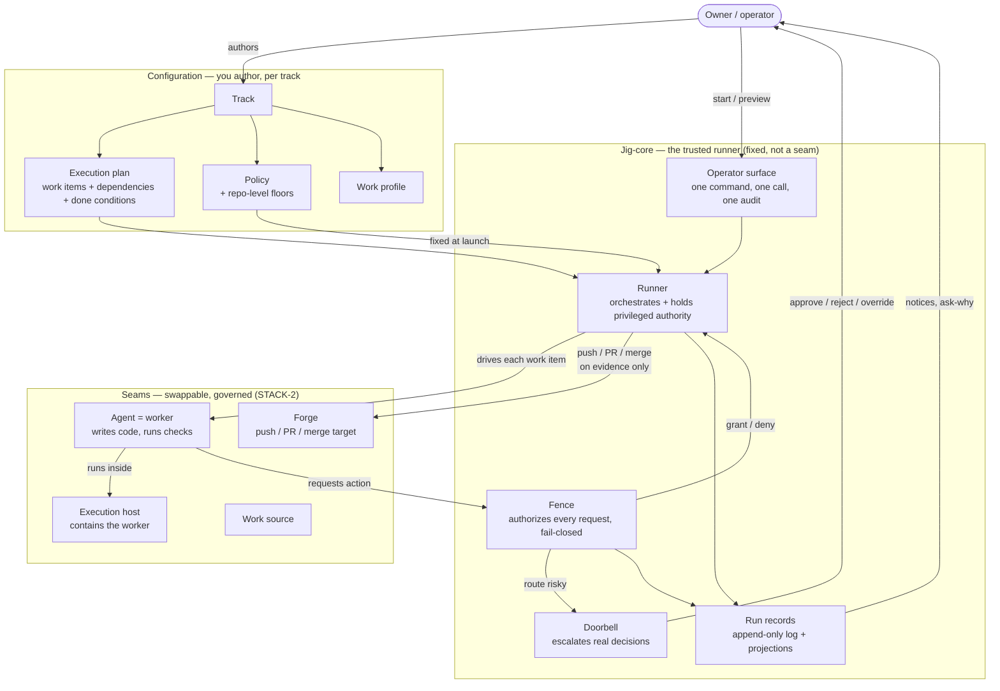
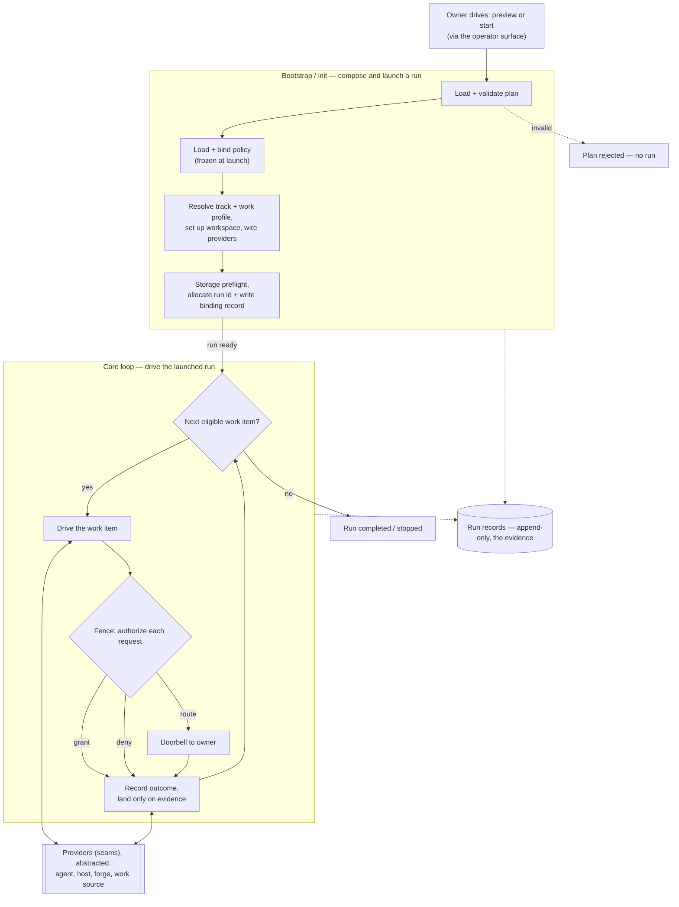

# Jig runtime — system overview

This is the design-layer map of jig's local runtime: the system entities, what each is
responsible for, and how they relate. It reconciles to the product commitments in
[`docs/product/`](../../product/); product owns what and why, this design owns how. Deeper
per-area detail lives in sibling files — the fixed logic here in `core/`
([`bootstrap`](./bootstrap.md), [`plan-intake`](./plan-intake.md),
[`orchestration`](./orchestration.md), [`authorization`](./authorization.md),
[`records`](./records.md)) and the edge interfaces in [`../contracts/`](../contracts/) (driving,
the two data contracts, providers).

**Terminology.** Product altitude owns the name **story** (see
[`concepts.md`](../../product/concepts.md#stories--the-unit-of-work)); the earlier design draft
called it a **task**. This design uses the neutral term **work item**, because the owner
configures their own label — story, task, ticket, whatever fits their tracker. Story, task, and
work item are the same unit: what jig schedules, runs, and lands. This is a deliberate, recorded
design-layer naming choice, not a silent divergence.

## The relations, at a glance

## How a run flows

The map above is the _structure_ — who owns what. This is the _flow_ — how one run moves through
the system in two phases. **Bootstrap / init** composes and launches a run: load and validate the
plan, bind the policy (frozen at launch), wire the providers, and allocate run identity. The
**core loop** then drives each eligible work item through the fence, records the outcome, and
lands only on evidence. The four provider seams are drawn here as one abstracted boundary; their
detail lives in [`../contracts/providers.md`](../contracts/providers.md).

## Responsibilities, by group

### A. Configuration — the owner's inputs (per track)

| Entity            | Responsibility (owns)                                                                                                                                                                                       | Product IDs            |
| ----------------- | ----------------------------------------------------------------------------------------------------------------------------------------------------------------------------------------------------------- | ---------------------- |
| Track             | One independent line of work; carries its own plan + policy + work profile; isolates parallel work so one area never falsely gates another.                                                                 | concepts; CFG-3        |
| Execution plan    | Jig's one hard input. A set of work items + their dependencies + each item's done conditions. One plan per track.                                                                                           | jig.md                 |
| Work item         | The unit jig executes and lands: one reviewable change with its own done conditions; declares dependencies on other items.                                                                                  | concepts               |
| Policy            | The safety/governance contract: gating posture, merge spectrum, concurrency ceiling, retries, required reviews, approvals, escalation, anti-gaming floor, and the manual-to-assisted dial. Fixed at launch. | CFG-1, CFG-10, GUARD-1 |
| Repo-level floors | Repo-scoped policy every track inherits; a track may tighten but never weaken; changing it is itself governed.                                                                                              | CFG-3                  |
| Work profile      | The realization: model, effort, prompt strategy, role realization. Freely tunable — it never lowers the safety floor.                                                                                       | CFG-2                  |

### B. Jig-core — the trusted runner (governs the seams)

| Entity                 | Responsibility (owns)                                                                                                                                                                                                                       | Product IDs                               |
| ---------------------- | ------------------------------------------------------------------------------------------------------------------------------------------------------------------------------------------------------------------------------------------- | ----------------------------------------- |
| Operator surface       | The thin entry point (CLI / SDK / embed) the owner drives jig through: one command becomes one control-plane call and one audit event; the edge holds no run logic and imports no provider contracts.                                       | jig.md; SEE-1                             |
| Runner                 | Jig's trusted orchestrator. Resolves eligibility/order, drives each work item, holds credentials and the sole authority to push/PR/merge, and performs irreversible actions only under policy + evidence. Governs the seams; is not a seam. | concepts; FENCE-3, MERGE-2, SEC-3         |
| Fence                  | Runtime authorization: authorizes every worker request before it executes, fail-closed; grant / deny / route by fixed category; cannot be loosened mid-run.                                                                                 | FENCE-1, FENCE-2, GUARD-1, CFG-10         |
| Doorbell               | Escalation surface: routes ambiguous/risky/unproven actions to the owner; parks durably (survives interruption); grants are narrow, not blanket.                                                                                            | DOOR-1, DOOR-2, DOOR-3                    |
| Capability attestation | Earned-trust gate: requires fresh, positive proof a driver can perform a capability safely; missing or stale proof means less autonomy, not a weaker guarantee.                                                                             | EARN-1, EARN-2, STACK-4, DRIVE-1, DRIVE-3 |
| Run records            | Durable, ordered, structured records — the evidence itself; state/summary/metrics are pure projections of an append-only log; exportable write-once, redacted. The source of notices and "ask why."                                         | SEE-1..6                                  |

### C. The four seams — swappable, governed at the authority boundary

| Entity           | Responsibility (owns)                                                                                                                                    | Product IDs                      |
| ---------------- | -------------------------------------------------------------------------------------------------------------------------------------------------------- | -------------------------------- |
| Agent (= worker) | The contained coding agent: reads a work item, writes code, runs checks, reports. Holds no credentials; cannot push/PR/merge or widen its own authority. | concepts; FENCE-3                |
| Execution host   | Where the worker runs; provides isolation/containment and reports its isolation strength honestly; local-first today.                                    | STACK-2, STACK-5, DRIVE-3, ISO-4 |
| Forge            | The code host: push/PR/merge target; respects branch protection and merge queues; where a block surfaces as a real PR.                                   | STACK-2, MERGE-5                 |
| Work source      | Where work items originate (an extension seam; the plan is the hard input).                                                                              | STACK-2                          |

### D. What you observe (run artifacts)

| Entity   | Responsibility (owns)                                                                                             | Product IDs      |
| -------- | ----------------------------------------------------------------------------------------------------------------- | ---------------- |
| Run      | One execution of a plan under a policy; reconstructible end to end.                                               | jig.md           |
| Evidence | What gates landing — automated checks + review + capability proof; never the worker's self-report alone.          | MERGE-1, MERGE-3 |
| Notice   | A triaged attention item per parked/blocked/stale/overdue condition: what it is, how urgent, what you can do now. | SEE-5            |

## The spine in one paragraph

The owner authors a track (plan + policy + work profile) and starts a run through the operator
surface (one command, one control-plane call, one audit event). The runner binds the policy
at launch, resolves which work items are eligible from their dependencies, and drives each by
handing work to the worker (the agent seam) running inside the execution host. Every action the
worker wants goes through the fence, which grants, denies, or routes it by fixed category;
routed or risky calls ring the doorbell for the owner. The runner — never the worker — pushes,
opens PRs, and merges through the forge, and only on evidence. Every decision lands in run
records, from which the owner inspects, asks "why," and works a queue of notices.

## The two lifecycles

- **Work item:** eligible → started → parked _(transient)_ → done / landed / rejected / blocked
- **Run:** previewed → started → stopped / resumed / completed

`stopped` is a run-level state, not a work-item outcome: a stop pauses the whole run, while
work items that had not reached a terminal outcome stay where they were and resume from their
last safe checkpoint (see [`concepts.md`](../../product/concepts.md#story-and-run-outcomes)).
