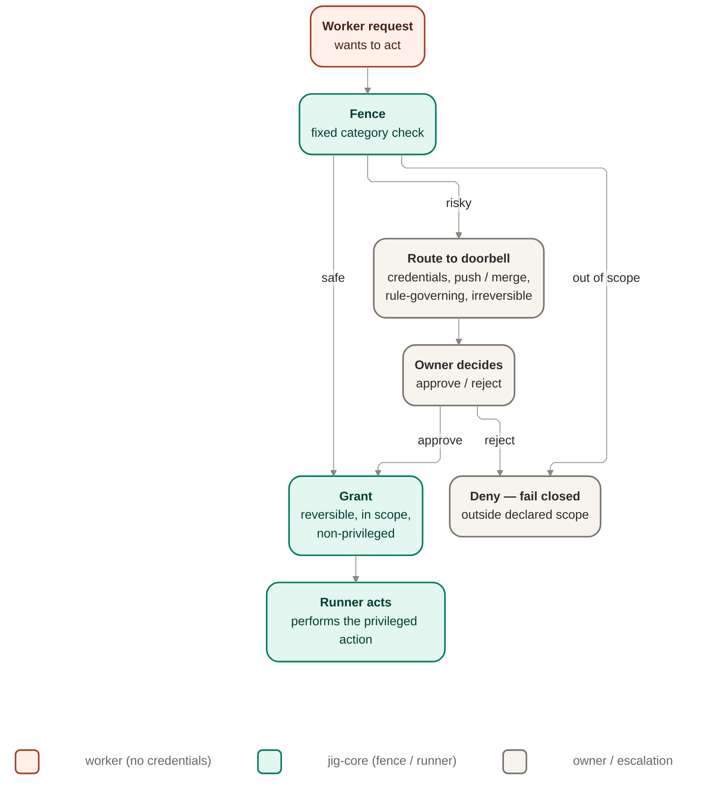

# Authorization — fence, doorbell, capability attestation

The fail-closed control of what the worker may do: authorize every request the worker makes,
escalate the ones that are risky or unproven, and gate autonomy on fresh proof rather than
assertion.

This doc deepens the existing `Owns`, `Interface`, and `Diagram` seed in place. It preserves the
seed boundary that later waves already cite: the Fence owns the classifier behind
`authorize(request, boundPolicy)`, the Doorbell owns durable, narrow escalation, and capability
attestation gates autonomy on proof. The work-item and run state machines remain
[`orchestration.md`](./orchestration.md)'s territory; policy content and rule-governing-surface
declaration remain outside this file.

## Owns

- Authorizing every worker request before it executes, fail-closed when a request is not
  declared and approved (FENCE-1).
- Granting, denying, or routing a request by the fixed CFG-10 category boundary.
- Holding policy fixed at launch — the rules in force cannot be loosened mid-run (GUARD-1,
  FENCE-2).
- Escalating routed, risky, or unproven actions to the doorbell, parking the run durably and
  granting narrowly when the owner decides (DOOR-1, DOOR-2, DOOR-3).
- Gating autonomy on capability attestation: fresh, positive proof a driver can perform an
  action safely before that action is auto-grantable (EARN-1, EARN-2, STACK-4, DRIVE-1).

## Interface

`Fence` port — `authorize(request, boundPolicy) → grant | deny | route`. Routed requests cross
the doorbell escalation channel to the owner, who approves, rejects, or overrides.

The interface line above is preserved as the stable seam. This doc deepens the classifier behind
it; it does not freeze a method signature, schema, or provider protocol.

## Diagram

The worker itself never holds credentials; any privileged action a grant authorizes is carried
out by the runner on the worker's behalf.

## Authority model

| Part                        | Owns                                                                                                                   | Reads                                                                                  | Does not own                                                          |
| --------------------------- | ---------------------------------------------------------------------------------------------------------------------- | -------------------------------------------------------------------------------------- | --------------------------------------------------------------------- |
| Fence classifier            | Classifying a request as `grant`, `deny`, or `route` using the fixed CFG-10 boundary, declared scope, and bound policy | Worker request, bound policy, declared authority expectations, capability proof status | Work-item transition table, policy authoring, provider implementation |
| Doorbell escalation         | Durable routing to an owner decision point and narrow human grants                                                     | Routed request, bound policy, prior escalation context                                 | Policy content, run/work-item stop mechanics, records storage engine  |
| Capability-attestation gate | Whether autonomy may rely on a driver's proof for this action in this run context                                      | Driver proof, run context, requested action class                                      | Conformance-suite design, provider adapter implementation             |
| Runner                      | Executing any privileged action that a grant permits                                                                   | Fence decision, owner decision                                                         | Holding the worker's authority boundary open                          |

## Fixed category boundary

CFG-10 fixes the category line. The Fence applies that fixed line; it does not learn or improvise
it, and no model adjudicates edge cases at runtime.

| Request shape                                                                             | Fence outcome     | Why                                                                   |
| ----------------------------------------------------------------------------------------- | ----------------- | --------------------------------------------------------------------- |
| Declared, approved, reversible, non-privileged, and not touching rule-governing surfaces  | `grant` candidate | This is the only class eligible for assisted autonomy                 |
| Touches credentials, push, merge, rule-governing files, or otherwise irreversible effects | `route`           | The product boundary requires a human decision here                   |
| Ambiguous, risky, or unproven relative to the bound policy or capability proof            | `route`           | Uncertainty closes the door rather than weakening the guarantee       |
| Undeclared, unapproved, or outside bound scope                                            | `deny`            | FENCE-1 is fail-closed on requests the run was not authorized to make |

This boundary is intentionally category-based, not confidence-based. A request does not become
auto-grantable because a model sounds certain; it becomes auto-grantable only if it falls inside
the fixed allowed category and the required proof posture is satisfied.

## Fence decision rules

The Fence evaluates every worker request in this order:

1. Confirm the request is declared and inside approved scope. If not, `deny`.
2. Check whether the request falls into any always-route category: credentials, push, merge,
   rule-governing touch, irreversible effect, ambiguity, or insufficient proof. If so, `route`.
3. Check whether the request is in the low-risk category the bound policy allows to auto-grant.
   If so, `grant`.
4. If the classifier cannot justify `grant` from the fixed rules above, `route`.

The fourth rule is load-bearing: uncertainty never degrades to permissive behavior. The fallback
is escalation, not inference.

## Capability-attestation gate

Capability attestation gates whether a request that is otherwise low-risk may actually be
auto-granted. The gate is positive-only:

- **Fresh** — the proof is still within the validity window the bound policy expects.
- **Positive** — the proof demonstrates the driver can perform the relevant capability safely
  enough; a missing or failed proof is not treated as neutral.
- **Driver-specific** — proof for one driver does not transfer to another.
- **Run-context-specific** — proof is tied to the current run context rather than treated as a
  permanent entitlement.

Insufficient proof does not silently widen authority. It removes the request from the
auto-grantable set and sends it to the Doorbell or keeps it denied by scope, depending on the
request class.

**Phase 5 realization ([ADR 0021](../decisions/0021-phase-5-integrated-provider-runs.md)).** The Fence
gains a capability-attestation input (`authorize(request, boundPolicy, attestation)`): an otherwise
low-risk request is auto-grantable only when a fresh, positive, driver- and run-context-specific proof
exists. A provider-supplied **isolation category or capability claim is input to** this judgment, never
a substitute for it — a `strong`-isolation self-report with an absent, stale, or overstated proof is
judged unproven and unlocks nothing. Freshness is modeled deterministically at local altitude
(`fresh` | `stale` | `missing` against a policy-declared expectation); wall-clock validity windows are
a later real-driver concern. The gate stays positive-only and core-judged; providers supply proof, core
decides sufficiency.

**Phase 6 realization ([ADR 0022](../decisions/0022-phase-6-real-driver-integration.md)).** With real
drivers the gate hardens without changing shape. (1) The Fence judges autonomy on the host's
**`provenIsolationStrength`** (populated from an exercised confinement check), never on
`reportedIsolationStrength`: a `strong` report whose proof supports only `weak` records
`isolation-strength-overstated` and unlocks nothing beyond `weak`; an absent/stale proof records
`containment-unproven` and routes to the Doorbell. (2) Freshness is now decided by a **real clock**
against real driver/host timestamps (the deterministic constant is gone); an attestation past its
policy-declared window is `stale` and treated as non-fresh, dropping the request out of the
auto-grantable set. (3) A separate **substrate manifest** (an immutable, hashed, approved tuple of
runtimes/argv/credentials/egress) bounds what a real driver may **request** at runtime — an
out-of-tuple request is refused as a diagnosable stop; this is distinct from capability attestation
(which proves what the host confines) and is likewise immutable-for-the-run and core-judged. On resume,
the gate adjudicates against the **launch** capability attestation, recovered launch-immutable, never a
fresher re-derivation (see [`bootstrap.md`](./bootstrap.md) "Phase 6 realization").

## Doorbell escalation

The Doorbell is the owner-facing side of routed authority decisions.

- A routed request parks for an explicit owner decision rather than proceeding on worker judgment.
- The routed state is durable: interruption does not erase the pending decision point.
- Human approval is narrow: the owner grants only the authority needed for the request in front of
  the run, not a broader standing exception.
- A routed request may be approved, rejected, or explicitly overridden, but any approval still
  stays scoped to the immediate need and is executed by the runner, not the worker.

This file owns the authorization-side escalation discipline only. The work-item `started → parked`
and `parked → started | rejected` transitions that consume routed decisions remain defined in
[`orchestration.md`](./orchestration.md).

## GUARD-2 enforcement leg

GUARD-2 is intentionally split across three design surfaces, and this file owns only the
authorization leg:

- [`plan-intake.md`](./plan-intake.md) owns the rule side: what counts as a rule-governing
  surface and the policy-level requirement that touching one forces re-approval and fresh
  evidence.
- This file owns the enforcement side: when a request touches a declared rule-governing surface,
  the Fence must not auto-grant it, and the Doorbell must route it to an owner decision.
- [`orchestration.md`](./orchestration.md) owns the pause point: the work-item and run lifecycle
  effects that consume the routed decision and prevent quiet completion.

So the authorization rule here is narrow and explicit: rule-governing touch is always outside the
auto-grantable category. This file does not define the rule-governing-surface set, does not
invent a new lifecycle state, and does not decide the completion guard itself.

### Phase 9 realization — the active re-approval trigger (ADR 0025)

[ADR 0025](../decisions/0025-phase-9-records-integrity.md) activates the
`resume-blocked-missing-approval` seam [ADR 0020](../decisions/0020-phase-4-reliable-local-runs.md) §9
named with **no active trigger** (P4-AC-3 was met by enforced launch-policy immutability alone). At resume
preflight the trigger now fires with a clean two-way split:

- **Tamper (broken integrity) → hard refuse.** If the records-integrity sidecar (ADR 0025;
  [`records.md`](./records.md) "Phase 9 realization") fails to verify, resume **hard-refuses** with a named
  integrity reason and **no re-approval can override it** — a broken chain is corrupted evidence, not a
  changed basis an owner may bless.
- **Legitimate changed-basis → block pending fresh owner re-approval.** If integrity **verifies** but a
  **safety-relevant change to the approved plan's basis** occurred while stopped — a rule-governing surface,
  the launch policy basis, or an integration-safety input the durable evidence detects against the launch
  binding (bounded to what the run records + the workspace fingerprint + the tamper-evident snapshots;
  ADR 0020 §9 says do not over-build) — resume is **blocked** on `resume-blocked-missing-approval` until a
  fresh owner decision and evidence are recorded.

The re-approval evidence is a **fresh owner decision through the existing Doorbell path** —
`authorization.granted` basis `["owner-approval"]` — narrow and durable, the same affordance this file
already owns. Re-approval **re-confirms** continuation under the recorded binding; it **never** rebinds,
widens scope, or swaps the launch policy (GUARD-1). A non-interactive resume with no fresh decision
available fails closed at preflight. **No model adjudicates this boundary (CFG-10):** the
tamper-vs-changed-basis split and the re-approval decision are fixed-category checks and an owner decision,
never an LLM runtime judgment — an implementer must not slip a model in to "decide whether the change
matters."

## Adjacent boundaries

- The Fence provides the guard vocabulary that [`orchestration.md`](./orchestration.md) consumes:
  `grant` continues work on the in-scope path, `deny` feeds the blocked path, and `route` feeds
  the parked/escalation path.
- The runner remains the only component that performs privileged actions, even after a grant or
  owner approval.
- The records system remains the durable evidence substrate for authorization and escalation
  outcomes; this file names the decisions that must be recorded but does not own record storage or
  event-shape design.

## Open questions

- How fresh capability proof must be for each action class is still policy-shaped and remains a
  tuning question outside this file.
- Whether owner override needs a narrower named subtype than the current approve / reject /
  override vocabulary is left open; this doc preserves the seed interface language rather than
  introducing new decision labels.
- The exact review surface through which a routed GUARD-2 decision is presented to the owner
  remains downstream of this core design and the records/driving surfaces.

## Invariant candidates

These are unnumbered candidates only. They do not extend the ledger here.

- **Fail-closed on undeclared or unapproved request.** Any request outside declared approved scope
  yields `deny`; the Fence never manufactures a broader allowance.
- **Category boundary fixed, not model-adjudicated.** Grant / deny / route stays a fixed CFG-10
  category check, never an LLM runtime judgment.
- **Escalation survives interruption and stays narrow.** A routed request remains durable until an
  owner decision resolves it, and any approval stays scoped to the immediate need.

## Risks and deferred decisions

- **Risk — proof freshness tuned too loosely or too tightly.** Overly loose freshness weakens the
  earned-trust posture; overly tight freshness turns routine autonomy into unnecessary escalation.
  This doc keeps the gate shape fixed and leaves threshold tuning to policy and later design.
- **Risk — rule-governing surface declaration drift.** If the declared rule-governing set is
  incomplete upstream, the Fence can only enforce the declared boundary it is given. This file
  therefore depends on the plan/policy surface being explicit rather than inferred.
- **Deferred — conformance depth.** This doc requires driver-and-run-specific capability proof but
  does not define the conformance-suite mechanics that produce that proof.
- **Deferred — observability detail.** Authorization outcomes must become durable evidence, but the
  record families, payload shape, and export posture remain with records and contracts rather than
  this file.

## Notes

- No model adjudicates this boundary (CFG-10): the grant/deny/route line is a fixed category
  check, never an LLM decision.
- The worker never holds credentials (FENCE-3, SEC-3); authorization decides whether an action
  happens, the runner is what makes it happen.
- The GUARD-2 rule itself stays outside this file; authorization owns only the enforcement leg
  that refuses auto-grant and routes to the owner.
- Deferred / extension points: the depth of capability-attestation conformance checking, and the
  manual-vs-assisted posture's exact tuning surface, are not specified here.

## Reconciles to

FENCE-1, FENCE-2, FENCE-3, GUARD-1, GUARD-2, DOOR-1, DOOR-2, DOOR-3, EARN-1, EARN-2, CFG-10,
STACK-4, DRIVE-1, DRIVE-3.
