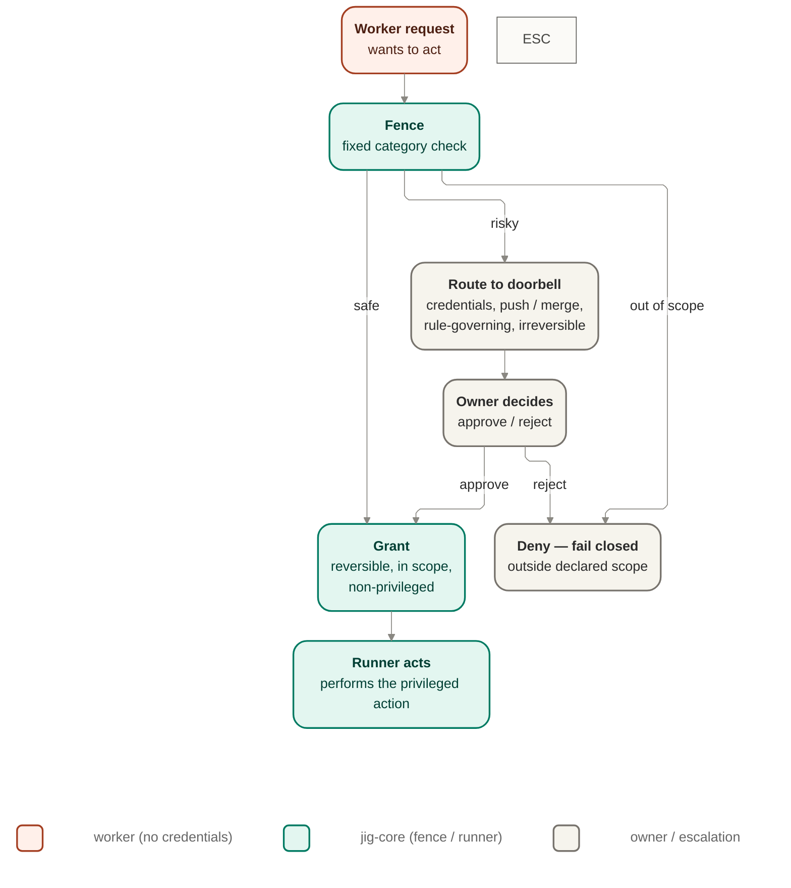

# Authorization — fence, doorbell, capability attestation

The fail-closed control of what the worker may do: authorize every request the worker makes,
escalate the ones that are risky or unproven, and gate autonomy on fresh proof rather than
assertion.

## Owns

- Authorizing every worker request before it executes, fail-closed when a request is not
  declared and approved (FENCE-1).
- Granting, denying, or routing a request by the fixed CFG-10 category boundary.
- Holding policy fixed at launch — the rules in force cannot be loosened mid-run (GUARD-1,
  FENCE-2).
- Escalating routed, risky, or unproven actions to the doorbell, parking the run durably and
  granting narrowly when the owner decides (DOOR-1, DOOR-2, DOOR-3).
- Gating autonomy on capability attestation: fresh, positive proof a driver can perform an
  action safely before that action is auto-grantable (EARN-1, EARN-2, STACK-4, DRIVE-1).

## Interface

`Fence` port — `authorize(request, boundPolicy) → grant | deny | route`. Routed requests cross
the doorbell escalation channel to the owner, who approves, rejects, or overrides.

## Diagram

The worker itself never holds credentials; any privileged action a grant authorizes is carried
out by the runner on the worker's behalf.

## Notes

- No model adjudicates this boundary (CFG-10): the grant/deny/route line is a fixed category
  check, never an LLM decision.
- The worker never holds credentials (FENCE-3, SEC-3); authorization decides whether an action
  happens, the runner is what makes it happen.
- Deferred / extension points: the depth of capability-attestation conformance checking, and the
  manual-vs-assisted posture's exact tuning surface, are not specified here.

## Reconciles to

FENCE-1, FENCE-2, FENCE-3, CFG-10, GUARD-1, DOOR-1, DOOR-2, DOOR-3, EARN-1, EARN-2, STACK-4,
DRIVE-1.
