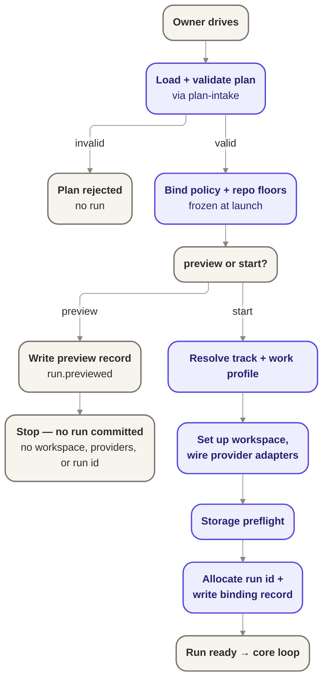

# Bootstrap — the launch / composition root

Bootstrap is the phase that turns authored configuration into a validated, bound, wired,
identified, ready run; `preview` is its recorded-but-non-committing form, exercising the same path
without committing to a run identity.

## Owns

- Load and validate the plan, delegating to [`plan-intake`](./plan-intake.md).
- Load and bind policy and repo-level floors, frozen at launch (GUARD-1).
- Resolve the track and work profile for the run.
- Set up the isolated workspace (ISO-4).
- Wire the provider adapters: the composition root selects which agent, host, forge, and
  work-source implementations are in play for this run.
- Run a storage preflight before anything starts.
- Allocate run identity and write the binding record (runId, planRef, policyRef, trackRef),
  only after the audit append for that record succeeds.
- Hand off to orchestration once the run is ready.

## Interface

- Consumes the plan-intake port (`PlanValidator`) and the run-records port for the binding
  append.
- Selects and wires provider adapters (agent, host, forge, work source) at compose time; it is
  the one place that imports provider implementations.

## Notes

- `preview` walks load, validate, and bind and is still recorded — it emits its own audit event
  (`run.previewed`), honoring the one-command / one-audit invariant — but it commits no run: no
  run identity is allocated and no workspace, provider, or privileged side effects occur.
- Policy (plus repo-level floors) is immutable for the life of the run once bound here.
- Named extension points: capability attestation depth, and resume (re-entering bootstrap for an
  already-allocated run) are deferred to their own seams, not designed here.
- Deferred: provider adapter selection rules, storage preflight failure taxonomy, and the exact
  shape of the binding record beyond the four identifiers named above.

## Run-lifecycle resume view

This section deepens bootstrap only at the **run-lifecycle** altitude w2-s2 owns. It does not
draft the internal composition-root mechanics of re-entering bootstrap for an already-allocated
run; those remain the deferred seam for Wave 4a's
`w4-s4-bootstrap-composition-root`.

### Preview vs start boundary

- `preview` remains the recorded-but-non-committing path named above: it emits `run.previewed`
  only after load, validate, and bind succeed, but still allocates no run identity, workspace, or
  provider side effects.
- `start` is the first committing edge of the run lifecycle: once bootstrap resolves the track and
  work profile, wires providers, passes storage preflight, allocates the run identity, and appends
  the binding record, orchestration may enter `run.started`.
- This keeps the seed's one-way distinction intact: a preview may inform a later start, but it is
  not itself a partially started run.

### Start guards: storage preflight and launch binding

- Bootstrap's start path owns the last pre-orchestration gates for `run.started`: storage
  preflight must succeed so jig can safely record durable progress rather than risk a run on an
  unreliable substrate ([`RESUME-4`](../../product/guarantees.md#31-interruption-resume)).
- The policy, work-profile, and repo-floor bindings are fixed here, at launch, and recorded in the
  binding record. That binding is then immutable for the life of the run
  ([`GUARD-1`](../../product/guarantees.md#13-anti-gaming), INV-003 in
  [`../notes/runtime-design-m5a.md`](../notes/runtime-design-m5a.md)).
- Because the records are the evidence and state is projected from the append-only log, the run is
  not considered started until the binding append succeeds (INV-006 in
  [`../notes/runtime-design-m5a.md`](../notes/runtime-design-m5a.md)).

### Resume integrity and re-approval boundary

- Resume is permitted only from a previously recorded safe checkpoint. Bootstrap's role at this
  altitude is to re-assert the same launch binding and storage viability the run depends on, not
  to author a new launch contract.
- **Launch-binding immutability remains explicit across resume.** The policy, work-profile, and
  repo-floor references fixed at launch do not silently change when a stopped run resumes
  ([`GUARD-1`](../../product/guarantees.md#13-anti-gaming), INV-003).
- If safety-relevant assumptions changed while the run was stopped — for example, the run touched
  policy- or verification-governing surfaces that require renewed trust — resume pauses for fresh
  owner re-approval and evidence before orchestration continues
  ([`RESUME-5`](../../product/guarantees.md#31-interruption-resume),
  [`GUARD-2`](../../product/guarantees.md#13-anti-gaming)).
- Resume also preserves no-double-effect: previously recorded irreversible runner actions are
  recognized and not replayed simply because bootstrap was re-entered
  ([`RESUME-3`](../../product/guarantees.md#31-interruption-resume), INV-006).

### Wave 4a seam: bootstrap internal re-entry mechanics

- This doc names, but does not design, the internal bootstrap mechanics of re-entering for an
  already-allocated run: how provider adapters are re-wired, how any resume-specific storage checks
  are sequenced internally, and what internal control flow distinguishes resume from fresh start.
- That internal composition-root procedure is the deferred seam for Wave 4a's
  `w4-s4-bootstrap-composition-root`. w2-s2 owns only the run-lifecycle contract visible to
  orchestration: resume must preserve launch-binding immutability, no-double-effect, and
  re-approval-on-changed-assumptions.

### Candidate invariants (for w2-s3 consolidation)

- **Bootstrap commits only after binding is durable.** A run is not started until the launch
  binding record append succeeds. Authority: bootstrap + Records. Reconciles to:
  [`RESUME-1`](../../product/guarantees.md#31-interruption-resume), INV-006.
- **Launch binding stays fixed across resume.** Re-entering bootstrap for a stopped run does not
  create a second mutable launch contract. Authority: bootstrap binding gate. Reconciles to:
  [`GUARD-1`](../../product/guarantees.md#13-anti-gaming), INV-003.
- **Changed safety assumptions force owner re-approval before resume.** Authority: bootstrap /
  runner resume boundary. Reconciles to:
  [`RESUME-5`](../../product/guarantees.md#31-interruption-resume),
  [`GUARD-2`](../../product/guarantees.md#13-anti-gaming).

### Run-lifecycle open questions

- **How much of storage preflight is re-executed on resume versus trusted from the last recorded
  stop?** This story intentionally leaves that as an internal bootstrap sequencing question for
  Wave 4a. The run-lifecycle rule here is only that resume must fail closed with a diagnosable
  stop if storage cannot safely support continuation ([`RESUME-4`](../../product/guarantees.md#31-interruption-resume)).

### Run-lifecycle risks and deferred decisions

- **Deferred — internal resume control flow.** The exact composition-root path for "resume an
  already-allocated run" is left to Wave 4a's `w4-s4-bootstrap-composition-root`; this doc should
  not be read as freezing that internal design.
- **Risk — provider re-wiring proof remains seam-owned.** This story states that resume must
  preserve launch-binding immutability and fail closed on unsafe continuation, but it does not yet
  prove how each provider adapter re-establishes that posture after interruption. That proof belongs
  with the Wave 4a bootstrap internals and later provider-wave work, not with this run-lifecycle
  view.

## Reconciles to

- `GUARD-1` — policy fixed at launch.
- `ISO-4` — isolated workspace per run.
- `SEE-1` — run-identity/visibility binding (the binding record).
- Resilience honest edge (section 3, `RESUME-4`) — storage preflight checks jig's own storage
  can do what it needs before starting, and stops with a clear reason rather than risk a run on
  an unreliable filesystem.
- `docs/product/jig.md` ("no silent legacy coping") and
  `docs/design/contracts/execution-plan-contract-v0.md` — for rejecting an unknown or invalid plan.
