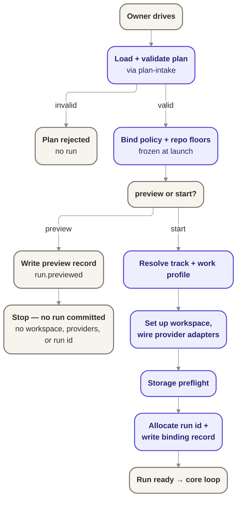

# Bootstrap — the launch / composition root

Bootstrap is the phase that turns authored configuration into a validated, bound, wired,
identified, ready run; `preview` is its recorded-but-non-committing form, exercising the same path
without committing to a run identity.

## Owns

- Load and validate the plan, delegating to [`plan-intake`](./plan-intake.md).
- Load and bind policy and repo-level floors, frozen at launch (GUARD-1).
- Resolve the track and work profile for the run.
- Set up the isolated workspace (ISO-4).
- Wire the provider adapters: the composition root selects which agent, host, forge, and
  work-source implementations are in play for this run.
- Run a storage preflight before anything starts.
- Allocate run identity and write the binding record (runId, planRef, policyRef, trackRef),
  only after the audit append for that record succeeds.
- Hand off to orchestration once the run is ready.

## Interface

- Consumes the plan-intake port (`PlanValidator`) and the run-records port for the binding
  append.
- Selects and wires provider adapters (agent, host, forge, work source) at compose time; it is
  the one place that imports provider implementations.

## Notes

- `preview` walks load, validate, and bind and is still recorded — it emits its own audit event
  (`run.previewed`), honoring the one-command / one-audit invariant — but it commits no run: no
  run identity is allocated and no workspace, provider, or privileged side effects occur.
- Policy (plus repo-level floors) is immutable for the life of the run once bound here.
- Named extension points: capability attestation depth, and resume (re-entering bootstrap for an
  already-allocated run) are deferred to their own seams, not designed here.
- Deferred: provider adapter selection rules, storage preflight failure taxonomy, and the exact
  shape of the binding record beyond the four identifiers named above.

## Reconciles to

- `GUARD-1` — policy fixed at launch.
- `ISO-4` — isolated workspace per run.
- `SEE-1` — run-identity/visibility binding (the binding record).
- Resilience honest edge (section 3, `RESUME-4`) — storage preflight checks jig's own storage
  can do what it needs before starting, and stops with a clear reason rather than risk a run on
  an unreliable filesystem.
- `docs/product/jig.md` ("no silent legacy coping") and
  `docs/design/contracts/execution-plan-contract-v0.md` — for rejecting an unknown or invalid plan.
