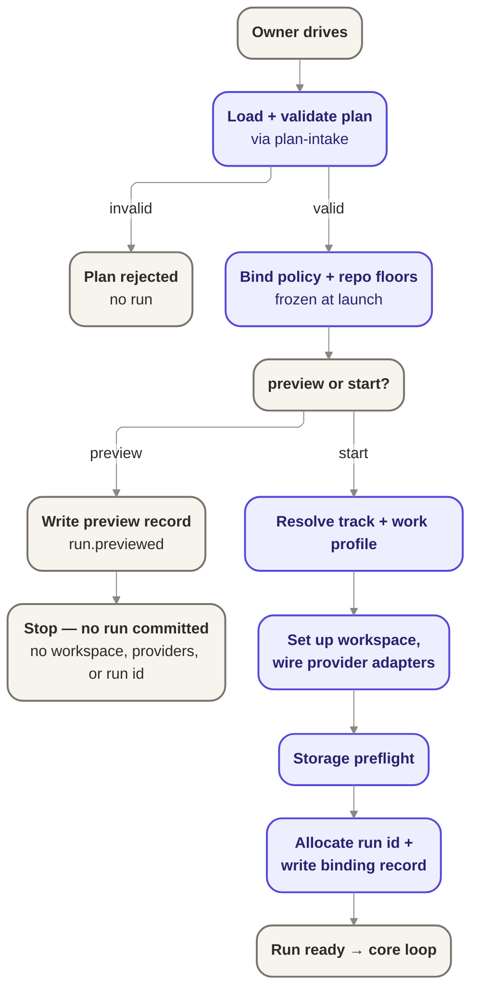

# Bootstrap — the launch / composition root

Bootstrap is the phase that turns authored configuration into a validated, bound, wired,
identified, ready run; `preview` is its recorded-but-non-committing form, exercising the same path
without committing to a run identity. This doc deepens the existing stub in place. It preserves the
seed `Owns`, `Interface`, and launch flowchart, then authors the sequencing and resume-re-entry
mechanics Wave 2 deferred here by name.

## Planner Handoff Summary

### Handoff Identity

| Field               | Required data                               |
| ------------------- | ------------------------------------------- |
| Design ID           | `w4-s4-bootstrap-composition-root`          |
| Handoff contract    | `technical-design-handoff-v0`               |
| Design title        | `Bootstrap — the launch / composition root` |
| Status              | `draft`                                     |
| Methodology profile | `ddd` `v1`                                  |
| Architecture mode   | `control-plane/runtime`                     |
| DDD depth           | `ports-and-adapters`                        |
| Review round        | `1`                                         |

### Source and Product References

| ID      | Type     | Reference                                                                                                                                                                                   | Required for Planning                                                                                  | Notes                                |
| ------- | -------- | ------------------------------------------------------------------------------------------------------------------------------------------------------------------------------------------- | ------------------------------------------------------------------------------------------------------ | ------------------------------------ |
| SRC-001 | design   | [wave-4a-core/frames/w4-s4-bootstrap-composition-root.md](../../planning/design-track/waves/wave-4a-core/frames/w4-s4-bootstrap-composition-root.md)                                        | approved `InputResolution`, `AgreedSystemModel`, bootstrap scope, seams, and resume-re-entry ownership | primary w4-s4 source                 |
| SRC-002 | decision | [wave-4a-core/decisions.md](../../planning/design-track/waves/wave-4a-core/decisions.md)                                                                                                    | accepted depth/mode, s1<->s4 and s3<->s4 seam wording, candidate-only invariant handling               | D-002, D-004, D-005, D-011           |
| SRC-003 | design   | [wave-1-domain/frame.md](../../planning/design-track/waves/wave-1-domain/frame.md)                                                                                                          | launch binding of plan, policy, work-profile, and repo floors                                          | cited, not reopened                  |
| SRC-004 | design   | [wave-2-state-machines/frame.md](../../planning/design-track/waves/wave-2-state-machines/frame.md) and [decisions.md](../../planning/design-track/waves/wave-2-state-machines/decisions.md) | run-lifecycle resume view, last-safe-checkpoint semantics, and Wave 2 D-003 deferral boundary          | bootstrap owns procedure, not states |
| SRC-005 | design   | [wave-3-ports/frame.md](../../planning/design-track/waves/wave-3-ports/frame.md)                                                                                                            | composition-root/provider-wiring boundary and sole-importer role                                       | cited, not reopened                  |
| SRC-006 | design   | [`records.md`](./records.md)                                                                                                                                                                | records-store construction seam, binding-record durability dependence, append/replay authority         | committed sibling shape              |
| SRC-007 | design   | [`plan-intake.md`](./plan-intake.md)                                                                                                                                                        | plan admission delegation and policy/evidence shape bootstrap consumes                                 | committed sibling shape              |
| SRC-008 | design   | [`authorization.md`](./authorization.md)                                                                                                                                                    | Fence/Doorbell wiring seam and resume re-approval dependency                                           | committed sibling shape              |
| SRC-009 | design   | [`orchestration.md`](./orchestration.md)                                                                                                                                                    | post-bootstrap handoff target and unchanged lifecycle-state ownership                                  | cited only                           |
| SRC-010 | source   | [../../product/guarantees.md](../../product/guarantees.md)                                                                                                                                  | `RESUME-1..5`, `GUARD-1`, `CFG-9`, `ISO-4`, `SEE-1` product commitments                                | product source of truth              |

### Required Planning Facts

| ID            | Category                | Required content                                                                                                                                                                                                                                                                            | Source refs                                 |
| ------------- | ----------------------- | ------------------------------------------------------------------------------------------------------------------------------------------------------------------------------------------------------------------------------------------------------------------------------------------- | ------------------------------------------- |
| CTX-001       | Context and boundary    | Bootstrap owns launch sequencing, `run.previewed`, provider wiring, storage preflight, launch binding, and the resume re-entry procedure; it composes sibling core parts and does not redesign their internals.                                                                             | SRC-001, SRC-002                            |
| CTX-002       | Context and boundary    | Bootstrap reads the validated plan and bound policy inputs, constructs and wires the records store, wires the Fence/Doorbell with the bound policy, and hands off to orchestration once readiness is durable.                                                                               | SRC-001, SRC-006, SRC-007, SRC-008, SRC-009 |
| CAND-BOOT-001 | Invariant and lifecycle | Candidate only: `binding-record-append-precedes-run-readiness`. Predicate operands: allocated run identity, bound launch references, successful binding-record append. Owning authority: bootstrap using the records store.                                                                 | SRC-006, SRC-010                            |
| CAND-BOOT-002 | Invariant and lifecycle | Candidate only: `resume-re-entry-preserves-original-binding`. Predicate operands: existing run identity, prior binding record, same plan/policy/work-profile/repo-floor references on resume. Owning authority: bootstrap resume re-entry.                                                  | SRC-003, SRC-004, SRC-006, SRC-010          |
| SURF-001      | API and surface         | `PlanValidator` is the intake surface bootstrap consumes for load/validate/admit-or-reject. Producer authority: [`plan-intake.md`](./plan-intake.md). Consumer: bootstrap only. Exposure proof: design review against the committed sibling surface.                                        | SRC-007                                     |
| SURF-002      | API and surface         | The records store is the bootstrap-facing surface for constructing run records and appending the binding record. Producer authority: [`records.md`](./records.md). Consumer: bootstrap. Exposure proof: design review against the committed sibling surface.                                | SRC-006                                     |
| SURF-003      | API and surface         | The Fence/Doorbell wiring surface is composed at launch and resume with the bound policy. Producer authority: [`authorization.md`](./authorization.md). Consumer: bootstrap/orchestration. Exposure proof: design review against the committed sibling surface.                             | SRC-008                                     |
| SURF-004      | API and surface         | Concrete provider implementations are imported only at bootstrap composition time through the already-settled Wave 3 provider-port boundaries. Producer authority: provider-side adapters behind Wave 3 ports. Consumer: bootstrap. Exposure proof: boundary review against Wave 3 framing. | SRC-005                                     |
| FAIL-001      | Failure                 | Invalid or incompatible plan submission stops before run allocation and produces no run. Recovery authority: plan owner must resubmit a valid plan.                                                                                                                                         | SRC-007, SRC-010                            |
| FAIL-002      | Failure                 | Storage-preflight failure stops start or resume before orchestration handoff; bootstrap must fail closed with a diagnosable stop. Recovery authority: bootstrap/operator after storage issue resolution.                                                                                    | SRC-001, SRC-006, SRC-010                   |
| FAIL-003      | Failure                 | Binding-record append failure stops before run readiness; bootstrap may not treat in-memory binding as sufficient evidence. Recovery authority: bootstrap/operator after records-store issue resolution.                                                                                    | SRC-006, SRC-010                            |
| FAIL-004      | Failure                 | Resume-integrity failure stops instead of rebinding or replaying irreversible effects when bootstrap cannot prove continuity from durable evidence. Recovery authority: bootstrap plus owner/authority surfaces as needed.                                                                  | SRC-004, SRC-006, SRC-008, SRC-010          |
| OBS-001       | Observability           | `run.previewed` is a producer-owned bootstrap audit event for the non-committing preview path. Emission authority: bootstrap.                                                                                                                                                               | SRC-001, SRC-010                            |
| OBS-002       | Observability           | The binding record is the durable proof that run identity was bound to specific launch inputs before orchestration starts. Emission authority: records store append invoked by bootstrap.                                                                                                   | SRC-006, SRC-010                            |
| OBS-003       | Observability           | Resume depends on existing durable checkpoint evidence and prior binding evidence rather than in-memory reconstruction. Producer authority: records store and prior lifecycle records.                                                                                                      | SRC-004, SRC-006                            |
| ENF-001       | Enforcement             | Manual-only review gate: bootstrap must preserve the records-store construction seam and Fence/Doorbell wiring seam exactly as committed sibling shapes, not re-specify them locally. Proof substrate: documentation review.                                                                | SRC-002, SRC-006, SRC-008                   |
| ENF-002       | Enforcement             | Manual-only review gate: bootstrap must not introduce new Wave 2 lifecycle states or redesign sibling ownership boundaries. Proof substrate: documentation review against prior-wave sources.                                                                                               | SRC-003, SRC-004, SRC-005                   |
| DEL-001       | Delivery planning       | Candidate story area: fresh-start bootstrap path covering load/validate, launch binding, provider wiring, storage preflight, binding-record append, and orchestration handoff. Must preserve CTX-001, CTX-002, CAND-BOOT-001, SURF-001..004, FAIL-001..003, OBS-001..002.                   | SRC-001, SRC-002                            |
| DEL-002       | Delivery planning       | Candidate story area: resume re-entry path covering binding preservation, re-wiring, re-preflight, and no-double-effect handoff at the last safe checkpoint. Must preserve CAND-BOOT-002, FAIL-004, OBS-003, and Wave 2 ownership boundaries.                                               | SRC-001, SRC-004, SRC-008                   |

### Sequencing, Contention, Validation, and Stops

| ID       | Category                  | Required content                                                                                                                                                                                                 | Source refs                                |
| -------- | ------------------------- | ---------------------------------------------------------------------------------------------------------------------------------------------------------------------------------------------------------------- | ------------------------------------------ |
| SEQ-001  | Sequencing and dependency | Fresh-start bootstrap work must preserve the order load/validate -> bind -> resolve -> wire -> preflight -> allocate -> append binding record -> handoff; readiness comes only after durable append.             | DEL-001, CAND-BOOT-001, SURF-001, SURF-002 |
| SEQ-002  | Sequencing and dependency | Resume work depends on existing durable run evidence and comes after the fresh-start binding model exists; resume re-entry re-validates and re-wires before orchestration continues at the last safe checkpoint. | DEL-002, CAND-BOOT-002, OBS-003            |
| FILE-001 | File contention           | Single durable design target for this story area: `docs/design/core/bootstrap.md`; sibling docs are cited input surfaces and should not be edited to implement bootstrap-owned behavior.                         | SRC-001, SRC-002                           |
| VAL-001  | Validation                | `pnpm check` plus documentation review that `SURF-001..004` and `ENF-001..002` still match the committed sibling and prior-wave sources. Evidence class: markdown validation and review gate.                    | ENF-001, ENF-002                           |
| STOP-001 | Stop condition            | Stop if implementation/design work would need to redesign records shape, policy content, authorization rules, Wave 2 lifecycle states, or provider implementations rather than bootstrap sequencing/composition. | CTX-001, CTX-002, SRC-002                  |

## Pre-authoring Approval Record

| Input             | Approval evidence                                                                                                                                                                                                                                                      | Status   |
| ----------------- | ---------------------------------------------------------------------------------------------------------------------------------------------------------------------------------------------------------------------------------------------------------------------- | -------- |
| InputResolution   | [wave-4a-core/frames/w4-s4-bootstrap-composition-root.md](../../planning/design-track/waves/wave-4a-core/frames/w4-s4-bootstrap-composition-root.md) plus [wave-4a-core/decisions.md](../../planning/design-track/waves/wave-4a-core/decisions.md) D-002, D-004, D-005 | approved |
| AgreedSystemModel | same frame's `AgreedSystemModel`, with depth/mode resolution confirmed by D-002                                                                                                                                                                                        | approved |
| DocStructurePlan  | coordinator approval for deepening this file in place only                                                                                                                                                                                                             | approved |

## Source and Context Audit

| Source                                                                                                                                                                                      | Used for                                                                 | Notes                                                  |
| ------------------------------------------------------------------------------------------------------------------------------------------------------------------------------------------- | ------------------------------------------------------------------------ | ------------------------------------------------------ |
| [wave-4a-core/frames/w4-s4-bootstrap-composition-root.md](../../planning/design-track/waves/wave-4a-core/frames/w4-s4-bootstrap-composition-root.md)                                        | bootstrap ownership, seams, resume territory, mode/depth                 | primary agreed system-model source                     |
| [wave-4a-core/decisions.md](../../planning/design-track/waves/wave-4a-core/decisions.md)                                                                                                    | accepted depth, cross-part seam wording, invariant-candidate handling    | D-002, D-004, D-005 are load-bearing                   |
| [wave-1-domain/frame.md](../../planning/design-track/waves/wave-1-domain/frame.md)                                                                                                          | launch binding of plan/policy/work-profile/repo floors                   | cited, not reopened                                    |
| [wave-2-state-machines/frame.md](../../planning/design-track/waves/wave-2-state-machines/frame.md) and [decisions.md](../../planning/design-track/waves/wave-2-state-machines/decisions.md) | run-lifecycle resume view and Wave 2 D-003 deferral                      | bootstrap owns procedure, not states                   |
| [wave-3-ports/frame.md](../../planning/design-track/waves/wave-3-ports/frame.md)                                                                                                            | composition-root/provider-wiring boundary                                | bootstrap is sole importer of provider implementations |
| [`records.md`](./records.md)                                                                                                                                                                | records-store construction seam and binding-record durability dependence | cited sibling shape only                               |
| [`plan-intake.md`](./plan-intake.md)                                                                                                                                                        | plan admission and policy shape delegation                               | cited sibling shape only                               |
| [`authorization.md`](./authorization.md)                                                                                                                                                    | Fence/Doorbell wiring seam and resume re-approval dependency             | cited sibling shape only                               |
| [`orchestration.md`](./orchestration.md)                                                                                                                                                    | post-bootstrap handoff target                                            | cited only                                             |
| [../../product/guarantees.md](../../product/guarantees.md)                                                                                                                                  | RESUME-1..5, GUARD-1, CFG-9, ISO-4, SEE-1                                | product commitments this doc reconciles to             |

## Assumptions and Blockers

### Safe Assumptions

- `bootstrap.md` remains the only durable design file for this story.
- Bootstrap composes committed sibling shapes from [`records.md`](./records.md),
  [`plan-intake.md`](./plan-intake.md), and [`authorization.md`](./authorization.md) without
  restating their internals as bootstrap-owned rules.
- Resume re-entry returns control to the last safe checkpoint already defined by Wave 2's
  lifecycle view; this doc does not define a new state to represent that checkpoint.

### Blocking Questions

- None for authoring at this altitude.

## Owns

- Load and validate the plan, delegating to [`plan-intake`](./plan-intake.md).
- Load and bind policy and repo-level floors, frozen at launch (GUARD-1).
- Resolve the track and work profile for the run.
- Set up the isolated workspace (ISO-4).
- Wire the provider adapters: the composition root selects which agent, host, forge, and
  work-source implementations are in play for this run.
- Run a storage preflight before anything starts.
- Allocate run identity and write the binding record (runId, planRef, policyRef, trackRef),
  only after the audit append for that record succeeds.
- Hand off to orchestration once the run is ready.
- On resume, re-enter after allocation, re-validate the original binding, re-wire providers,
  re-run preflight, and hand back to orchestration without double-effecting prior irreversible
  actions.

## Interface

- Consumes the plan-intake port (`PlanValidator`) and the run-records port for the binding
  append.
- Selects and wires provider adapters (agent, host, forge, work source) at compose time; it is
  the one place that imports provider implementations.
- Wires the Fence/Doorbell with the bound policy at launch and on resume; the classifier rules stay
  in [`authorization.md`](./authorization.md).

**Phase 5 realization ([ADR 0021](../decisions/0021-phase-5-integrated-provider-runs.md)).** The
composition root selects each of the four adapters from `config.drivers`, defaulting to the reference
adapters (reference agent = the scripted worker, so the default wiring reproduces the Phase 0–4 dry-run
and its goldens exactly); an unknown driver name fails closed with usage guidance rather than falling
back silently. The runner, Fence, and records never import an adapter — only this composition root
does.

## Context Map

| Context                      | Owns                                                                                               | Reads                                                                                                                              | Does Not Own                                                                                           |
| ---------------------------- | -------------------------------------------------------------------------------------------------- | ---------------------------------------------------------------------------------------------------------------------------------- | ------------------------------------------------------------------------------------------------------ |
| Bootstrap / composition root | launch sequencing, `run.previewed`, binding, provider wiring, preflight, resume re-entry procedure | validated plan, bound policy inputs, records-store construction contract, Fence/Doorbell wiring contract, Wave 2 resume checkpoint | records engine internals, policy content, authorization rules, Wave 2 states, provider implementations |
| Storage preflight            | bootstrap-owned checks that storage can support start/resume safely and diagnosably                | storage capability exposed through the configured records store                                                                    | records consistency model, event shape, storage engine design                                          |
| Resume re-entry              | re-entry sequencing and idempotency over an already allocated run                                  | existing binding record, latest safe checkpoint, bound policy, configured provider implementations                                 | whether resume is approved, lifecycle-state design, provider-internal recovery behavior                |

## Ubiquitous Language

| Term                 | Meaning                                                                                                                            | Owner                                     |
| -------------------- | ---------------------------------------------------------------------------------------------------------------------------------- | ----------------------------------------- |
| Preview              | The recorded-but-non-committing bootstrap path that validates and binds but does not create a run.                                 | Bootstrap                                 |
| Launch binding       | The policy, work-profile, plan, and repo-floor references fixed for a run's lifetime.                                              | Bootstrap, citing Wave 1                  |
| Binding record       | The first durable run record that ties run identity to the launch binding.                                                         | Records store, appended by Bootstrap      |
| Storage preflight    | Bootstrap's fail-closed check that the configured records substrate can safely support start or resume.                            | Bootstrap                                 |
| Resume re-entry      | Re-entering bootstrap for an already allocated run to re-validate binding, re-wire providers, and re-check storage before handoff. | Bootstrap                                 |
| Last safe checkpoint | The previously recorded run point from which orchestration may continue without re-performing irreversible actions.                | Wave 2 lifecycle view, cited by Bootstrap |

## Commands and Use Cases

| Command / use case | Actor                                     | Result                                                          | Notes                                                           |
| ------------------ | ----------------------------------------- | --------------------------------------------------------------- | --------------------------------------------------------------- |
| `PreviewRun`       | owner via driving surface                 | `run.previewed` audit event or plan rejection                   | no run identity, workspace, provider, or privileged side effect |
| `StartRun`         | owner via driving surface                 | ready run handed to orchestration or fail-closed stop           | first committing bootstrap path                                 |
| `ResumeRun`        | owner/system restart against recorded run | re-entered run handed back to orchestration or fail-closed stop | uses existing binding and last safe checkpoint only             |

## Launch Sequence

The preserved flowchart remains correct. The authored sequence below makes each step explicit and
names where sibling surfaces are composed.

1. **Load and validate the submitted plan.**
   Bootstrap delegates admission to [`plan-intake.md`](./plan-intake.md). Unknown, malformed, or
   incompatible plans stop here. No run identity exists yet.
2. **Bind launch-governing references.**
   Bootstrap resolves the plan's policy, work-profile, and repo-floor references and freezes them
   for the run. This is the concrete GUARD-1 binding point.
3. **Branch by intent: preview or start.**
   `preview` remains non-committing. `start` continues into realization.
4. **Resolve track/work-profile realization inputs.**
   Bootstrap resolves the concrete track/work-profile context needed to select implementations and
   prepare the workspace.
5. **Wire implementations.**
   Bootstrap imports the concrete agent, execution-host, forge, and work-source implementations,
   constructs the records store as defined by [`records.md`](./records.md), and wires the
   Fence/Doorbell from [`authorization.md`](./authorization.md) with the already bound policy.
6. **Run storage preflight.**
   Before a run can exist, bootstrap checks that the configured records substrate can support the
   required durable append and later replay/read path without ambiguous partial readiness.
7. **Allocate run identity and append the binding record.**
   For `start`, bootstrap allocates the run identity only after preflight passes, then appends the
   binding record through the configured records store. The run is not ready until that append
   succeeds.
8. **Hand off to orchestration.**
   Only after the binding record is durable does bootstrap hand control to
   [`orchestration.md`](./orchestration.md).

## Preview vs Start Boundary

- `preview` walks steps 1 through 3 only: load, validate, bind, then emit `run.previewed`.
- `preview` is always recorded, but it does not allocate a run identity, create a workspace, wire
  providers for execution, invoke privileged actions, or append the binding record.
- `start` is the first committing bootstrap path because it is the first path that can allocate a
  run identity and create durable run evidence for later resume.

## Provider Wiring and Composition Seams

Bootstrap composes three sibling shapes and four provider seams, but owns only the composition act.

### Records-store construction seam

[`records.md`](./records.md) owns the records store's shape, consistency model, and invariants.
Bootstrap owns constructing and wiring that store at launch, including the first binding-record
append. This doc therefore treats records-store readiness as a precondition and never redefines the
append/replay rules.

### Plan-intake delegation seam

[`plan-intake.md`](./plan-intake.md) owns plan admission and the policy/evidence shape bootstrap
consumes. Bootstrap delegates load/validate there, then binds the admitted references it returns.
Bootstrap does not reinterpret unknown format, policy content, or evidence categories locally.

### Fence and Doorbell wiring seam

[`authorization.md`](./authorization.md) owns the classifier and escalation rules. Bootstrap wires
the Fence/Doorbell with the bound policy at launch and again on resume. Bootstrap does not decide
grant, deny, or route; it only ensures the already-owned authority spine is present when
orchestration resumes work.

### Provider boundary

Bootstrap is the sole importer of concrete provider implementations against Wave 3's provider-port
shapes. That ownership is limited to selection and composition sequence:

- select implementations compatible with the bound track/work-profile context;
- pass them only through the settled provider-port boundaries;
- keep implementation-specific recovery or attestation logic on the provider side of the port.

## Storage Preflight

Storage preflight is bootstrap's last fail-closed gate before a run is allowed to exist or resume.
It does not redesign the records engine. It checks that the configured records substrate can safely
support the bootstrap obligations that follow.

### Preflight responsibilities

- verify bootstrap can reach the configured records store path/endpoint for this run;
- verify the store can accept the binding append required for start;
- verify the store can later replay/read the durable history bootstrap depends on for resume and
  handoff;
- verify bootstrap is not about to continue from an ambiguous or partially initialized records
  surface.

### Failure taxonomy

- **Unavailable substrate** — the records surface cannot be reached or opened at all.
- **Append-unsuitable substrate** — bootstrap cannot trust that the binding record append can be
  durably accepted.
- **Read/replay-unsuitable substrate** — bootstrap cannot trust that existing run evidence can be
  re-read consistently enough to resume.
- **Integrity ambiguity** — the records substrate is reachable but leaves bootstrap unable to tell
  whether a required prior bootstrap effect succeeded.

All four are fail-closed stop reasons. Bootstrap does not downgrade them into warnings because
doing so would undercut RESUME-4's diagnosable-stop contract.

## Launch Binding

Bootstrap is the concrete owner of performing the launch binding Wave 1 named and GUARD-1 requires.

- The binding includes the admitted plan reference plus the policy, work-profile, and repo-floor
  references the run is allowed to operate under.
- Bootstrap freezes that binding before execution wiring begins. A provider implementation may
  receive the bound context, but it may not widen or replace it.
- The binding becomes durable only when the binding record append succeeds through the configured
  records store.
- A run is not considered ready before that append succeeds. Readiness is a records-backed fact,
  not an in-memory intention.

## Resume Re-entry Procedure

Wave 2 owns the lifecycle rule that a stopped run resumes from a last safe checkpoint. This doc
authors the internal bootstrap procedure that makes that lifecycle rule safe and inspectable.

### Entry condition

Resume re-entry begins only for an already allocated run with durable prior evidence. Bootstrap
does not allocate a second run identity and does not re-choose a different binding.

### Resume sequence

1. **Load the prior bootstrap evidence.**
   Bootstrap reads the existing binding record and latest safe checkpoint from the records store.
2. **Re-validate the original launch binding.**
   Bootstrap confirms the run still points to the original plan/policy/work-profile/repo-floor
   binding. It does not silently substitute newer references.
3. **Check resume-integrity prerequisites.**
   If resume depends on fresh owner approval or other authority-side conditions, bootstrap requires
   the durable authorization evidence owned by [`authorization.md`](./authorization.md) to be
   present before continuing.
4. **Re-wire provider implementations.**
   Bootstrap reconstitutes the same category of provider boundaries for the run under the original
   binding. Re-wiring is allowed; rebinding is not.
5. **Re-run storage preflight.**
   Bootstrap treats resume as requiring fresh storage viability, because the records surface is
   still the source of truth for what has already happened and what may happen next.
6. **Hand off at the last safe checkpoint.**
   Bootstrap returns control to orchestration only after the original binding remains intact, the
   authority-side prerequisites are satisfied, and storage viability is re-established.

### No-double-effect rule

Resume re-entry must preserve RESUME-3. Bootstrap therefore distinguishes between:

- **re-wiring effects** it may safely repeat, such as reconstructing in-memory composition; and
- **irreversible run effects** that must remain derived from prior durable records and must not be
  re-issued merely because bootstrap was re-entered.

The binding record is one such irreversible boundary. Resume reads it; it never appends a second
"first binding" record for the same run.

### Original-binding preservation rule

Bootstrap preserves the original launch binding across resume:

- same run identity;
- same bound plan/policy/work-profile/repo-floor references;
- same authority to continue only if the resume prerequisites remain satisfied.

If bootstrap cannot prove that continuity from durable evidence, it stops rather than "helpfully"
rebinding the run to current local configuration.

### Phase 4 local re-entry (ADR 0020)

[ADR 0020](../decisions/0020-phase-4-reliable-local-runs.md) concretizes this procedure for the
Phase 4 local surface without changing its ownership:

- **Surface.** `jig resume <run-dir> --scripted-output <output>`. `--scripted-output` is the live
  agent-seam source that drives not-yet-terminal work; it is not binding. Any `--config`/`--policy`/
  `--plan` passed on resume are **verification-only** against the recorded binding — a mismatch
  fails closed (`resume-blocked-binding-mismatch`), never rebinds.
- **Durable plan and policy snapshots.** For "resume from records" to be honest, the validated plan
  _and the resolved launch policy_ must be durable in the run directory. Resume re-derives
  eligibility, dependency order, and each resumed story's declared `scope` from the plan, and it
  **adjudicates every resumed request against the launch policy** — so both must survive the stop.
  Bootstrap therefore **persists a validated-plan snapshot and a policy snapshot (resolved rules)
  into the run directory at launch** (alongside the binding record) and reads them back on resume,
  rather than depending on external files the operator kept unchanged, or on rebuilding a permissive
  stub from `policyRef` alone (ADR 0020 §3). The binding records policy by _reference_; the snapshot
  is what makes the rules themselves durable.
- **Authoritative launch header.** So resume and inspect can read the launch metadata without
  `run.json`, bootstrap records the binding — `run.id`, `planId`, `binding` (including the workspace
  fingerprint and run-level redaction/export posture), and the plan and policy snapshot references —
  into a durable launch header at the head of `events.jsonl` (the `run.started` record), not only
  into the finalized `run.json`. This is additive and mints no new event family (ADR 0020 §1).
- **Workspace-continuity preflight.** Alongside storage preflight, resume recomputes the run-level
  workspace fingerprint recorded in `binding.workspace` (repo root + git `HEAD` + a content hash
  over the working-tree change set, so two materially different dirty trees at one `HEAD` do not
  collide) and compares it. A material difference is fail-closed and diagnosable
  (`resume-blocked-workspace-mismatch`), never silently claimed continuous (RESUME-4, P4-AC-6).
- **Identity is preserved, not reallocated.** Resume keeps the same run id and does **not** increment
  `attempt` (which denotes a distinct run instance per
  [ADR 0017](../decisions/0017-records-seam-reconciliation.md) decision 1); a resume-sequence marker,
  if any, rides on the existing `run.resumed` event family.

### Phase 6 real-driver wiring (ADR 0022)

[ADR 0022](../decisions/0022-phase-6-real-driver-integration.md) makes the composition root select and
wire **real** agent/host drivers without changing its ownership or a port surface:

- **Selection.** The composition root selects the real Codex-first agent and the real execution host by
  name from `config.drivers`, exactly as it selects the reference adapters today; the default wiring
  stays reference-only, so real drivers are opt-in and the Phase-0..4 goldens stay byte-identical. It
  remains the **sole importer** of provider implementations, and an unknown driver name still fails
  closed.
- **Prove-then-describe (the sync-`describe()` resolution).** `ExecutionHostPort.describe()` **stays
  synchronous**. The real host's confinement proof runs **async at compose time**, in an async host
  factory (mirroring the existing agent factory) that the already-`async` composition root awaits;
  `describe()` then returns the already-computed `HostAttestation`. No port surface flexes to async.
- **Persist the launch attestation and substrate manifest.** Alongside the Phase-4 plan and policy
  snapshots, bootstrap persists the launch `CapabilityAttestation` (Residual A) and the driver's
  approved, hashed **substrate manifest** into the run directory at launch, launch-immutable.
- **Recover the launch attestation on resume.** Resume reads the persisted launch attestation back the
  same launch-immutable way it reads the plan/policy snapshots ("Original-binding preservation rule"),
  and every resumed request is adjudicated against it — **never** a fresher, more permissive attestation
  a drifted real host would now report (GUARD-1, FENCE-2). This replaces the Phase-5 reference behavior
  of re-deriving a constant attestation, which was safe only because the reference host could not drift.

## Invariant and State Matrix

| Invariant or state rule                     | Bootstrap implication                                                                                        | Source                                                     |
| ------------------------------------------- | ------------------------------------------------------------------------------------------------------------ | ---------------------------------------------------------- |
| GUARD-1 launch binding is fixed for the run | bind once before execution; do not silently widen or swap on resume                                          | [../../product/guarantees.md](../../product/guarantees.md) |
| RESUME-3 no-double-effect                   | resume reads prior durable effects and never replays irreversible actions just because composition restarted | [../../product/guarantees.md](../../product/guarantees.md) |
| RESUME-4 fail closed and diagnosable        | storage-preflight failures stop start/resume with explicit cause                                             | [../../product/guarantees.md](../../product/guarantees.md) |
| SEE-1 run identity and visibility binding   | start requires durable binding record before handoff                                                         | [../../product/guarantees.md](../../product/guarantees.md) |
| Wave 2 states stay closed                   | bootstrap hands off into existing lifecycle states; it does not mint a new resume sub-state                  | Wave 2 frame and D-003                                     |

## Data, Query, and Consistency Posture

- Bootstrap does not own the records store consistency model. It depends on the append-only,
  replay-backed records posture owned by [`records.md`](./records.md).
- Bootstrap's own consistency obligation is sequencing: it must not announce run readiness before
  the binding append is durable, and it must not resume before the prior durable evidence supports
  a single unambiguous continuation.
- Querying for resume is limited to what bootstrap needs to re-establish safe composition:
  original binding, last safe checkpoint, and required authority-side evidence.

## Failure, Observability, and Recovery Surfaces

### Failure

- invalid or incompatible plan -> reject before run allocation;
- storage-preflight failure -> stop before start or resume;
- binding-append failure -> stop before orchestration handoff;
- missing or contradictory resume evidence -> stop instead of rebinding or replaying effects;
- missing required approval evidence for resume -> stop and let the authority spine govern re-entry.

### Observability

- `run.previewed` is emitted as its own audit event and remains non-committing.
- The binding record is the durable proof that a specific run identity was bound to specific launch
  inputs.
- Resume depends on existing durable checkpoint evidence rather than in-memory recovery.

### Recovery

- Fresh start recovery means re-running bootstrap from the beginning because no durable run exists
  yet.
- Resume recovery means re-entering after allocation using existing durable evidence rather than
  re-creating the run.

## Testing and Enforcement Map

This doc does not add code-level rules, but it does define the proof surfaces later implementation
and review must preserve.

| Boundary                                         | Expected proof substrate                                    |
| ------------------------------------------------ | ----------------------------------------------------------- |
| preview stays non-committing                     | integration test / fixture review                           |
| start readiness waits for durable binding append | integration test / records fixture                          |
| resume preserves original binding                | resume-path integration test / fixture review               |
| resume avoids double effect                      | integration test against prior irreversible-action evidence |
| bootstrap does not redesign sibling shapes       | documentation review against cited sibling docs             |

## Open Questions

- How provider implementations prove they have re-established their own internal safe posture after
  interruption remains provider-wave work, not bootstrap-owned design.
- The exact threshold or mechanism by which authorization evidence becomes "fresh enough" for
  resume remains owned by the policy and authority surfaces, not by bootstrap.

## Invariant Candidates

These remain candidates only. They are not numbered here and are not appended to the invariant
ledger.

- **binding-record-append-precedes-run-readiness** — bootstrap may allocate a run identity before
  handoff, but the run is not ready until the binding record append succeeds durably through the
  records store.
- **resume-re-entry-preserves-original-binding** — resume re-entry re-validates and preserves the
  original launch binding rather than constructing a new mutable launch contract.

## Risks and Deferred Decisions

- **Risk — provider re-wiring may prove safe only with provider-specific evidence the current core
  doc does not own.** Bootstrap can require re-wiring and fail closed when evidence is missing, but
  later provider work still has to prove each adapter's recovery posture.
- **Risk — storage preflight may be implemented too narrowly.** If later implementation checks only
  reachability and not append/replay suitability, bootstrap could appear ready while still violating
  RESUME-4's diagnosable-stop requirement.
- **Deferred — concrete provider-selection heuristics.** This doc owns the sequence and boundary,
  not the final matching rules for specific provider implementations.
- **Deferred — binding-record field shape beyond the named identifiers.** This doc preserves the
  binding-record role without freezing schema details.

## Notes

- `preview` walks load, validate, and bind and is still recorded — it emits its own audit event
  (`run.previewed`), honoring the one-command / one-audit invariant — but it commits no run: no
  run identity is allocated and no workspace, provider, or privileged side effects occur.
- Policy (plus repo-level floors) is immutable for the life of the run once bound here.
- Capability-attestation depth remains seam-owned by [`authorization.md`](./authorization.md) and
  later provider work; bootstrap only composes that spine.

## Reconciles to

- `RESUME-1`, `RESUME-2`, `RESUME-3`, `RESUME-4`, `RESUME-5`
- `GUARD-1`
- `CFG-9`
- `ISO-4`
- `SEE-1`
- `INV-003` (cited existing ledger entry only)
