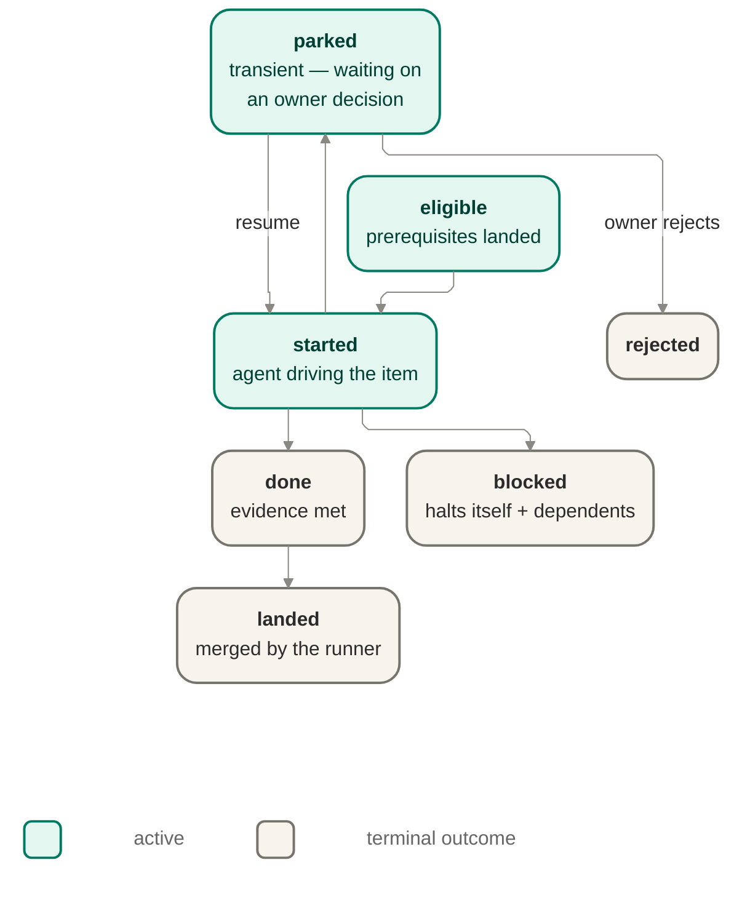

# Orchestration — the runner

The runner is jig's trusted orchestrator: it drives a launched run from start to finish, owns
the run and work-item state machines, resolves what is eligible to run next, and is the sole
holder of the privileged authority needed to land work.

## Owns

- The work-item lifecycle and the run lifecycle — the two state sets a run moves through.
- Eligibility and DAG resolution: a work item is ineligible until its prerequisites land
  (ISO-1); a blocked item halts itself and its downstream dependents while independent work
  keeps moving.
- Driving each eligible work item to the agent port and recording its outcome.
- Holding credentials and the sole authority to push, open a PR, and merge (FENCE-3, MERGE-2) —
  the thing that writes code is never the thing that ships it.
- The done/landed distinction: a work item being done (evidence met) is separate from it being
  landed (merged) (MERGE-4).

## Interface

Consumes the `ValidatedPlan` (from plan-intake) and the bound policy; consumes fence decisions
(grant / deny / route) and modeled evidence as inputs to its state transitions. Drives the agent
port to carry out a work item. Emits every transition and decision as an event to the records
port.

## Diagram

The run itself has a separate, run-level lifecycle: previewed → started → stopped / resumed /
completed. `stopped` is run-level, not a work-item outcome — it pauses the whole run; work items
that had not reached a terminal outcome stay where they were and resume from their last safe
checkpoint.

## Notes

- The transition table above is closed: any transition not drawn is illegal. An illegal
  transition is a test-time fact to catch in verification, not a runtime "shouldn't happen"
  branch to handle defensively.
- Landing — the merge step from done to landed — is exclusively runner-owned; no other
  component performs it.
- Parallel-workspace concurrency across work items (ISO-4) and resume-after-interruption
  mechanics are named extension points for this area, not specified here.

## Run transition table — guards and events

The run-lifecycle prose above names the state set this section deepens: `previewed → started →
stopped / resumed / completed`. The table below closes that run-level transition set at this
altitude, without changing the seed prose or importing any new run event family beyond the v0
observability contract's existing `previewed`, `started`, `stopped`, `resumed`, and `completed`
families ([`../contracts/observability-records-contract-v0.md`](../contracts/observability-records-contract-v0.md)).
As with the work-item table below, any transition not listed here is illegal.

| Transition            | Guard                                                                                                                                                                                                                                                                                                                                                                                                                                                                                                                                                                                                                                                                                                                                                               | Emitted event |
| --------------------- | ------------------------------------------------------------------------------------------------------------------------------------------------------------------------------------------------------------------------------------------------------------------------------------------------------------------------------------------------------------------------------------------------------------------------------------------------------------------------------------------------------------------------------------------------------------------------------------------------------------------------------------------------------------------------------------------------------------------------------------------------------------------- | ------------- |
| `previewed → started` | The owner chooses to start from the validated, bound preview path, and bootstrap's launch-time gates pass: storage preflight succeeds ([`RESUME-4`](../../product/guarantees.md#31-interruption-resume)); the policy, work-profile, and repo-floor bindings are fixed at launch and recorded before orchestration begins ([`GUARD-1`](../../product/guarantees.md#13-anti-gaming), INV-003 in [`../notes/runtime-design-m5a.md`](../notes/runtime-design-m5a.md)); and the run identity / binding record append succeeds (INV-006 in [`../notes/runtime-design-m5a.md`](../notes/runtime-design-m5a.md)).                                                                                                                                                           | `started`     |
| `started → stopped`   | The run cannot safely continue and parks at a resumable checkpoint: either an unattended `parked` work item leaves the run waiting on an owner decision ([`DOOR-2`](../../product/guarantees.md#14-the-doorbell--approval-and-escalation), FAIL-004 in [`../notes/runtime-design-m5a.md`](../notes/runtime-design-m5a.md)), or the liveness signals say the run is stuck, silent, or overdue and must escalate instead of waiting forever ([`LIVE-1`](../../product/guarantees.md#33-liveness--noticing-a-stuck-run), [`LIVE-2`](../../product/guarantees.md#33-liveness--noticing-a-stuck-run)).                                                                                                                                                                   | `stopped`     |
| `stopped → resumed`   | Resume begins from the last safe checkpoint, not from zero ([`RESUME-2`](../../product/guarantees.md#31-interruption-resume)); irreversible actions already taken are recognized and not repeated ([`RESUME-3`](../../product/guarantees.md#31-interruption-resume), INV-006); **the launch bindings fixed at start remain immutable across resume** — the policy, work-profile, and repo-floor references do not silently change ([`GUARD-1`](../../product/guarantees.md#13-anti-gaming), INV-003); and if any safety-relevant assumption changed while stopped, fresh owner re-approval and evidence are required before continuing ([`RESUME-5`](../../product/guarantees.md#31-interruption-resume), [`GUARD-2`](../../product/guarantees.md#13-anti-gaming)). | `resumed`     |
| `started → completed` | Every work item has reached a terminal outcome and no run-level stop condition remains: no item is left unattended in `parked`, and no item is merely `done`-but-unlanded where runner-owned landing is still required ([`MERGE-4`](../../product/guarantees.md#15-merge-on-evidence)); the resulting run state is therefore a terminal summary of already-recorded work-item outcomes rather than a second source of truth (INV-006).                                                                                                                                                                                                                                                                                                                              | `completed`   |
| `resumed → stopped`   | After resuming, the run again reaches a clean stop because a new unattended `parked` work item or a liveness signal requires escalation; the stop is recorded at the new safe checkpoint rather than guessed through ([`RESUME-4`](../../product/guarantees.md#31-interruption-resume), [`LIVE-1`](../../product/guarantees.md#33-liveness--noticing-a-stuck-run), [`LIVE-2`](../../product/guarantees.md#33-liveness--noticing-a-stuck-run)).                                                                                                                                                                                                                                                                                                                      | `stopped`     |
| `resumed → completed` | After resuming, every remaining work item reaches a terminal outcome, any prior `done` item still preserves the done-versus-landed distinction ([`MERGE-4`](../../product/guarantees.md#15-merge-on-evidence)), and the run can close without violating no-double-effect on already-recorded irreversible actions ([`RESUME-3`](../../product/guarantees.md#31-interruption-resume), INV-006).                                                                                                                                                                                                                                                                                                                                                                      | `completed`   |

Any transition **not** in this table is illegal. In particular, `stopped` does not jump directly
to `completed`: a stopped run must either resume from its last safe checkpoint or remain stopped
for an owner decision; it does not silently "age into" completion while work remains unresolved.

### Run-lifecycle modeling notes on the seed

- **`previewed` stays the recorded-but-non-committing edge state.** The lifecycle prose above
  starts the run at `previewed`, but [`bootstrap.md`](bootstrap.md) makes clear that preview
  allocates no run identity, workspace, or provider side effects. This table therefore treats
  `previewed → started` as the edge where bootstrap's launch-time gates have all passed and the
  run is first committed, rather than importing a new earlier state.
- **`stopped` is run-level and is defined partly by work-item state.** The seed prose says
  `stopped` pauses the whole run while unfinished work items resume from their last safe
  checkpoint. This table makes explicit that an unattended `parked` work item is one of the
  concrete drivers of `run.stopped`; the work-item table below names that seam from the item side,
  and this run table closes it from the run side.
- **`resumed` is a distinct state, not a synonym for `started`.** The seed lifecycle names
  `resumed` separately, so this table preserves that distinction: a resumed run is one that
  re-enters active orchestration from a previously recorded stop, carrying forward the last safe
  checkpoint and the no-double-effect rule rather than replaying launch from scratch.

### Run-level recovery, stop, and resume properties

- **Durable progress is record-grounded.** A stop/resume cycle relies on the append-only run
  record as the evidence of what already happened; state is reconstructed from the log's
  projections, not from a parallel mutable checkpoint store (INV-006; [`RESUME-1`](../../product/guarantees.md#31-interruption-resume)).
- **Launch binding is immutable across resume.** Every resume discussion in this area carries the
  same rule: the policy, work-profile, and repo-floor bindings fixed at launch remain fixed across
  resume ([`GUARD-1`](../../product/guarantees.md#13-anti-gaming), INV-003). Resume may continue
  a run, but it may not quietly swap in looser launch-time rules.
- **Changed safety-relevant assumptions force re-approval.** If the run was stopped and something
  that governs policy, verification, or integration safety changed in the meantime, resume pauses
  for explicit owner re-approval and fresh evidence before continuing
  ([`RESUME-5`](../../product/guarantees.md#31-interruption-resume), [`GUARD-2`](../../product/guarantees.md#13-anti-gaming)).
- **Done remains distinct from landed across recovery.** A resumed run preserves a previously
  recorded `done` work-item outcome without treating it as already landed; runner-owned landing is
  still a separate action, and no resume path is allowed to collapse those milestones
  ([`MERGE-4`](../../product/guarantees.md#15-merge-on-evidence)).

### Candidate invariants (for w2-s3 consolidation) — run lifecycle

This section names the run-lifecycle invariant candidates that `w2-s3-invariant-catalog`
consolidated into the ledger as part of `INV-009..INV-018`.

- **Launch-binding immutability across resume.** A resumed run keeps the policy, work-profile,
  and repo-floor bindings fixed at launch; resume never widens or silently swaps them. Authority:
  bootstrap binding + runner resume gate. Reconciles to:
  [`GUARD-1`](../../product/guarantees.md#13-anti-gaming), INV-003.
- **Resume requires re-approval on changed safety assumptions.** If rule-governing or
  safety-relevant assumptions changed while the run was stopped, the run cannot resume until fresh
  owner re-approval and evidence are recorded. Authority: runner resume gate. Reconciles to:
  [`RESUME-5`](../../product/guarantees.md#31-interruption-resume),
  [`GUARD-2`](../../product/guarantees.md#13-anti-gaming).
- **No double effect across resume.** Resume recognizes previously recorded irreversible actions
  and does not perform them again. Authority: Records as the evidence source, consumed by the
  runner. Reconciles to: [`RESUME-3`](../../product/guarantees.md#31-interruption-resume),
  INV-006.
- **Unattended park drives run stop.** An unattended `parked` work item is elevated into a
  run-level `stopped` state at a safe checkpoint rather than being left as silent drift.
  Authority: runner run-state machine. Reconciles to:
  [`DOOR-2`](../../product/guarantees.md#14-the-doorbell--approval-and-escalation),
  [`LIVE-2`](../../product/guarantees.md#33-liveness--noticing-a-stuck-run),
  [`RESUME-4`](../../product/guarantees.md#31-interruption-resume).

### Run-lifecycle open questions

- **Does `previewed → started` require a distinct resumed-attempt marker in records, or is the
  existing `resumed` family sufficient?** This doc stays within the existing event families only
  (`previewed`, `started`, `stopped`, `resumed`, `completed`) and therefore does not add a second
  launch-vs-resume event vocabulary. If later contract work finds that insufficient at the seam
  level, that is a contract-owner change, not a silent addition here.

### Run-lifecycle risks and deferred decisions

- **Risk — liveness-to-stop thresholds are not set at field detail here.** This table states that
  liveness signals can drive `started/resumed → stopped`, but it does not freeze the exact timeout
  or threshold vocabulary. That remains acceptable at this altitude because the run state machine
  owns the transition, while the record contract owns only the event-family surface.
- **Deferred — bootstrap internal re-entry mechanics.** This table names the `stopped → resumed`
  guard set at run-lifecycle altitude only. The internal composition-root mechanics of re-entering
  bootstrap for an already-allocated run are deferred to Wave 4a's
  `w4-s4-bootstrap-composition-root`, not designed here.

## Work-item transition table — guards and events

The diagram above draws the closed set of legal work-item transitions; the table below
**re-projects that same diagram** and deepens it with, for each of its edges, the guard that
governs the transition and the event it emits. It adds no state and no edge the diagram does not
already draw — it is the diagram's edge set with two columns added (this is a re-projection of
the seed, not a divergence from it; see [STOP-003](../notes/runtime-design-m5a.md#sequencing-contention-validation-and-stops) discipline). The
diagram remains the authoritative picture; this table is its elaboration.

Guards are cited to a source or, where a guard is a modeling choice this session makes rather
than one a source states, labelled **(modeling decision)** so the closed table stays defensible.
Events use the story-lifecycle event families named in the observability records contract
([`../contracts/observability-records-contract-v0.md`](../contracts/observability-records-contract-v0.md) —
`eligible, started, parked, unparked, blocked, done, landed, rejected`); this table mints no new
event-type string and no new field.

| Transition           | Guard                                                                                                                                                                                                                                                                                                                                                                                                                                                                                                                                                                               | Emitted event |
| -------------------- | ----------------------------------------------------------------------------------------------------------------------------------------------------------------------------------------------------------------------------------------------------------------------------------------------------------------------------------------------------------------------------------------------------------------------------------------------------------------------------------------------------------------------------------------------------------------------------------- | ------------- |
| `eligible → started` | Dependency-aware eligibility resolves: every prerequisite has **landed**, so the item may begin ([`ISO-1`](../../product/guarantees.md#32-work-level-failure-isolation), INV-005 in [`../notes/runtime-design-m5a.md`](../notes/runtime-design-m5a.md)). See the eligibility entry-guard note below.                                                                                                                                                                                                                                                                                | `started`     |
| `started → done`     | Independent evidence aligned to the policy in force is met — never the worker's self-report ([`MERGE-1`](../../product/guarantees.md#15-merge-on-evidence); sufficiency is Policy's, [`MERGE-3`](../../product/guarantees.md#15-merge-on-evidence)). Fence `grant` is the continue-condition that lets the item stay on this path; it is not itself an edge (see below).                                                                                                                                                                                                            | `done`        |
| `started → parked`   | The Fence routes the item's request to the owner: an ambiguous, risky, or unproven action escalates through the Doorbell rather than being guessed ([`authorize → route`](authorization.md), [`DOOR-1`](../../product/guarantees.md#14-the-doorbell--approval-and-escalation)); the park is durable ([`DOOR-2`](../../product/guarantees.md#14-the-doorbell--approval-and-escalation)).                                                                                                                                                                                             | `parked`      |
| `started → blocked`  | The Fence **denies** the item's request, fail-closed — the request is outside declared, approved scope ([`authorize → deny`](authorization.md), [`FENCE-1`](../../product/guarantees.md#11-the-fence--runtime-authorization); FAIL-002 in [`../notes/runtime-design-m5a.md`](../notes/runtime-design-m5a.md)); **or** the item cannot proceed for a recorded reason (FAIL-003 in [`../notes/runtime-design-m5a.md`](../notes/runtime-design-m5a.md)) — treating an unmet evidence gate as one such non-proceeding reason is a **(modeling decision)**, see the open question below. | `blocked`     |
| `parked → started`   | The owner resolves the escalation in favour of proceeding; the narrow grant is scoped to the need in front of the run ([`DOOR-3`](../../product/guarantees.md#14-the-doorbell--approval-and-escalation)).                                                                                                                                                                                                                                                                                                                                                                           | `unparked`    |
| `parked → rejected`  | The owner resolves the escalation by rejecting the item ([`authorize`/owner-reject](authorization.md); terminal by owner decision).                                                                                                                                                                                                                                                                                                                                                                                                                                                 | `rejected`    |
| `done → landed`      | The **runner-exclusive** push/PR/merge action lands the done item ([`MERGE-2`](../../product/guarantees.md#15-merge-on-evidence)); `done` and `landed` stay separate milestones ([`MERGE-4`](../../product/guarantees.md#15-merge-on-evidence), INV-004 in [`../notes/runtime-design-m5a.md`](../notes/runtime-design-m5a.md)) — a done item is not landed until this action fires.                                                                                                                                                                                                 | `landed`      |

Any transition **not** in this table is illegal, extending the diagram's own closure discipline:
an illegal transition is a test-time fact to catch in verification, not a runtime branch to
handle defensively.

### Modeling notes on the seed

- **Eligibility as an entry guard on `eligible`, not a new node.** The diagram starts the item at
  `eligible` with no incoming edge; the dependency-aware resolution that decides an item is
  eligible in the first place is modelled here as the **entry guard on `eligible`**, not as a new
  `waiting → eligible` transition. [`../notes/runtime-design-m5a.md`](../notes/runtime-design-m5a.md)
  §8/§15 render a `story.waiting` state, but that is that note's own dry-run-scoped rendering; it
  is not part of this diagram's seed and is deliberately **not** imported here (adding it would be
  a divergence from the seed). This keeps the closed set exactly the seven edges the diagram
  draws.
- **Fence `grant` is a continue-condition, not an edge.** The Fence's `authorize → grant | deny |
route` decision ([`authorization.md`](authorization.md)) gates `started`'s exits: `deny` drives
  `started → blocked` (fail-closed), `route` drives `started → parked`. `grant` does **not** get
  its own row — it is the condition under which the item stays on the `started → done` path
  (which fires on evidence-met, not on the grant itself). The Fence classifier's internals (the
  fixed CFG-10 category boundary, escalation routing) stay [`authorization.md`](authorization.md)'s
  own; this table cites `authorize`'s outcome, it does not redesign it.
- **`parked` is transient, and its non-happy resolution feeds the run.** `parked` resolves to
  either `started` (resume, `unparked`) or `rejected` on an owner decision. An **unattended**
  `parked` item — one whose owner decision does not arrive — is the driver that the run lifecycle
  turns into a run-level `stopped`; this is the seam owned by `w2-s2-run-lifecycle-and-recovery`,
  named here only, not sequenced (the run states remain the run-lifecycle prose above).

### Cross-item and run-facing properties

These reconcile the work-item lifecycle to product commitments that are **not** single-edge
guards, so they are recorded as properties of a state rather than forced into a transition row:

- **Blocked halts dependents.** A `blocked` item halts itself and its downstream dependents while
  independent work keeps moving ([`ISO-3`](../../product/guarantees.md#32-work-level-failure-isolation),
  [`ISO-1`](../../product/guarantees.md#32-work-level-failure-isolation), INV-005) — a property of
  the `blocked` outcome and the eligibility resolver, not a transition of the blocked item itself.
- **Blocks are visible.** A `blocked` item surfaces where the owner already works — as a real pull
  request with the failure reasons, when a safe branch and push permission exist, and recorded for
  the owner regardless ([`MERGE-5`](../../product/guarantees.md#15-merge-on-evidence),
  [`ISO-3`](../../product/guarantees.md#32-work-level-failure-isolation)). This is the observability
  of `blocked`, not a new transition.
- **No mid-run widening.** No transition may widen the item's permission mid-run; the guard set
  each transition consults is exactly what the Fence grants under the policy fixed at launch
  ([`FENCE-2`](../../product/guarantees.md#11-the-fence--runtime-authorization)).
- **Narrow, durable escalation.** The `started → parked` (route) edge and the `parked` state are
  durable — they survive interruption ([`DOOR-2`](../../product/guarantees.md#14-the-doorbell--approval-and-escalation)) —
  and any grant that resolves `parked → started` is scoped to the need in front of the run
  ([`DOOR-3`](../../product/guarantees.md#14-the-doorbell--approval-and-escalation)).
- **Capability proof feeds the grant.** Fresh, positive capability proof is an input the Fence
  consumes before an action is auto-grantable; missing, stale, or failed proof means less autonomy
  and more owner checkpoints (more `route → parked`), not a weakened guarantee
  ([`EARN-1`](../../product/guarantees.md#12-earned-trust--capability-attestation),
  [`EARN-2`](../../product/guarantees.md#12-earned-trust--capability-attestation)). This table
  cites the Fence guard those proofs feed; it does not re-derive the attestation mechanism
  ([`authorization.md`](authorization.md) owns it).
- **The worker holds no credentials.** The thing that writes code is never the thing that ships
  it; the runner performs every privileged action, including the `done → landed` landing
  ([`FENCE-3`](../../product/guarantees.md#11-the-fence--runtime-authorization),
  [`MERGE-2`](../../product/guarantees.md#15-merge-on-evidence)) — the existing "Owns" prose
  above, restated here as it governs the `done → landed` guard.

### Two authority mechanisms across this table

The closed table exercises the two authority mechanisms this area holds, and must not collapse
them (INV-008 in [`../notes/runtime-design-m5a.md`](../notes/runtime-design-m5a.md)): (a) the
**Fence** adjudicates each worker request into `grant | deny | route`, which the table consumes
as the guard on `started`'s exits; and (b) at **landing**, the **runner-exclusive** push/PR/merge
action gates `done → landed`. These are distinct authorities — Fence adjudication governs whether
an action is allowed; runner-owned landing governs whether the merge fires — and no single row
conflates them.

### Candidate invariants (for w2-s3 consolidation)

This section **names** the invariant candidates the closed table surfaces. `w2-s3-invariant-catalog`
has since consolidated the Wave 2 candidate set into `INV-009..INV-018`; the candidate text here
stays as the source back-citation for that ledger continuation. Each candidate states what it
constrains, the authority that holds it, and the product IDs it reconciles to.

- **Closed guarded transition set.** Every legal work-item transition is in the table above with
  a named guard; any transition not drawn is illegal. Authority: the runner's work-item state
  machine. Reconciles to: [`ISO-1`](../../product/guarantees.md#32-work-level-failure-isolation),
  INV-005.
- **Runner-exclusive landing.** Only the runner performs the `done → landed` push/PR/merge action;
  the worker never does. Authority: the runner. Reconciles to:
  [`MERGE-2`](../../product/guarantees.md#15-merge-on-evidence),
  [`MERGE-4`](../../product/guarantees.md#15-merge-on-evidence), INV-004.
- **Done is not landed.** `done` (evidence met) and `landed` (merged) are separate milestones; an
  item may hold at `done` without being `landed`. Authority: the runner's state machine.
  Reconciles to: [`MERGE-4`](../../product/guarantees.md#15-merge-on-evidence), INV-004.
- **Fail-closed deny edge.** A Fence `deny` drives `started → blocked` by construction — an
  undeclared or unapproved request fails closed, never silently proceeds. Authority: the Fence.
  Reconciles to: [`FENCE-1`](../../product/guarantees.md#11-the-fence--runtime-authorization),
  [`FENCE-2`](../../product/guarantees.md#11-the-fence--runtime-authorization),
  [`FENCE-3`](../../product/guarantees.md#11-the-fence--runtime-authorization).
- **Durable narrow escalation.** The `route → parked` escalation and the `parked` state survive
  interruption, and any resolving grant is narrow. Authority: the Doorbell (escalation) and
  Records (durability). Reconciles to:
  [`DOOR-1`](../../product/guarantees.md#14-the-doorbell--approval-and-escalation),
  [`DOOR-2`](../../product/guarantees.md#14-the-doorbell--approval-and-escalation),
  [`DOOR-3`](../../product/guarantees.md#14-the-doorbell--approval-and-escalation).
- **Capability-gated autonomy.** An auto-grantable transition requires fresh, positive capability
  proof; missing or stale proof reduces autonomy rather than weakening a guarantee. Authority: the
  Fence. Reconciles to:
  [`EARN-1`](../../product/guarantees.md#12-earned-trust--capability-attestation),
  [`EARN-2`](../../product/guarantees.md#12-earned-trust--capability-attestation).
- **Dependent halt.** A `blocked` item halts its downstream dependents while independent items
  keep moving. Authority: the orchestration eligibility resolver. Reconciles to:
  [`ISO-3`](../../product/guarantees.md#32-work-level-failure-isolation),
  [`ISO-1`](../../product/guarantees.md#32-work-level-failure-isolation), INV-005.
- **Visible block.** A `blocked` item is surfaced (a real PR where possible, recorded regardless),
  never silently dropped. Authority: the runner and Records. Reconciles to:
  [`MERGE-5`](../../product/guarantees.md#15-merge-on-evidence).
- **Two distinct authorities.** Fence adjudication (grant/deny/route) and runner-owned landing are
  distinct and are not collapsed by any transition. Authority: the Fence (adjudication) and the
  runner (landing). Reconciles to: INV-008.

## Open questions

- **Is an unmet evidence gate a `started → blocked` cause, or a distinct outcome?** This session
  models an unmet evidence gate as a non-proceeding reason that drives `started → blocked` (under
  FAIL-003's "cannot proceed → recorded with reason"), rather than minting a new state or edge.
  This is a modeling decision, not a source-settled rule: the product guarantees state
  evidence-met as the `done` gate ([`MERGE-1`](../../product/guarantees.md#15-merge-on-evidence),
  [`MERGE-3`](../../product/guarantees.md#15-merge-on-evidence)) but do not name the failing-gate
  disposition at this altitude. Flagged for `w2-s3` / a later wave to confirm or refine; it does
  not change the closed edge set either way.

## Risks and deferred decisions

- **Risk — the evidence-gate-failure modeling decision may be re-settled.** This session models an
  unmet evidence gate as a `started → blocked` cause (the open question above). If a later wave
  settles it differently — e.g. as a distinct non-terminal outcome rather than a `blocked` cause —
  this transition table would have to be touched again. The risk is scoped: the closed edge set is
  unaffected either way, so the churn would land on the `started → blocked` guard cell and its
  note, not on the diagram.
- **Resolved — `w2-s3` numbered the candidate invariants.** The candidate invariants above were
  deliberately named before they were numbered; `w2-s3-invariant-catalog` has since consolidated
  the Wave 2 candidate set into `INV-009..INV-018`.
- **Deferred — run-lifecycle and recovery sequencing.** How an unattended `parked` item is
  sequenced into a run-level `stopped`, and the run state machine itself, are named here as a seam
  only and owned by `w2-s2-run-lifecycle-and-recovery`; this doc does not pre-empt that sequencing.
- **Deferred — concurrency and resume mechanics.** Parallel-workspace isolation (ISO-4) and
  resume-after-interruption remain the named extension points the Notes above record, not specified
  by this table.

## Reconciles to

MERGE-1, MERGE-2, MERGE-4, MERGE-5, FENCE-1, FENCE-2, FENCE-3, DOOR-1, DOOR-2, DOOR-3, EARN-1,
EARN-2, ISO-1, ISO-3, INV-004, INV-005, INV-008, and the product-visible states in
[`concepts.md`](../../product/concepts.md#story-and-run-outcomes).
