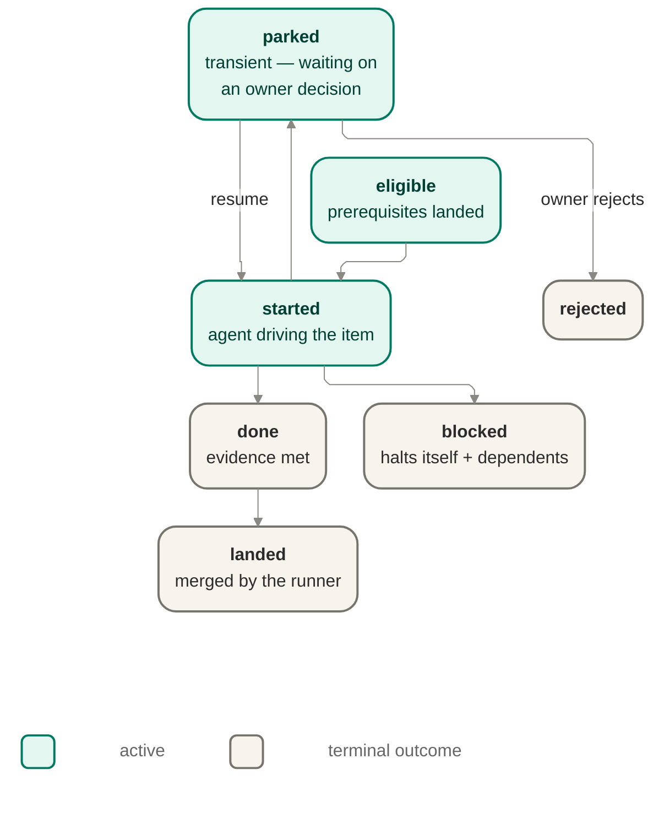

# Orchestration — the runner

The runner is jig's trusted orchestrator: it drives a launched run from start to finish, owns
the run and work-item state machines, resolves what is eligible to run next, and is the sole
holder of the privileged authority needed to land work.

## Owns

- The work-item lifecycle and the run lifecycle — the two state sets a run moves through.
- Eligibility and DAG resolution: a work item is ineligible until its prerequisites land
  (ISO-1); a blocked item halts itself and its downstream dependents while independent work
  keeps moving.
- Driving each eligible work item to the agent port and recording its outcome.
- Holding credentials and the sole authority to push, open a PR, and merge (FENCE-3, MERGE-2) —
  the thing that writes code is never the thing that ships it.
- The done/landed distinction: a work item being done (evidence met) is separate from it being
  landed (merged) (MERGE-4).

## Interface

Consumes the `ValidatedPlan` (from plan-intake) and the bound policy; consumes fence decisions
(grant / deny / route) and modeled evidence as inputs to its state transitions. Drives the agent
port to carry out a work item. Emits every transition and decision as an event to the records
port.

## Diagram

The run itself has a separate, run-level lifecycle: previewed → started → stopped / resumed /
completed. `stopped` is run-level, not a work-item outcome — it pauses the whole run; work items
that had not reached a terminal outcome stay where they were and resume from their last safe
checkpoint.

## Notes

- The transition table above is closed: any transition not drawn is illegal. An illegal
  transition is a test-time fact to catch in verification, not a runtime "shouldn't happen"
  branch to handle defensively.
- Landing — the merge step from done to landed — is exclusively runner-owned; no other
  component performs it.
- Parallel-workspace concurrency across work items (ISO-4) and resume-after-interruption
  mechanics are named extension points for this area, not specified here.

## Reconciles to

ISO-1, ISO-3, MERGE-2, MERGE-4, FENCE-3, and the product-visible states in
[`concepts.md`](../../product/concepts.md#story-and-run-outcomes).
