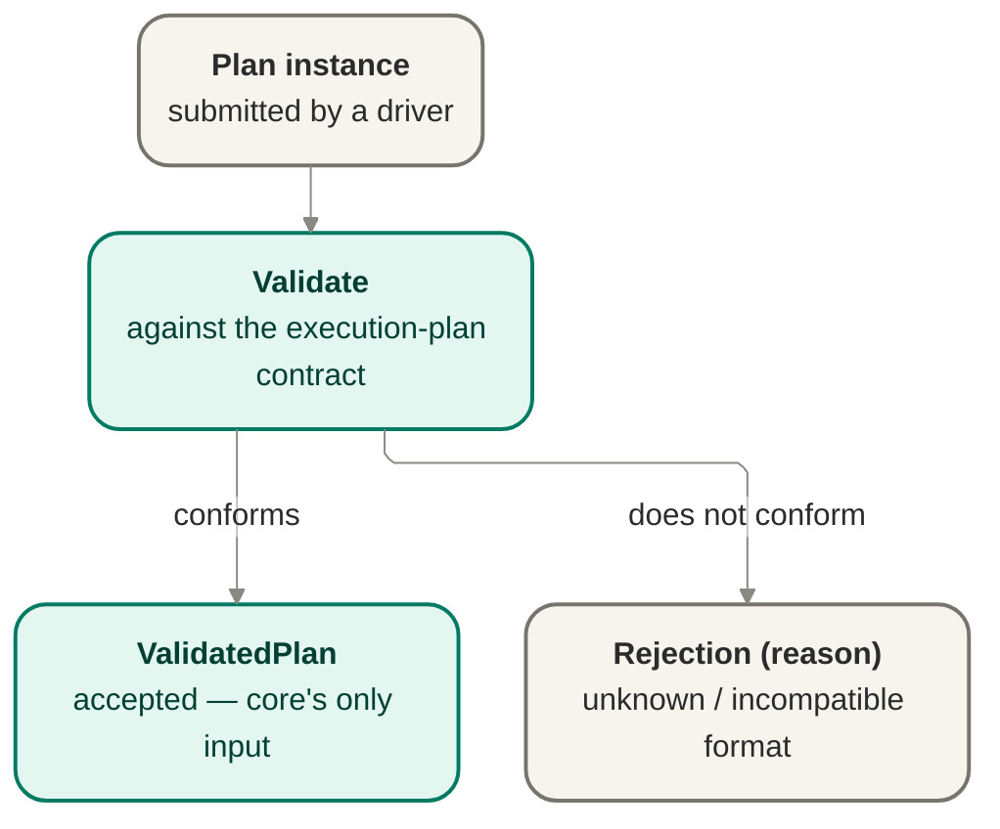

# Plan intake — parsing and validation

Plan intake parses a machine-readable plan instance and validates it against the execution-plan
contract, rejecting unknown or incompatible formats with a reason rather than guessing at
intent. It is the boundary [`bootstrap`](./bootstrap.md) calls before anything else can happen.

## Owns

- Parse the plan instance into an in-memory representation.
- Validate the parsed plan against the execution-plan contract shape.
- Reject with a named reason on unknown, malformed, or incompatible plan format.
- Guarantee no run is created from an invalid or rejected plan.

## Interface

- **`PlanValidator` port** — `validate(instance) → ValidatedPlan | Rejection(reason)`.
- Consumes the execution-plan data contract
  ([`../contracts/execution-plan-contract-v0.md`](../contracts/execution-plan-contract-v0.md)).

## Port boundary and anti-corruption stance

The existing interface and Mermaid diagram above are the preserved seed for this boundary. Wave 3
deepens them in place rather than replacing them: the port remains the single plan-intake
boundary `bootstrap` calls before a run can begin, and the execution-plan contract remains cited,
not frozen or rewritten here.

The anti-corruption stance is validate once, at the boundary. A submitted plan instance may come
from an operator-driving surface or, in future, from a cited work-source path, but no supplier of a
raw plan instance gets to weaken or bypass the boundary. Core owns the intake contract, the
accept/reject semantics, and the meaning of "validated plan"; upstream producers supply an
instance, not a replacement definition of plan validity.

## Owns / implements / must-not

### Core owns

- The `PlanValidator` port contract and its accept-or-reject semantics.
- Parse and validation against the cited execution-plan contract shape.
- The reject-unknown-format posture and the guarantee that no run is created from a rejected plan.
- The meaning of `ValidatedPlan` as core's only admitted runtime input.

### An adapter or caller implements

- Submission of a machine-readable plan instance to this boundary.
- Driver-surface behavior around how an operator or upstream tool supplies the instance for
  validation.

### Must not

- Treat a producer's self-description as sufficient proof of compatibility.
- Re-define plan semantics locally to fit a particular producer or source.
- Skip intake and hand a work item, plan fragment, or provider-originated payload directly to
  orchestration.
- Re-validate plan shape downstream as a second source of truth with different semantics.

## Invocation point in settled Wave 2 flow

This doc does not author any new state or transition. It names the already-settled invocation point
only: `PlanValidator` is invoked at launch from the cited preview/start path before orchestration
consumes a `ValidatedPlan`, consistent with [`orchestration.md`](./orchestration.md)'s existing
run-lifecycle prose and the Wave 3 story brief's "validate-once-at-the-boundary" scope.

## Relationship to the execution-plan v0 contract

`PlanValidator` carries the seam shape defined in
[`../contracts/execution-plan-contract-v0.md`](../contracts/execution-plan-contract-v0.md). That
contract stays v0, cited, and unfrozen here.

This file therefore names the relationship at contract altitude only:

- intake validates against the contract properties the seam owner has already declared;
- unknown or incompatible format is rejected with a reason rather than guessed through;
- a needed refinement to contract shape routes back to the contract owner instead of becoming a
  silent local intake rule.

This section does not mint field names, validation-language detail, or frozen schema.

## Failure posture

- Invalid, malformed, unknown, or incompatible submitted plans are rejected at the boundary with a
  named reason.
- Rejection is terminal for intake of that submitted instance: no run is created from it.
- Contract-shape mismatch is handled as a seam-governance issue, not as local silent coercion.

## Port-boundary invariant candidates

These are unnumbered candidates only. If a future consolidated ledger needs numbering, the next
available invariant number is `INV-019`.

- **Validate once at the boundary.** Plan-shape acceptance happens at intake; downstream consumers
  rely on the validated result rather than re-defining validity later.
- **Reject unknown formats, never guess.** Intake rejects a plan whose compatibility posture is not
  understood instead of silently coping with it.
- **No second scheduling input.** No upstream source, including a future work-source path, bypasses
  validated plan intake and hands runtime scheduling input directly to core.

## Risks and deferred decisions

- **Risk — contract drift pressure at the seam.** A producer may eventually want a contract shape
  this intake boundary does not yet admit. That is a seam-owner decision, not a local parsing
  exception.
- **Deferred — field-level validation detail.** Exact field names, schema language, encoding, and
  versioning/migration strategy remain in the cited v0 contract's future evolution, not this doc.
- **Deferred — upstream source forms.** How different operator or tooling surfaces package and submit
  a plan instance is outside this port contract as long as they still enter through intake.

## Notes

- Reject-unknown-format is the same posture as "no silent legacy coping": jig refuses what it
  doesn't understand, with a reason, instead of coping silently.
- Validation happens once, at the boundary; nothing downstream re-validates plan shape.
- The v0 contract shape is not frozen. Refinements route back to the seam owner — they are
  never a silent, local change inside intake.
- Deferred: field-level schema, encoding format, and versioning/migration strategy across
  contract revisions.

## Reconciles to

- `docs/product/jig.md` — "The execution plan — Jig's one input"; "no silent legacy coping".
- `docs/design/contracts/execution-plan-contract-v0.md` — the contract this seam validates against.
- `INV-007` — reject unknown formats at the boundary; a plan whose compatibility posture is not
  understood is rejected rather than guessed through.
- `SURF-002` — `PlanValidator` as the cited plan-intake surface carrying
  `validate(instance) → ValidatedPlan | Rejection(reason)` at current altitude.
