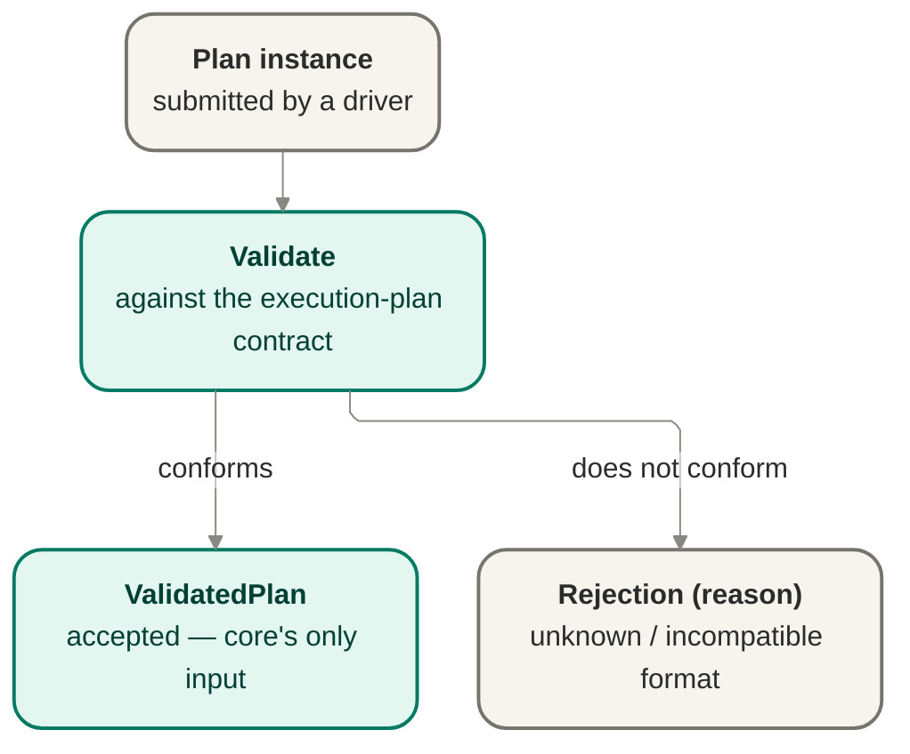

# Plan intake — parsing and validation

Plan intake parses a machine-readable plan instance and validates it against the execution-plan
contract, rejecting unknown or incompatible formats with a reason rather than guessing at
intent. It is the boundary [`bootstrap`](./bootstrap.md) calls before anything else can happen.

## Owns

- Parse the plan instance into an in-memory representation.
- Validate the parsed plan against the execution-plan contract shape.
- Reject with a named reason on unknown, malformed, or incompatible plan format.
- Guarantee no run is created from an invalid or rejected plan.

## Interface

- **`PlanValidator` port** — `validate(instance) → ValidatedPlan | Rejection(reason)`.
- Consumes the execution-plan data contract
  ([`../contracts/execution-plan-contract-v0.md`](../contracts/execution-plan-contract-v0.md)).

## Notes

- Reject-unknown-format is the same posture as "no silent legacy coping": jig refuses what it
  doesn't understand, with a reason, instead of coping silently.
- Validation happens once, at the boundary; nothing downstream re-validates plan shape.
- The v0 contract shape is not frozen. Refinements route back to the seam owner — they are
  never a silent, local change inside intake.
- Deferred: field-level schema, encoding format, and versioning/migration strategy across
  contract revisions.

## Reconciles to

- `docs/product/jig.md` — "The execution plan — Jig's one input"; "no silent legacy coping".
- `docs/design/contracts/execution-plan-contract-v0.md` — the contract this seam validates against.
