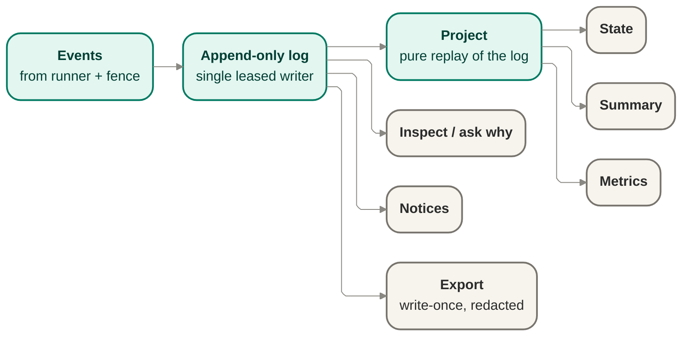

# Records — the event-log engine

Produces the durable, ordered, redaction-aware records that are the evidence itself, including
governed acceptance/review verdicts when an implemented lane emits them. State and summary are
never authored directly — they are pure projections replayed from the log.

## Owns

- The append-only event log, with a single leased writer per run.
- Pure projections — state, summary, metrics — replayed from the log, never hand-maintained
  separately.
- Redaction posture recorded per record.
- Export: a write-once, redacted artifact a finished run produces.
- The source data for notices and for "ask why" — both read from the same log, nothing parallel.
- The durable evidence posture for acceptance/review verdicts and supporting evidence, without
  freezing a new record schema here.

## Interface

`RunStore` port — `append(event)` (append-only, no mutation or deletion) and
`project(state | summary | metrics)` (pure replay of the log into a view); plus an `export`
operation producing the write-once redacted artifact.

## Diagram

## Port boundary and anti-corruption stance

The interface and Mermaid diagram above are the boundary: the port is the append-only evidence
surface, and the records contract it emits into remains cited, not frozen or rewritten here.

The anti-corruption stance is that records are the evidence and projections are derived views, never
competing sources of truth. Core owns append semantics, replay semantics, export posture, and the
meaning of durable run evidence. Consumers may read projections, notices, and exports, but they do
not redefine what happened by writing around the log.

## Engine consistency model

This section defines the engine behind the `RunStore` port above without changing its method shape.

The log is the one durable authority for what happened in a run. Its consistency model is:

- **Append-only.** A governed event is appended as a new fact or it is rejected; previously accepted
  events are never mutated, deleted, or replaced.
- **Single leased writer per run.** At any moment exactly one governed append authority is allowed to
  continue the log for a run. The runner-owned append path holds that authority while the run is
  active; reacquiring or re-wiring that authority across resume is owned by
  [`bootstrap.md`](./bootstrap.md), not redesigned here.
- **Write-conflict rejection.** An append attempt that does not come from the active leased writer,
  or would create a second competing continuation of the same run history, is rejected rather than
  merged, guessed through, or silently reordered.
- **Monotonic run history.** The accepted log grows in one direction only. Later records may explain,
  supersede, or close earlier situations, but they do so by new append, not by editing prior facts.

The construction seam applies here in one direction only: Records owns the store shape, consistency
model, and invariants; [`bootstrap.md`](./bootstrap.md) owns constructing and wiring the store at
launch, including the first binding-record append. This file names that seam and depends on it; it
does not redesign bootstrap.

This is a consistency model over the run record itself, not a storage-engine prescription. This file
still does not choose a concrete persistence mechanism, indexing strategy, or encoding.

## Event ordering and replay basis

The Records engine owns enough ordering and causal discipline that replay is meaningful and stable,
while the concrete field names remain with the cited v0 contract.

- Each accepted event is part of one causally ordered run history.
- The engine preserves the distinction between "this happened earlier" and "this record was derived
  later from the same history" by keeping derivation on the projection side, never by mutating the
  log.
- Event families already named by
  [`../contracts/observability-records-contract-v0.md`](../contracts/observability-records-contract-v0.md)
  remain the outward vocabulary; this file does not mint new event-type strings.

`RunStore` therefore does not promise arbitrary query semantics. It promises a stable replay basis
for the projections and exports core already relies on.

## Owns / implements / must-not

### Core owns

- The `RunStore` port contract: append, project, and export at the current altitude.
- The append-only log and the single-leased-writer discipline for governed run evidence.
- The rule that state, summary, metrics, notices, and inspect views are pure projections replayed
  from the log.
- Write-conflict rejection and replay-determinism as engine-level correctness properties.
- Redaction posture per record and export posture for the durable run artifact.

### A caller or consumer implements

- Emitting governed events into this port from already-settled core callers such as the runner and
  cited authorization path, and governed verifier/reviewer lanes once implemented.
- Reading projections, inspect/ask-why views, notices, or export outputs derived from the same log.

### Must not

- Author state, summary, metrics, notices, or a parallel "what happened" narrative outside the log.
- Mutate or delete previously appended governed events.
- Bypass redaction posture when surfacing records or exports.
- Treat a projection as the authority that appends back into the evidence stream.
- Recover from a conflicting append by inventing a merged history. A conflict is a stop/retry
  condition for the owning append path, not a cue to reconcile two writers inside Records.

## Emission points in the run lifecycle

This doc does not author any new state or transition. It names the already-settled emission points
only: `RunStore` receives the events emitted from the cited run/work-item lifecycle flow in
[`orchestration.md`](./orchestration.md), along with cited authorization outcomes and implemented
acceptance/review verdicts as sources. The port boundary here is the durable append and replay
surface those existing callers use.

## Relationship to the observability-records v0 contract

`RunStore` carries the seam shape defined in
[`../contracts/observability-records-contract-v0.md`](../contracts/observability-records-contract-v0.md).
That contract stays v0, cited, and unfrozen here.

This file therefore stays at contract altitude only:

- the log emits governed records that preserve the contract properties already declared by the seam
  owner;
- projections and export are derived from those governed records rather than inventing a second
  contract;
- a needed refinement to records shape routes back to the contract owner instead of becoming a
  silent local extension.

This section does not mint field names, event-family strings, storage schema, or export encoding.

## Projection purity and replay determinism

Evidence and Notice are record-derived, not separate stores, and the anti-corruption stance is that
projections never author the log. This file turns those design commitments into an engine rule:

- **Pure projection.** State, summary, metrics, notices, and inspect/ask-why views are derived only
  from replay of the accepted log plus the fixed projection logic that interprets it.
- **No parallel narrative.** A projection may summarize or triage, but it never becomes a second
  mutable account of what happened.
- **Replay determinism.** Replaying the same accepted log through the same projection logic produces
  the same derived view. A different result indicates replay drift, which is a correctness failure in
  the projection path, not a reason to rewrite the log.
- **Re-derivability.** A projection may be cached, materialized, or exported for convenience, but the
  authoritative form remains the log-backed replay result, not the cached copy.

This is why notices and inspect/ask-why remain projections from the same evidence base the owner
inspects and the runner decides from, satisfying the "records are the evidence" posture.

## Projection and export posture

- Projection is pure replay of the append-only log into state, summary, and metrics views.
- Inspect / ask-why and notices read from the same governed evidence source rather than from a
  separate narrative channel.
- Export remains write-once and redacted, produced from the same record basis the owner inspects.

## Redaction and evidence posture

- Records are the evidence Jig decides from and the evidence the owner inspects afterward.
- Acceptance/review verdicts and their supporting evidence are durable evidence inputs when policy
  requires them; they do not create a second narrative outside the log.
- Secrets, credentials, tokens, and sensitive values are omitted or redacted before governed record
  persistence, not merely before later surfacing; the redaction posture is part of the governed
  record path, not an optional afterthought.
- A redacted export is not a weaker side channel; it is a governed projection of the same evidence
  boundary.

The engine records redaction/export posture per governed record, but it does not decide which values
count as sensitive. That classification input is cited from the policy/evidence surface; Records
preserves and enforces the posture once supplied.

A governed append lacking valid redaction/export posture, or carrying unknown or ambiguous posture,
is rejected rather than guessed through. Inspect and export are denied or constrained until valid
posture exists on the accepted record path.

### Phase 4 local altitude — replay-inspect and run-level posture (ADR 0020)

[ADR 0020](../decisions/0020-phase-4-reliable-local-runs.md) settles the Phase 4 local reading of
this engine without freezing schema:

- **Replay is the inspect basis.** `events.jsonl` is the authoritative history; `run.json` is a
  finalized/cached summary only. `jig inspect` and resume derive their view by replaying
  `events.jsonl` (§1–2 of the ADR), so a crashed run with no finalized `run.json` is still
  inspectable. When a cached `run.json` conflicts with the log, the log wins and a staleness
  diagnostic is surfaced.
- **The log carries its own launch header.** So replay is genuinely self-sufficient, the
  authoritative launch metadata — `run.id`, `planId`, the launch `binding`, the workspace
  fingerprint, the run-level redaction/export posture, and the plan and policy snapshot references —
  rides in a durable launch header (the `run.started` record at the head of `events.jsonl`), not
  only in the cached `run.json`. Today `binding` is written only into `run.json`; Phase 4 promotes
  it into the log additively, reusing the `run.started` family and minting no new family (ADR 0020
  §1). The **policy snapshot** (resolved launch rules, persisted like the plan snapshot) is what lets
  resume adjudicate resumed work under the launch policy instead of a reference-only stub (ADR 0020
  §3). A crashed run recovers all of it by replay.
- **Projection failure is fail-closed and diagnosable.** Malformed events, a missing required
  Phase R/3 field, or an illegal replayed transition are correctness failures: inspect surfaces a
  diagnosable stop and resume refuses, rather than guessing past corruption or repairing the log
  (RESUME-4; the "Failure posture" rules above).
- **Run-level default posture at local altitude.** The per-record posture rule above is the v0
  design altitude. At Phase 4 local altitude a **run-level default posture** applies
  (`safe-for-owner-record` / export `redacted`); field-level per-record posture phases in with the
  concepts that introduce sensitive values (the phasing posture of
  [ADR 0017](../decisions/0017-records-seam-reconciliation.md) decision 5), because local dry-run
  carries no real secrets yet. Unknown or ambiguous posture stays fail-closed: inspect/export is
  denied or constrained and the ambiguity becomes an operator-visible diagnosable stop.

### Phase 9 realization — the integrity sidecar (ADR 0025)

[ADR 0025](../decisions/0025-phase-9-records-integrity.md) makes the durable evidence tamper-evident
**without** touching the record bytes, discharging the integrity deferral
[ADR 0020](../decisions/0020-phase-4-reliable-local-runs.md) left open:

- **Integrity rides beside the record, not inside it.** A content digest per immutable protected artifact
  and a hash-chain over the append-only event log's accepted bytes — authenticated by an **HMAC keyed from
  the environment** — are **materialized on a separate integrity sidecar** (`runs/<id>/integrity.*`, a
  **non-golden** file beside the run directory). The immutable launch header (`run.started`, including the
  Phase-8 provenance, Phase-6 attestation/substrate references, and Phase-9 `binding.drivers` sub-field)
  plus the plan/policy/attestation snapshots are digested once at launch. The event-log hash-chain is
  maintained incrementally under this file's governed **single leased writer** model: each accepted append
  extends the chain and updates the sidecar **atomically with** the append. Competing governed append
  attempts are rejected as write conflicts; out-of-band edits that bypass the writer are detected later as
  sidecar/log divergence. `events.jsonl` and every snapshot stay **byte-for-byte unchanged**; nothing
  integrity-related is appended to, nested in, or reshaped within a governed record. So the byte-identical
  Phase-0..4 record goldens stay a regression anchor — the sidecar is excluded from the record-goldens (or
  produced only under real-driver wiring). A naive per-line hash-chain written **inside** the log is
  rejected precisely because it would break that byte-identity.
- **Verify is recompute-and-compare — a projection, never a mutation.** `inspect` and resume preflight
  **recompute** the immutable-artifact digests, current log-chain head, and HMAC with the environment key,
  then compare to the sidecar. A mismatch is a detected break: a governed append not reflected in the
  sidecar, bytes changed outside the leased writer, truncation/reordering, or a sidecar edit that no
  longer verifies. `inspect` **surfaces** it as a diagnosable notice naming the broken artifact; resume
  **refuses** with a named reason (a live `resume-blocked-*` preflight diagnostic, not a minted event
  family). This is pure recompute-and-compare on the projection side, consistent with "Projection purity"
  above — it writes nothing into the evidence stream to detect a break.
- **Key discipline and honest scope.** The HMAC key is **environment-only**, **never serialized** into any
  record/snapshot/sidecar; its absence where integrity is expected is a **diagnosable stop, not a silent
  skip** (the fail-closed posture above). The sidecar detects tampering **without the live key** and
  off-host replay without it; it does **not** claim to stop an actor who **also holds the key**. Records
  **stay safe to keep and export** through a detected break — the run is flagged, not made unreadable, and
  the SEC-1 redaction posture is unchanged (the sidecar stores digests and an HMAC, never the key or any
  sensitive value). No observability-records field is minted or frozen — the digest/HMAC posture is
  design-owned on the sidecar, not part of the v0 contract.

## Records/evidence surface

Records remains the durable evidence substrate for both runtime decisions and later inspection:

- the runner and cited authorization path append governed facts into one history;
- projections derive the operator-facing state, summary, notices, and inspect views from that same
  history;
- export produces a write-once redacted artifact from that same history;
- downstream consumers read the records/evidence surface but do not redefine it.
- verifier/reviewer outputs are recorded as governed evidence inputs; the reviewer does not append
  around the runner-owned record path or become a records authority.

This surface is also a downstream contract for the execution-host seam. The capability / attestation
and future acceptance/review event families must be framable against this engine's append-and-project
model; this file therefore preserves the records/evidence surface as a core-owned seam without
freezing new fields here.

## Failure posture

The Records engine fails closed on evidence integrity:

- conflicting append attempts are rejected, not merged;
- projection drift is treated as a correctness failure in derivation, not as permission to rewrite
  history;
- governed appends with missing, unknown, or ambiguous redaction/export posture are rejected;
- inspect and export are denied or constrained until valid redaction/export posture exists; and
- redaction/export posture may deny or constrain a surfaced view, but does not authorize bypassing
  the governed record path.

## Port-boundary invariant candidates

These are unnumbered candidates only. If a future consolidated ledger needs numbering, the next
available invariant number is `INV-019`.

- **Append-only evidence boundary.** Governed run evidence is appended, never back-edited or
  replaced.
- **Single leased writer per run.** At any moment exactly one append authority may continue a run's
  governed history.
- **Write conflict is rejected, never merged.** A competing append attempt does not fork or repair the
  log in place; it is refused.
- **Replay is deterministic.** The same accepted log replays to the same derived view.
- **Projections never author the log.** State, summary, metrics, notices, and inspect views are
  derived from replay and do not become append authorities.
- **No parallel narrative.** The explanation of what happened remains reconstructible from records
  rather than a separate mutable story.
- **Review verdicts are evidence inputs.** Acceptance/review results are appended through the
  governed evidence path when implemented; they do not authorize landing by themselves.
- **Redaction is governed at the boundary.** Surfaced records and exports preserve the safety
  posture of the evidence stream instead of bypassing it later.
- **Unknown redaction/export posture is fail-closed.** A governed append without valid posture is
  rejected, and inspect/export stays denied or constrained until posture is valid.

## Risks and deferred decisions

- **Risk — storage-detail pressure.** Implementation pressure may tempt the design to smuggle engine,
  retention, or indexing decisions into this port contract. Those remain separate from the current
  seam definition.
- **Risk — lease ownership blur.** Future implementation work may conflate "who may append now" with
  "who emitted the underlying event." The Records invariant is narrower: many components may be event
  sources, but only the governed append path may continue the log.
- **Risk — replay drift hidden by cached views.** Any future materialized view can become a competing
  truth source if it is treated as authoritative after the log changes. Replay remains the authority;
  caches are convenience only.
- **Risk — redaction bypass at export edges.** Convenience exports or debug surfaces may try to read
  around the governed posture. They must remain projections of the same redaction-aware evidence
  boundary.
- **Deferred — storage engine and retention richness.** Concrete persistence mechanism, archival
  tiers, and retention policy detail remain out of scope here.
- **Deferred — event-sourcing subprofile.** The engine is event-sourcing-adjacent (append-only source
  of truth with pure projections), but snapshot strategy, upcasting/versioning, and CQRS-style read
  model pipelines remain out of scope until a later proof gate justifies them.
- **Deferred — export encoding and downstream analytics shape.** External representation details and
  between-runs consumption stay downstream of this port contract.
- **Deferred — acceptance/review record detail.** If the richer acceptance/review lane needs new
  event families or fields, that belongs in a future records-contract design change; this pass only
  names the durable evidence posture.
- **Deferred — replay-drift handling surface.** This file names replay drift as a correctness failure,
  but not yet whether later design work surfaces it as a stop token, notice, export denial, or
  another diagnosable outcome.

## Open questions

None. The remaining unresolved items are explicit deferrals above, not hidden ownership gaps.

## Notes

- The records are the evidence (SEE-3): there is no separate narrative of what happened that can
  drift from the log itself.
- Real secret-scanning **activates for real-driver records at Phase 6**
  ([ADR 0022](../decisions/0022-phase-6-real-driver-integration.md), P6-AC-6): the moment real
  credentials first enter play, secrets are scanned and redacted and a redaction ambiguity becomes a
  diagnosable stop. The default/reference path is unchanged — it has no real secrets — and the
  redaction-posture field already present on each record carries the posture either way, so activation
  needs no schema break.
- Retention richness — how long records live, archival tiers — is deferred.

## Reconciles to

- `SEE-1` — full run visibility through durable, reconstructible records.
- `SEE-2` — records as a structured, machine-readable product surface.
- `SEE-3` — the records are the evidence; no parallel narrative drifts from the log.
- `SEE-4`, `SEE-5`, `SEE-6` — inspectability, notice posture, and redacted export remain derived
  from the same governed record boundary.
- `SEC-1` — secrets and sensitive values stay out of surfaced records and exports.
- `INV-006` — state, summary, and metrics are pure projections of an append-only log, never
  authored directly.
- `SURF-004` — `RunStore` as the cited append/project/export surface at current altitude.
- `ENF-003` — projections never append; only the governed append path authors the evidence stream.
