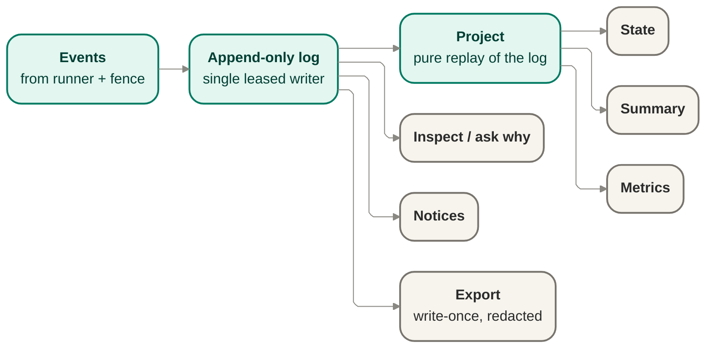

# Records — the event-log engine

Produces the durable, ordered, redaction-aware records that are the evidence itself. State and
summary are never authored directly — they are pure projections replayed from the log.

## Owns

- The append-only event log, with a single leased writer per run.
- Pure projections — state, summary, metrics — replayed from the log, never hand-maintained
  separately.
- Redaction posture recorded per record.
- Export: a write-once, redacted artifact a finished run produces.
- The source data for notices and for "ask why" — both read from the same log, nothing parallel.

## Interface

`RunStore` port — `append(event)` (append-only, no mutation or deletion) and
`project(state | summary | metrics)` (pure replay of the log into a view); plus an `export`
operation producing the write-once redacted artifact.

## Diagram

## Notes

- The records are the evidence (SEE-3): there is no separate narrative of what happened that can
  drift from the log itself.
- Real secret-scanning is deferred; the redaction-posture field exists on each record now so it
  can be populated later without a schema break.
- Retention richness — how long records live, archival tiers — is deferred.

## Reconciles to

SEE-1, SEE-2, SEE-3, SEE-4, SEE-5, SEE-6, SEC-1.
