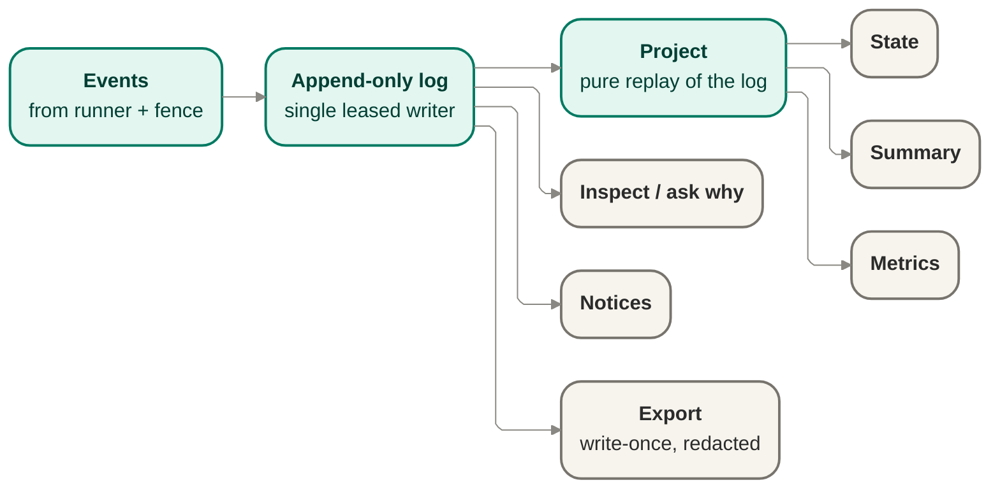

# Records — the event-log engine

Produces the durable, ordered, redaction-aware records that are the evidence itself. State and
summary are never authored directly — they are pure projections replayed from the log.

## Owns

- The append-only event log, with a single leased writer per run.
- Pure projections — state, summary, metrics — replayed from the log, never hand-maintained
  separately.
- Redaction posture recorded per record.
- Export: a write-once, redacted artifact a finished run produces.
- The source data for notices and for "ask why" — both read from the same log, nothing parallel.

## Interface

`RunStore` port — `append(event)` (append-only, no mutation or deletion) and
`project(state | summary | metrics)` (pure replay of the log into a view); plus an `export`
operation producing the write-once redacted artifact.

## Diagram

## Port boundary and anti-corruption stance

The existing interface and Mermaid diagram above are the preserved seed for this boundary. Wave 3
deepens them in place rather than replacing them: the port remains the append-only evidence surface,
and the records contract it emits into remains cited, not frozen or rewritten here.

The anti-corruption stance is that records are the evidence and projections are derived views, never
competing sources of truth. Core owns append semantics, replay semantics, export posture, and the
meaning of durable run evidence. Consumers may read projections, notices, and exports, but they do
not redefine what happened by writing around the log.

## Owns / implements / must-not

### Core owns

- The `RunStore` port contract: append, project, and export at the current altitude.
- The append-only log and the single-leased-writer discipline for governed run evidence.
- The rule that state, summary, and metrics are pure projections replayed from the log.
- Redaction posture per record and export posture for the durable run artifact.

### A caller or consumer implements

- Emitting governed events into this port from already-settled core callers such as the runner and
  cited authorization path.
- Reading projections, inspect/ask-why views, notices, or export outputs derived from the same log.

### Must not

- Author state, summary, metrics, notices, or a parallel "what happened" narrative outside the log.
- Mutate or delete previously appended governed events.
- Bypass redaction posture when surfacing records or exports.
- Treat a projection as the authority that appends back into the evidence stream.

## Emission points in settled Wave 2 flow

This doc does not author any new state or transition. It names the already-settled emission points
only: `RunStore` receives the events emitted from the cited run/work-item lifecycle flow in
[`orchestration.md`](./orchestration.md), along with cited authorization outcomes as sources. The
port boundary here is the durable append and replay surface those existing callers use.

## Relationship to the observability-records v0 contract

`RunStore` carries the seam shape defined in
[`../contracts/observability-records-contract-v0.md`](../contracts/observability-records-contract-v0.md).
That contract stays v0, cited, and unfrozen here.

This file therefore stays at contract altitude only:

- the log emits governed records that preserve the contract properties already declared by the seam
  owner;
- projections and export are derived from those governed records rather than inventing a second
  contract;
- a needed refinement to records shape routes back to the contract owner instead of becoming a
  silent local extension.

This section does not mint field names, event-family strings, storage schema, or export encoding.

## Projection and export posture

- Projection is pure replay of the append-only log into state, summary, and metrics views.
- Inspect / ask-why and notices read from the same governed evidence source rather than from a
  separate narrative channel.
- Export remains write-once and redacted, produced from the same record basis the owner inspects.

## Redaction and evidence posture

- Records are the evidence Jig decides from and the evidence the owner inspects afterward.
- Secrets, credentials, tokens, and sensitive values stay out of surfaced records and exports; the
  redaction posture is part of the governed record path, not an optional afterthought.
- A redacted export is not a weaker side channel; it is a governed projection of the same evidence
  boundary.

## Port-boundary invariant candidates

These are unnumbered candidates only. If a future consolidated ledger needs numbering, the next
available invariant number is `INV-019`.

- **Append-only evidence boundary.** Governed run evidence is appended, never back-edited or
  replaced.
- **Projections never author the log.** State, summary, metrics, notices, and inspect views are
  derived from replay and do not become append authorities.
- **No parallel narrative.** The explanation of what happened remains reconstructible from records
  rather than a separate mutable story.
- **Redaction is governed at the boundary.** Surfaced records and exports preserve the safety
  posture of the evidence stream instead of bypassing it later.

## Risks and deferred decisions

- **Risk — storage-detail pressure.** Implementation pressure may tempt the design to smuggle engine,
  retention, or indexing decisions into this port contract. Those remain separate from the current
  seam definition.
- **Deferred — storage engine and retention richness.** Concrete persistence mechanism, archival
  tiers, and retention policy detail remain out of scope here.
- **Deferred — export encoding and downstream analytics shape.** External representation details and
  between-runs consumption stay downstream of this port contract.

## Notes

- The records are the evidence (SEE-3): there is no separate narrative of what happened that can
  drift from the log itself.
- Real secret-scanning is deferred; the redaction-posture field exists on each record now so it
  can be populated later without a schema break.
- Retention richness — how long records live, archival tiers — is deferred.

## Reconciles to

- `SEE-1` — full run visibility through durable, reconstructible records.
- `SEE-2` — records as a structured, machine-readable product surface.
- `SEE-3` — the records are the evidence; no parallel narrative drifts from the log.
- `SEE-4`, `SEE-5`, `SEE-6` — inspectability, notice posture, and redacted export remain derived
  from the same governed record boundary.
- `SEC-1` — secrets and sensitive values stay out of surfaced records and exports.
- `INV-006` — state, summary, and metrics are pure projections of an append-only log, never
  authored directly.
- `SURF-004` — `RunStore` as the cited append/project/export surface at current altitude.
- `ENF-003` — projections never append; only the governed append path authors the evidence stream.
