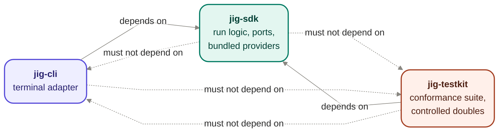

# ADR 0027 — Packaging and SDK boundary

## Context

The product layer now records the N2 packaging decision: jig adopts an internal SDK boundary for
extensibility and single-responsibility, the CLI is the first consumer, a future MCP surface is the
next expected consumer, consumers use the SDK instead of reaching into jig internals, and the package
stays private with no stability or publish promise yet
([product boundary](../../product/jig.md#product-boundaries)). The same product page keeps the
third-party provider ecosystem question explicitly open: packaging design must not assume either that
out-of-repo installable providers will ship or that they never will
([open questions](../../product/jig.md#open-questions)).

The prior-art absorption ledger routes the retired workflow-kit `20-sdk-and-packaging/` corpus to
this ADR as input only: dependency matrix, SDK boundary, injected factory shape, testkit split, and
storage-ports boundary are useful questions to ask, but the prototype's roughly eight-package answer
is not authority for jig's smaller current scope
([prior-art disposition](../notes/prior-art-workflow-kit.md#still-open-routed)). That corpus assumed a
broader platform shape than jig has today.

The live repo is still one private package: [`package.json`](../../../package.json) names
`@agentic-workflow-kit/jig-repo`, sets `private: true`, and has no `exports` field. The current source
tree keeps the provider-port interfaces in [`src/ports.ts`](../../../src/ports.ts), the composition
factory in [`src/bootstrap.ts`](../../../src/bootstrap.ts), the CLI adapter in
[`src/cli.ts`](../../../src/cli.ts), and the reusable conformance module in
[`src/conformance/provider-conformance.ts`](../../../src/conformance/provider-conformance.ts). The
conformance tests import that production-tree conformance module directly from `tests/conformance/*`.
[`tsconfig.base.json`](../../../tsconfig.base.json) already has `composite: true`, so the repo is
project-reference-capable, but there are no per-package `tsconfig` files yet. The only configured gate
tooling is the existing Biome, Prettier, TypeScript, delivery check, and Vitest stack in
[`package.json`](../../../package.json); no dependency-cruiser or equivalent boundary-enforcement
configuration exists.

This ADR is design-only. It does not create packages, exports, project references, dependency rules,
or enforcement tooling. It settles what those later implementation changes should be allowed to
create.

## Decision

Five settlements bind the N3 packaging and SDK boundary.

### Reconciliation with the driving contract

[`driving.md`](../contracts/driving.md) and this ADR use "SDK" on different axes. The
driving contract's "SDK adapter" is an architectural-layering boundary: CLI, MCP, and SDK
adapters are thin edge realizations of the operator-control port, so the adapter layer holds no
run logic and imports no provider contracts. This ADR's `jig-sdk` package is a distribution and
dependency boundary: it settles what ships as an installable internal package and what that
package may import.

Those boundaries both apply. The `jig-sdk` package physically contains the jig-core run logic,
orchestration, authorization, records/storage surface, provider ports, and bundled provider
implementations selected behind the factory. It also contains a thin SDK-adapter module for
embedding consumers that realizes the same operator-control port described in
[`driving.md`](../contracts/driving.md). That thin embedding realization still holds no run logic
itself and still calls into the core logic co-located in the same package; the driving edge/core
rule is not violated because package placement is orthogonal to architectural layering.

`jig-cli` remains a separate thin edge realization of the same operator-control port and depends
on `jig-sdk`, consistent with the driving contract's rule that "CLI, MCP, and SDK remain thin
realizations of the same port." This ADR does not amend, supersede, or reopen
[`driving.md`](../contracts/driving.md): the edge/core layering rule stands unchanged. It only
settles which package a first-party consumer installs to reach that edge/core system.

### 1. Target package matrix: three internal packages, not the prototype's eight

Jig should decompose into three internal packages when package work begins:

| Package                             | Owns                                                                                                                                                                                                                                                                                                    | May depend on                                          | Must not depend on                                                                 |
| ----------------------------------- | ------------------------------------------------------------------------------------------------------------------------------------------------------------------------------------------------------------------------------------------------------------------------------------------------------- | ------------------------------------------------------ | ---------------------------------------------------------------------------------- |
| `@agentic-workflow-kit/jig-sdk`     | The programmatic SDK boundary: core run operations, records/storage surface, plan intake, authorization, bootstrap/composition factory, four provider port interfaces, bundled first-party/reference provider implementations behind the factory, and typed results consumed by CLI/MCP/embedding code. | Runtime dependencies approved for core execution only. | `jig-cli`, `jig-testkit`, CLI presentation, test-only conformance code.            |
| `@agentic-workflow-kit/jig-cli`     | The terminal adapter: `bin/jig.js`, argument parsing, process I/O, exit codes, console rendering, and owner prompt plumbing. It realizes the driving contract by calling the SDK.                                                                                                                       | `jig-sdk`.                                             | Provider implementations by deep path, core internals by deep path, `jig-testkit`. |
| `@agentic-workflow-kit/jig-testkit` | Provider conformance suite, controlled doubles, conformance verdict helpers, and test-facing fixtures/helpers that prove driver behavior against the SDK ports.                                                                                                                                         | `jig-sdk`.                                             | `jig-cli` and production runtime packages importing back into testkit.             |

The same matrix, as a dependency graph — solid edges are required dependencies, dashed edges are
the boundaries this ADR forbids:

The load-bearing edge is `jig-sdk -.-> jig-testkit`: production runtime code must never depend on
the conformance suite (Decision 3), which is why the suite moves to `jig-testkit` rather than
staying a peer of `jig-sdk`'s own runtime code.

The root package remains a private workspace/coordination shell, not a fourth runtime product
surface. It may own repo scripts, formatting, aggregate checks, and package orchestration after the
split.

This count differs from the retired prototype because jig's current product and source scope is
smaller: one CLI consumer, one future MCP consumer, four provider ports, a single composition root,
and a conformance suite. It does not yet need separate published provider packages, adapter-family
packages, transport packages, or a public ecosystem scaffold. Bundled first-party/reference providers
may stay SDK-internal until product or implementation pressure proves that separate provider packages
remove real coupling. If the still-open third-party provider ecosystem question flips to "yes" later,
the org publication path and a later ADR can split provider packages intentionally.

### 2. Storage and provider ports belong to the SDK boundary

The SDK boundary owns the surfaces that any first-party consumer needs to operate jig without deep
imports:

- provider port interfaces and provider-facing types from `src/ports.ts`;
- the composition/factory surface from `src/bootstrap.ts`;
- plan intake and validation from `src/plan-validator.ts` and `src/intake.ts`;
- core execution and authorization surfaces from `src/harness.ts`, `src/authorization.ts`, and
  `src/resume.ts`;
- records, projection, integrity, redaction, workspace, clock, substrate, driver-selection, loader,
  and shared runtime types from the corresponding `src/` modules;
- bundled provider implementations under `src/providers/**` as SDK-internal implementations selected
  by the factory, not as deep-import consumer surfaces.

The CLI package owns only the terminal realization currently concentrated in `src/cli.ts` and
`bin/jig.js`: argument parsing, file-path convenience, process lifecycle, usage text, stdout/stderr
formatting, readline-based owner decisions, and exit codes. It may call SDK operations, but it must not
be the place where plan validation, records semantics, provider selection, authorization, or run
lifecycle meaning live.

This realizes the N2 product rule that consumers use the SDK instead of reaching into jig internals.
It also keeps storage in the SDK: `inspect`, resume, future MCP use, and embedding code all need the
same durable-record/projection semantics rather than separate CLI-only readers.

### 3. The conformance suite moves to testkit when the split happens

`src/conformance/` should move out of the production dependency graph into `jig-testkit` when package
work begins. The testkit package exports the provider-conformance suite and its verdict/basis helpers
for provider authors and jig's own conformance lane. `jig-sdk` exports the ports and provider-facing
types the suite tests against; it must not import `jig-testkit`.

That move matches [ADR 0026](./0026-conformance-self-report-only.md): conformance is the executable
adequacy bar for controlled doubles and provider contracts, but a green controlled-double suite does
not prove real-provider truth. Keeping it testkit-scoped prevents that evidence tool from becoming a
production runtime dependency or a hidden authority path. The existing Vitest lane split can then map
cleanly: unit/integration/smoke exercise SDK and CLI behavior, while conformance imports `jig-testkit`
against SDK ports.

This ADR does not perform the move. Until a later PR creates `jig-testkit`, the current
`src/conformance/` location remains an implementation fact, not the long-term package boundary.

### 4. Factory shape: build on `composeReferenceRun`, promote an SDK session factory

The existing `composeReferenceRun(options)` shape in `src/bootstrap.ts` is the current factory pattern
to build on: an async composition function accepts validated runtime inputs plus optional driver
implementation hooks, validates the plan, reads driver selection, wires the four ports, derives
capability attestation/redaction/substrate posture, and returns a composed run object.

The SDK package should expose a higher-level factory around that pattern, with a name chosen in the
implementation PR, that returns a consumer-safe session/control-plane surface for `preview`, `run`,
`resume`, and `inspect` rather than exposing deep provider modules. CLI today and MCP later both call
that SDK factory. Lower-level composition helpers may remain package-internal or explicitly exported
only when they are part of the supported SDK boundary.

The factory remains the sole importer/selector of concrete providers. Consumers may supply configured
provider hooks through the SDK's typed options, but they do not bypass the SDK to import provider or
core internals directly.

### 5. Enforcement and package templates are deferred to the first package PR

Dependency-cruiser rules, TypeScript project-reference wiring, `exports` maps, package templates, and
workspace package files are deferred until the PR that actually creates the second package. This ADR
authorizes the boundary and the target dependency matrix only.

That deferral is intentional: boundary enforcement should be introduced with the package subject it
can actually enforce. Adding dep-cruiser rules, package references, or export maps ahead of the second
package would be enforcement tooling ahead of its subject and is outside this ADR.

The package/export design must keep working if the third-party provider ecosystem remains "no" forever
and if it later becomes "yes" through the org's intentional publication and Changesets path. Nothing
in this ADR creates a publish promise, semver stability promise, or out-of-repo provider commitment.

## Consequences

- The next packaging implementation PR has a concrete target: create the SDK boundary first, then move
  the CLI adapter to consume it, and move conformance to testkit when that package exists.
- First-party consumers stop depending on deep source paths once the SDK package exists; CLI and
  future MCP use the same programmatic surface.
- Production runtime code does not depend on the conformance suite after the split. Provider
  conformance remains executable and reusable, but it is carried by testkit rather than the SDK
  runtime graph.
- Provider package extraction is deliberately not part of the N3 target. It remains available as a
  later product/design decision if a real provider ecosystem or first-party-provider maintenance cost
  justifies it.
- No package files, project references, export maps, dependency-cruiser rules, templates, source moves,
  or tests are authorized by this ADR alone.

## Reconciles to

- `CFG-7` — the SDK is the open extension/programmatic seam for surrounding tools without making CLI
  internals the integration surface.
- `STACK-1` and `STACK-2` — the four provider seams stay independently swappable behind the SDK
  boundary, not through CLI deep imports.
- `STACK-5`, `FENCE-3`, and `MERGE-2` — package boundaries preserve the authority split: the CLI drives
  core, providers implement ports, and privileged landing authority remains runner-owned.
- `DRIVE-1` — conformance lives in testkit as the provider proof tool rather than a production runtime
  dependency.
- `SEE-1`, `SEE-2`, and `SEE-3` — records/projection/storage semantics stay in the SDK so CLI, MCP, and
  embedding consumers inspect the same durable evidence surface.

## Open questions

- Whether a third-party, out-of-repo, installable provider ecosystem ever becomes product remains open;
  this package boundary must not assume the answer either way.
- Whether bundled first-party provider implementations later deserve separate packages remains open
  until real maintenance or publication pressure exists.
