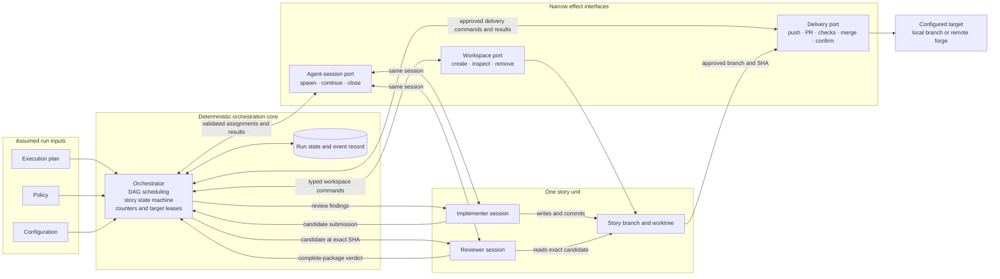
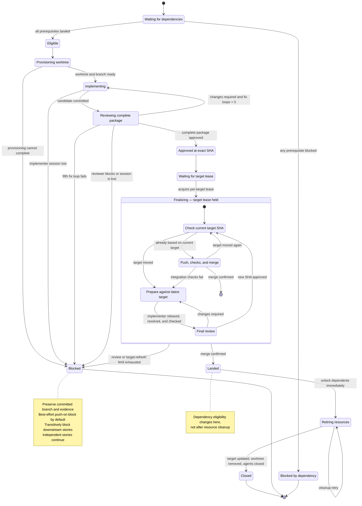

# Deterministic story orchestration

## Status and intent

This document captures a self-contained orchestration design agreed during an exploratory design
session on 2026-07-14. It deliberately does not depend on, amend, or claim consistency with any
existing product, design, delivery, or runtime document. A later adoption pass may reconcile it
with those artifacts.

The proposal reduces delivery orchestration to a deterministic coordinator, two judgment-bearing
agent roles per story, and narrow deterministic interfaces for workspace and delivery effects.
It describes the proposed first phase completely enough to evaluate or implement independently.

## Summary

The system receives an already-prepared execution plan, policy, and configuration. Input
production and compilation are outside this proposal.

For every eligible story, the system creates one branch and worktree, retains one implementer and
one reviewer through a bounded implementation-review loop, and requires the reviewer to approve a
complete delivery package tied to an exact commit. Finalization into a shared target is serialized.
If the target has moved, the same implementer rebases and resolves conflicts, and the same reviewer
reviews the updated package before deterministic delivery proceeds.

The orchestrator makes no implementation, review, conflict-resolution, metadata-writing, or merge
judgment. It deterministically schedules work, validates structured messages, enforces counters,
holds per-target finalization leases, dispatches commands through narrow interfaces, and records
outcomes.

## Goals

- Keep the orchestration core deterministic and small.
- Give each story one isolated, independently understandable delivery unit.
- Keep implementation and review judgment in separate agent sessions.
- Preserve the same implementer and reviewer throughout a story's normal lifecycle.
- Make every transition depend on validated structured artifacts rather than free-form agent
  conversation.
- Review the exact candidate and its complete delivery metadata before it can land.
- Serialize finalization without serializing implementation and initial review.
- Fail closed while allowing independent stories to continue.
- Preserve committed work when a story blocks.
- Keep effect interfaces narrow enough to replace or extend independently.

## Non-goals for the first phase

- Producing or compiling the plan, policy, or configuration.
- Recovering or replacing a lost implementer or reviewer session.
- Hosted pull-request review or processing hosted review feedback.
- Letting an agent decide whether or how to push, create a pull request, or merge.
- Giving the implementer or reviewer repository-host credentials.
- Designing field-level wire schemas or a provider plugin ecosystem.
- Reconciling this proposal with an existing product or implementation model.

## Core invariants

1. The orchestrator is deterministic. It coordinates judgment-bearing agents but does not make
   their judgments.
2. One story owns one branch, one worktree, one implementer session, one reviewer session, and at
   most one pull request.
3. Implementer and reviewer never communicate directly. Every handoff passes through the
   orchestrator as a validated structured message.
4. The implementer writes code. The reviewer assesses the complete delivery package. The
   orchestrator alone changes lifecycle state.
5. Reviewer approval is tied to an exact commit SHA. Any later code mutation invalidates it.
6. Only a reviewer-approved package may enter delivery.
7. The implementer and reviewer never push, create pull requests, merge, or clean worktrees
   directly.
8. Finalization is serialized per target branch through a deterministic lease.
9. A story lands only after the configured target is confirmed to contain the approved result.
10. Dependency eligibility changes when a prerequisite lands, not when its cleanup finishes.
11. Blocking propagates only to transitive dependents. Independent stories continue.
12. Worktree removal never discards uncommitted or insufficiently preserved work.

## Component model

The absence of a direct edge between implementer and reviewer is intentional. The orchestrator
owns their communication protocol and audit trail without altering their findings.

## Responsibilities

| Component                  | Owns                                                                                                                                                          | Must not own                                                                                |
| -------------------------- | ------------------------------------------------------------------------------------------------------------------------------------------------------------- | ------------------------------------------------------------------------------------------- |
| Orchestrator               | DAG eligibility, deterministic scheduling, lifecycle transitions, message validation, counters, target queues and leases, command dispatch, outcome recording | Coding, review judgment, conflict resolution, PR prose, direct Git/worktree/forge mechanics |
| Agent-session interface    | Spawn, continue, identify, and close role-specific sessions                                                                                                   | Story state, review policy, delivery authority                                              |
| Workspace interface        | Create, inspect, update, and safely remove story worktrees                                                                                                    | Agent judgment, dependency scheduling, remote delivery                                      |
| Delivery interface         | Deterministic branch push, optional PR creation, check observation, configured merge, result confirmation                                                     | Whether a package is acceptable, conflict resolution, weakening required checks             |
| Implementer                | Implement the story, rebase when assigned, resolve conflicts, run requested checks, propose delivery metadata                                                 | Review its own work as sufficient, push, create a PR, merge, or clean resources             |
| Reviewer                   | Assess the exact candidate, its evidence, and its delivery metadata; return approval, findings, or a block                                                    | Edit implementation, mutate lifecycle state, push, create a PR, merge, or clean resources   |
| Run state and event record | Story states, counters, commands, structured handoffs, decisions, SHAs, and effect outcomes                                                                   | Independent policy or judgment                                                              |

## SOLID posture

- **Single responsibility:** scheduling, workspace effects, session management, implementation,
  review, and delivery are distinct responsibilities.
- **Open/closed:** future delivery targets, hosted-review stages, specialist reviewers, and
  checkpoint strategies extend narrow boundaries rather than adding judgment to the orchestrator.
- **Liskov substitution:** any implementation of an effect interface must preserve the same typed
  outcomes and fail-closed invariants. A replacement cannot silently acquire decision authority.
- **Interface segregation:** agent-session, workspace, and delivery capabilities remain separate;
  no general-purpose provider interface grants unrelated authority.
- **Dependency inversion:** the orchestration core depends on message and effect contracts, not on
  a particular agent, Git implementation, or repository host.

This proposal avoids a generic plugin framework in the first phase. The boundaries are intended to
make later extraction possible without paying that complexity cost now.

## Per-story resources

Each story has exactly one active delivery unit:

- a stable story identifier;
- one story branch;
- one isolated worktree;
- one implementer session;
- one reviewer session;
- zero or one pull request, depending on delivery policy;
- structured candidate, review, checkpoint, and delivery records.

The story branch is both the implementation branch and the delivery source. There is no separate
per-run integration branch in this proposal. Stories targeting the same configured branch may
implement and undergo initial review in parallel, but they finalize serially.

## Structured agent protocol

Agent outputs are untrusted external input. The orchestrator validates them before changing state.
Free-form text may be retained as supporting detail, but it never acts as a control signal.

### Story assignment

The implementer receives at least:

- story identity and requirements;
- permitted scope;
- worktree and branch identity;
- target branch and known base SHA;
- required checks;
- delivery-metadata requirements;
- applicable budgets and loop counts;
- prior reviewer findings when continuing a loop.

### Candidate submission

The implementer returns at least:

- story identity;
- exact candidate SHA;
- branch identity;
- implementation summary;
- changed paths;
- check evidence;
- proposed pull-request title and body when the delivery mode uses a pull request;
- an explicit blocked result if implementation cannot continue.

Every reviewed candidate must be committed. Normal fix rounds append commits rather than rewriting
an already reviewed candidate.

### Review verdict

The reviewer receives the candidate submission and returns at least:

- story identity;
- exact reviewed SHA;
- `approved`, `changes-required`, or `blocked`;
- structured findings;
- unresolved-finding count;
- assessment of required checks;
- assessment of the factual accuracy and completeness of delivery metadata.

A verdict is invalid if it references a different SHA. An `approved` verdict is invalid if it
contains unresolved findings.

### Approved delivery package

Approval freezes an immutable package containing:

- story and branch identity;
- approved SHA;
- implementation summary and changed paths;
- check evidence;
- approved pull-request title and body when applicable;
- reviewer verdict and attribution;
- current review-fix and target-refresh counters.

The orchestrator may add deterministic metadata such as story identifiers and recorded check
results. It must not invent or rewrite factual claims. Any code mutation invalidates the package
and requires another review.

## Story lifecycle

## Detailed execution flow

### 1. Eligibility and provisioning

The orchestrator computes eligibility from the plan's dependency graph and recorded landed or
blocked outcomes. When capacity is available, it dispatches workspace creation for an eligible
story and starts its implementer session in that worktree.

If an upstream story blocks, every transitive dependent becomes `blocked-by-dependency` with a
causal path to the originating block. Those downstream stories receive no worktrees or agent
sessions. Unrelated eligible stories continue.

### 2. Implementation and initial review

The implementer commits a candidate and returns a candidate submission. The orchestrator validates
it, then assigns the exact candidate to the story's reviewer. The reviewer evaluates the code,
required evidence, and delivery metadata.

`changes-required` findings return through the orchestrator to the same implementer. The same
reviewer assesses the next committed candidate. Reviewer-requested correction rounds increment the
review-fix counter. A successful review produces an approved delivery package.

The default maximum is five review-fix loops. Exhausting the fifth loop blocks the story with
`review-loop-limit-exceeded`, blocks all transitive dependents, preserves the branch and evidence,
and leaves independent work eligible.

### 3. Remote checkpointing

Checkpointing is independent of delivery. A remote checkpoint never creates a pull request,
changes approval, lands a story, or unlocks dependents.

Supported policy modes are:

| Mode               | Behavior                                                                                                         |
| ------------------ | ---------------------------------------------------------------------------------------------------------------- |
| `local-only`       | Keep committed candidates local until delivery requires a push.                                                  |
| `push-on-block`    | Push the latest committed candidate when the story blocks, without creating a pull request. This is the default. |
| `push-each-round`  | Push after each committed implementer round.                                                                     |
| `push-on-approval` | Push only the final approved candidate as part of delivery.                                                      |

Checkpoint enforcement is independently `best-effort` or `required`. The default is best-effort.
A best-effort failure is recorded and local work continues. A required checkpoint failure blocks
the story.

Implementers never push. The orchestrator dispatches a deterministic branch-push operation through
the delivery interface and records the exact pushed SHA. Ordinary checkpoint pushes are
fast-forward-only.

### 4. Finalization queue and lease

Approved stories enter a queue for their configured target. Only one story at a time may hold the
target's finalization lease. Other stories may continue implementation and initial review while
waiting, but no other orchestrated story may merge into that target during the lease.

The lease begins when a story starts final target alignment and ends when its merge is confirmed or
the story reaches a named blocked outcome. After a process interruption, the target must be read
again; an old lease is never assumed valid. Full session or run recovery remains deferred.

Waiting stories do not rebase after every preceding merge. They align once when their own
finalization turn begins. This avoids deterministic churn when several stories were developed in
parallel.

### 5. Target alignment and final review

When finalization starts, the orchestrator reads the current target SHA.

- If the approved story is already based on that SHA, it may proceed to delivery.
- If the target moved, the orchestrator asks the same implementer to rebase onto the exact target,
  resolve conflicts, rerun required checks, and update delivery metadata if needed.
- The same reviewer reviews the complete rebased package and approves its new exact SHA.
- Immediately before delivery, the orchestrator confirms both the approved branch SHA and target
  SHA still match the reviewed finalization basis.

A rebase rewrites branch history and invalidates the prior approval. If the branch already exists
remotely, its deterministic update uses guarded `force-with-lease` against the previously recorded
remote SHA. The implementer never performs that push.

Target movement after finalization has begun increments a separate target-refresh counter. The
initial alignment when a story reaches the front of the queue is not a retry. The default maximum
is five repeated target refreshes. Exhaustion blocks the story with
`target-refresh-limit-exceeded`; downstream blocking and preservation rules then apply normally.

Reviewer-requested fixes and target refreshes use independent counters. Target movement cannot
consume the five implementation review-fix loops merely because other work landed.

### 6. Deterministic delivery

The orchestrator dispatches delivery only for the current approved package. Policy and
configuration determine:

- local or remote target;
- whether to push only, create a pull request, or use another deterministic delivery mechanism;
- target branch;
- required checks;
- merge method;
- remote checkpoint requirements.

For the first phase, a pull request is a delivery mechanism, not another review stage. The
implementer proposes its title and body, and the reviewer approves their factual accuracy and
completeness as part of the package. The orchestrator creates the pull request through the delivery
interface, waits for configured checks, and requests the configured merge. Hosted review is not
part of this phase.

If checks expose a code problem, the story returns to the same implementer and reviewer while
retaining the target lease. If the target moved, it returns through target alignment and final
review. Transient delivery failures may be retried deterministically; a non-recoverable failure
blocks the story with a recorded reason.

### 7. Landing and retirement

The story becomes `landed` only after the configured target is confirmed to contain the delivered
result. That transition immediately makes dependent stories eligible.

Resource retirement is separate:

1. Update the local target view.
2. Confirm the story worktree has no uncommitted work.
3. Confirm the branch is preserved in every location required by policy.
4. Remove the worktree.
5. Close implementer and reviewer sessions.
6. Release the story's resource slot.

A cleanup failure does not reverse landing or block dependents. The landed story remains in
`retiring`, cleanup retries independently, and its resources may continue consuming capacity until
closure.

## Blocking semantics

The first phase uses fail-closed story outcomes:

| Cause                                                 | Story outcome                            | Downstream effect                                        | Independent work              |
| ----------------------------------------------------- | ---------------------------------------- | -------------------------------------------------------- | ----------------------------- |
| Five unsuccessful review-fix loops                    | `blocked: review-loop-limit-exceeded`    | All transitive dependents become `blocked-by-dependency` | Continues                     |
| Five repeated target refreshes                        | `blocked: target-refresh-limit-exceeded` | All transitive dependents become `blocked-by-dependency` | Continues                     |
| Reviewer explicitly cannot approve                    | `blocked` with structured reason         | All transitive dependents become `blocked-by-dependency` | Continues                     |
| Implementer or reviewer session is irrecoverably lost | `blocked: agent-session-lost`            | All transitive dependents become `blocked-by-dependency` | Continues                     |
| Required checkpoint cannot be persisted               | `blocked: checkpoint-failed`             | All transitive dependents become `blocked-by-dependency` | Continues                     |
| Best-effort checkpoint fails                          | No state change; record failure          | None                                                     | Continues                     |
| Cleanup fails after merge confirmation                | Remains `landed` and `retiring`          | Dependents remain eligible                               | Continues subject to capacity |

Every `blocked-by-dependency` record retains the causal path to its originating blocked story. A
run may therefore finish with a mixed result: landed stories, directly blocked stories, and
stories blocked by dependency.

After the original story blocks, the orchestrator retires its resources without discarding work:

1. Confirm that the latest reviewed candidate is committed and record its branch and SHA.
2. Apply the configured checkpoint policy, including a no-PR remote push when required.
3. Preserve the candidate, review history, findings, and effect evidence.
4. Close the implementer and reviewer sessions.
5. Remove the worktree only after confirming it has no uncommitted work and the branch is preserved
   in every policy-required location.

Blocking propagation does not wait for this retirement sequence. Downstream stories become
`blocked-by-dependency` immediately, and independent work may continue subject to available
capacity.

## Agreed first-phase defaults

| Setting                       | Default                                                                 |
| ----------------------------- | ----------------------------------------------------------------------- |
| Story work unit               | One branch, one worktree, one implementer, one reviewer, zero or one PR |
| Review-fix limit              | 5                                                                       |
| Target-refresh retry limit    | 5, separate from review fixes                                           |
| Checkpoint mode               | `push-on-block`                                                         |
| Checkpoint enforcement        | `best-effort`                                                           |
| Hosted PR review              | Disabled                                                                |
| Finalization concurrency      | One active lease per target branch                                      |
| Dependency unlock point       | Confirmed merge/landing                                                 |
| Lost agent session            | Block story; recovery deferred                                          |
| Cleanup failure after landing | Retry without reversing landing                                         |

## Extension points

The design intentionally leaves the following additions possible without assigning new judgment
to the orchestrator:

- **Hosted pull-request review:** add a post-PR acceptance stage that returns structured feedback to
  the same implementer and reviewer.
- **Specialist review:** add policy-selected reviewers that each emit a verdict against the same
  candidate package.
- **Alternative delivery:** implement the delivery interface for another forge, a local integration
  branch, a patch export, or another deterministic target.
- **Alternative workspace:** implement the workspace interface with another isolation substrate.
- **Agent providers:** implement the agent-session interface without exposing provider-specific
  protocol objects to the orchestrator.
- **Metadata assistance:** add a low-cost, unprivileged copywriting helper that proposes text; the
  reviewer still approves it and the helper gains no delivery authority.
- **Recovery:** reconstruct or replace agent sessions from structured records in a later phase.

## Deferred decisions

- Exact schemas and versioning for assignments, submissions, verdicts, packages, effects, and
  records.
- Session recovery, agent replacement, and replay after process interruption.
- Hosted review states, feedback ingestion, and review-loop interaction.
- Exact lease persistence, timeout, and stale-holder rules.
- Delivery retry classification and retry limits beyond target refreshes.
- Merge-method-specific proof that the approved candidate is what landed.
- Security gates required before remote checkpointing unapproved intermediate work.
- Run-level completion semantics when cleanup remains pending.
- Adoption, reconciliation, migration, and compatibility with any current implementation.

## Adoption criterion

This proposal should become an implementation contract only after a separate reconciliation pass
confirms its intended product guarantees, maps or replaces conflicting concepts, defines the
field-level contracts needed by an implementation, and records an explicit adoption decision.
