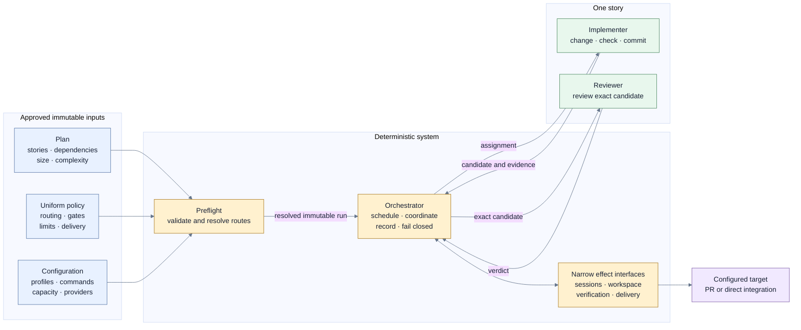

# Deterministic story orchestration

## Status and intent

This document set captures a self-contained orchestration design agreed during an exploratory
design session on 2026-07-14. It deliberately does not depend on, amend, or claim consistency with
any existing product, design, delivery, or runtime document. A later adoption pass may reconcile
it with those artifacts.

The proposal reduces delivery orchestration to a deterministic coordinator, two judgment-bearing
agent roles per story, and narrow deterministic interfaces for agent sessions, workspace effects,
local verification, and delivery effects. The files in this directory form one proposal and are
intended to be read together.

## Summary

The system receives an already-approved, immutable execution plan, policy, and configuration.
Input production, classification, and approval are outside this proposal. Before performing any
side effect, deterministic preflight resolves every story's implementer and reviewer routes and
rejects the entire run if the input envelope is incomplete or impossible to execute.

For every eligible story, the system creates one branch and worktree, retains one implementer and
one reviewer through a bounded implementation-review loop, and requires the reviewer to approve a
complete delivery package tied to an exact commit. Finalization into the run's single shared
target is serialized. If the target has moved, the same implementer rebases and resolves
conflicts, and the same reviewer reviews the updated package before deterministic delivery
proceeds.

The orchestrator makes no implementation, review, conflict-resolution, metadata-writing, check,
or merge judgment. It deterministically validates inputs, resolves configured routes, schedules
work, validates structured messages, enforces counters, holds the finalization lease, dispatches
commands through narrow interfaces, and records outcomes.

## Document layers

| Layer | Document                                              | Owns                                                                                                      |
| ----- | ----------------------------------------------------- | --------------------------------------------------------------------------------------------------------- |
| 0     | This overview                                         | Status, scope, goals, invariants, and navigation                                                          |
| 1     | [Inputs](inputs.md)                                   | Plan, policy, configuration, routing, evidence responsibilities, immutability, and preflight              |
| 2     | [Orchestration](orchestration.md)                     | Deterministic core, effect boundaries, responsibilities, SOLID posture, and agent protocol                |
| 3     | [Story execution](story-execution.md)                 | Eligibility, implementation-review rounds, scheduling, target refresh, and the story state machine        |
| 4     | [Delivery and operations](delivery-and-operations.md) | Checkpointing, final verification, PR or merge flow, blocking, landing, cleanup, defaults, and extensions |

## Goals

- Keep the orchestration core deterministic and small.
- Give each story one isolated, independently understandable delivery unit.
- Keep implementation and review judgment in separate agent sessions.
- Preserve the same implementer and reviewer throughout a story's normal lifecycle.
- Apply one uniform, immutable policy to every story in the run.
- Route stories deterministically from approved plan characteristics rather than orchestrator
  judgment.
- Make every transition depend on validated structured artifacts rather than free-form agent
  conversation.
- Assign checks and evidence responsibilities ahead of time instead of repeating the same work
  across implementer, reviewer, and orchestrator.
- Review the exact candidate and its complete delivery metadata before it can land.
- Serialize finalization without serializing implementation and initial review.
- Fail closed while allowing independent stories to continue.
- Preserve committed work when a story blocks.
- Keep effect interfaces narrow enough to replace or extend independently.

## Non-goals for the first phase

- Producing, classifying, or compiling the plan, policy, or configuration.
- Changing an approved input after the run starts.
- Reclassifying or dynamically rerouting a story during execution.
- Recovering or replacing a lost implementer or reviewer session.
- Hosted pull-request review or processing hosted review feedback.
- Letting an agent decide whether or how to push, create a pull request, or merge.
- Giving the implementer or reviewer repository-host credentials.
- Designing field-level wire schemas or a provider plugin ecosystem.
- Supporting more than one repository or integration target in a run.
- Reconciling this proposal with an existing product or implementation model.

## Core invariants

1. The plan, policy, configuration, and resolved routes are approved and frozen before execution.
2. The orchestrator is deterministic. It coordinates judgment-bearing agents but does not make
   their judgments.
3. One uniform policy applies to every story. Stories cannot override it.
4. One run targets one repository, one integration target, and one delivery environment.
5. Every story declares size and complexity; the orchestrator never infers either value.
6. One story owns one branch, one worktree, one implementer session, one reviewer session, and at
   most one pull request.
7. Implementer and reviewer never communicate directly. Every handoff passes through the
   orchestrator as a validated structured message.
8. The implementer writes code. The reviewer assesses the complete delivery package. The
   orchestrator alone changes lifecycle state.
9. The implementer runs its assigned checks before committing and submitting every candidate.
   The reviewer consumes that evidence rather than repeating those checks.
10. Reviewer approval is tied to an exact commit SHA. Any later code mutation invalidates it.
11. Only a reviewer-approved package may enter delivery.
12. The implementer and reviewer never push, create pull requests, merge, or clean worktrees
    directly.
13. Finalization is serialized through one deterministic lease for the run's target branch.
14. A story lands only after the configured target is confirmed to contain the approved result.
15. Dependency eligibility changes when a prerequisite lands, not when its cleanup finishes.
16. Blocking propagates only to transitive dependents. Independent stories continue.
17. Worktree removal never discards uncommitted or insufficiently preserved work.

## End-to-end view

## Adoption criterion

This proposal should become an implementation contract only after a separate reconciliation pass
confirms its intended product guarantees, maps or replaces conflicting concepts, defines the
field-level contracts needed by an implementation, and records an explicit adoption decision.
