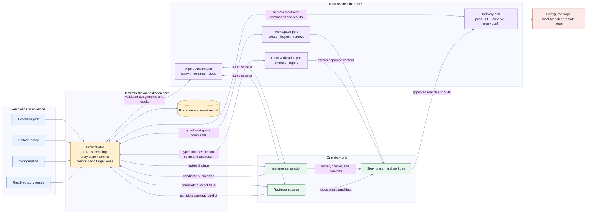

# Orchestration

This layer defines the deterministic core, its effect boundaries, and its structured interaction
with the two judgment-bearing roles. It consumes the immutable, resolved envelope defined by the
[input layer](inputs.md).

## Component model

The absence of a direct edge between implementer and reviewer is intentional. The orchestrator
owns their communication protocol and audit trail without altering their findings.

## Responsibilities

| Component                    | Owns                                                                                                                                                                                                     | Must not own                                                                                                                            |
| ---------------------------- | -------------------------------------------------------------------------------------------------------------------------------------------------------------------------------------------------------- | --------------------------------------------------------------------------------------------------------------------------------------- |
| Orchestrator                 | Input-envelope validation, deterministic route resolution, DAG eligibility, scheduling, lifecycle transitions, message validation, counters, target queue and lease, command dispatch, outcome recording | Coding, review judgment, conflict resolution, PR prose, interpreting project-specific check output, direct Git/worktree/forge mechanics |
| Agent-session interface      | Spawn, continue, identify, and close role-specific sessions using the resolved profile                                                                                                                   | Story state, routing judgment, review policy, delivery authority                                                                        |
| Workspace interface          | Create, inspect, update, and safely remove story worktrees                                                                                                                                               | Agent judgment, dependency scheduling, remote delivery                                                                                  |
| Local-verification interface | Execute the configured final local check set against an exact candidate and return a typed result                                                                                                        | Deciding which checks are required, interpreting acceptability, editing code, delivery authority                                        |
| Delivery interface           | Deterministic branch push, optional PR creation, remote-check observation, configured merge, result confirmation                                                                                         | Whether a package is acceptable, conflict resolution, weakening required checks                                                         |
| Implementer                  | Implement the story, rebase when assigned, resolve conflicts, run its assigned checks before commit, commit the checked candidate, propose delivery metadata                                             | Review its own work as sufficient, push, create a PR, merge, or clean resources                                                         |
| Reviewer                     | Assess the exact candidate, its evidence, and its delivery metadata; return approval, findings, or a block                                                                                               | Repeat implementer checks by default, edit implementation, mutate lifecycle state, push, create a PR, merge, or clean resources         |
| Run state and event record   | Immutable input basis, resolved routes, story states, counters, commands, structured handoffs, decisions, SHAs, and effect outcomes                                                                      | Independent policy or judgment                                                                                                          |

## SOLID posture

- **Single responsibility:** input resolution, scheduling, workspace effects, session management,
  implementation, review, local verification, and delivery are distinct responsibilities.
- **Open/closed:** future routing dimensions, delivery targets, hosted-review stages, specialist
  reviewers, and checkpoint strategies extend narrow boundaries rather than adding judgment to the
  orchestrator.
- **Liskov substitution:** any implementation of an effect interface must preserve the same typed
  outcomes and fail-closed invariants. A replacement cannot silently acquire decision authority.
- **Interface segregation:** agent-session, workspace, local-verification, and delivery
  capabilities remain separate; no general-purpose provider interface grants unrelated authority.
- **Dependency inversion:** the orchestration core depends on message and effect contracts, not on
  a particular agent, check command, Git implementation, or repository host.

This proposal avoids a generic plugin framework in the first phase. The boundaries are intended to
make later extraction possible without paying that complexity cost now.

## Per-story resources

Each story has exactly one active delivery unit:

- a stable story identifier;
- one frozen implementer route and one frozen reviewer route;
- one story branch;
- one isolated worktree;
- one implementer session;
- one reviewer session;
- zero or one pull request, depending on delivery policy; and
- structured candidate, review, checkpoint, verification, and delivery records.

The story branch is both the implementation branch and the delivery source. There is no separate
per-run integration branch in this proposal. Stories may implement and undergo initial review in
parallel, but they finalize serially into the run's one configured target.

## Structured agent protocol

Agent outputs are untrusted external input. The orchestrator validates them before changing state.
Free-form text may be retained as supporting detail, but it never acts as a control signal.

### Story assignment

The implementer receives at least:

- story identity, requirements, acceptance criteria, size, and complexity;
- permitted scope;
- its resolved logical and concrete execution profile;
- worktree and branch identity;
- target branch and known base SHA;
- its assigned checks and evidence requirements;
- delivery-metadata requirements;
- applicable budgets and loop counts; and
- prior reviewer findings when continuing a loop.

### Candidate submission

The implementer returns at least:

- story identity;
- exact candidate SHA;
- branch identity;
- implementation summary;
- changed paths;
- assigned-check evidence;
- confirmation that checked content did not change before commit;
- proposed pull-request title and body when delivery uses a pull request; and
- an explicit blocked result if implementation cannot continue.

Every reviewed candidate must be committed. Normal fix rounds append commits rather than rewriting
an already reviewed candidate. A target rebase may rewrite branch history under the separate
target-refresh rules.

### Review assignment and verdict

The reviewer receives:

- the story requirements and acceptance criteria;
- its resolved reviewer profile and responsibilities;
- the exact candidate submission;
- the assigned-check evidence produced by the implementer; and
- the required delivery-metadata assessment.

It returns at least:

- story identity;
- exact reviewed SHA;
- `approved`, `changes-required`, or `blocked`;
- structured findings;
- unresolved-finding count;
- assessment of required evidence; and
- assessment of the factual accuracy and completeness of delivery metadata.

A verdict is invalid if it references a different SHA. An `approved` verdict is invalid if it
contains unresolved findings. Reviewer-specific diagnostics may support the verdict but do not
replace or weaken the assigned evidence requirements.

### Approved delivery package

Approval freezes an immutable package containing:

- story and branch identity;
- approved SHA;
- implementation summary and changed paths;
- implementer check evidence;
- approved pull-request title and body when applicable;
- reviewer verdict and attribution;
- resolved role routes; and
- current review-fix and target-refresh counters.

The orchestrator may add deterministic metadata such as story identifiers and recorded effect
results. It must not invent or rewrite factual claims. Any code mutation invalidates the package
and requires another implementer check, commit, and review round.

The package then enters the [story-execution finalization flow](story-execution.md).
