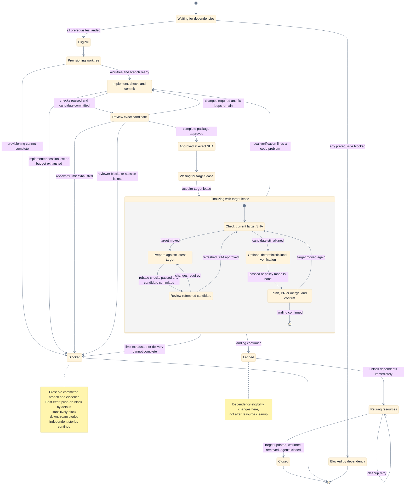

# Story execution

This layer defines scheduling and the lifecycle of one story after the
[input envelope](inputs.md) has passed preflight and the
[orchestration core](orchestration.md) has recorded its resolved routes.

## Story lifecycle

The diagram shows the logical states. A transition back from final local verification to
implementation invalidates the old approval if code changes and must return through the ordinary
implementer-check-commit-review sequence before finalization can resume.

## Eligibility and provisioning

The orchestrator computes eligibility from the plan's dependency graph and recorded landed or
blocked outcomes. When capacity is available, it dispatches workspace creation for an eligible
story and starts its implementer session in that worktree using the story's frozen route.

If an upstream story blocks, every transitive dependent becomes `blocked-by-dependency` with a
causal path to the originating block. Those downstream stories receive no worktrees or agent
sessions. Unrelated eligible stories continue.

## Scheduling and capacity

The first phase uses simple story-count concurrency rather than weighted scheduling:

- policy defines the maximum number of concurrently active stories;
- configuration declares actual available session capacity;
- the orchestrator respects the lower effective limit; and
- size and complexity influence routing, effort, and budget, but not a scheduling weight.

An implementation or initial review may proceed in parallel with work on independent stories.
Finalization is separately serialized through the target lease.

## Implementation and review rounds

For the initial candidate and after every reviewer-requested fix, the same sequence applies:

1. The implementer changes the worktree.
2. The implementer runs all checks assigned to its role.
3. If an assigned check fails, the implementer continues working and does not submit the
   candidate.
4. Once the assigned checks pass, the implementer makes no further content changes before commit.
5. The implementer commits and submits the exact candidate with its evidence.
6. The orchestrator validates the submission and assigns the exact SHA to the same reviewer.
7. The reviewer evaluates the code, requirements, evidence, and delivery metadata without
   repeating implementer checks by default.

`changes-required` findings return through the orchestrator to the same implementer. The same
reviewer assesses the next committed candidate. Reviewer-requested correction rounds increment the
review-fix counter. A successful review produces an approved delivery package.

The default maximum is five review-fix loops. Exhausting the fifth loop blocks the story with
`review-loop-limit-exceeded`, blocks all transitive dependents, preserves the branch and evidence,
and leaves independent work eligible.

The resolved implementer and reviewer routes remain fixed through all normal rounds. There is no
automatic model escalation, session replacement, or mid-story rerouting in the first phase.

## Finalization queue and lease

Approved stories enter a queue for the run's configured target. Only one story at a time may hold
the target's finalization lease. Other stories may continue implementation and initial review
while waiting, but no other orchestrated story may merge into that target during the lease.

The lease begins when a story starts final target alignment and ends when its landing is confirmed
or the story reaches a named blocked outcome. After a process interruption, the target must be read
again; an old lease is never assumed valid. Full session or run recovery remains deferred.

Waiting stories do not rebase after every preceding merge. They align once when their own
finalization turn begins. This avoids deterministic churn when several stories were developed in
parallel.

## Target alignment and refreshed review

When finalization starts, the orchestrator reads the current target SHA.

- If the approved story is already based on that SHA, it may proceed to the configured final local
  verification mode.
- If the target moved, the orchestrator asks the same implementer to rebase onto the exact target
  and resolve conflicts.
- Before committing the refreshed candidate, the implementer reruns every assigned check.
- The same reviewer reviews the complete refreshed package and approves its new exact SHA.
- Immediately before delivery, the orchestrator confirms both the approved branch SHA and target
  SHA still match the reviewed finalization basis.

A rebase rewrites branch history and invalidates the prior approval. If the branch already exists
remotely, its deterministic update uses guarded `force-with-lease` against the previously recorded
remote SHA. The implementer never performs that push.

Target movement after finalization has begun increments a separate target-refresh counter. The
initial alignment when a story reaches the front of the queue is not a retry. The default maximum
is five repeated target refreshes. Exhaustion blocks the story with
`target-refresh-limit-exceeded`; downstream blocking and preservation rules then apply normally.

Reviewer-requested fixes and target refreshes use independent counters. Target movement cannot
consume the five implementation review-fix loops merely because other work landed.

## Handoff to delivery

After the candidate remains aligned and approved, the story follows the configured final local
verification mode and the [delivery and operations flow](delivery-and-operations.md). Any later
code mutation invalidates the approved package and returns the story through implementer checks,
commit, and review.
