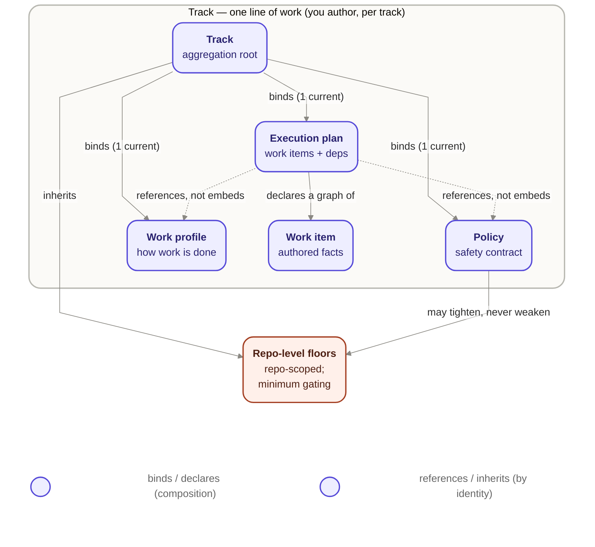

# Jig domain — Configuration & Work

This is the design-layer domain model of jig's **Configuration & Work** area: the owner-facing
entities that carry a track's inputs, and the relations that bind them. It deepens the group-A
entity spine already sketched in
[`../core/README.md`](../core/README.md#a-configuration--the-owners-inputs-per-track) —
**Track**, **Execution plan**, **Work item**, **Policy**, **Repo-level floors**, **Work
profile** — from a one-line-per-entity overview into an owns / reads / does-not-own model with
explicit Track-level relations and the lifecycle _terms_ each entity carries.

It reconciles to the product commitments in [`../../product/`](../../product/) rather than
restating them: product owns _what_ and _why_ (see
[`concepts.md`](../../product/concepts.md) and [`guarantees.md`](../../product/guarantees.md)),
this design owns _how_ these entities are shaped and where their ownership boundaries fall. It
descends from the design-layer [`charter.md`](../charter.md) and follows the numbering and voice
rules in [`conventions.md`](../conventions.md); it cites both rather than re-deriving their
rules.

## Scope and altitude

This is a **domain model at strategic altitude** (`architecture_mode: system-entity-model`,
`ddd_depth: strategic-only`, per this wave's frame at
[`../../planning/design-track/waves/wave-1-domain/frame.md`](../../planning/design-track/waves/wave-1-domain/frame.md)).
It names entities, their ownership, their relations, and the lifecycle _terms_ they carry. It
authors **no state machine or transition table** — the work-item and run lifecycles as closed
transitions are Wave 2's, owned by [`../core/orchestration.md`](../core/orchestration.md). It
authors **no field-level schema, TypeScript, or JSON Schema** — those are deferred per
[`../README.md`](../README.md#deferred), and the execution-plan contract stays a v0 shape, not a
frozen schema.

The Configuration & Work area is one of two Wave 1 domain areas. Its sibling, **Runtime &
Observation** (Run, Evidence, Notice, Run records), is authored by `w1-s2`; where the boundary
between the two areas matters, this doc points at `w1-s2` rather than reaching across it.

## Ownership altitude — jig owns the shape, the owner authors the content

The six entities below fall into two ownership layers that must not be conflated:

- **Jig's domain model owns the type, shape, and invariants** of Policy, Work profile, and
  Repo-level floors. What a Policy _is_ — a governance contract expressing gating posture, merge
  spectrum, concurrency ceiling, retry budget, required reviews, approvals, escalation, the
  anti-gaming floor, and the manual-to-assisted category dial — and its invariants (fixed at
  launch; the fixed category boundary) are defined by
  [`CFG-1`](../../product/guarantees.md#2-configuration-ownership),
  [`CFG-10`](../../product/guarantees.md#2-configuration-ownership), and
  [`GUARD-1`](../../product/guarantees.md#13-anti-gaming). What a Work profile is, and that it
  never lowers the safety floor, is defined by
  [`CFG-2`](../../product/guarantees.md#2-configuration-ownership). What Repo-level floors are,
  and the tighten-never-weaken constraint, is defined by
  [`CFG-3`](../../product/guarantees.md#2-configuration-ownership). These are first-class jig
  domain entities with jig-defined structure.
- **The owner authors each instance's content and values.** An owner writes _their_ Policy,
  _their_ Work profile, _their_ Repo-level floors — the concrete gating posture, model choice,
  and floor values for a specific track or repo — the same way an owner names a specific Track
  while jig owns what a Track is.

This distinction is why the group-A "Configuration — you author, per track" placement in
[`../core/README.md`](../core/README.md#a-configuration--the-owners-inputs-per-track) is **not**
a contradiction of this model. That placement records **authoring authority** — who fills in the
values — not **domain ownership** of the type and its invariants. The two readings are
consistent: the owner authors the instance; jig owns the shape and the invariants the instance
must satisfy. This is the disposition recorded as `D-001` in this wave's
[`decisions.md`](../../planning/design-track/waves/wave-1-domain/decisions.md).

## The entities

Each entity below states its **owns / reads / does-not-own**, deepening the corresponding
group-A row in [`../core/README.md`](../core/README.md#a-configuration--the-owners-inputs-per-track)
without re-litigating the product concepts it grounds.

### Track

The aggregation root of the "you author" configuration group: one independent line of work that
carries its own artifact chain and runs in parallel with other tracks in the same repo (see
[`concepts.md`](../../product/concepts.md#what-a-track-contains)).

- **Owns:** its own identity; the binding of exactly one current Execution plan, one Policy, and
  one Work profile to itself (which versions are in force for this track). The isolation boundary
  that keeps one track's progress from falsely gating another's
  ([`CFG-3`](../../product/guarantees.md#2-configuration-ownership)).
- **Reads:** the Repo-level floors it inherits and cannot weaken.
- **Does not own:** the internal content of its Policy / Work profile / Execution plan instances
  (jig owns their type/shape, the owner authors their content — see `D-001` above); any other
  track's configuration or isolation.

### Execution plan (the authored artifact)

Jig's one hard input per track: a set of Work items, their declared dependencies, and each item's
declared done conditions, plus provenance and version identity (see
[`../contracts/execution-plan-contract-v0.md`](../contracts/execution-plan-contract-v0.md)).
This area models the plan strictly **as the authored artifact** — the facts an owner or an
upstream planning tool commits to the plan — not the runtime act of consuming it.

- **Owns:** its own identity, provenance, and version/compatibility marker; the declared
  Work-item set and dependency graph; the declared done/evidence requirements and declared
  authority expectations, understood as **authored facts** rather than runtime evaluations of
  those facts.
- **Reads:** the Track it belongs to; the Policy and Work profile it references by identity and
  version posture (not by embedding their content —
  [`CFG-1`](../../product/guarantees.md#2-configuration-ownership),
  [`CFG-2`](../../product/guarantees.md#2-configuration-ownership),
  [`CFG-3`](../../product/guarantees.md#2-configuration-ownership)).
- **Does not own:** the **parse / validate / reject-unknown-format act** on a submitted plan
  instance — that boundary is runtime-side, named by `w1-s2` (re-projecting `CTX-001` from
  [`../notes/runtime-design-m5a.md`](../notes/runtime-design-m5a.md)) and enforced by
  [`../core/plan-intake.md`](../core/plan-intake.md); this is the disposition `D-002`. It also
  does not own whether declared evidence is _sufficient_ (Policy decides,
  [`MERGE-3`](../../product/guarantees.md#15-merge-on-evidence)), the runtime state of any Work
  item (Runtime & Observation / Wave 2), or how the plan was produced (upstream planning, optional
  per [`jig.md`](../../product/jig.md)).

### Work item (its authored facts)

The unit jig schedules, runs, and lands — jig's neutral design-layer name for what product calls
a **story** (the same unit; the naming choice is recorded in
[`../core/README.md`](../core/README.md)). By disposition `D-003`, Work item is
**one entity** spanning two lifecycle phases; this area owns only its **authored-facts** phase.

- **Owns:** its authored facts — identity, intent, its expected work boundary and any
  protected/rule-governing surfaces it declares it may touch, its dependencies-as-declared on
  other Work items, and its done-conditions-as-declared (the evidence it says it will need).
- **Reads:** the Execution plan it belongs to.
- **Does not own:** its own runtime state or outcome — `eligible`, `started`, `parked`, `done`,
  `landed`, `rejected`, `blocked` — and the state machine that drives those transitions, which
  belong to Runtime & Observation / Wave 2 as a later phase of this same entity (see
  [`../core/orchestration.md`](../core/orchestration.md)); nor whether its declared evidence was
  actually met at runtime.

**Wave 2 may later elevate the runtime facet to a distinct entity with recorded rationale, but
Wave 1 does not split it.** For this wave, there is one Work item; its authored facts live here
and its runtime state lives in Runtime & Observation, as two phases of one domain concept, not
two entities.

### Policy

The safety and governance contract for a track: gating posture, merge spectrum, concurrency
ceiling, retry budget, required reviews, approvals, escalation rules, the anti-gaming floor, and
the manual-to-assisted category dial
([`CFG-1`](../../product/guarantees.md#2-configuration-ownership),
[`CFG-10`](../../product/guarantees.md#2-configuration-ownership)). Because policy governs
safety, changing it is itself a governed action.

- **Owns:** the governance rules for its Track — jig owns the type, shape, and invariants; the
  owner authors the content (`D-001`).
- **Reads:** the Repo-level floors it must not weaken.
- **Does not own:** Work profile's concerns (cost, quality, model, behavior —
  [`CFG-2`](../../product/guarantees.md#2-configuration-ownership)); any single run's live derived
  behavior (that is computed from Policy plus the plan's eligible work, not stored on Policy, and
  is Runtime & Observation's to derive).

### Repo-level floors

A distinct, repo-scoped policy artifact every track in the repo inherits: minimum gating,
required reviews, and anti-gaming protections. Structurally the same _kind_ of thing as a track's
Policy, but scoped one level up (see
[`concepts.md`](../../product/concepts.md#what-is-track-scoped) and
[`CFG-3`](../../product/guarantees.md#2-configuration-ownership)).

- **Owns:** the repo-wide floor values; the constraint that a track's Policy may **tighten** but
  never **weaken** them, and that changing the floors is itself a governed action.
- **Reads:** nothing — it is the root of the policy-inheritance relation.
- **Does not own:** any single track's specific policy tuning above the floor.

### Work profile

The realization: model, effort, prompt strategy, and how roles are realized — _how_ work gets
done, as distinct from _whether and how safely_
([`CFG-2`](../../product/guarantees.md#2-configuration-ownership)). It is freely tunable per
track.

- **Owns:** its own realization content for its Track — jig owns the type/shape, the owner
  authors the values (`D-001`).
- **Reads:** nothing structurally required; it is independently tunable.
- **Does not own:** **any gating or safety authority whatsoever** — that is always Policy's.
  A Work profile change tunes how work is carried out but cannot lower the safety floor
  ([`CFG-2`](../../product/guarantees.md#2-configuration-ownership)). This is the one boundary this
  area must never blur.

## Relations at Track level

The Track is the aggregation root; the relations below are the composition-vs-reference structure
of the "you author" group. Two properties matter and are made explicit in the diagram: a Track
**binds** its Plan / Policy / Work profile **by reference** (one current version each, not by
embedding their content), and a Track **inherits** Repo-level floors under a one-directional
**tighten-never-weaken** constraint.

The relations in words:

- **Track binds Execution plan / Policy / Work profile** — one current version of each, **by
  reference**. A plan, a policy, and a work profile each have their own identity and version
  posture; the Track points at the version in force, it does not copy their content into itself
  ([`concepts.md`](../../product/concepts.md#what-a-track-contains); the plan-contract's Track
  Binding property).
- **Track inherits Repo-level floors**, and its **Policy may tighten but never weaken** them —
  the one-directional constraint from
  [`CFG-3`](../../product/guarantees.md#2-configuration-ownership). Changing the floors is itself
  a governed action.
- **Execution plan declares a graph of Work items** — the plan _is_ a set of Work items plus
  their declared dependencies (composition: the items are part of the authored plan).
- **Execution plan references Policy and Work profile by identity, not by embedding** — this is
  the seam that keeps a plan from carrying a mutable override that could silently weaken its own
  guardrails, preserving [`GUARD-1`](../../product/guarantees.md#13-anti-gaming).

## Lifecycle terms

Per this wave's scope, this area records lifecycle _terms only_ — the vocabulary each entity
carries — **not** transition tables. The closed transition tables for the Work-item and Run
lifecycles are Wave 2's, owned by [`../core/orchestration.md`](../core/orchestration.md).

- **Work item terms** (unchanged from
  [`concepts.md`](../../product/concepts.md#story-and-run-outcomes) and
  [`../core/README.md`](../core/README.md#the-two-lifecycles)): `eligible`, `started`, `parked`
  _(transient)_, `done`, `landed`, `rejected`, `blocked`. These are the vocabulary of the Work
  item's runtime phase, which this area does **not** own — they are named here only so the
  authored-facts phase reads against the same vocabulary. `done` and `landed` are distinct
  milestones ([`MERGE-3`](../../product/guarantees.md#15-merge-on-evidence) makes done conditions
  explicit and policy-bound; the done-vs-landed separation itself is Runtime & Observation's).
- **Policy term:** "fixed at launch"
  ([`GUARD-1`](../../product/guarantees.md#13-anti-gaming)). At this altitude Policy has no
  lifecycle of its own: it is bound once per run and held immutable for that run's duration. The
  runtime enforcement of that immutability is Runtime & Observation's; the _term_ belongs to
  Policy as a domain fact.
- **Execution plan term:** a submitted plan instance is either **accepted** or **rejected with a
  named reason** — a single boundary decision, not a multi-state lifecycle. This area owns only
  the plan _as authored artifact_; the accept/reject act itself is the plan-intake boundary owned
  by `w1-s2` (`D-002`).

## Reconciliation

This area's `reconciles_to` set — the product commitments it must not narrow, contradict, or
silently drop — is addressed entity by entity below. Each is governed at design altitude by the
[`charter.md`](../charter.md#product-reconciliation) boundary rule; this table records how this
domain model specifically honors each.

| ID          | Commitment (product owns the wording)                                                                                                      | How this model honors it                                                                                                                                                                         |
| ----------- | ------------------------------------------------------------------------------------------------------------------------------------------ | ------------------------------------------------------------------------------------------------------------------------------------------------------------------------------------------------ |
| **CFG-1**   | [Policy is the governance contract; changing it is itself governed.](../../product/guarantees.md#2-configuration-ownership)                | Policy is modeled as the sole owner of the governance rules for its Track; no other entity in this area is given gating authority. Jig owns its shape/invariants; the owner authors the content. |
| **CFG-2**   | [Work profile is the realization; freely tunable; never lowers the safety floor.](../../product/guarantees.md#2-configuration-ownership)   | Work profile's "does not own" explicitly denies it any gating or safety authority; that authority is always Policy's. This is stated as the one boundary the area must never blur.               |
| **CFG-3**   | [Configuration is per track; repo-level floors a track can tighten but not weaken.](../../product/guarantees.md#2-configuration-ownership) | Track owns per-track binding and isolation; Repo-level floors is a distinct entity related to Policy by a one-directional tighten-never-weaken constraint (diagram + relations).                 |
| **CFG-10**  | [The manual-to-assisted dial; the category boundary is fixed.](../../product/guarantees.md#2-configuration-ownership)                      | The manual-to-assisted category dial is named as part of Policy's owned shape; this area does not relocate the fixed category boundary onto any other entity.                                    |
| **GUARD-1** | [The policy in force is fixed when the run launches.](../../product/guarantees.md#13-anti-gaming)                                          | Carried as Policy's "fixed at launch" lifecycle term; reinforced by the plan's reference-not-embed relation, which prevents a plan from carrying a mutable policy override.                      |
| **MERGE-3** | [Done conditions are explicit and policy-bound.](../../product/guarantees.md#15-merge-on-evidence)                                         | Work item's authored facts include its done-conditions-as-declared; whether that evidence is _sufficient_ is explicitly left to Policy, not decided in this area.                                |

No conflict with product was found; this model refines the group-A spine without contradicting
any of the six commitments above.

## Open questions

None from this session. (Stated explicitly per [`conventions.md`](../conventions.md#5-open-questions-ledger-convention-no-new-id-kind-carry-forward-through-the-existing-decision-log-mechanism).)

## Invariants

This session adds **no new `INV-*` entry**. It names entities, ownership, and relations — not new
runtime rules — so no new invariant is warranted. The `INV-*` ledger continues verbatim from
[`../notes/runtime-design-m5a.md`](../notes/runtime-design-m5a.md) (`INV-001` through `INV-018`)
with no renumbering, per [`conventions.md`](../conventions.md#1-the-inv--invariant-ledger-continues-as-one-running-list);
the next available number, should a later wave add one, is **`INV-019`**.

Two existing invariants bound entities this area names, and this model stays consistent with them
without owning their runtime enforcement:

- **`INV-003`** (policy fixed at launch) — carried here as Policy's "fixed at launch" lifecycle
  term; the runtime binding and immutability enforcement remain Runtime & Observation's.
- **`INV-007`** (reject unknown plan formats) — grounds the Execution plan's version/compatibility
  marker as an authored fact; the reject act itself is the plan-intake boundary owned by `w1-s2`.

## Risks and deferred decisions

- **Deferred — Work item's runtime facet.** By `D-003`, Work item is one entity with two phases;
  its runtime state lives in Runtime & Observation. Wave 2 may later elevate that facet to a
  distinct entity, but only with recorded rationale; until then, treating the two phases as one
  entity is a deliberate choice, not an oversight.
- **Deferred — plan-intake boundary placement.** By `D-002`, the parse/validate/reject act is
  runtime-side (continuing `CTX-001`), not owned here. If a later wave finds the authored/validated
  seam needs re-homing, that is its decision to record, not this area's to pre-empt.
- **Deferred — field-level schema.** The execution-plan contract stays a v0 shape; this area
  models the plan's authored _properties_, not field names, per
  [`../README.md`](../README.md#deferred). Minting field names from the v0 contract is explicitly
  out of scope.
- **Risk — ownership-altitude drift.** The `D-001` distinction (jig owns shape; owner authors
  content) is subtle and could be misread over time as either "jig authors the owner's policy" or
  "these entities aren't jig's domain at all." Mitigation: the distinction is stated once,
  explicitly, in "Ownership altitude" above and cited from each affected entity, so a future
  editor sees it rather than re-deriving it.

## Review evidence

This domain model is authored for a full-weight `review-technical-design` pass against three
lenses (architecture-enforceability, domain-correctness, agreement-integrity). The review report
and its suggestion dispositions are recorded in this wave's
[`decisions.md`](../../planning/design-track/waves/wave-1-domain/decisions.md); this section is
the pointer to that evidence once the review runs. Settled = zero open blocking suggestions.

## Related

- [`../core/README.md`](../core/README.md) — the group-A entity spine this doc deepens, and the
  source of the story/work-item naming choice.
- [`../charter.md`](../charter.md) and [`../conventions.md`](../conventions.md) — the design-layer
  goal/boundary/stub/deliverable rules and the numbering/voice conventions this doc follows.
- [`../../product/concepts.md`](../../product/concepts.md) and
  [`../../product/guarantees.md`](../../product/guarantees.md) — the Track model and the CFG / GUARD /
  MERGE commitments this doc reconciles to.
- [`../contracts/execution-plan-contract-v0.md`](../contracts/execution-plan-contract-v0.md) — the
  v0 shape whose authored properties this doc models as the Execution plan entity (unfrozen).
- [`../notes/runtime-design-m5a.md`](../notes/runtime-design-m5a.md) — the continuing `INV-*` /
  `CTX-*` vocabulary.
- `w1-s2` (Runtime & Observation) — the sibling Wave 1 area that owns Run, Evidence, Notice, Run
  records, and the plan-intake validation boundary this doc points at.
