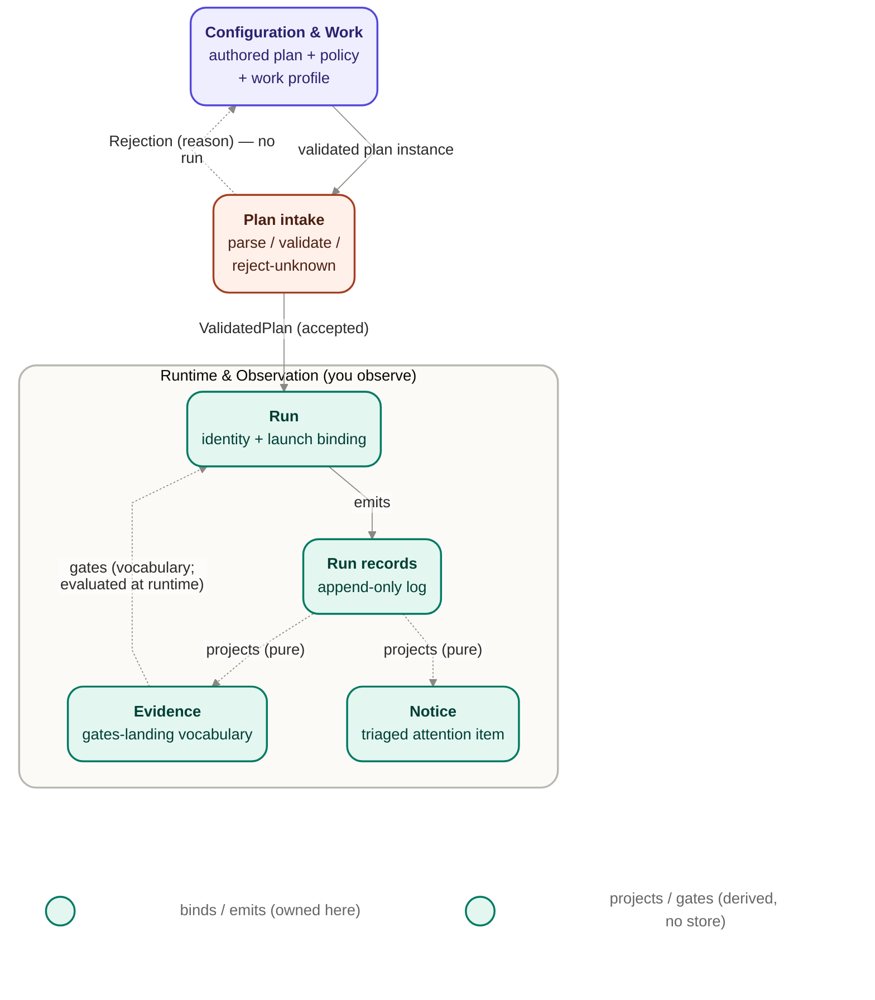

# Jig domain — Runtime & Observation

This is the design-layer domain model of jig's **Runtime & Observation** area: the run artifacts
an owner observes — **Run**, **Evidence**, **Notice** — and the **Run records** event-log
evidence model they all derive from, plus the **plan-intake validation boundary** where an
authored plan enters the runtime. It deepens the group-D "what you observe" entities and the
group-B **Run records** entity already sketched in
[`../core/README.md`](../core/README.md#d-what-you-observe-run-artifacts) — from a
one-line-per-entity overview into an owns / reads / does-not-own model with explicit relations,
the seam from Configuration & Work, and the lifecycle _terms_ each entity carries.

It reconciles to the product commitments in [`../../product/`](../../product/) rather than
restating them: product owns _what_ and _why_ (see
[`guarantees.md`](../../product/guarantees.md) and
[`concepts.md`](../../product/concepts.md)), this design owns _how_ these entities are shaped and
where their ownership boundaries fall. It descends from the design-layer
[`charter.md`](../charter.md) and follows the numbering and voice rules in
[`conventions.md`](../conventions.md); it cites both rather than re-deriving their rules.

Runtime & Observation's sibling area is **Configuration & Work** (Track, Execution plan, Work
item, Policy, Repo-level floors, Work profile), authored in
[`configuration-and-work.md`](./configuration-and-work.md). The two areas meet at one seam — the
validated plan plus the bound policy and work profile crossing from Configuration & Work into the
runtime — named in [its own section below](#the-configuration--work--runtime--observation-seam),
consistently with that document's side of it.

## Scope and altitude

This is a **domain model at strategic altitude**: it names entities, their ownership, their
relations, the seam it sits against, and the lifecycle _terms_ they carry. It authors **no state
machine or transition table** — the run and work-item lifecycles as closed transitions are owned
by [`../core/orchestration.md`](../core/orchestration.md). It authors **no field-level schema,
TypeScript, or JSON Schema** — those are deferred per [`../README.md`](../README.md#status--whats-ready-whats-wip),
and the observability-records contract stays a v0 shape, not a frozen schema
([`../contracts/observability-records-contract-v0.md`](../contracts/observability-records-contract-v0.md#v0-not-frozen-schema)).

## Evidence and Notice are record-derived, not independent stores

Two of this area's four entities — **Evidence** and **Notice** — carry **no store of their own**.
This is the load-bearing framing for the whole area, stated once here and cited from each affected
entity below.

- **Run records is the single source of current state.** State, summary, metrics, notices, and the
  evidence an owner inspects are all **pure projections** of one append-only log, never authored
  directly ([`INV-006`](../notes/runtime-design-m5a.md), [`SEE-3`](../../product/guarantees.md#5-full-observability)).
  There is no separate narrative of what happened that can drift from the run.
- **Evidence is vocabulary over that log.** Evidence names _what gates landing_ — automated checks,
  review, and capability proof, never the worker's self-report alone
  ([`MERGE-1`](../../product/guarantees.md#15-merge-on-evidence),
  [`MERGE-3`](../../product/guarantees.md#15-merge-on-evidence)). The categories are the entity;
  the observations themselves live in the log as recorded events, not in a parallel evidence store.
- **Notice is a projection of that log.** A notice is a query/view over events that meet an
  attention-worthy condition ([`SEE-5`](../../product/guarantees.md#5-full-observability)), the same
  log an owner reads when they "inspect" or "ask why" (`records.md`'s diagram routes `log --> notices`
  the same way it routes `log --> project`). It is a triaged queue, not a second store.

The rule this section enforces: **neither Evidence nor Notice may acquire a second, competing
notion of "current state."** If either grew its own store, it could drift from the log the runner
actually decided from, breaking [`INV-006`](../notes/runtime-design-m5a.md) and
[`SEE-3`](../../product/guarantees.md#5-full-observability). Records stays the sole owner of
persistence; Evidence and Notice are how that one log is _read_, not additional places state is
_kept_.

## The entities

Each entity below states its **owns / reads / does-not-own**, deepening the corresponding group-D
(and group-B, for Run records) row in
[`../core/README.md`](../core/README.md#d-what-you-observe-run-artifacts) without re-litigating the
product concepts it grounds.

### Run

One operator-initiated execution of an Execution plan under a Policy bound at launch —
reconstructible end to end (see [`jig.md`](../../product/jig.md)). The Run is the anchor every
record hangs off: it is the thing that has an identity, an input binding, and a lifecycle, and it
is the observable unit an owner previews, starts, stops, resumes, and completes.

- **Owns:** its own run identity and attempt identity; the **launch-time binding** of the exact
  plan, policy, work-profile, and repo-floor references that were in force when it started
  ([`OBS-001`](../notes/runtime-design-m5a.md); the contract's
  [Run Identity and Input Binding](../contracts/observability-records-contract-v0.md#run-identity-and-input-binding)
  property). This binding is **fixed for the run's duration** — the policy posture bound at launch
  is immutable for that run ([`GUARD-1`](../../product/guarantees.md#13-anti-gaming),
  [`INV-003`](../notes/runtime-design-m5a.md)) — so that a run can never silently weaken its own
  guardrails mid-flight, and so a resume can reject an incompatible attempt by comparing against
  what was bound.
- **Reads:** the `ValidatedPlan` and the bound Policy / Work profile / Repo-level floors it was
  launched with — produced and referenced by Configuration & Work, handed across the seam named
  below.
- **Does not own:** the **work-item and run state machines** and eligibility/DAG resolution — those
  are owned by [`../core/orchestration.md`](../core/orchestration.md); the Run carries the
  lifecycle _terms_ (below) but not the transitions between them. It also does not own the
  **content** of the Policy or Work profile it binds (that is Configuration & Work's — jig owns
  their shape, the owner authors their values, per
  [`D-001`](../../planning/design-track/waves/wave-1-domain/decisions.md)), nor a run's live
  _derived_ behavior, which is computed from Policy plus the plan's eligible work rather than stored
  on any Configuration entity ([`CFG-4`](../../product/guarantees.md#2-configuration-ownership)).

### Evidence

The vocabulary for **what gates landing**: automated checks, review, and capability proof — never
the worker's self-report alone ([`MERGE-1`](../../product/guarantees.md#15-merge-on-evidence),
[`MERGE-3`](../../product/guarantees.md#15-merge-on-evidence)). Evidence is a **conceptual entity
for the ubiquitous language**, backed entirely by the Records log; see
[Evidence and Notice are record-derived](#evidence-and-notice-are-record-derived-not-independent-stores)
above.

- **Owns:** the evidence **categories** and their meaning — automated-check, review, and
  capability-proof — as ubiquitous language, and the principle that these are _independent_ of the
  worker's own claim of doneness ([`MERGE-1`](../../product/guarantees.md#15-merge-on-evidence)).
- **Reads:** the Records log, where evidence is actually observed and recorded (the contract's
  [Gates and Evidence](../contracts/observability-records-contract-v0.md#gates-and-evidence)
  property; the `evidence.observed` / `evidence.modeled` event families,
  [`OBS-002`](../notes/runtime-design-m5a.md)).
- **Does not own:** **persistence** — Records owns the log, and there is no parallel evidence store
  that could drift from it ([`SEE-3`](../../product/guarantees.md#5-full-observability),
  [`INV-006`](../notes/runtime-design-m5a.md)); and **whether declared evidence is _sufficient_** to
  gate a landing — that is a policy-bound gate decision the runner makes at runtime
  ([`MERGE-3`](../../product/guarantees.md#15-merge-on-evidence)), evaluated by the orchestration
  behavioral contexts, not decided in this area.

### Notice

A triaged **attention item** per parked, blocked, stale, or overdue condition: what it is, how
urgent it is, and what the owner can do about it right now
([`SEE-5`](../../product/guarantees.md#5-full-observability)). A notice is a **named projection**,
not a separate store; see
[Evidence and Notice are record-derived](#evidence-and-notice-are-record-derived-not-independent-stores)
above.

- **Owns:** the notice **shape as a projection contract** — the attention item's urgency and the
  owner action available on it, and the acknowledged / snoozed posture when an owner handles it
  (the contract's
  [Blocks, Stops, and Notices](../contracts/observability-records-contract-v0.md#blocks-stops-and-notices)
  property). It is how attention becomes _a queue of decisions_, not a transcript to read
  ([`SEE-5`](../../product/guarantees.md#5-full-observability)).
- **Reads:** the Records log — the same source an owner reads to "inspect" or "ask why" (`records.md`
  routes `log --> notices` alongside `log --> project` and `log --> inspect`).
- **Does not own:** **persistence** (Records owns the log); and the **decision itself** — a notice
  surfaces that an owner decision is needed and offers the available action, but the doorbell
  escalation behavior and the resulting state transition are owned by orchestration, not this
  area's (the notice is escalation's visible trace, not its mechanism).

### Run records

The append-only, ordered, redaction-aware **evidence log** — the durable records that _are_ the
evidence itself ([`SEE-1`](../../product/guarantees.md#5-full-observability)..[`SEE-6`](../../product/guarantees.md#5-full-observability)).
State, summary, metrics, and notices are pure projections replayed from it, never hand-maintained
separately ([`INV-006`](../notes/runtime-design-m5a.md)). This entity deepens the group-B
Run-records row in [`../core/README.md`](../core/README.md#b-jig-core--the-trusted-runner-governs-the-seams)
and the [`../core/records.md`](../core/records.md) stub; it is the durable-output side of the
observability-records seam.

- **Owns:** the log itself; the **single-leased-writer** discipline (one writer per run,
  append-only, no mutation or deletion); the **pure projections** — state, summary, metrics,
  notices — replayed from the log ([`INV-006`](../notes/runtime-design-m5a.md)); the
  **redaction-posture** recorded per record ([`OBS-003`](../notes/runtime-design-m5a.md)); and
  **export** — a write-once, redacted artifact a finished run produces
  ([`SEE-6`](../../product/guarantees.md#5-full-observability)). It also owns the record properties
  the contract requires — run identity and input binding
  ([`OBS-001`](../notes/runtime-design-m5a.md)), the governed event families
  ([`OBS-002`](../notes/runtime-design-m5a.md)), and the golden run-record shape those properties
  compose into ([`OBS-004`](../notes/runtime-design-m5a.md)).
- **Reads:** the events emitted by Orchestration and Fence — read here only as **event sources**,
  not modeled in entity depth in this document (`records.md`'s diagram: `events --> log`).
- **Does not own:** **interpreting what the events mean for future planning** — that is the Learning
  loop, an explicitly between-runs, out-of-hot-path consumer per
  [`jig.md`](../../product/jig.md#product-boundaries) and the contract's
  [Learning-Loop Consumption](../contracts/observability-records-contract-v0.md#learning-loop-consumption)
  property; and the **storage engine choice** and retention richness, deferred per
  [`../core/records.md`](../core/records.md#notes).

### Plan intake — the validation boundary (continuing CTX-001)

Plan intake is the boundary where a submitted, owner-authored plan instance **enters the runtime**:
it parses the instance, validates it against the execution-plan contract, and **rejects unknown or
incompatible formats with a reason** rather than guessing at intent — guaranteeing that no run is
ever created from an invalid or rejected plan
([`INV-007`](../notes/runtime-design-m5a.md)). This is a **runtime-side** concern, per disposition
[`D-002`](../../planning/design-track/waves/wave-1-domain/decisions.md): the authored plan is
Configuration & Work's (its shape, its track binding — that document's Execution plan entity),
but the **act** of parsing, validating, and rejecting it belongs here.

This area continues and cites the context first named as `CTX-001` (Plan Intake & Validation) in
[`../notes/runtime-design-m5a.md`](../notes/runtime-design-m5a.md), expressed here in this area's
own words and grounded in the [`../core/plan-intake.md`](../core/plan-intake.md) stub that carries
its owns / reads / does-not-own in detail. This continuation does not supersede or re-home
`CTX-001`; it routes and cites that context rather than changing it, per the `STOP-003` discipline
(a v0 contract or prior context is routed and cited, never silently changed).

- **Owns:** the parse / validate / reject-unknown-format **act** on a submitted plan instance and
  the named reasons a rejection carries ([`INV-007`](../notes/runtime-design-m5a.md));
  the guarantee that no run is created from an invalid or rejected plan.
- **Reads:** the plan instance; the execution-plan contract shape it validates against
  ([`../contracts/execution-plan-contract-v0.md`](../contracts/execution-plan-contract-v0.md)).
- **Does not own:** **how the plan was produced** or its authored shape (owned by Configuration &
  Work's Execution plan entity); **policy semantics**; and anything about the plan once it becomes
  a `ValidatedPlan` consumed by Orchestration. Validation happens **once, at the boundary**;
  nothing downstream re-validates plan shape.

This subsection is the **runtime side of a two-sided boundary**: Configuration & Work's Execution
plan entity states that it "does not own the parse / validate / reject-unknown-format act …that
boundary is runtime-side, named here." This is that named boundary; the two documents close the
loop from both directions without either owning the other's half.

## Relations

The Run is the runtime anchor; Run records is the log everything projects from. The relations below
are the reference-and-projection structure of the Runtime & Observation group and the one edge that
crosses in from Configuration & Work.

The relations in words:

- **Configuration & Work hands a plan instance to Plan intake**, which **validates** it against the
  execution-plan contract. On acceptance it produces a `ValidatedPlan`; on an unknown or
  incompatible format it produces a **rejection with a reason** and **no run is created**
  ([`INV-007`](../notes/runtime-design-m5a.md)).
- **Run is bound, at launch, to** the `ValidatedPlan` plus the Policy, Work profile, and Repo-level
  floors in force — **fixed for the run's duration**
  ([`GUARD-1`](../../product/guarantees.md#13-anti-gaming),
  [`INV-003`](../notes/runtime-design-m5a.md)).
- **Run emits Run records** — every phase and transition writes an event to the append-only log
  (`records.md`'s `events --> log`).
- **Run records is read, as a pure projection, by Evidence, Notice, and the state / summary /
  metrics views** ([`INV-006`](../notes/runtime-design-m5a.md); `records.md`'s `log --> project`,
  `log --> notices`). Evidence and Notice are how the one log is read, not additional stores.
- **Evidence gates a Work item's done / landed transitions** — as _vocabulary_ named here; the gate
  is actually evaluated by Orchestration/Fence at runtime, on the independent evidence in the log,
  not the worker's self-report
  ([`MERGE-1`](../../product/guarantees.md#15-merge-on-evidence),
  [`MERGE-3`](../../product/guarantees.md#15-merge-on-evidence)).

## The Configuration & Work → Runtime & Observation seam

The two areas meet at exactly one seam: the **handoff of the validated plan plus the bound policy
and work profile** from Configuration & Work into the runtime. Concretely, this seam has two
named, ordered parts:

1. **The plan-intake validation boundary** — where an owner-authored plan instance becomes a
   `ValidatedPlan` (or a reason-bearing rejection). Reject-unknown-format is enforced here, once, at
   the boundary; nothing downstream re-validates plan shape
   ([`INV-007`](../notes/runtime-design-m5a.md)). This is the boundary named in
   [Plan intake](#plan-intake--the-validation-boundary-continuing-ctx-001) above, continuing
   `CTX-001`.
2. **The launch-time binding** — where the `ValidatedPlan` plus the Policy, Work profile, and
   Repo-level floors that govern the track are **bound to a Run** and held immutable for its duration
   ([`GUARD-1`](../../product/guarantees.md#13-anti-gaming),
   [`INV-003`](../notes/runtime-design-m5a.md)).

This is stated consistently with Configuration & Work's side of the seam. That document's
Execution plan entity references the Policy and Work profile it binds by identity and version
posture rather than by embedding their content, and explicitly does not own the parse / validate /
reject-unknown-format act. This area picks up exactly there: the runtime **reads** those references
across the seam, **validates** the plan at the intake boundary, and **binds** the result to a Run.
Neither side owns the other's half; the seam is the single crossing point, and the
reference-not-embed posture on the Configuration side is what keeps the run from carrying a
mutable override that could weaken its own guardrails
([`GUARD-1`](../../product/guarantees.md#13-anti-gaming)).

## Work item — the runtime-observed facts (the same entity as Configuration & Work's, D-003)

A Run observes **Work items** moving through the runtime. Per disposition
[`D-003`](../../planning/design-track/waves/wave-1-domain/decisions.md), **Work item is one entity
spanning two lifecycle phases** — it is **not** split into two entities.
[`configuration-and-work.md`](./configuration-and-work.md) owns the authored-facts phase (identity,
dependencies-as-declared, done-conditions-as-declared); this area names the **runtime-observed
facts** of that _same_ entity: its runtime state and outcome (`eligible`, `started`, `parked`,
`done`, `landed`, `rejected`, `blocked`) and whether its declared evidence was actually met.

This area **names** those runtime-observed facts as observation vocabulary; it does **not** own the
state machine that drives the transitions ([`../core/orchestration.md`](../core/orchestration.md)),
and it does **not** create a separate "work-item run" entity.
[`configuration-and-work.md`](./configuration-and-work.md) records the matching statement from its
side: a later design pass **may** elevate the runtime facet to a distinct entity with recorded
rationale, but this model does not split it. Both documents hold that line — one Work item, two
phases, observed here and authored there.

## Lifecycle terms

This area records lifecycle _terms only_ — the vocabulary each entity carries — **not** transition
tables. The closed transition tables for the Run and Work-item lifecycles are owned by
[`../core/orchestration.md`](../core/orchestration.md).

- **Run terms** (unchanged from
  [`../core/README.md`](../core/README.md#the-two-lifecycles) and
  [`../core/orchestration.md`](../core/orchestration.md)): `previewed`, `started`, `stopped`,
  `resumed`, `completed`. `stopped` is **run-level, not a work-item outcome**: a stop pauses the
  whole run, while work items that had not reached a terminal outcome stay where they were and
  resume from their last safe checkpoint. These are named here as the terms the Run entity carries;
  the transitions among them are owned by `orchestration.md`.
- **Plan-instance terms** (at the intake boundary): a submitted plan instance is either **accepted**
  (becoming a `ValidatedPlan`) or **rejected with a named reason**
  ([`INV-007`](../notes/runtime-design-m5a.md)). This is a single **boundary decision**, not a
  multi-state lifecycle — the plan does not carry an ongoing runtime lifecycle of its own.
- **Work-item terms** (observed here; the same vocabulary Configuration & Work names from the
  authored side): `eligible`, `started`, `parked` _(transient)_, `done`, `landed`, `rejected`,
  `blocked`. `done` and `landed` are **distinct milestones** — a work item can be done (evidence
  met) without being landed (merged) ([`INV-004`](../notes/runtime-design-m5a.md),
  [`MERGE-4`](../../product/guarantees.md#15-merge-on-evidence)). These are named as the observed
  runtime phase's vocabulary; the transition table is owned by `orchestration.md`.

## Reconciliation

This area's `reconciles_to` set — the product commitments and continuing invariants it must not
narrow, contradict, or silently drop — is addressed ID by ID below. Each is governed at design
altitude by the [`charter.md`](../charter.md#product-reconciliation) boundary rule; this table
records how this domain model specifically honors each. All eighteen IDs from this area's brief are
enumerated.

| ID          | Commitment (product / prior design owns the wording)                                                                                                                | How this model honors it                                                                                                                                                                                  |
| ----------- | ------------------------------------------------------------------------------------------------------------------------------------------------------------------- | --------------------------------------------------------------------------------------------------------------------------------------------------------------------------------------------------------- |
| **SEE-1**   | [Full run visibility — reconstruct what happened and why.](../../product/guarantees.md#5-full-observability)                                                        | Run records owns the append-only log every decision writes to, and Run owns the launch-time binding; together they make a run reconstructible end to end.                                                 |
| **SEE-2**   | [Structured and machine-readable by design.](../../product/guarantees.md#5-full-observability)                                                                      | Run records is modeled as governed event families and pure projections (`OBS-002`), a structured product surface, not free-form transcript.                                                               |
| **SEE-3**   | [The records are the evidence; no separate story that can drift.](../../product/guarantees.md#5-full-observability)                                                 | The dedicated "record-derived" section makes Records the sole source of state; Evidence and Notice are reads over that one log, denied any parallel store (`INV-006`).                                    |
| **SEE-4**   | [Self-diagnosis, no extra tooling required.](../../product/guarantees.md#5-full-observability)                                                                      | Run records owns the same log an owner inspects to diagnose a bad plan or policy; Learning-loop interpretation is explicitly not required for visibility and is left out of the hot path.                 |
| **SEE-5**   | [Attention is a triaged queue, not a log.](../../product/guarantees.md#5-full-observability)                                                                        | Notice is modeled as a projection carrying urgency and owner-action — a queue of decisions — not a second store and not a transcript.                                                                     |
| **SEE-6**   | [Take the record with you — write-once, redacted export.](../../product/guarantees.md#5-full-observability)                                                         | Run records owns export as a write-once, redacted artifact a finished run produces.                                                                                                                       |
| **INV-003** | [Policy fixed at launch (GUARD-1).](../notes/runtime-design-m5a.md)                                                                                                 | Carried as the Run's launch-time binding being fixed for the run's duration; this area observes and binds the immutable policy, and states that a run cannot weaken its own guardrails mid-flight.        |
| **INV-004** | [Done is not landed (MERGE-4).](../notes/runtime-design-m5a.md)                                                                                                     | Named in the Work-item terms and the done/landed distinction; `done` (evidence met) is kept separate from `landed` (merged) as distinct milestones the records keep apart.                                |
| **INV-006** | [Records are the evidence; state/summary are pure projections, never authored directly.](../notes/runtime-design-m5a.md)                                            | The load-bearing invariant of the "record-derived" section: Evidence, Notice, state, summary, metrics are all pure projections of one append-only log; none carries its own store.                        |
| **INV-007** | [Reject unknown plan formats — rejected, not guessed.](../notes/runtime-design-m5a.md)                                                                              | The Plan intake boundary owns the parse/validate/reject-unknown act with named reasons and the "no run on rejection" guarantee, continuing `CTX-001`.                                                     |
| **MERGE-1** | [Landing requires independent evidence aligned to policy.](../../product/guarantees.md#15-merge-on-evidence)                                                        | Evidence is modeled as the vocabulary for the _independent_ gates (automated-check / review / capability-proof), explicitly never the worker's self-report alone.                                         |
| **MERGE-3** | [Done conditions are explicit and policy-bound.](../../product/guarantees.md#15-merge-on-evidence)                                                                  | Evidence's "does not own" leaves _whether declared evidence is sufficient_ to a policy-bound gate decision at runtime, not to this area; the categories are vocabulary, the sufficiency call is Policy's. |
| **MERGE-4** | [Done and merged are separate milestones.](../../product/guarantees.md#15-merge-on-evidence)                                                                        | Carried in the Work-item terms (with `INV-004`): `done` and `landed` are distinct, and Run records keeps them distinct even when a forge constraint holds a done item.                                    |
| **OBS-001** | [Run identity + input binding.](../notes/runtime-design-m5a.md)                                                                                                     | Modeled as Run's owned identity/attempt identity and launch-time binding of plan/policy/work-profile/repo-floor references.                                                                               |
| **OBS-002** | [Event families the runtime emits.](../notes/runtime-design-m5a.md)                                                                                                 | Named as what Run records reads from Orchestration/Fence and projects from; Evidence's observed/modeled families and Notice's attention families are cited as record content, not restated as a schema.   |
| **OBS-003** | [Each record carries a redaction-posture field.](../notes/runtime-design-m5a.md)                                                                                    | Run records owns the per-record redaction posture; real secret scanning stays deferred, the field exists so it can be populated later without a schema break.                                             |
| **OBS-004** | [A golden run-record shape is the canonical output artifact.](../notes/runtime-design-m5a.md)                                                                       | Run records owns the record properties (`OBS-001`..`OBS-003`) those compose into the golden run-record shape; this area names the shape's ownership without minting field names (contract stays v0).      |
| **CTX-001** | [Plan Intake & Validation — parse/validate/reject-unknown; reads the plan contract; does not own how plans are produced or policy.](../notes/runtime-design-m5a.md) | Continued and cited in this area's own words in the Plan intake section (`STOP-003`); this area extends that context rather than replacing it.                                                            |

No conflict with product or with the continuing design vocabulary was found; this model deepens the
group-D spine and the Run-records entity without contradicting any of the eighteen IDs above.

## Open questions

None. (Per
[`conventions.md`](../conventions.md#5-open-questions-ledger-convention-no-new-id-kind-carry-forward-through-the-existing-decision-log-mechanism).)

## Invariants

This document adds **no new `INV-*` entry**. It names entities, ownership, relations, and a seam —
not new runtime rules — so no new invariant is warranted. The `INV-*` ledger continues verbatim from
[`../notes/runtime-design-m5a.md`](../notes/runtime-design-m5a.md) (`INV-001` through `INV-018`) with
no renumbering, per [`conventions.md`](../conventions.md#1-the-inv--invariant-ledger-continues-as-one-running-list);
the next available number, should a later addition need one, is **`INV-019`**.

Four existing invariants bound entities this area names, and this model stays consistent with them
without owning their runtime enforcement:

- **`INV-003`** (policy fixed at launch) — carried as the Run's launch-time binding being fixed for
  the run's duration; the runtime enforcement of that immutability is owned by `orchestration.md`.
- **`INV-004`** (done is not landed) — carried in the Work-item terms and the done/landed
  distinction; the transitions themselves are owned by `orchestration.md`.
- **`INV-006`** (records are the evidence; projections never authored directly) — the load-bearing
  invariant that keeps Evidence and Notice record-derived; this area preserves it by denying either a
  separate store, but the reducer/projection enforcement mechanics are Records' and
  `orchestration.md`'s.
- **`INV-007`** (reject unknown plan formats) — the invariant the plan-intake boundary this area
  names enforces; the boundary is named and cited here (continuing `CTX-001`), its internal
  mechanics stay in [`../core/plan-intake.md`](../core/plan-intake.md).

## Risks and deferred decisions

- **Deferred — Work item's runtime facet as a possible future entity.** By
  [`D-003`](../../planning/design-track/waves/wave-1-domain/decisions.md), Work item is one entity
  with two phases; this area observes its runtime facet as the same entity
  [`configuration-and-work.md`](./configuration-and-work.md) authors. A later design pass may
  elevate that facet to a distinct entity, but only with recorded rationale; until then, treating
  the two phases as one entity is a deliberate choice, not an oversight. (This is the runtime-side
  statement of the same deferred item recorded from the authored side.)
- **Deferred — plan-intake boundary placement.** By
  [`D-002`](../../planning/design-track/waves/wave-1-domain/decisions.md), the parse/validate/reject
  act is runtime-side, continuing `CTX-001`; this area names and cites it, it does not re-home it. If
  a later design pass finds the authored/validated seam needs re-placing, that is its decision to
  record and route (`STOP-003`), not this area's to pre-empt.
- **Deferred — field-level schema.** The observability-records contract stays a v0 shape; this area
  models the records' _properties_ and _ownership_, not field names or event-type strings, per
  [`../README.md`](../README.md#status--whats-ready-whats-wip) and the contract's own
  [v0-not-frozen posture](../contracts/observability-records-contract-v0.md#v0-not-frozen-schema).
  Minting field names from the v0 contract is explicitly out of scope.
- **Deferred — Learning-loop interpretation and storage engine.** Interpreting records for future
  planning is a between-runs consumer per [`jig.md`](../../product/jig.md#product-boundaries), and
  the storage engine / retention richness is deferred per
  [`../core/records.md`](../core/records.md#notes); neither is decided here.
- **Risk — "Run records" (entity) vs. "Records" (file) naming.** This area names the entity
  **Run records** (matching the group-D / group-B rows in
  [`../core/README.md`](../core/README.md)), while the file that carries its stub is titled
  **"Records — the event-log engine"** ([`../core/records.md`](../core/records.md)). These are the
  same concept under two labels — the domain entity and the file that deepens it — not two
  entities. Mitigation: this note states the equivalence once, explicitly.

## Related

- [`../core/README.md`](../core/README.md) — the group-D "what you observe" spine (Run, Evidence,
  Notice) and the group-B Run-records entity this doc deepens.
- [`../core/records.md`](../core/records.md) — the event-log stub whose entity this doc models as
  Run records; [`../core/orchestration.md`](../core/orchestration.md) — the Run/Work-item lifecycle
  transition tables whose _terms_ this doc names; [`../core/plan-intake.md`](../core/plan-intake.md)
  — the parse/validate/reject boundary this doc names and cites.
- [`../charter.md`](../charter.md) and [`../conventions.md`](../conventions.md) — the design-layer
  goal/boundary/stub/deliverable rules and the numbering/voice conventions this doc follows.
- [`../../product/guarantees.md`](../../product/guarantees.md) and
  [`../../product/concepts.md`](../../product/concepts.md) — the SEE / MERGE commitments and the
  run/story model this doc reconciles to.
- [`../contracts/observability-records-contract-v0.md`](../contracts/observability-records-contract-v0.md)
  — the v0 record-properties shape this doc models as the Run-records entity (unfrozen).
- [`../notes/runtime-design-m5a.md`](../notes/runtime-design-m5a.md) — the continuing `INV-*` ledger
  and the `CTX-001` / `OBS-*` vocabulary this doc continues.
- [`configuration-and-work.md`](./configuration-and-work.md) — the sibling area that authors the
  Track, Execution plan, Work item (authored facts), Policy, Repo-level floors, and Work profile
  this area reads across the seam.
