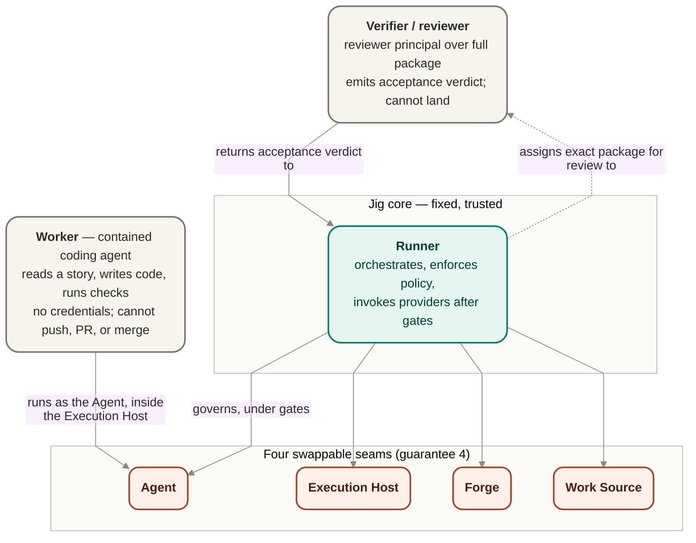
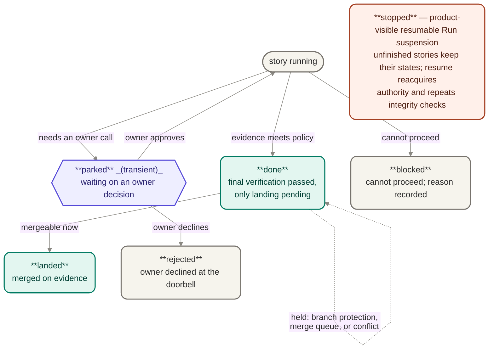

# Tracks — parallel independent work

A **track** is one independent line of work — from product definition through execution —
that runs on its own, in parallel with other tracks in the same repo.

## What a track contains

Each track carries its own complete lifecycle artifact chain:
**PRD → design → plan → policy → work profile.** Every piece is scoped to that
track and advances independently. One repo hosts many tracks simultaneously.

## Why tracks exist

A repo or company often has multiple products or product areas — a small team where each
developer owns a distinct area, or a single project with several semi-independent
surfaces. Each area has its own product definition, its own design, its own plan, and its
own configuration. Running them as a single unit creates false dependencies: one area's
progress gates another's for no structural reason.

Tracks eliminate that coupling. Each proceeds at its own pace, with its own policy and
work profile, without waiting on or conflicting with the others.

## What is track-scoped

**Policy** and **work profile** are both per-track. Policy — the governance contract that
sets gating posture, merge spectrum, approval rules, and concurrency ceiling — is
track-scoped, but it still honors **repo-level floors** a single track cannot weaken.
Work profile — which model, what effort, prompt strategy, and how roles are realized —
is track-scoped and freely tunable.

This is the "policy is protected; config is free" line from the package. See
[Jig — the execution engine](./jig.md) guarantee 2 for the full detail.

**Repo-level floors** are themselves a distinct, **repo-scoped policy artifact** — a small policy
the repo owner authors once, separate from any track's policy. It sets the floors every track in
the repo inherits: minimum gating, required reviews, and the anti-gaming protections. A track's
own policy may **tighten** these floors but never weaken them, and because the floors govern
safety, changing the repo-level artifact is itself a governed action (guarantee 2, CFG-1).

## How tracks relate to the products

Each track feeds Jig its own execution plan and configuration. The supporting products —
define-product, product→design, design→plan — each operate per-track: a design is a
design _for a track_, a plan is a plan _for a track_, a policy is set _for a track_.
Nothing in the suite forces a single product definition or a single plan across all tracks
in a repo.

## Stories — the unit of work

A **story** is the unit of work Jig executes and lands: one reviewable change with its own
done conditions. An [execution plan](./jig.md#the-execution-plan--jigs-one-input) is a set of
stories. (The engineering design uses the neutral term _work item_ —
[ADR 0012](../archive/design/decisions/0012-neutral-unit-term-work-item.md); at product altitude they
are the same thing — the unit Jig schedules, runs, and lands.)

Stories declare **dependencies** on one another. Jig keeps a story ineligible until its
prerequisites have landed, so work never starts out of order, and a blocked story halts its
downstream dependents while independent stories keep moving (see guarantee 3, ISO-1).

The decomposition nests cleanly:

- a **track** is one independent line of work and carries one **plan**;
- a **plan** is a set of **stories** with their declared dependencies;
- a **story** is one landed change with its own done conditions;
- **policy** and **work profile** are set per track and govern how its stories run.

## Runner, worker, and verifier — the authority boundary

Three roles carry Jig's control boundary, and the difference between them is what makes delegation
safe:

- The **worker** is the coding agent — the thing that reads a story, writes code, and runs
  requested checks. It is the **Agent** seam, executing inside the **Execution Host** seam under
  the exact provider permission posture selected before launch. The provider and Execution Host
  enforce that runtime posture. The worker never holds privileged forge credentials and cannot
  push, open a PR, merge, choose or weaken acceptance level, decide evidence sufficiency, review
  itself as sufficient proof, or change its own posture.
- The **verifier/reviewer** is the reviewer principal selected before launch: a human, the owner, a
  specialist, or an agent reviewer. It judges the complete exact Candidate package and emits the
  acceptance verdict. Deterministic checks are a separate post-acceptance verification posture,
  never a reviewer principal or reviewer-less acceptance lane. The reviewer does not land work,
  hold privileged forge credentials, redefine policy, or create lifecycle transitions directly.
- The **runner** is Jig's own trusted component. It holds privileged authority — credentials, and
  the power to push, open PRs, and merge — and performs those irreversible actions on the worker's
  behalf only under each Operation's lifecycle gate. Review-scoped publication may precede
  acceptance; merge and landing never do. It orchestrates lifecycle, enforces policy, consumes
  evidence/verdicts, escalates through the Doorbell, records decisions, and invokes providers. The
  runner is **Jig-core, not a seam**: the four swappable seams (guarantee 4) are Agent, Execution
  Host, Forge, and Work Source; the runner is the fixed part that governs them. It is not a
  code-review engine, forge API implementation, or worker implementation.

The Agent provider owns runtime permission handling inside each session. It may allow an action,
review it automatically, or reject it without creating a Jig decision. When the provider requires
a human permission or answer, it emits a request through the Agent seam. Jig durably parks that
request at the same **Doorbell** used for its own owner questions, then returns the scoped answer by
durable request identity to the session currently bound to the originating principal and
assignment. The same session is reused where supported; attested loss rebinds a provenance-linked
replacement or explicitly cancels and reissues an unrestorable request. Jig does not add an
automatic middleman responder in v1.

This split is the spine of guarantee 1 — the thing that writes code is not the thing that reviews
it as sufficient proof or ships it (FENCE-3, MERGE-1, MERGE-2, SEC-3).

## SDK, providers, and conformance

The **SDK boundary** is Jig's programmatic product surface for first-party consumers. The CLI uses
that boundary today; a future MCP surface is expected to use it too. Product does not promise a
public package or stable external API today, but it does promise that first-party consumers should
not reach through Jig internals to get their work done.

A **provider** — called a _driver_ in the guarantee detail when discussing a concrete trusted
implementation — is an implementation behind one of Jig's swappable seams: Agent, Execution Host,
Forge, or Work Source. A provider can be bundled with Jig, owner-authored, or arrive later, but the
product promise is the same: it behaves as replaceable at the boundary, declares what authority it
needs, and proves what it can safely do before Jig grants autonomy. A bundled provider therefore
gets no privileged shortcut a future extracted or custom provider couldn't use: it earns autonomy
through the same declared authority and conformance proof at the boundary.

A **Forge provider** is deterministic adapter capability behind the Forge seam. It performs external
forge operations such as push, PR/status/comment, merge, idempotency handling, and API translation
only when the Runner invokes it under the policy gate for that operation. Opening or updating a PR
may create the draft, non-mergeable venue a configured review mode needs; that venue is not
acceptance, and merge/landing remains gated on the required acceptance verdict. Forge is not
another agent and does not decide what should happen.

The **conformance surface** is the repeatable proof behind that trust. It gives Jig and provider
authors a shared way to check capability, containment, declared authority, and adversarial cases.
The product need is reusable proof before trust; whether the supporting surface is internal-only,
published as `jig-testkit`, or split later is still an open packaging/product question. The
ability to bring a compatible custom provider is settled product scope; the open question is the
public ecosystem around such providers.

## Story and run outcomes

The full internal lifecycle is design's to define; the product-visible states an owner sees and
acts on are these.

A **story** ends in one terminal outcome, or sits in the one transient waiting state:

- **landed** — merged, on evidence that satisfied policy;
- **done** — the policy-required final verification has passed and only landing remains pending.
  Branch protection, a merge queue, or a conflict can hold a done story (see guarantee 1, MERGE-4);
- **rejected** — the owner declined the story at the doorbell. Terminal and on the record; it is
  not resumed. (Distinct from _blocked_ — Jig finding the work cannot proceed — and from
  _stopped_, which pauses the whole run rather than ending a story.);
- **blocked** — cannot proceed; the reason is recorded;
- **parked** _(transient)_ — waiting on an owner decision, such as an approval at the doorbell. A
  parked story resumes when the owner approves, or becomes _rejected_ if they decline.

**stopped** is the product-visible name for a **run**-level resumable suspension, not a story
outcome. Unfinished stories keep their current states, no Story transition fires during the
suspension, and resume reacquires controller authority and repeats the interruption integrity
checks before dispatch. Design's separate terminal `Stopped` outcome never resumes.

## Glossary

One-line definitions of the product terms used across these pages. Each links to its fuller
treatment.

| Term                    | Meaning                                                                                                                                                                                                            |
| ----------------------- | ------------------------------------------------------------------------------------------------------------------------------------------------------------------------------------------------------------------ |
| **Track**               | One independent line of work — its own plan, policy, and work profile — running in parallel with other tracks in the same repo. See [Tracks](#tracks--parallel-independent-work).                                  |
| **Execution plan**      | Jig's one hard input: a set of stories with their dependencies and done conditions, one per track. See [the execution plan](./jig.md#the-execution-plan--jigs-one-input).                                          |
| **Story**               | The unit of work Jig runs and lands: one reviewable change with its own done conditions. Design calls it a _work item_. See [Stories](#stories--the-unit-of-work).                                                 |
| **Config**              | Owner-controlled run/repo wiring: provider selection, track setup, work profile, and operating posture chosen before launch.                                                                                       |
| **Policy**              | The per-track safety contract — gating posture, merge spectrum, acceptance strength, required reviews, approvals, anti-gaming floor. Changing it is itself governed (guarantee 2, CFG-1).                          |
| **Work profile**        | The per-track realization — model, effort, prompt strategy, role realization. Freely tunable; it cannot lower the safety floor (CFG-2).                                                                            |
| **Repo-level floors**   | A repo-scoped policy artifact setting minimums every track inherits and can tighten but not weaken (CFG-3).                                                                                                        |
| **Runner**              | Jig's fixed, trusted core: orchestrates lifecycle, enforces policy, consumes evidence/verdicts, records decisions, and invokes providers after gates pass. Not a seam.                                             |
| **Worker**              | The implementer running under its provider's selected permission posture: reads a story, writes code, runs checks, and reports evidence. Holds no forge credentials and cannot ship, self-review, or lower policy. |
| **Verifier / reviewer** | Reviewer principal — human, owner, specialist, or agent — that judges the complete exact Candidate package and emits the acceptance verdict; deterministic verification is separate.                               |
| **Fence**               | Provider-enforced worker runtime permissions plus Jig-enforced lifecycle and delivery authorization; neither side silently widens the other's boundary.                                                            |
| **Seam**                | One of four swappable integration boundaries — Agent, Execution Host, Forge, Work Source (guarantee 4, STACK-2).                                                                                                   |
| **Provider / driver**   | An implementation behind a seam. _Provider_ is the product term; the guarantee detail says _driver_ for a concrete trusted implementation.                                                                         |
| **Forge provider**      | Deterministic adapter behind the Forge seam for Runner-invoked push, PR/status/comment, merge, idempotency, and API translation.                                                                                   |
| **Execution host**      | The seam in which the Agent provider enforces the selected worker permission posture; Jig trusts rather than independently proves that enforcement.                                                                |
| **Work source**         | The seam that supplies candidate work and provenance; it never bypasses plan validation.                                                                                                                           |
| **Doorbell**            | The durable human-interaction point for Jig-owned decisions and Agent-provider permissions or questions that require a person.                                                                                     |
| **Records**             | Durable evidence trail for Jig-governed decisions, human Doorbell interactions, evidence, acceptance verdicts, stops, and outcomes; provider-internal review stays provider-local.                                 |
| **Conformance**         | The repeatable proof — protocol behavior, declared posture and authority, adversarial probes — a provider passes before Jig grants autonomy (DRIVE-1, DRIVE-4).                                                    |
| **SDK boundary**        | Jig's stable programmatic surface for first-party consumers (CLI today, MCP later), used instead of reaching into internals.                                                                                       |
| **done vs landed**      | _done_ = policy-required final verification passed and only landing remains; _landed_ = merged on evidence. Separate milestones (MERGE-4).                                                                         |
| **stopped**             | Product-visible resumable Run suspension, realized by design `Suspended`; design's terminal `Stopped` is a separate non-resumable outcome.                                                                         |
