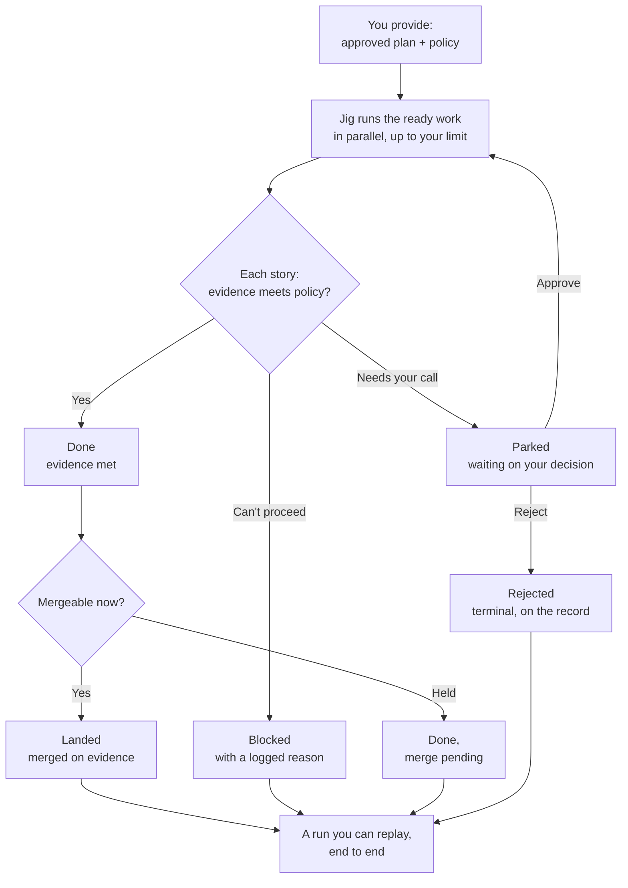

# Jig — the execution engine

Jig is the deterministic execution engine you run as `jig` (the package
`@agentic-workflow-kit/jig`). You give it an approved **execution plan** and a **policy**; it
turns that plan into reviewed, landed work as far as the policy allows, or into a deliberate,
inspectable stop when the work should not continue.

This page is the product contract for Jig: who it serves, what job it does, what promises it
makes, and where its boundaries are. It does not define low-level protocol mechanics,
provider internals, safety classifiers, or delivery exit bars. Product owns what and why;
design and delivery planning own how those promises are implemented and verified.

> **The product layer, at a glance.** This page is the hub. Two companion pages carry the
> detail: **[the five guarantees](./guarantees.md)** (full, ID-bearing specification) and
> **[how you use Jig](./use-cases.md)** (worked scenarios). [Tracks](./concepts.md) covers the
> per-track concept the configuration story relies on.

## Product Spine

| Question | Product answer |
|---|---|
| User | An owner/operator with product and design judgment who cannot safely supervise every agent action manually. |
| Job | Turn an approved execution plan into reviewed, landed work while preserving human control. |
| Current alternative | A chain of one-off agent sessions, manual PR and review follow-up, ad hoc notes, and fragile recovery. |
| Before | The owner cannot tell whether the agent stayed inside policy, what evidence justified a merge, or how to resume safely after interruption. |
| After | The owner delegates execution under policy and receives evidence, escalation points, recovery, and a reconstructible outcome. |
| Non-fit | Jig is not a product-definition tool, a design authoring tool, an LLM project manager, or a way to bypass review judgment. |

## Workflow

Jig starts where planning ends:

1. You provide an execution plan and policy.
2. Jig runs eligible work under that policy, with the worker contained behind authorization
   and the runner holding privileged actions.
3. Jig asks for a human decision when policy, evidence, or capability proof requires it.
4. Jig lands work only on evidence, or stops in a named state with enough information to
   recover, re-plan, or reject.

The supporting products can help produce the product definition, design, and plan. They are
strong defaults, not prerequisites. Jig's minimum input is a valid execution plan.

### Driving a run

You stay in control through a small set of deliberate actions. Each one is a single, recorded
move — not a free-form conversation with an agent.

- **Start** a run from your plan and policy, or **preview** what would run before committing.
- **Watch** it live — what's progressing, what's parked, what's blocked — and **inspect** any
  story for what happened and what evidence backs it.
- **Ask why.** Why did this story block? Why did that one merge? Why is this one waiting? Jig
  answers from the run's own record — an attributable answer, not a log you decode.
- **Decide** when a run pulls you in: approve, reject, **override** a call you'd make
  differently, or **hand off** the decision to someone else.
- **Stop** a run cleanly so it can be resumed later, and **acknowledge or snooze** a notice so
  your queue reflects what you've already seen.

You run Jig from a terminal, drive it as a tool from your own agent, or embed it in your own
software.

## The execution plan — Jig's one input

Jig's only hard input is a valid **execution plan** (together with a policy). Everything
upstream is optional; whatever produced the plan, Jig runs the plan.

At product altitude, an execution plan carries:

- a set of **stories** — the units of work Jig delivers and lands (defined in
  [concepts](./concepts.md#stories--the-unit-of-work));
- the **dependencies** between them — so Jig runs work in a safe order and never starts a story
  before its prerequisites land;
- each story's **done conditions** — the evidence that must hold before that story may land. The
  owner sets these through policy (see [Merge-on-evidence](./guarantees.md#15-merge-on-evidence)).

The plan is one artifact per track. Its exact schema is design's to define; what it must
*carry* is the product contract above.

**Producing a plan.** You can author a plan directly — it is a structured artifact, not a
conversation with an agent — or generate it with the upstream supporting products
(define-product → design → plan). Those products are strong defaults that make planning easier;
Jig requires only the finished plan, however you arrived at it.

## The five guarantees

These are the outcome-level commitments Jig makes. Each has a full, ID-bearing specification —
see **[the five guarantees in detail](./guarantees.md)**.

1. **Control & trust** — the worker can only do what you authorized, earns autonomy by proof,
   cannot weaken its own guardrails, pulls you in for real decisions, and never ships on its
   own assertion. _([detail](./guarantees.md#1-control--trust))_
2. **You own the configuration** — policy expresses risk and safety; work profile expresses how
   work is carried out; both are track-scoped and understandable to the owner.
   _([detail](./guarantees.md#2-configuration-ownership))_
3. **Never lose work; resume safely** — recorded progress survives interruption, irreversible
   actions are not repeated, and one blocked story does not sink independent work.
   _([detail](./guarantees.md#3-resilience--never-lose-work-resume-safely))_
4. **Runs against your stack** — agents, execution hosts, forges, and work sources sit behind
   swappable seams, and weak drivers reduce autonomy rather than weakening guarantees.
   _([detail](./guarantees.md#4-stack-portability))_
5. **See everything** — every governed decision and outcome is visible through durable,
   structured records that owners and tools can inspect.
   _([detail](./guarantees.md#5-full-observability))_

### Enforce vs. Guide

Most of the suite guides: it gives templates, presets, product practices, and planning
discipline the owner can adapt. Jig enforces only the floors that make delegation safe:
authorization before action, policy that cannot be quietly weakened, runner-owned irreversible
actions, and evidence before landing work. The owner still chooses the policy posture and the
strength of the gates.

## How you use Jig

See **[how you use Jig](./use-cases.md)** for worked scenarios — overnight delivery of a planned
epic, a risky change at the doorbell, a safe resume after interruption, and swapping your agent —
each making one of the five guarantees concrete.

## Product Boundaries

Jig owns execution under policy: authorization, escalation, evidence, recovery, stack seams,
and run visibility. The supporting products can help produce better product definitions,
designs, and execution plans, but Jig does not require them. The learning loop is between-runs
improvement, not part of Jig's per-run hot path.

Design owns the implementation details behind these promises: event schema shape, protocol
mechanics, provider contracts, exact policy classifiers, storage strategy, and delivery gates.
Planning owns delivery-level acceptance criteria and phase sequencing. Product keeps the
outcome-level commitments and the IDs in [the five guarantees](./guarantees.md).

### What Jig isn't (yet)

Jig is honest about its edges. These are deliberate non-goals or deferrals, not gaps:

- **No model decides for you.** No LLM adjudicates approvals; risky or unallowlisted requests
  always go to a human. Low-risk auto-grants in assisted mode follow a fixed, predictable rule
  (CFG-10), never a model.
- **Local-first.** Jig runs against a local execution host now. Remote hosts are a ready seam
  with no shipped driver yet — don't expect remote execution today.
- **Operator-initiated.** A run starts because you start it; webhook and scheduler triggers come
  later.
- **A tool you run, not a service you buy.** Jig is not a hosted, multi-tenant service in v1.
- **No silent legacy coping.** Jig refuses configuration it doesn't understand, with guidance,
  rather than guessing at an outdated format.

## Success And Counter-Signals

**Success looks like:**

- Owners can explain the run's promise and boundaries from this page without reading design
  mechanics.
- Runs land or stop with clear evidence and fewer unsafe surprises.
- Review burden drops because policy, evidence, and escalation are explicit.
- Recovery feels ordinary rather than exceptional.

**Counter-signals look like:**

- Product docs require implementation protocol detail to explain the promise.
- Supporting docs cite commitment IDs that no longer exist here.
- Owners treat current design defaults as product truth instead of reconciling design to the
  product commitment.

## Open Questions

- How much of the setup and preset experience belongs in Jig itself versus surrounding
  guidance?
- How broad should first-class driver support be before stack portability feels credible?
- Which throughput-oriented follow-up checks should become shipped product surfaces, and which
  should remain extension examples?
- Delivery-level acceptance criteria should be issued later in design or planning artifacts
  that cite these product-owned IDs; they should not become a product-layer AC table.

## Related

- [The five guarantees (detail)](./guarantees.md) — full ID-bearing specification.
- [How you use Jig](./use-cases.md) — worked scenarios for each guarantee.
- [Tracks](./concepts.md) — the track model that scopes policy, work profile, and execution.
- Engineering design — the implementation reference for how these product commitments are
  satisfied. _(Forthcoming; the design layer is the next step in this repo — see
  [`docs/design/`](../design/).)_
