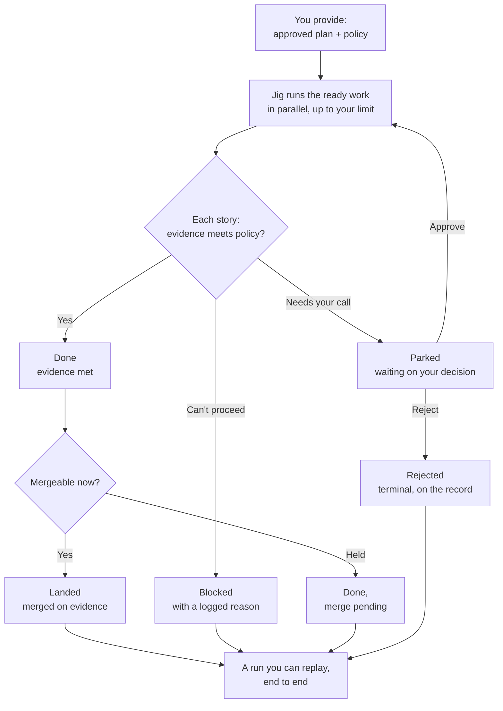

# Jig — the execution engine

Jig is the deterministic execution engine you run as `jig`. At product altitude,
`@agentic-workflow-kit/jig` names the Jig product identity; there is no public package, export,
or stability promise today. You give Jig an approved **execution plan** plus owner-controlled
**policy** and **configuration**; it turns those inputs into safe, evidenced delivery as far as
policy allows, or into a deliberate, inspectable stop when the work should not continue.

This page is the product contract for Jig: who it serves, what job it does, what promises it
makes, and where its boundaries are. It does not define low-level protocol mechanics,
provider internals, safety classifiers, or delivery exit bars. Product owns what and why;
design and delivery planning own how those promises are implemented and verified.

> **The product layer, at a glance.** This page is the hub. Two companion pages carry the
> detail: **[the five guarantees](./guarantees.md)** (full, ID-bearing specification) and
> **[how you use Jig](./use-cases.md)** (worked scenarios). [Product concepts](./concepts.md)
> covers tracks, stories, runner/worker/verifier authority, SDK boundaries, providers, and
> conformance.

## Product Spine

| Question            | Product answer                                                                                                                                                                                                                   |
| ------------------- | -------------------------------------------------------------------------------------------------------------------------------------------------------------------------------------------------------------------------------- |
| User                | An owner/operator with product and design judgment who cannot safely supervise every agent action manually.                                                                                                                      |
| Also serves         | Integrators and tool builders who consume Jig's programmatic surface and its structured records — driving Jig from their own agent, embedding it, or building analyzers, dashboards, and story sources around it (CFG-7, SEE-2). |
| Job                 | Turn an approved execution plan and owner policy/configuration into safe, evidenced delivery or an inspectable stop while preserving human control.                                                                              |
| Current alternative | A chain of one-off agent sessions, manual PR and review follow-up, ad hoc notes, and fragile recovery.                                                                                                                           |
| Before              | The owner cannot tell whether the agent stayed inside policy, what evidence justified a merge, or how to resume safely after interruption.                                                                                       |
| After               | The owner delegates execution under policy and receives evidence, escalation points, recovery, and a reconstructible outcome.                                                                                                    |
| Non-fit             | Jig is not a product-definition tool, a design authoring tool, an LLM project manager, or a way to bypass review judgment.                                                                                                       |

## Workflow

Jig starts where planning ends:

1. You provide an execution plan, policy, and configuration.
2. Jig runs eligible work under that policy, with the worker contained behind authorization
   and the runner holding privileged actions.
3. Jig's product model treats acceptance/review before landing as a policy-selected lane; richer
   runtime support for that lane remains implementation follow-up unless current design or code has
   separately proven it.
4. Jig asks for a human decision when policy, evidence, implemented acceptance checks, or
   capability proof requires it.
5. Jig lands work only on evidence, or stops in a named state with enough information to
   recover, re-plan, or reject.

The supporting products can help produce the product definition, design, and plan. They are
strong defaults, not prerequisites. Jig's hard input boundary is a valid execution plan; the run's
safety and acceptance posture comes from owner-controlled policy and configuration.

### Driving a run

You stay in control through a small set of deliberate actions. Each one is a single, recorded
move — not a free-form conversation with an agent.

- **Set up** Jig through the `jig` tool: pick the track you are configuring, choose the provider
  posture you want to start with, and get an understandable policy and work profile from templates
  before you tune them.
- **Start** a run from your plan and policy, or **preview** what would run before committing.
- **Watch** it live — what's progressing, what's parked, what's blocked — and **inspect** any
  story for what happened and what evidence backs it.
- **Ask why.** Why did this story block? Why did that one merge? Why is this one waiting? Jig
  answers from the run's own record — an attributable answer, not a log you decode.
- **Decide** when a run pulls you in: approve, reject, **override** a call you'd make
  differently, or **hand off** the decision to someone else.
- **Stop** a run cleanly so it can be resumed later, and **acknowledge or snooze** a notice so
  your queue reflects what you've already seen.

You run Jig from a terminal, drive it as a tool from your own agent, or embed it in your own
software.

## The execution plan — Jig's one input

Jig's only hard input is a valid **execution plan** (together with a policy). Everything
upstream is optional; whatever produced the plan, Jig runs the plan.

At product altitude, an execution plan carries:

- a set of **stories** — the units of work Jig delivers and lands (defined in
  [concepts](./concepts.md#stories--the-unit-of-work));
- the **dependencies** between them — so Jig runs work in a safe order and never starts a story
  before its prerequisites land;
- each story's **done conditions** — the evidence that must hold before that story may land. The
  owner sets these through policy (see [Merge-on-evidence](./guarantees.md#15-merge-on-evidence)).

The plan is one artifact per track — one independent line of work (see
[concepts](./concepts.md#tracks--parallel-independent-work)). Its exact schema is design's to define; what it must
_carry_ is the product contract above.

**Producing a plan.** You can author a plan directly — it is a structured artifact, not a
conversation with an agent — or generate it with the upstream supporting products
(define-product → design → plan). Those products are strong defaults that make planning easier;
Jig requires only the finished plan, however you arrived at it.

## The five guarantees

These are the outcome-level commitments Jig makes. Each has a full, ID-bearing specification —
see **[the five guarantees in detail](./guarantees.md)**.

1. **Control & trust** — the worker can only do what you authorized, earns autonomy by proof,
   cannot weaken its own guardrails, pulls you in for real decisions, and never ships on its
   own assertion. _([detail](./guarantees.md#1-control--trust))_
2. **You own the configuration** — policy expresses risk and safety; work profile expresses how
   work is carried out; both are track-scoped and understandable to the owner.
   _([detail](./guarantees.md#2-configuration-ownership))_
3. **Never lose work; resume safely** — recorded progress survives interruption, irreversible
   actions are not repeated, and one blocked story does not sink independent work.
   _([detail](./guarantees.md#3-resilience--never-lose-work-resume-safely))_
4. **Runs against your stack** — agents, execution hosts, forges, and work sources sit behind
   swappable seams, custom compatible providers can plug in without forking Jig core, and weak
   drivers reduce autonomy rather than weakening guarantees.
   _([detail](./guarantees.md#4-stack-portability))_
5. **See everything** — every governed decision and outcome is visible through durable,
   structured records that owners and tools can inspect.
   _([detail](./guarantees.md#5-full-observability))_

### The run roles

Jig's product promise depends on keeping these roles separate:

| Role                  | Product boundary                                                                                                                                                                            |
| --------------------- | ------------------------------------------------------------------------------------------------------------------------------------------------------------------------------------------- |
| **Config**            | Owner-controlled run/repo wiring: which track, work profile, providers, and operating posture are selected before launch.                                                                   |
| **Policy**            | Owner-controlled safety and acceptance contract: gating posture, acceptance strength, escalation, reviews, and merge conditions. Fixed at launch for the run.                               |
| **Plan**              | The approved execution plan and Jig's hard input boundary: stories, dependencies, and done conditions.                                                                                      |
| **Runner**            | Jig's trusted orchestrator: owns lifecycle, policy enforcement, evidence consumption, Doorbell escalation, records append, and provider invocation. It is not a code reviewer or forge API. |
| **Worker**            | The contained implementer: edits code, runs requested checks, and reports results/evidence. It does not hold forge credentials, land work, choose acceptance strength, or review itself.    |
| **Verifier/reviewer** | The independent acceptance lane: human, agent, or deterministic checker that assesses evidence, diff, or output and emits a verdict for Runner/policy to consume.                           |
| **Fence**             | Runtime authorization: approves, denies, or routes worker requests before they execute.                                                                                                     |
| **Doorbell**          | Owner escalation for ambiguous, risky, or unproven decisions; grants remain narrow and recorded.                                                                                            |
| **Forge provider**    | Deterministic adapter capability for external forge operations such as push, PR/status/comment, merge, idempotency handling, and API translation when Runner invokes it under policy.       |
| **Execution host**    | The environment containing the worker and proving the isolation/no-phone-home posture policy relies on.                                                                                     |
| **Work source**       | Supplies candidate work and provenance, but never bypasses plan validation.                                                                                                                 |
| **Records**           | Durable evidence trail for governed decisions, evidence, verdicts, stops, and outcomes.                                                                                                     |

This is why Jig is not "an agent that codes." Jig is the harness around a worker: the worker
produces work, the verifier/reviewer assesses it, the runner enforces policy and lifecycle, the
forge provider performs deterministic external operations, and the owner owns risk decisions.

### Acceptance before landing

Verification before merge/landing is a configurable acceptance/review lane selected by the owner's
policy and configuration before launch. Some review modes, especially ordinary code review, may
require Runner to push a branch or open/update a PR so the review can happen or blocked work can be
surfaced safely. Those forge operations are still runner-invoked and policy-governed, but they are
not acceptance. At product altitude, the lane can be as simple or as strong as the policy requires:

- a mechanical evidence check over recorded commands and outputs;
- structured independent review of the diff and evidence;
- real code review in the owner's normal review flow;
- explicit owner review;
- specialist review, such as security, contracts, data, or platform review.

In the product model, the lane emits a verdict or evidence assessment. It does not land work, hold
privileged forge credentials, redefine policy, select weaker acceptance, or create lifecycle
transitions directly. Runner consumes the verdict, records it, and enforces policy when the lane is
implemented for the selected policy. If proof is missing, stale, self-reported, weak, or
inconclusive, Jig routes to the Doorbell or stops according to policy; it does not lower the bar.

This section names the product model and target boundary. Runtime/config/policy support for richer
acceptance lanes is implementation follow-up unless current design or code has separately proven
that support.

### Enforce vs. Guide

Most of the suite guides: it gives templates, presets, product practices, and planning
discipline the owner can adapt. Jig enforces only the floors that make delegation safe:
authorization before action, policy that cannot be quietly weakened, runner-owned irreversible
actions, implemented acceptance gates before landing when policy requires them, and evidence before
landing work. The owner still chooses the policy posture and the strength of the gates.

## How you use Jig

See **[how you use Jig](./use-cases.md)** for worked scenarios — overnight delivery of a planned
epic, a risky change at the doorbell, a safe resume after interruption, and swapping your agent —
each making one of the five guarantees concrete.

## Product Boundaries

Jig owns execution under policy: orchestration, authorization, escalation, evidence consumption,
implemented acceptance verdict consumption, recovery, provider invocation, stack seams, and run
visibility. The supporting products can help produce better product definitions, designs, and
execution plans, but Jig does not require them. The learning loop is between-runs improvement, not
part of Jig's per-run hot path.

Design owns the implementation details behind these promises: event schema shape, protocol
mechanics, provider contracts, exact policy classifiers, setup prompts, configuration file shape,
storage strategy, and delivery gates. Planning owns delivery-level acceptance criteria and phase
sequencing. Product keeps the outcome-level commitments and the IDs in
[the five guarantees](./guarantees.md).

Jig exposes a stable programmatic surface for its first-party consumers — its CLI, private MCP
adapter, and SDK boundary — so those consumers do their work through that surface instead of reaching
into Jig internals. The product promise is the boundary and its stability posture: no public package
and no external stability commitment today, and any future change to that posture is a deliberate,
owner-visible decision rather than a quiet drift. How the boundary is drawn, packaged, and released
is design's.

That same boundary is where provider replaceability lives. Bundled providers may ship with Jig,
but they behave like replaceable providers at the boundary: they prove their capabilities,
declare their authority, and can be swapped or extracted later without changing Jig's
guarantees — a first-party provider gets no privileged shortcut a third-party one couldn't use.
This is a product promise about portability and owner trust, not a decision about package layout
or publication.

The Forge provider is one of those replaceable providers, not another agent. It translates a
Runner-authorized external operation into deterministic forge effects and reports the result. It
does not decide whether evidence is sufficient, whether policy allows landing, or whether the work
should ship.

Provider extensibility is settled product scope. Owners and teams should be able to bring a
compatible provider for a supported seam and plug it into Jig without forking Jig core. That
provider earns use through declared authority and conformance proof; the exact local connection
and registration mechanics remain design-owned. Public distribution, discovery, install UX, and
stability guarantees remain separate product questions below.

The product promise behind `jig-testkit` is conformance, not packaging. Jig needs a reusable
way to prove bundled and future providers before owners trust them: capability checks,
declared authority, and adversarial probes that support
[DRIVE-1 and DRIVE-4](./guarantees.md#41-trusting-a-driver). Whether that surface remains
internal-only or becomes a public package is still open.

### What Jig isn't (yet)

Jig is honest about its edges. These are deliberate non-goals or deferrals, not gaps:

- **No model decides for you.** No LLM adjudicates approvals; risky or unallowlisted requests
  always go to a human. Low-risk auto-grants in assisted mode follow a fixed, predictable rule
  (CFG-10), never a model.
- **Local-first.** Jig runs against a local execution host now. Remote hosts are a ready seam
  with no shipped driver yet — don't expect remote execution today.
- **Operator-initiated.** A run starts because you start it; webhook and scheduler triggers come
  later.
- **A tool you run, not a service you buy.** Jig is not a hosted, multi-tenant service in v1.
- **The full agent-driven real run is still bounded evidence.** EVRUN-partial proved a real
  work-source, Forge, and records-integrity path with a scripted agent leg. The later EVRUN-full
  combined smoke proves a real GitHub Issues, Codex app-server, real-host, GitHub Forge `open-pr`,
  and records-integrity path against the disposable target repo. Remote execution, strong
  no-phone-home behavior, held-merge/idempotency, Windows behavior, and every transport edge remain
  unproven.
- **No silent legacy coping.** Jig refuses configuration it doesn't understand, with guidance,
  rather than guessing at an outdated format.

## Success And Counter-Signals

**Success looks like:**

- Owners can explain the run's promise and boundaries from this page without reading design
  mechanics.
- Runs land or stop with clear evidence and fewer unsafe surprises.
- Review burden drops because policy, evidence, and escalation are explicit.
- Recovery feels ordinary rather than exceptional.

**Counter-signals look like:**

- Product docs require implementation protocol detail to explain the promise.
- Supporting docs cite commitment IDs that no longer exist here.
- Owners treat current design defaults as product truth instead of reconciling design to the
  product commitment.

## Open Questions

- Which setup integrations should Jig guide first: provider selection, MCP surface setup, local
  skills, sibling suite tools, or policy/config templates beyond the first useful defaults?
- How broad should first-class driver support be before stack portability feels credible?
- Owner-authored compatible providers are product scope. What remains open is the public provider
  ecosystem around them: published distribution packages, discovery, registry or marketplace,
  support policy, install UX, and public stability guarantees.
- Whether `jig-testkit` becomes a public package, an internal-only conformance tool, or both
  remains open; the settled product promise is repeatable provider proof before trust.
- Which throughput-oriented follow-up checks should become shipped product surfaces, and which
  should remain extension examples?
- Delivery-level acceptance criteria should be issued later in design or planning artifacts
  that cite these product-owned IDs; they should not become a product-layer AC table.

## Related

- [The five guarantees (detail)](./guarantees.md) — full ID-bearing specification.
- [How you use Jig](./use-cases.md) — worked scenarios for each guarantee.
- [Product concepts](./concepts.md) — tracks, stories, runner/worker/verifier authority, SDK
  boundaries, providers, and conformance.
- [Engineering design](../redesign/design/README.md) — the approved architecture for how these
  product commitments are satisfied; the pre-redesign implementation reference is archived at
  [docs/archive/design](../archive/design/README.md).
