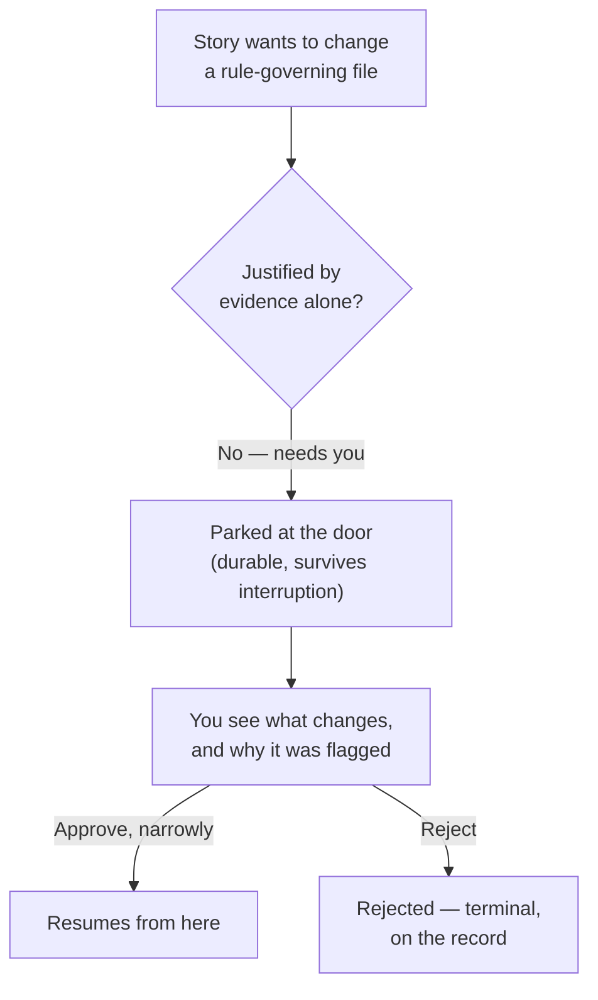

# How you use Jig

These scenarios show what Jig does _for you_. Each one makes one of the
[five guarantees](./guarantees.md) concrete. For the product contract behind them — the spine,
workflow, boundaries, and open questions — start at
[Jig — the execution engine](./jig.md).

## Overnight delivery of a planned epic

_Shows guarantee 1 — control & trust._

You have an approved plan — twelve stories — and you want them delivered tonight without
supervising each one. You use the setup flow in `jig` to choose a cautious provider posture and
start from a policy/work-profile template you understand, then point Jig at the plan. It works the
stories that are ready, in parallel up to the limit you set, and lands each one **only on real
evidence** — never on the agent's say-so. One story tries to change a file that governs your safety
rules; Jig **pauses it and asks you**, rather than quietly merging. Another fails its checks; Jig
**blocks it and records why**, without holding up the independent stories.

By morning: nine landed with evidence you can replay, two waiting on a decision only you should
make, one blocked with a reason. **You spent your judgment on the two decisions that mattered —
not on babysitting twelve runs.**

## A risky change at the doorbell

_Shows guarantee 1 — the doorbell._

A story needs to touch a file that governs your safety rules — your policy, a CI gate, the
verification command itself. That is exactly the kind of change Jig will not wave through on
evidence alone. It **parks the story at the door** and hands you one decision: here is what
wants to change, here is why it was flagged, approve it narrowly or reject it. The run waits —
durably, through interruption — until you answer, then resumes from exactly there. **You are
pulled in once, for the one change that warranted your eyes — not the twenty that didn't.**

## Setting the posture for a track

_Shows guarantee 2 — you own the configuration._

A new track is riskier than your others — it touches auth and billing — and you want it to run
more cautiously without hand-tuning fifty knobs. In setup, Jig asks how you want to work and maps
your answer to a starting **policy** (the safety contract: gating posture, required reviews, the
anti-gaming floor) and a **work profile** (how the work gets done: model, effort, prompt
strategy). You dial the policy toward manual — every escalation comes to you — and leave the work
profile free to tune for cost and speed later. The two never blur: raising the model's effort
can't loosen a gate, and the repo-level floors you set once hold under every track no matter how a
track's own policy is tuned. **You expressed intent once, in owner terms — and the safety
contract stayed separate from the performance dial.**

## A safe resume after interruption

_Shows guarantee 3 — never lose work; resume safely._

Your machine dies mid-run — power, a crash, a closed laptop. You restart Jig and point it at
the same run. It does not start over and it does not double-act: the stories that already landed
stay landed, irreversible steps already taken are not repeated, and work picks up from the last
safe checkpoint. If something safety-relevant changed while it was down, Jig asks you to
re-approve before continuing rather than assuming the old answer still holds. **An interruption
costs you the time since the last checkpoint — not the run.**

## Swapping your agent

_Shows guarantee 4 — runs against your stack._

You want to move a track from one coding agent to another — a new model, a different vendor,
your own in-house agent. You change the agent in that track's work profile; the policy, the
gates, and the evidence bar stay exactly as they were. Before the new agent earns any autonomy,
Jig makes it **prove** the capabilities it claims; until it does, you get more checkpoints, not
weaker guarantees. The same proof bar applies to a bundled agent driver and a future extracted
driver; first-party convenience does not create hidden trust. **You change who does the work
without renegotiating what "safe" means.**

## Reconstructing a run after the fact

_Shows guarantee 5 — see everything._

A story landed last night and someone asks why — what evidence justified the merge, who approved
it, what the worker was and wasn't allowed to do. You don't reconstruct it from memory or a chat
transcript. You open the run's records and read the decision itself: the request, the
authorization, the gates it passed, the evidence that met policy, the approval and who made it.
The records Jig **used** to decide are the same records you **inspect** — there is no second
story that can drift from what actually happened. When you need to hand it on, the finished run
exports as a write-once, redacted-by-default audit record you can archive or give to compliance.
**The answer to "why did this happen" comes from the run's own trail — not from anyone's
recollection.**

## Related

- [Jig — the execution engine](./jig.md) — product overview and contract.
- [The five guarantees (detail)](./guarantees.md) — the full ID-bearing specification.
