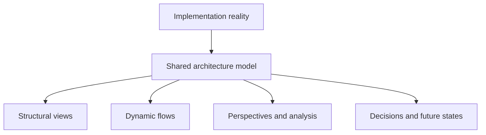
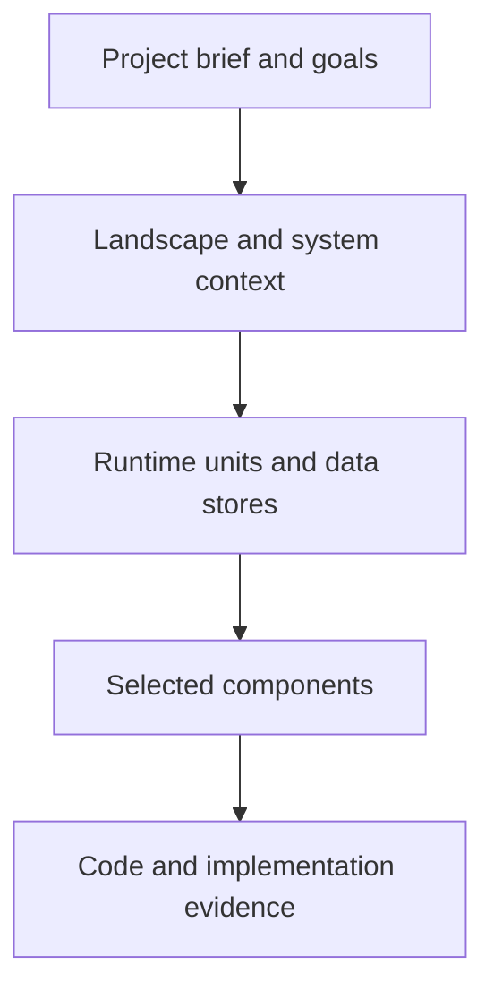
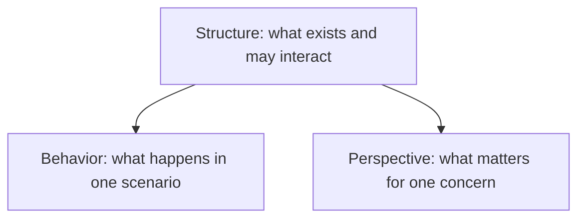
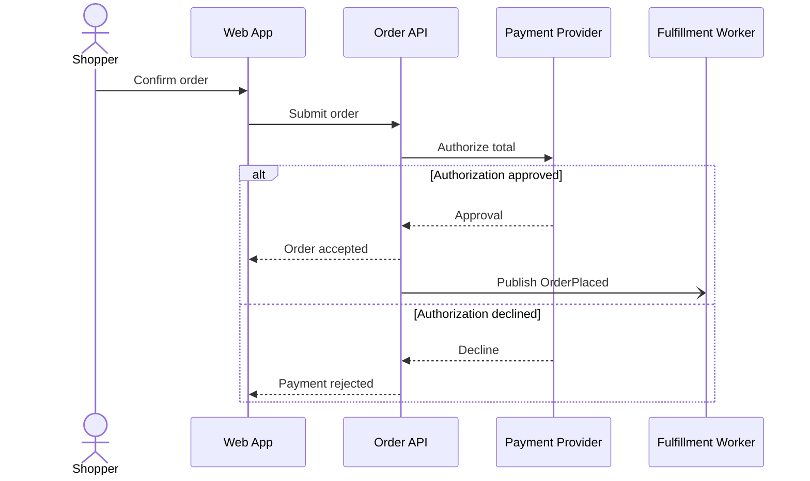
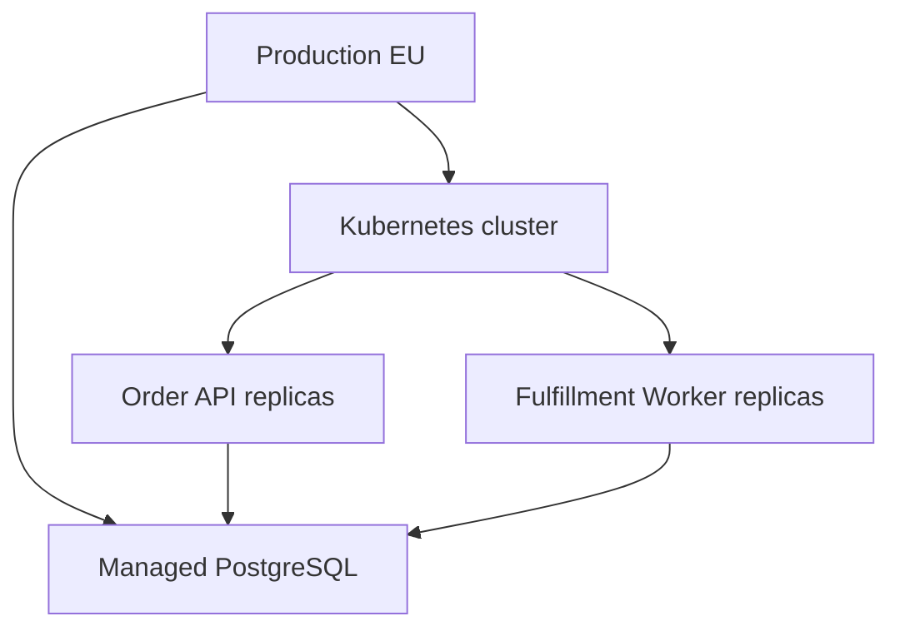
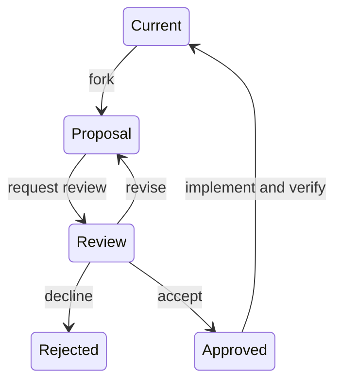
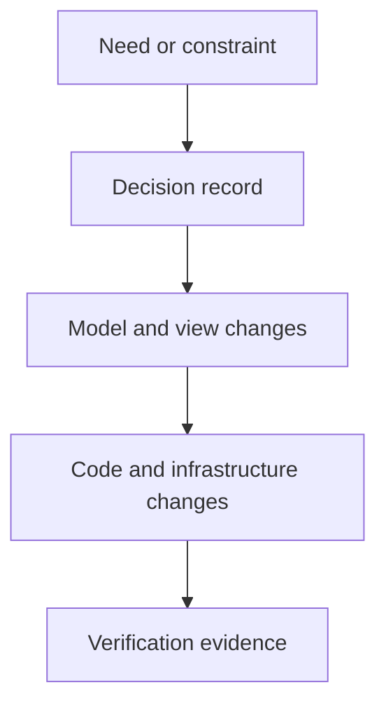
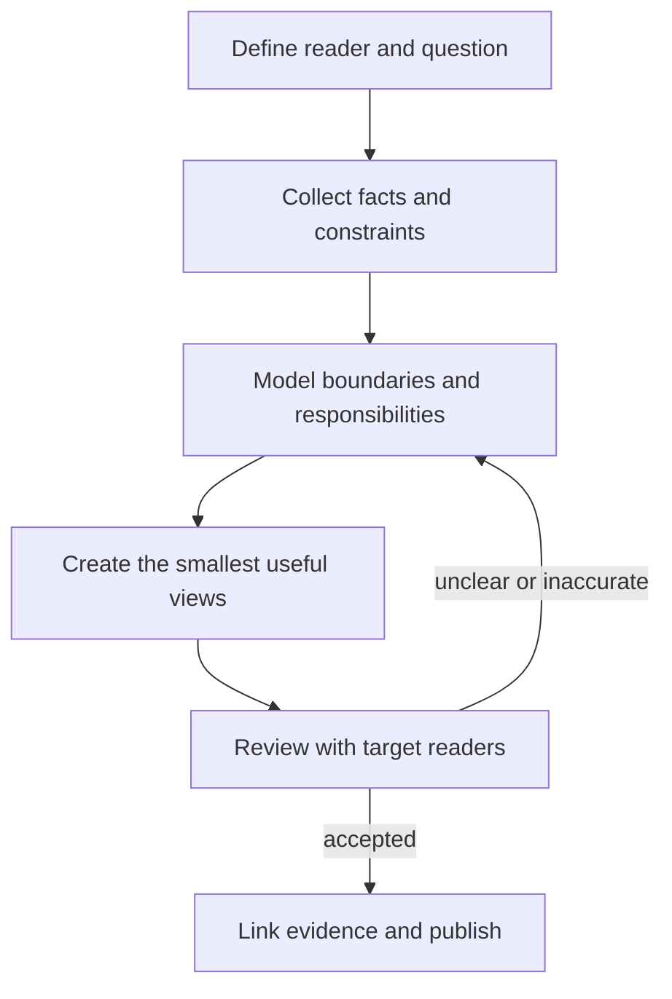
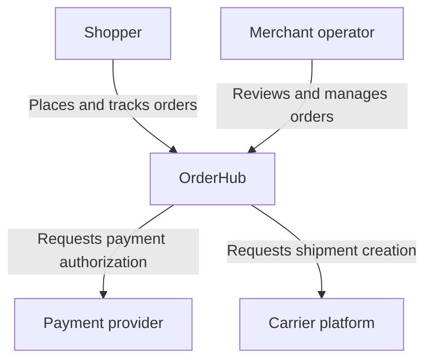
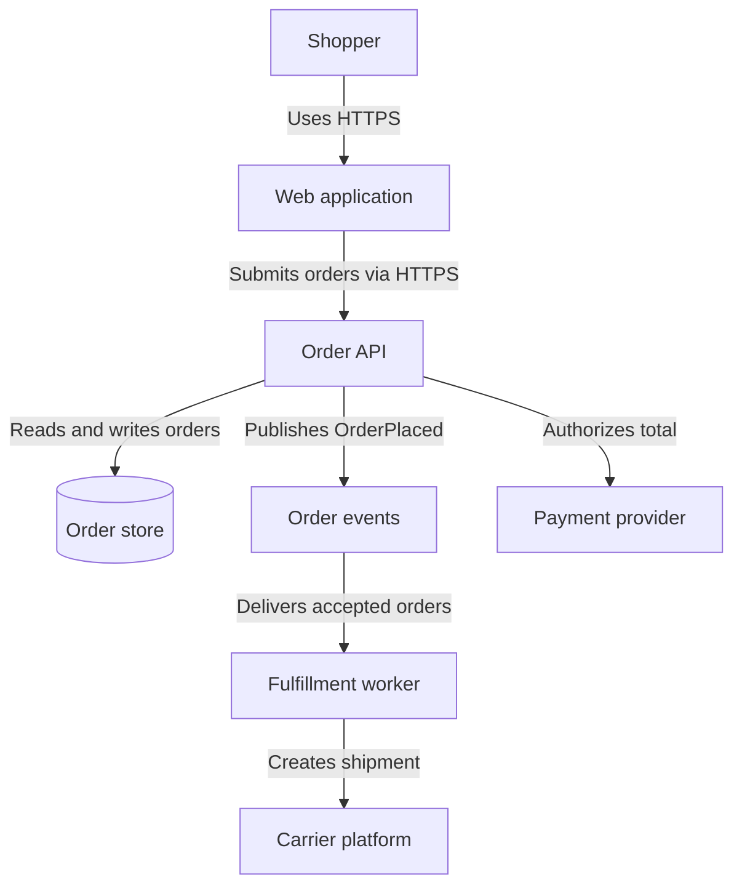

# Designing and Documenting Software Projects

## A layered, model-based guide for clear architecture communication

> **Purpose:** A tool-agnostic method for designing and documenting software projects from business context down to implementation reality.
>
> **Source basis:** This guide generalizes the strongest ideas in the [IcePanel documentation](https://docs.icepanel.io/) and its underlying [C4 model](https://c4model.com/). It is not an IcePanel usage manual.
>
> **Reviewed:** 2026-07-14

> **Operational use:** This is the comprehensive source reference. Authors and reviewers should
> start at the needs-routed [architecture guidelines handbook](./guidelines/README.md), then read
> only the page for their active design layer. Use this source guide for deeper rationale, research
> links, expanded examples, or a specific unresolved question; do not read it in full by default.

---

## How to use this guide

For active work, first select a layer through the
[architecture guidelines index](./guidelines/README.md). The routes below are optional deep-reading
paths when the operational layer page does not answer a specific question.

- **Starting a new project:** Read sections 2, 3, 5, and 11, then adapt the worked example in section 12.
- **Reviewing existing documentation:** Use sections 6, 14, and 15 as a review rubric.
- **Designing an architectural change:** Follow section 9 and the future-state checklist in section 14.5.
- **Setting up a documentation repository:** Start with sections 10 and 13.
- **Looking for a lightweight standard:** Use the twelve rules in section 17 and the templates in section 16.

The guide is intentionally layered. Read from the beginning for the reasoning, or jump directly to the workflow, example, checklists, and templates when applying it.

---

## 1. The central idea: model once, explain many times

A software architecture has more facts than any one diagram should show.

Keep one coherent **model** of the important things in the project, then create multiple **views** of that model for different readers and questions. Connect the model to **reality**—code, APIs, infrastructure, telemetry, and runbooks—so readers can move from an explanation to evidence.



The three concepts are different:

| Concept     | What it contains                                                                                       | What it is for                                                  |
| ----------- | ------------------------------------------------------------------------------------------------------ | --------------------------------------------------------------- |
| **Model**   | Stable identities, types, boundaries, responsibilities, relationships, ownership, lifecycle, and links | The reusable source of architectural facts                      |
| **View**    | A deliberate selection and arrangement of model facts                                                  | Answering one question for one audience                         |
| **Reality** | Code, configuration, APIs, infrastructure as code, telemetry, schemas, and operational material        | Verifying that the model still describes the implemented system |

This separation matters because a model optimized for completeness is not optimized for reading. Conversely, a diagram optimized for a conversation is not a safe place to store the only copy of an architectural fact.

IcePanel makes this distinction explicitly: objects and relationships belong to a reusable model, while each diagram displays only the subset intentionally added to tell its story. That reduces contradictory diagrams without forcing every diagram to show everything ([Modelling](https://docs.icepanel.io/core-features/modelling), [Diagramming](https://docs.icepanel.io/core-features/diagramming), [FAQ](https://docs.icepanel.io/other-information/faq)).

### Working rule

> **The model may be complete; each view must be selective.**

If a diagram tries to be the model, it becomes unreadable. If every diagram invents its own objects and relationships, the documentation becomes inconsistent.

---

## 2. Start with the reader and the question

Do not begin with boxes. Begin with a communication contract.

Before creating an artifact, write:

```text
Audience:
Question this artifact must answer:
Decision or action it should enable:
Scope:
Level of detail:
State and point in time:
Owner:
```

For example:

```text
Audience: Product, engineering, and security reviewers
Question: Which external parties exchange customer data with OrderHub?
Decision: Agree on system boundaries and privacy review scope
Scope: OrderHub and its direct external dependencies
Level: System context
State: Proposed target for Q4
Owner: Checkout team
```

### One view, one primary story

A useful diagram has one main question in its title or purpose. It may provide supporting context, but it should not simultaneously try to explain:

- the business ecosystem;
- every deployable service;
- a checkout request sequence;
- cloud networking;
- database tables;
- team ownership; and
- a proposed migration.

Those are different stories with different readers and visual grammars.

IcePanel recommends multiple diagrams at the same abstraction level when a single diagram becomes complex. Each can focus on a particular audience, business area, object, or use case while reusing the same model. This is not duplication if the views answer different questions ([Diagramming](https://docs.icepanel.io/core-features/diagramming)).

### Choose an artifact from the question

| Reader's question                                    | Best first artifact                   | Why                                                                            |
| ---------------------------------------------------- | ------------------------------------- | ------------------------------------------------------------------------------ |
| Why does this project exist?                         | Project brief                         | Architecture has no useful frame without outcomes and constraints              |
| Who uses the system, and what surrounds it?          | System context view                   | Establishes scope and external dependencies without implementation noise       |
| What are the major runnable or deployable parts?     | Runtime/container view                | Shows responsibility distribution and high-level communication                 |
| How is one application internally organized?         | Component view                        | Explains important internal boundaries selectively                             |
| What happens when a user performs a scenario?        | Dynamic flow or sequence              | Adds time and causality that a static diagram cannot express                   |
| Where does software run in production?               | Deployment view                       | Separates logical architecture from environment-specific topology              |
| Which parts handle PII, cost the most, or are risky? | Perspective/overlay or filtered table | Adds a cross-cutting lens without changing the structural model                |
| Why did we choose this design?                       | Architecture decision record          | Preserves forces, alternatives, and consequences                               |
| How will the system change?                          | Isolated future-state proposal        | Prevents proposed design from being mistaken for current reality               |
| What breaks if this changes?                         | Dependency view or impact analysis    | Derives risk from relationships instead of hand-drawing another static picture |

---

## 3. Use progressive disclosure from high level to low level

Readers should be able to stop when they have enough detail and continue when they need more.



The levels form a navigation structure, not a mandatory checklist. Most projects need a project brief, a context view, and a runtime/container view. Component and code-level material should exist only where it helps someone make or verify a decision. The C4 guidance similarly says context and container diagrams are sufficient for many teams, while code diagrams are usually better generated on demand ([C4 diagrams](https://c4model.com/diagrams), [IcePanel Modelling](https://docs.icepanel.io/core-features/modelling)).

### Level 0: project and product context

**Question:** Why are we building this, for whom, and under which constraints?

**Primary audience:** Everyone involved in the project.

Include:

- problem and target users;
- expected outcomes and success measures;
- key capabilities;
- scope and non-goals;
- material business, legal, operational, and technical constraints;
- assumptions and unresolved questions;
- stakeholders and decision owners.

Exclude:

- speculative service boundaries;
- detailed schemas;
- implementation tasks.

**Why:** A technically elegant system can still be the wrong system. This layer lets readers judge architectural choices against the problem rather than against personal taste.

### Landscape view: the wider organizational world

**Question:** How do the relevant systems and people fit together across the chosen organization, portfolio, or business area?

Use this when a single system context is too narrow—for example, when documenting a platform with many products or a company-wide capability.

Include:

- people or roles;
- internal software systems;
- external software systems;
- only the relationships needed to understand the portfolio.

**Why:** It provides an organizational map and a route into system-specific documentation. It should remain less detailed than each system's own context view.

### Level 1: system context

**Question:** What value boundary are we discussing, who uses it, and which external systems does it directly interact with?

**Primary audience:** Technical and non-technical readers.

Include:

- the system in scope;
- human roles or personas that interact with it;
- directly connected external systems;
- business-purpose relationship labels;
- an explicit internal/external boundary.

Exclude:

- services, databases, queues, and classes inside the system;
- cloud products, frameworks, and protocols unless they are themselves part of the business context;
- speculative internal design.

**Why:** Context diagrams create shared vocabulary and scope before technical detail creates disagreement. IcePanel's first recommended step is an intentionally simple context view for everyone, with understandable names and labelled relationships ([Getting started](https://docs.icepanel.io/getting-started)).

### Level 2: runtime/container architecture

**Question:** What separately runnable, deployable, or independently stored units make the system work, and how are responsibilities distributed?

**Primary audience:** Engineers, architects, product specialists, security, and operations.

Typical elements:

- web or mobile clients;
- backend applications and services;
- workers and scheduled jobs;
- data stores;
- independently meaningful queues or topics;
- directly connected people and external systems.

For every unit, capture:

- responsibility;
- technology where it helps the reader;
- owner;
- lifecycle state;
- important inbound and outbound relationships;
- links to implementation and operations.

Exclude:

- individual classes and functions;
- replica counts, subnets, and node groups that belong in deployment views;
- every possible runtime interaction in one static diagram.

**Why:** This level shows the high-level shape of the solution and the main responsibility boundaries. It changes more slowly than code, so it is detailed enough to be useful without becoming immediately stale. The C4 container guidance also deliberately separates logical architecture from deployment topology ([Container diagram](https://c4model.com/diagrams/container)).

### Level 3: selected component design

**Question:** How is one runtime unit divided into significant internal responsibilities?

**Primary audience:** Engineers working on or integrating with that unit.

Create this view only when the internal structure is consequential, non-obvious, or stable enough to maintain. Good triggers include:

- several teams change the same application;
- important security or consistency boundaries exist inside it;
- the application exposes multiple integration surfaces;
- a refactor or migration depends on internal seams;
- onboarding repeatedly requires the same explanation.

Model cohesive modules, ports, adapters, engines, or subsystems—not every source directory.

**Why:** A component view should explain design intent, not mirror a file tree. If it changes with every refactor but enables no decision, link to or generate a code view instead.

### Level 4: code and implementation reality

**Question:** Where is this design implemented, configured, deployed, and observed?

Prefer links or generated artifacts:

- repositories, directories, and primary entry points;
- API or event schemas;
- database migrations;
- infrastructure-as-code modules;
- generated dependency or class views;
- dashboards, alerts, runbooks, and service catalog entries.

**Why:** Hand-maintained code diagrams usually decay fastest. IcePanel explicitly recommends linking lower-level model objects to code rather than manually diagramming code, and the C4 documentation recommends generating volatile code-level material on demand ([Linking to reality](https://docs.icepanel.io/integrations/linking-to-reality), [C4 diagram FAQ](https://c4model.com/diagrams/faq)).

---

## 4. Keep supporting views separate from abstraction levels

The levels above describe **static logical structure**. Other questions need other view types.

| Supporting view     | Adds                                                               | Keep separate because                                                                 |
| ------------------- | ------------------------------------------------------------------ | ------------------------------------------------------------------------------------- |
| Dynamic flow        | Order, causality, branches, parallel work, failures                | Static connections only show that interaction is possible, not how a scenario unfolds |
| Deployment          | Environments, regions, networks, compute, replicas, infrastructure | Logical responsibilities should survive topology changes                              |
| Data model          | Entities, ownership, cardinality, retention                        | A runtime-unit diagram cannot explain data semantics precisely                        |
| State machine       | Valid states, events, and transitions                              | State behavior is different from service topology                                     |
| Threat model        | Assets, trust boundaries, threats, mitigations                     | Security analysis needs a specialized lens and evidence                               |
| Dependency analysis | Incoming/outgoing dependencies and impact                          | It is usually derived from the model rather than curated as another primary view      |
| Ownership map       | Accountable teams and escalation paths                             | Organizational metadata changes independently from architecture layout                |

Do not force every design concern into C4-style boxes and arrows. The C4 model itself focuses on static software structure and encourages complementary notations for processes, states, domains, and data when needed ([C4 FAQ](https://c4model.com/faq)).

---

## 5. Build a canonical architecture model

Even if your tool is Markdown and Mermaid, think in terms of a model rather than unrelated drawings.

### Minimum object record

```yaml
id: order-api
name: Order API
type: application
parent: orderhub
status: live
responsibility: Accepts orders and coordinates durable order creation.
owner: checkout-team
technologies:
  - Node.js
  - PostgreSQL
tags:
  data-classification: confidential
  criticality: tier-1
links:
  repository: https://example.invalid/order-api
  runbook: https://example.invalid/order-api/runbook
```

### Minimum relationship record

```yaml
id: order-api-to-payment
from: order-api
to: payment-provider
intent: Authorizes the order total
mechanism: HTTPS JSON API
status: live
data:
  - payment token
  - amount
```

The exact format is unimportant. The important properties are:

1. **Stable identity.** Renaming a thing should not create a second thing.
2. **Explicit type and parent.** Readers can tell its abstraction and scope.
3. **Short responsibility.** The object explains why it exists.
4. **Directed, intentional relationships.** A line is a fact with meaning, not decoration.
5. **Lifecycle and ownership.** Readers know whether it is current and who can verify it.
6. **Links to reality.** Claims can be checked.

### Use one definition and many references

If `Order API` appears in a context-specific view, a risk view, and a checkout flow, it should still be the same model object. Change its canonical responsibility or owner once; let every view refer to that definition.

This is the practical benefit of model-based documentation: reuse, synchronized updates, consistent vocabulary, and derived analysis such as dependency risk ([IcePanel Modelling](https://docs.icepanel.io/core-features/modelling), [Dependencies view](https://docs.icepanel.io/core-features/dependencies-view)).

### Use unambiguous names within a scope

Prefer names that communicate business or technical responsibility:

- `Order API`, not `Backend 2`;
- `Customer Profile Store`, not `Database`;
- `Publishes OrderPlaced events`, not `Uses`;
- `Payment Provider`, not a vendor logo alone.

Generic local names such as `Database` may be acceptable inside a tightly scoped system if the parent is always obvious. Across a larger model, qualify the name.

### Decide whether something is a node, a relationship detail, or metadata

Ask what the reader needs to reason about independently.

| Model as a node when…                                    | Model as relationship detail when…                     | Model as metadata when…                               |
| -------------------------------------------------------- | ------------------------------------------------------ | ----------------------------------------------------- |
| It has its own responsibility or lifecycle               | It only explains how two nodes interact                | It classifies or filters an existing node             |
| It is independently owned, secured, operated, or changed | Showing it as a node would hide the real dependency    | It is a cross-cutting property such as risk or region |
| Other things connect to it in materially different ways  | The current audience does not need to navigate into it | It does not create a structural boundary              |
| Its failure or replacement deserves direct analysis      | It is only a protocol, channel, or intermediary detail | It may change without changing the system topology    |

Examples:

- A shared event topic with several producers, consumers, retention rules, and ownership may deserve a node.
- A point-to-point queue may be clearer as `Publishes via OrderQueue` on a relationship.
- `AWS`, `PII`, `high risk`, and `checkout team` are usually metadata or overlays, not additional services.
- An interface that delivers independent value and has a dedicated owner may be a system; for a business overview it may be better represented as relationship detail to reduce noise ([IcePanel FAQ](https://docs.icepanel.io/other-information/faq), [C4 queues and topics](https://c4model.com/abstractions/queues-and-topics)).

### Preserve one connected world unless separation is real

Keep interacting systems in one shared model. Partition it into logical domains or bounded areas when size becomes difficult, but preserve cross-domain references.

Create a separate model only when at least one is true:

- the systems genuinely never or rarely interact;
- regulation or access control requires hard separation;
- a customer-specific design must be isolated;
- the copy is an explicit sandbox rather than documentation of reality.

**Why:** Splitting a connected architecture into separate sources of truth hides dependencies and creates synchronization work. IcePanel makes the same distinction between one landscape and logical domains inside it ([Landscapes](https://docs.icepanel.io/core-features/landscape), [Domains](https://docs.icepanel.io/core-features/domains)).

### Distinguish semantic boundaries from visual groups

A domain, system, application, or component is a semantic boundary. A box around several objects may merely show a deployment region, team, environment, or technology family.

Use visual groups as overlays unless membership changes the actual identity or ownership hierarchy. Otherwise a deployment convenience can accidentally become a misleading software boundary. IcePanel's group guidance illustrates this distinction: groups can visualize deployment, environment, technology, or tags without replacing the model hierarchy ([Groups](https://docs.icepanel.io/core-features/modelling/groups)).

---

## 6. Give every diagram a communication contract

A diagram should mostly stand on its own. A reader should not need its author beside them to decode it.

### Required header

```markdown
# Runtime architecture — OrderHub checkout path

- **Purpose:** Show the units involved in accepting and fulfilling an order.
- **Audience:** Checkout engineers, SRE, and security.
- **Scope:** OrderHub production logic; infrastructure topology excluded.
- **State:** Current as of 2026-07-14.
- **Owner:** Checkout team.
- **Related:** Checkout flow, production deployment, ADR-004.
```

### Title

Include the **view type**, **scope**, and **state** when it is not current.

Good:

- `System context — OrderHub`
- `Runtime architecture — OrderHub checkout path`
- `Production deployment — EU region`
- `Proposed runtime architecture — asynchronous fulfillment`

Weak:

- `Architecture`
- `New diagram`
- `System flow`

### Objects

Every object should communicate, at a glance:

1. **Name** — what readers call it.
2. **Type** — person, system, application, store, component, or deployment node.
3. **Responsibility** — why it exists, ideally in one sentence.
4. **Technology** — only where relevant to the view.

Example:

```text
Order API
[Application · Node.js]
Accepts orders and coordinates durable order creation.
```

At context level, omit `Node.js`; it does not help a business reader understand the ecosystem.

IcePanel asks for a brief displayed description of what an object is and its primary responsibility, with longer details and repository links available separately ([Getting started](https://docs.icepanel.io/getting-started)).

### Relationships

Use a directed verb phrase that agrees with the arrow direction.

| Weak        | Better                               |
| ----------- | ------------------------------------ |
| Uses        | Requests payment authorization from  |
| Data        | Publishes `OrderPlaced` events to    |
| API         | Retrieves customer profile via HTTPS |
| Integration | Sends fulfillment request to         |
| Sync        | Replicates product updates to        |

At runtime and component levels, add the mechanism when it matters: `HTTPS/JSON`, `gRPC`, `AMQP`, `S3 object`, or `PostgreSQL protocol`.

Pick either dependency language or data-flow language for a relationship and remain consistent. The more explicit the phrase, the less the reader must infer. C4 recommends unidirectional, labelled relationships and mechanism labels for inter-process communication ([C4 notation](https://c4model.com/diagrams/notation)).

### Legend

Explain every visual encoding that is not plain language:

- shapes;
- colors;
- borders;
- line styles;
- arrowheads;
- icons;
- abbreviations;
- status markers.

If a visual difference has no meaning, remove it. If it has meaning, document it.

### Layout and visual grammar

1. **Prefer a dominant reading direction.** Left-to-right is natural for many flows; top-to-bottom works well for layers.
2. **Keep higher-level views smaller than lower-level views.** Zooming in should add detail.
3. **Avoid crossing and overlapping relationships.** Move nodes, split the view, or remove irrelevant edges.
4. **Use one visual encoding per meaning.** Do not make dashed lines mean both “future” and “asynchronous.”
5. **Keep line style consistent within a view.** Variation should communicate something, not decorate.
6. **Use true bidirectional arrows sparingly.** Reserve them for genuinely open duplex relationships such as a WebSocket; show request and response order in a dynamic flow.
7. **Do not use color as the only signal.** Add labels, patterns, or status text for accessibility and monochrome output.
8. **Use icons as secondary cues.** Names and types must remain sufficient when icons are unfamiliar or absent.
9. **Remove detail instead of shrinking it.** Tiny text is a symptom that the story needs another view.
10. **Keep notation stable across the documentation set.** Readers should learn the visual language once.

IcePanel's diagram recommendations emphasize named diagrams, named objects and connections, short descriptions, level-appropriate complexity, consistent connection styles, and non-overlapping lines. The C4 checklist adds titles, scope, legends, understandable symbols, explicit element types, and directionally correct relationship labels ([IcePanel Diagramming](https://docs.icepanel.io/core-features/diagramming), [C4 review checklist](https://c4model.com/diagrams/checklist)).

### The stand-alone test

Give the diagram to someone from its stated audience without narration. Ask them:

- What question does this answer?
- What is inside and outside scope?
- What does each node do?
- What do the arrows mean?
- What is current versus proposed?
- Where would you go for more detail?

If they cannot answer, add missing context or simplify the view. Do not solve every misunderstanding by adding more boxes.

---

## 7. Separate structure, behavior, and perspective

These three layers work together, but they should not be collapsed into one overloaded diagram.



### Structure

Static views show boundaries, responsibilities, and possible relationships. They are the map.

### Behavior

Flows show one realistic journey through the map. They add time, direction, causality, decisions, failure paths, and parallelism.

Use these step concepts:

| Flow concept    | Use it for                                                                     |
| --------------- | ------------------------------------------------------------------------------ |
| Introduction    | Scenario, trigger, preconditions, and desired outcome                          |
| Message         | Communication between two modeled objects                                      |
| Process         | Work performed inside one object when internal detail is intentionally hidden  |
| Alternate paths | OR choices such as success/failure or one authentication method versus another |
| Parallel paths  | AND behavior such as asynchronous consumers or simultaneous notifications      |
| Linked subflow  | A reusable lower-level scenario that would otherwise overload the current flow |
| Information     | A relevant fact not attached to a node or edge                                 |
| Conclusion      | Postconditions, emitted events, and visible outcome                            |

IcePanel's flows use the existing objects and relationships rather than creating a separate behavioral universe. They can move from business journeys to technical processes and link high-level flows to lower-level detail ([Flows](https://docs.icepanel.io/visual-storytelling/flows)).

Example:



The static runtime view should show that these participants can interact. The sequence should explain how this scenario uses those relationships. Avoid duplicating all step numbers and response arrows in the static view.

### Perspective

A perspective highlights one concern across existing structure and flows.

Useful metadata groups include:

- security classification;
- trust zone;
- PII handling;
- risk;
- cost band;
- owner;
- business domain;
- criticality;
- region or residency;
- lifecycle state;
- release or migration wave.

Use one perspective at a time unless combining two directly answers the question. For example, play the checkout flow while highlighting `PII handling`; do not simultaneously encode team, region, cost, risk, lifecycle, and cloud vendor in six colors.

IcePanel's tag model is deliberately an overlay: it can focus, hide, or highlight model objects without duplicating the underlying diagram. Combining a flow with a focused tag can reveal risky or expensive steps in a specific scenario ([Tags](https://docs.icepanel.io/visual-storytelling/perspective-tags)).

---

## 8. Keep logical architecture and deployment architecture distinct

A logical runtime unit answers **what responsibility exists**. A deployment node answers **where an instance runs in a particular environment**.

For example, `Order API` remains one logical application whether production runs:

- three Kubernetes replicas in two availability zones;
- one process on a developer laptop;
- a temporary staging task;
- a future serverless deployment.

Create one deployment view per materially different environment or topology.



Include only infrastructure relevant to the deployment question: regions, networks, execution environments, gateways, load balancers, managed stores, and instances. Explain cloud icons in a legend. C4 deployment guidance similarly scopes a deployment view to a particular environment and permits nested deployment nodes ([Deployment diagram](https://c4model.com/diagrams/deployment)).

**Why:** Mixing logical and physical concerns makes the core architecture appear to change whenever scaling or hosting changes. Separate views let readers compare environments without redefining application responsibilities.

---

## 9. Treat current state, future state, and decisions as different things

Never silently mix facts and proposals.

Every artifact should identify one of these states:

- **Current:** believed to be true now;
- **Proposed:** one possible future;
- **Approved:** selected but not necessarily implemented;
- **Transitional:** temporary architecture during change;
- **Deprecated:** still present but scheduled for removal;
- **Historical:** frozen record of an earlier state.

### Explore future states in isolation



A proposal may change several diagrams, flows, and metadata records. Review it as one coherent change set. Compare alternative proposals from the same current baseline. Merge only after conflicts and open questions are resolved.

IcePanel's draft model follows this pattern: proposed changes are isolated from the live model, can span several diagrams, can include flows and perspectives, are reviewed as a change set, and create a version when merged ([Drafts](https://docs.icepanel.io/future-state-design/drafts)).

### Record the decision, not just the result

Use an architecture decision record when a choice has meaningful alternatives or consequences.

```markdown
# ADR-004: Use asynchronous fulfillment after order acceptance

- **Status:** Approved
- **Date:** 2026-07-14
- **Owners:** Checkout and Fulfillment teams
- **Related:** Proposed runtime view, checkout flow, rollout plan

## Context

Synchronous fulfillment makes checkout availability depend on warehouse latency.

## Decision drivers

- Checkout must acknowledge accepted orders within 800 ms.
- Fulfillment may take minutes and must be retried safely.
- Operations needs observable backlog and replay.

## Options considered

1. Keep synchronous HTTP fulfillment.
2. Publish `OrderPlaced` and process asynchronously.
3. Write directly to a shared fulfillment database.

## Decision

Publish a durable `OrderPlaced` event after the order transaction commits.

## Consequences

- Checkout and fulfillment availability are decoupled.
- Eventual consistency becomes visible to users.
- We must define idempotency, retention, replay, and backlog alerts.
```

Minimum fields:

- title and status;
- context and decision drivers;
- viable alternatives;
- decision;
- positive and negative consequences;
- related diagrams, flows, proposals, issues, and evidence.

IcePanel's decision records similarly preserve status, summary, context, decision content, and links to diagrams, drafts, other records, and external evidence ([Decision records](https://docs.icepanel.io/core-features/decision-records)).

### Version at meaningful moments

A version is a frozen snapshot of what the design said at a point in time. Create versions when:

- an architectural proposal is approved or merged;
- a release materially changes boundaries or dependencies;
- a compliance review needs a stable reference;
- a migration phase completes;
- you need a baseline before a risky change.

Add notes explaining why the snapshot matters. A version shows **what** the design was; an ADR explains **why** it became that way. One does not replace the other. IcePanel treats versions as static snapshots and proposals as isolated drafts ([Versioning](https://docs.icepanel.io/future-state-design/versioning)).

### Maintain traceability without creating a bureaucracy



Link rather than copy. A decision should point to the affected view; the view should point to implementation; implementation should expose tests, telemetry, or operational evidence.

---

## 10. Organize the documentation as a navigable system

The repository should support progressive disclosure just like the diagrams.

```text
docs/
├── README.md                      # Start here: audience routes and current status
├── project/
│   ├── brief.md                   # Problem, outcomes, scope, non-goals
│   ├── requirements.md            # Capabilities and quality scenarios
│   └── glossary.md                # Shared business and technical language
├── architecture/
│   ├── README.md                  # Architecture map and conventions
│   ├── landscape.md               # Optional portfolio view
│   ├── context.md                 # System boundary and external world
│   ├── runtime.md                 # Major runnable units and stores
│   ├── components/                # Only selected internal designs
│   ├── flows/                     # User and technical scenarios
│   ├── deployment/                # Environment-specific topology
│   ├── data/                      # Data ownership and schemas
│   └── perspectives/              # Security, risk, cost, ownership
├── decisions/
│   ├── README.md                  # Decision index and statuses
│   └── ADR-004-async-fulfillment.md
├── proposals/
│   └── async-fulfillment/         # Isolated future-state change set
├── operations/
│   ├── runbooks/
│   └── observability.md
└── references.md                  # Repositories, APIs, IaC, dashboards
```

Adapt the structure to the project. A small service may keep everything in five files. A platform may need domain subdirectories. The invariant is navigation, not folder count.

### Make the entry point useful

The root documentation page should answer:

1. What is this project?
2. What is current?
3. Where should each audience start?
4. Which views are authoritative?
5. Which proposals or decisions are active?
6. Who owns each area?
7. When was it last verified?

Example:

```markdown
## Read this first

- Product or business reader: [Project brief](project/brief.md) → [Context](architecture/context.md)
- New engineer: [Context](architecture/context.md) → [Runtime](architecture/runtime.md) → [Critical flows](architecture/flows/)
- Operator: [Production deployment](architecture/deployment/production.md) → [Runbooks](operations/runbooks/)
- Reviewer: [Open proposals](proposals/) → [Decision index](decisions/README.md)
```

### Give each document metadata

```yaml
title: Runtime architecture — OrderHub
purpose: Explain major runtime responsibilities and communication paths.
audience:
  - engineers
  - security
scope: OrderHub logical architecture
state: current
owner: checkout-team
last_verified: 2026-07-14
sources_of_truth:
  - service catalog
  - production telemetry
related:
  - flows/checkout.md
  - deployment/production.md
  - ../decisions/ADR-004-async-fulfillment.md
```

**Why:** Metadata makes staleness, authority, and navigation visible. Without it, a polished diagram can be mistaken for a current, approved design when it is neither.

### Prefer links over repeated detail

The context view should not restate the runtime catalog. The runtime view should not copy the deployment topology. An ADR should not duplicate the entire proposal. Link to the next layer and keep each fact in its most appropriate home.

---

## 11. A practical design and documentation workflow



### Step 1: frame the project

Write the problem, outcomes, scope, non-goals, quality requirements, constraints, and unresolved questions.

**Exit condition:** A reader can explain why the project exists and how success will be judged.

### Step 2: collect facts before proposing structure

For an existing system, inspect:

- repositories and service catalogs;
- API and event definitions;
- infrastructure as code;
- runtime configuration;
- database ownership;
- traces and dependency telemetry;
- operational runbooks;
- existing decisions and incident reports.

Label inference as inference. Do not turn an assumed relationship into a model fact merely because it makes the diagram tidy.

**Exit condition:** Known facts, assumptions, and unknowns are distinguishable.

### Step 3: agree on scope and vocabulary

Define:

- the system in scope;
- internal versus external ownership;
- domain boundaries;
- names for major concepts;
- what counts as a system, runtime unit, store, and component in this project.

**Exit condition:** Two people do not create separate objects for the same thing or use the same name for different things.

### Step 4: create the context view

Begin with one system, its direct users, and direct external dependencies. Label every relationship in business language.

**Exit condition:** A non-technical stakeholder can verify the boundary and purpose.

### Step 5: define runtime responsibilities

Zoom into the system. Identify independently runnable applications, workers, clients, and stores. Assign one-sentence responsibilities, owners, technologies, and directed relationships.

**Exit condition:** Engineers can explain where each major responsibility lives and how units communicate.

### Step 6: walk the critical scenarios

Choose the flows that test the architecture rather than merely showcase the happy path:

- primary user outcome;
- failure and retry;
- authentication and authorization;
- data write and consistency;
- asynchronous processing;
- administrative or support path;
- disaster recovery when material.

If a necessary step has no responsible object or relationship, the static model is incomplete. If a static relationship appears in no meaningful flow and has no other justification, question whether it belongs.

**Exit condition:** Important behavior is possible, owned, and understandable—including failure behavior.

### Step 7: add only the supporting views needed for decisions

Create component, deployment, data, state, threat, or dependency views only where a reader has a concrete question.

**Exit condition:** Every artifact names the question it answers and has an intended reader.

### Step 8: apply perspectives

Add metadata for risk, security, cost, ownership, lifecycle, regions, or migration waves. Use filtered views or tables for focused reviews.

**Exit condition:** Cross-cutting concerns can be analyzed without redrawing the architecture.

### Step 9: propose change safely

Fork current state into an explicit proposal. Include all affected structural views, flows, metadata, risks, rollout stages, and rollback implications. Compare viable alternatives and record the chosen decision.

**Exit condition:** Reviewers can distinguish present reality, transition, and target state.

### Step 10: publish, link, and maintain

Link model objects to code and operational evidence. Assign owners. Create a meaningful version. Share the exact landing view appropriate to each audience.

**Exit condition:** Readers can navigate from purpose to design to implementation, and someone is accountable for corrections.

---

## 12. Worked example: OrderHub

The following small example shows how one project becomes several connected stories rather than one overloaded “architecture diagram.”

### 12.1 Project brief

**Problem:** Small merchants need to accept online orders without manually coordinating payment and fulfillment.

**Outcome:** A shopper receives an order decision within one second; accepted orders are fulfilled reliably even when warehouse processing is temporarily unavailable.

**Non-goals:** Product catalog authoring and carrier route optimization.

**Key constraints:** Payment card data must remain with the payment provider; fulfillment may be eventually consistent; every accepted order must be auditable.

### 12.2 System context

**Question:** Who uses OrderHub and which external systems does it directly depend on?



Notice what is absent: Node.js, databases, queues, Kubernetes, and internal services. They do not help answer the context question.

### 12.3 Runtime architecture

**Question:** Which major runtime units accept, store, and fulfill orders?



This view shows possible interactions and responsibility boundaries. It does not show the exact order of checkout messages or where replicas run.

### 12.4 Checkout flow

The sequence in section 7 explains one use of the runtime model, including the approved and declined paths. A separate `fulfillment retry` flow could show backoff, idempotency, dead-letter handling, and operator recovery without adding that behavior to the checkout diagram.

### 12.5 Perspectives

The same model can support focused reviews:

| Object             | Owner            | Criticality | Sensitive data          | Lifecycle |
| ------------------ | ---------------- | ----------- | ----------------------- | --------- |
| Web application    | Checkout team    | Tier 2      | Session data            | Live      |
| Order API          | Checkout team    | Tier 1      | Customer and order data | Live      |
| Order store        | Checkout team    | Tier 1      | Customer and order data | Live      |
| Order events       | Platform team    | Tier 1      | Order identifier        | Proposed  |
| Fulfillment worker | Fulfillment team | Tier 1      | Delivery address        | Proposed  |

A security review might filter to sensitive-data handlers and walk the checkout flow. A migration review might focus on `Proposed` objects. Neither needs a separately maintained architecture model.

### 12.6 Decision and proposal

`ADR-004` records why asynchronous fulfillment was chosen. The future-state proposal contains the changed runtime view, new failure flows, rollout phases, and operational requirements. Once implementation and verification are complete, the proposal becomes current and a version records the transition.

---

## 13. Keep documentation trustworthy

Documentation is a maintained product, not the residue of a design meeting.

### Assign ownership

Every important object and document should have an accountable team. Ownership is not merely attribution; it tells readers who can verify behavior and who must respond when a fact becomes inaccurate.

IcePanel treats ownership as part of the model and uses it for accountability and edit control ([Ownership teams](https://docs.icepanel.io/collaboration/ownership-teams)).

### Separate feedback types

Use distinct work queues for:

- **Question:** The documentation is unclear or knowledge is missing.
- **Inaccuracy:** The documentation is believed to be false or stale.
- **Idea:** A future improvement is proposed.

Do not let an idea silently modify current-state documentation, and do not close an inaccuracy merely because a future proposal would fix it. IcePanel uses the same separation in its collaboration model ([Comments](https://docs.icepanel.io/collaboration/commenting)).

### Verify on events, not only on a calendar

Review documentation when:

- a service, store, topic, external dependency, or team owner changes;
- an API or event contract changes materially;
- a deployment topology or trust boundary changes;
- an incident contradicts a documented assumption;
- a proposal is approved or completed;
- a linked implementation path disappears;
- onboarding or review repeatedly exposes confusion.

Periodic review is still useful, but change-triggered review catches drift closer to its cause.

### Match maintenance strategy to volatility

| Artifact                           | Typical volatility | Sensible maintenance approach                            |
| ---------------------------------- | ------------------ | -------------------------------------------------------- |
| Project purpose and system context | Low                | Human-owned; review on product or dependency change      |
| Runtime/container view             | Medium             | Human-owned model, checked against catalog and telemetry |
| Component view                     | Medium to high     | Selective; owner-reviewed; generate where possible       |
| Code-level detail                  | Very high          | Link or generate on demand                               |
| Deployment view                    | Medium to high     | Derive from infrastructure as code where practical       |
| Dynamic flows                      | Medium             | Review with contract and behavior changes                |
| Ownership and lifecycle            | Medium             | Sync with service catalog or team registry               |

The C4 documentation notes that high-level context changes slowly while components and code can change rapidly; it recommends generation from catalogs, telemetry, static analysis, and infrastructure definitions where appropriate ([C4 diagram FAQ](https://c4model.com/diagrams/faq)).

### Link claims to evidence

Useful links include:

- source repository and relevant path;
- API or event schema;
- infrastructure module;
- production dashboard or trace;
- service catalog entry;
- security or privacy review;
- runbook;
- test or evaluation report;
- issue, proposal, or ADR.

Automate link checking or compare the model with implementation metadata where feasible. IcePanel's “linking to reality” concept uses source-control metadata to flag moved or missing implementation links; the generalized principle is to make staleness observable rather than relying on memory ([Linking to reality](https://docs.icepanel.io/integrations/linking-to-reality)).

### Share a live entry point when the audience needs current state

Prefer a stable, current documentation route over pasted screenshots in unrelated documents. Use a frozen version only when the reader needs an auditable historical snapshot. When sharing, land readers on the correct diagram, flow, perspective, and zoom level rather than making them rediscover the intended story. IcePanel's sharing guidance follows this contextual landing principle ([Share links](https://docs.icepanel.io/collaboration/sharing)).

---

## 14. Review checklists

### 14.1 Project-level completeness

- [ ] The problem, users, outcomes, scope, and non-goals are explicit.
- [ ] Quality requirements are expressed as testable scenarios or constraints.
- [ ] Assumptions and unresolved questions are visible.
- [ ] The system boundary and external dependencies are agreed.
- [ ] Important responsibilities have owners.
- [ ] Current, proposed, transitional, and historical states are distinguishable.
- [ ] Significant choices have decision records with alternatives and consequences.
- [ ] Readers can navigate from overview to implementation and operations.

### 14.2 Model integrity

- [ ] Each object has one stable identity and an unambiguous name in its scope.
- [ ] Each object has a type, parent, responsibility, lifecycle state, and owner where applicable.
- [ ] Every relationship is directed and describes an actual intent.
- [ ] Cross-domain dependencies remain visible.
- [ ] Visual groups have not accidentally become false semantic boundaries.
- [ ] Metadata is reusable across views rather than encoded only in layout or color.
- [ ] Model facts are linked to verifiable implementation or operational evidence.

### 14.3 Diagram comprehension

- [ ] The title states the view type and scope.
- [ ] The audience, purpose, state, owner, and last verification date are available.
- [ ] The diagram answers one primary question.
- [ ] Every element has a name, understandable type, and short responsibility.
- [ ] Every relationship has a directionally correct verb phrase.
- [ ] Technologies and protocols appear only where relevant.
- [ ] All colors, icons, shapes, borders, line styles, and abbreviations are explained.
- [ ] Color is not the only carrier of meaning.
- [ ] Relationships do not overlap unnecessarily.
- [ ] The view can be read at a normal size.
- [ ] A reader knows where to navigate next.

### 14.4 Dynamic-flow review

- [ ] Trigger, preconditions, outcome, and participants are explicit.
- [ ] Each message uses a relationship that exists in the structural model.
- [ ] Important internal processing has a responsible object.
- [ ] Success, rejection, timeout, retry, and compensation paths are covered where material.
- [ ] OR branches and parallel work are visually distinct.
- [ ] The flow stops or links to a subflow before it becomes unreadable.
- [ ] Postconditions and emitted events are clear.

### 14.5 Future-state review

- [ ] The proposal is isolated from current-state documentation.
- [ ] The problem and decision drivers are explicit.
- [ ] Viable alternatives and trade-offs are documented.
- [ ] Every affected structural view and flow is included.
- [ ] Migration, coexistence, rollback, observability, and ownership are addressed.
- [ ] Conflicts and unresolved questions are closed before approval.
- [ ] Approval, implementation, and verification are different statuses.
- [ ] A version and decision record will preserve the result and rationale.

---

## 15. Common failure modes and corrections

| Failure mode                                     | Why it fails                                                   | Correction                                                                        |
| ------------------------------------------------ | -------------------------------------------------------------- | --------------------------------------------------------------------------------- |
| One giant “everything diagram”                   | High cognitive load hides the intended story                   | Split by audience, question, and abstraction while reusing one model              |
| Mixed abstraction levels                         | A class beside a company-wide system has no comparable meaning | Keep peers at one level; link to a lower-level view                               |
| Unlabelled arrows or `Uses`                      | Readers cannot infer intent or direction reliably              | Use a specific directed verb phrase and mechanism where relevant                  |
| Technology-heavy context view                    | Implementation distracts from users, value, and boundaries     | Move technologies to runtime or deployment views                                  |
| Runtime and deployment mixed together            | Hosting changes appear to redefine logical responsibilities    | Create environment-specific deployment views                                      |
| Current and future objects mixed silently        | Readers cannot tell fact from proposal                         | Isolate proposals and label lifecycle state explicitly                            |
| Separate diagrams invent separate facts          | Names, owners, and relationships drift                         | Maintain one canonical model and reference it                                     |
| Color and icons carry hidden semantics           | Accessibility and unfamiliarity make the diagram undecodable   | Add text and a legend; treat icons as secondary cues                              |
| A manually maintained file-tree diagram          | It becomes stale without explaining design intent              | Model only meaningful components; link or generate code detail                    |
| Every queue or platform product becomes a node   | Intermediaries obscure the actual coupling                     | Promote only independently meaningful elements; otherwise use relationship detail |
| No owner or verification date                    | Nobody knows whether to trust or fix the artifact              | Record owner, state, evidence, and last verification                              |
| Diagram generated from reality with no narrative | Accurate topology may still answer no reader question          | Curate audience-specific views over generated facts                               |
| ADR records only the chosen technology           | Future readers cannot reconstruct the choice                   | Record context, drivers, alternatives, and consequences                           |
| Version history used instead of decisions        | A snapshot shows what changed, not why                         | Keep versions and ADRs as complementary records                                   |

---

## 16. Compact reusable templates

### 16.1 Project overview

```markdown
# Project name

## Problem

## Users and stakeholders

## Outcomes and success measures

## Capabilities

## Scope

## Non-goals

## Quality requirements

## Constraints

## Assumptions and open questions

## System context

## Current decisions and proposals

## Owners and next reading
```

### 16.2 Diagram page

```markdown
# <View type> — <scope> — <state if not current>

- **Purpose:**
- **Audience:**
- **Scope:**
- **State:**
- **Owner:**
- **Last verified:**
- **Sources of truth:**
- **Related views and decisions:**

## Diagram

## How to read it

## Important boundaries and assumptions

## Known omissions

## Follow-up detail
```

### 16.3 Flow page

```markdown
# Flow — <scenario>

- **Purpose:**
- **Audience:**
- **Trigger:**
- **Preconditions:**
- **Outcome:**
- **Participants:**
- **State:**

## Main path

## Alternate and failure paths

## Parallel work

## Postconditions and emitted events

## Operational and security notes

## Related structural view and decisions
```

### 16.4 Architecture decision record

```markdown
# ADR-<number>: <decision title>

- **Status:** Proposed | Approved | Rejected | Superseded
- **Date:**
- **Owners:**
- **Related views, proposals, and evidence:**

## Context

## Decision drivers

## Options considered

## Decision

## Consequences

## Validation and revisit triggers
```

---

## 17. The shortest useful rule set

If the full guide is too much for a small project, follow these twelve rules:

1. Start with the problem, reader, and question—not a drawing tool.
2. Keep one shared model of objects, relationships, ownership, lifecycle, and evidence.
3. Begin with system context, then zoom into runtime units; go lower only when useful.
4. Keep every diagram at one abstraction level and focused on one primary story.
5. Give every object a clear name, type, and one-sentence responsibility.
6. Give every relationship a directed, specific verb phrase.
7. Use flows for time and causality; use static diagrams for structure.
8. Use metadata and overlays for risk, security, cost, ownership, region, and status.
9. Keep logical architecture separate from deployment topology.
10. Isolate future proposals, record decisions, and version meaningful baselines.
11. Link volatile detail to code, infrastructure, schemas, telemetry, and runbooks.
12. Assign owners and review with actual target readers.

---

## 18. Source basis and interpretation

This guide is a generalized synthesis, not a transcription. The most influential IcePanel ideas were:

- abstraction-first communication and progressive zoom ([Getting started](https://docs.icepanel.io/getting-started), [Modelling](https://docs.icepanel.io/core-features/modelling));
- a reusable model with audience-specific diagrams ([Diagramming](https://docs.icepanel.io/core-features/diagramming), [FAQ](https://docs.icepanel.io/other-information/faq));
- one connected landscape with logical domains rather than disconnected copies ([Landscapes](https://docs.icepanel.io/core-features/landscape), [Domains](https://docs.icepanel.io/core-features/domains));
- separate visual grouping from model hierarchy ([Groups](https://docs.icepanel.io/core-features/modelling/groups));
- dynamic storytelling over static structure ([Flows](https://docs.icepanel.io/visual-storytelling/flows));
- reusable perspectives through metadata ([Tags](https://docs.icepanel.io/visual-storytelling/perspective-tags), [Technology choices](https://docs.icepanel.io/visual-storytelling/technology-choices));
- dependency analysis derived from the model ([Dependencies view](https://docs.icepanel.io/core-features/dependencies-view));
- isolated future states, review, merge, and snapshots ([Drafts](https://docs.icepanel.io/future-state-design/drafts), [Versioning](https://docs.icepanel.io/future-state-design/versioning));
- decisions linked to designs and proposals ([Decision records](https://docs.icepanel.io/core-features/decision-records));
- explicit ownership and categorized feedback ([Ownership teams](https://docs.icepanel.io/collaboration/ownership-teams), [Comments](https://docs.icepanel.io/collaboration/commenting)); and
- links from abstraction to implementation reality ([Linking to reality](https://docs.icepanel.io/integrations/linking-to-reality)).

The linked C4 material adds the tool-independent definitions, notation recommendations, supporting diagram types, and review questions used here:

- [C4 model overview](https://c4model.com/)
- [System context diagram](https://c4model.com/diagrams/system-context)
- [Container diagram](https://c4model.com/diagrams/container)
- [Deployment diagram](https://c4model.com/diagrams/deployment)
- [Notation guidance](https://c4model.com/diagrams/notation)
- [Diagram review checklist](https://c4model.com/diagrams/checklist)
- [Queues and topics](https://c4model.com/abstractions/queues-and-topics)

Two deliberate generalizations differ slightly from tool-specific advice:

1. **Icons are optional.** IcePanel recommends adding icons to every object. In a tool-agnostic guide, text labels, types, and responsibilities remain primary; icons are useful only as consistent, explained, accessible scanning aids.
2. **C4 is the structural spine, not the entire documentation system.** Project goals, quality requirements, data models, states, threats, operations, and validation evidence need complementary artifacts when they answer different questions.

The goal is not to produce more documentation. It is to create the smallest connected set of artifacts that lets each reader understand the right truth, at the right level, and verify it when necessary.
