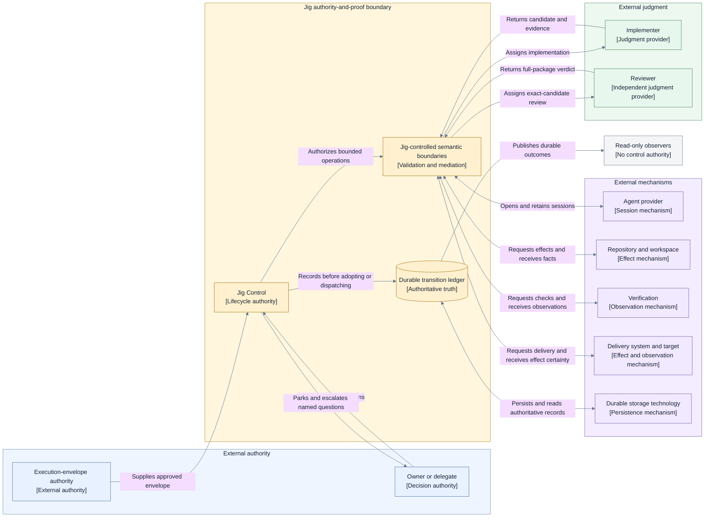

# Jig Stage 1 high-level architecture

## Status and approval boundary

This document and the connected [decision record](./decisions.md) form the complete approved and
locked Stage 1 foundation for Jig's redesign. They record Decisions 1–9 and the owner's final
approval on 2026-07-14.

The set claims no implementation, migration, delivery sequence, or current-state truth. Stage 2
may refine mechanisms within this foundation but may change a locked invariant only through an
explicit Stage 1 reopen, impact statement, and renewed owner approval.

No product-reference material was consulted or imported while developing this architecture.

## Architecture summary

Jig owns the deterministic authority-and-proof boundary for turning an approved execution envelope
into reviewed, landed work or a deliberate, inspectable stop. It owns semantic capability
boundaries, preflight sufficiency, request identity, validation, authoritative recording, lifecycle
decisions, reconciliation, and proof obligations.

Implementers and reviewers provide judgment. Configured adapters and providers perform mechanisms
and report attributable facts or effect certainty. Being outside Jig's decision-authority boundary
does not imply being outside Jig's repository, installation, deployment, or process.

The reviewer owns full-package judgment and approval of an exact candidate. Valid approval is the
acceptance gate and permits finalization. Jig validates authority, identity, binding, required
evidence availability and integrity, unresolved findings, and lifecycle position without
independently rejudging sufficiency. Frozen policy selects final verification as `deterministic` or
`none`.

Jig serializes target-sensitive finalization while allowing independent implementation and review
to proceed concurrently. It treats a durable ordered transition ledger as authority, reconstructs
live state after interruption, reconciles uncertain effects before authorizing another semantic
attempt, and unlocks dependencies only after confirmed landing.

## Canonical vocabulary and source roles

| Term                               | Canonical meaning                                                                                                                                                                 |
| ---------------------------------- | --------------------------------------------------------------------------------------------------------------------------------------------------------------------------------- |
| **Architecture Authority**         | The initiative [goal](../GOAL.md) plus explicit owner decisions.                                                                                                                  |
| **Owner Decision**                 | An explicit owner selection, import, approval, rejection, stop, exception, or reopen; never inferred from silence or document labels.                                             |
| **Working Contract**               | The applicable `AGENTS.md` and handoff instructions governing behavior and source scope without selecting architecture.                                                           |
| **Architecture Method**            | The active guidelines defining how alternatives, views, approval, and locking work.                                                                                               |
| **Directional Source**             | The immutable standalone proposal: candidate direction to preserve, test, revise, or reject.                                                                                      |
| **Review Evidence**                | Immutable review findings used as failure scenarios and questions, not automatic fixes.                                                                                           |
| **Product Reference**              | A product observation that may inform discussion but has no governing force.                                                                                                      |
| **Imported Promise or Constraint** | An exact external statement elevated by explicit owner decision with provenance, rationale, consequences, and affected architecture decisions.                                    |
| **Proposed Architecture**          | A coherent candidate that remains non-authoritative until the complete Stage 1 foundation is explicitly approved and locked.                                                      |
| **Execution Envelope**             | The already-approved plan, policy, and configuration submitted to Jig.                                                                                                            |
| **Jig Control**                    | The logical authority that validates triggers, makes deterministic lifecycle decisions, authorizes operations, records durable truth, and reconciles interruption or uncertainty. |
| **Candidate**                      | One exact committed story result with its target basis, evidence, and delivery metadata.                                                                                          |
| **Accepted**                       | The durable Jig lifecycle decision produced from a valid reviewer approval of the exact candidate and Jig's structural and authority validation.                                  |
| **Landed**                         | The durable business outcome recorded only after the authoritative target is observed to contain the accepted result.                                                             |
| **Retirement**                     | Settlement, preservation, cleanup, release, or explicit handoff of resources and obligations after a business outcome.                                                            |
| **Residual Obligation**            | A durable, owner-assigned retirement or proof obligation that could not be completed automatically.                                                                               |

## System boundary and external relationships

### Boundary rule

Jig's boundary is defined by authority and proof responsibility, not packaging. Jig includes every
responsibility required to control the lifecycle and prove its decisions. Concrete agent providers,
repository mechanisms, verification mechanisms, delivery systems, and storage technologies remain
external mechanisms behind Jig-owned semantic boundaries even when they are bundled with or run in
the same process as Jig.

Inside Jig's responsibility boundary:

- execution-envelope intake and preflight;
- frozen run-definition ownership after acceptance;
- deterministic lifecycle, scheduling, concurrency, and finalization decisions;
- authoritative live-state projection and durable transition recording;
- stable transition and operation identity;
- operation authorization, validation, fencing, and reconciliation;
- structured implementer and reviewer assignment and result validation;
- acceptance recording and evidence-integrity validation;
- workspace, verification, delivery, and storage mediation;
- landing confirmation and preservation-safe retirement coordination;
- parking, escalation, owner-decision intake, and deterministic continuation; and
- durable observable run outcomes.

Outside Jig's decision-authority boundary:

- the execution-envelope producer and approver;
- the Jig owner or explicitly delegated decision authority;
- implementer and reviewer judgment providers;
- agent-provider mechanisms;
- repository and workspace substrates;
- verification execution mechanisms;
- delivery systems and integration targets;
- durable storage technologies; and
- read-only observers and downstream consumers.

### System-context and authority view

- **Question:** What is inside Jig's authority-and-proof boundary, and how do external participants
  and mechanisms relate to it?
- **View type:** System context and authority.
- **Purpose:** Establish the Layer 1 system boundary without selecting components, ports, packages,
  or deployment topology.
- **Audience:** Jig owner, architecture reviewers, engineering, security, and operations.
- **Scope:** Logical authority and information relationships; provider and transport details are
  excluded.
- **State:** Approved and locked.
- **Owner:** Jig owner.
- **Sources:** [Initiative goal](../GOAL.md) and [Decisions 1–3](./decisions.md).
- **Related views:** Lifecycle, state, acceptance, and failure sections in this document.

**Legend:** Blue nodes are external authorities. Yellow nodes are Jig-owned responsibilities.
Green nodes are judgment providers. Purple nodes are mechanisms that perform or observe but do not
own lifecycle decisions. Gray nodes are read-only consumers. Every relationship is directed and
named; color is supplementary rather than the sole carrier of meaning.

### Named external relationships

| External participant or system | Relationship with Jig                                                                                                     |
| ------------------------------ | ------------------------------------------------------------------------------------------------------------------------- |
| Execution-envelope authority   | Supplies an already-approved plan, policy, and configuration; does not mutate an accepted run implicitly.                 |
| Owner or delegate              | Receives named escalations and returns explicit decisions within recorded authority scope.                                |
| Implementer                    | Receives a bounded assignment and returns an exact candidate, self-report, and supporting evidence.                       |
| Reviewer                       | Independently judges the exact candidate, implementation, requirements, risks, evidence, findings, and delivery metadata. |
| Agent provider                 | Hosts role-specific sessions behind Jig's assignment and validation boundary.                                             |
| Repository/workspace mechanism | Performs isolated repository operations and reports observed branch, content, cleanliness, and preservation facts.        |
| Verification mechanism         | Executes policy-selected checks against an exact candidate and reports observations.                                      |
| Delivery system and target     | Performs authorized publication or integration and reports target, remote-gate, effect-certainty, and landing facts.      |
| Durable storage technology     | Persists authoritative Jig records and returns durability or integrity observations without choosing their semantics.     |
| Read-only observers            | Consume durable views and outcomes without becoming an undeclared control path.                                           |

## Responsibilities, trust, and authority

### Power vocabulary

| Power         | Meaning                                                                                          |
| ------------- | ------------------------------------------------------------------------------------------------ |
| **Propose**   | Supply a candidate, recommendation, verdict, or requested action without changing control state. |
| **Perform**   | Execute work or an external effect.                                                              |
| **Observe**   | Report directly observed facts.                                                                  |
| **Attest**    | Return an attributable, contract-valid claim about an observation or judgment.                   |
| **Authorize** | Permit a bounded operation under approved policy.                                                |
| **Decide**    | Select a lifecycle state, outcome, escalation, or exception.                                     |
| **Record**    | Create the authoritative durable control fact.                                                   |
| **Reconcile** | Resolve uncertain, duplicate, or interrupted activity from durable and external evidence.        |

### Responsibility and authority matrix

| Participant                    | Granted powers                              | Responsibility and trust scope                                                                                                                 | Explicitly excluded                                                                    |
| ------------------------------ | ------------------------------------------- | ---------------------------------------------------------------------------------------------------------------------------------------------- | -------------------------------------------------------------------------------------- |
| Jig Control                    | Authorize, Decide, Record, Reconcile        | Validates inputs and results; schedules work; owns lifecycle, operation identity, authoritative state, recovery, and proof obligations.        | Implementation or review judgment; provider-specific effects; invented external facts. |
| Owner or recorded delegate     | Authorize, Decide                           | Owns architecture approval, policy exceptions, named escalations, imported promises, stop/continue choices, and reopens within explicit scope. | Routine implementation, verification, delivery, or implicit ambient intervention.      |
| Implementer                    | Propose, Perform, self-Observe, self-Attest | Produces implementation, exact candidate, summaries, and evidence about its own actions.                                                       | Reviewing its own sufficiency; lifecycle or remote-delivery authority.                 |
| Reviewer                       | Propose, Observe, Attest judgment           | Owns full-package judgment for the exact candidate and returns approval, changes required, or block.                                           | Editing the candidate; performing delivery; changing lifecycle state directly.         |
| Verification mechanism         | Perform, Observe, Attest                    | Executes configured verification and reports exact-subject outcomes.                                                                           | Choosing required checks, judging implementation sufficiency, or authorizing delivery. |
| Repository/workspace mechanism | Perform, Observe, Attest                    | Provisions or retires isolation and reports repository, content, cleanliness, and preservation facts.                                          | Implementing work, remote integration, eligibility, or acceptance decisions.           |
| Delivery mechanism             | Perform, Observe, Attest                    | Performs an authorized external effect and reports identity, outcome, and effect certainty.                                                    | Choosing whether delivery is allowed or declaring lifecycle completion.                |
| Durable store                  | Perform storage, Attest persistence         | Preserves Jig-created records and reports persistence or integrity.                                                                            | Selecting semantic facts, lifecycle state, retries, or reconciliation outcomes.        |
| Read-only observers            | Observe                                     | Consume authoritative views and outcomes.                                                                                                      | Supplying undeclared control input or changing state.                                  |

Jig records owner decisions and participant attestations. Participants do not write authoritative
lifecycle history directly.

### Trust and compromised-participant posture

- Every external result is validated against request identity, role, exact subject, current
  lifecycle phase, fence, and configured capability.
- Implementer self-report and reviewer judgment remain attributable inputs; neither can directly
  dispatch delivery or write lifecycle state.
- A mechanism is trusted only for its scoped observation or effect and cannot widen that scope
  through its result.
- Missing, contradictory, stale, malformed, or integrity-failing input fails closed.
- A story-scoped participant failure may block that story while independent work continues.
- Loss or compromise of shared Jig authority, the authoritative ledger, or controller fencing
  interrupts the affected run.
- Compromise of Jig Control or owner decision authority is a trust-root failure requiring
  externally governed recovery.

## Canonical lifecycle and information flow

### Run lifecycle

| Stage                        | Meaning and exit                                                                                                                                                            |
| ---------------------------- | --------------------------------------------------------------------------------------------------------------------------------------------------------------------------- |
| **Received**                 | Jig assigns a stable run identity to the submitted execution envelope; no execution effect has occurred.                                                                    |
| **Preflighting**             | Jig validates the complete envelope, routes, capabilities, authority, and policy. Failure durably rejects the run before story effects; success freezes the run definition. |
| **Active**                   | Jig derives eligibility, admits work within resource-class capacity, and coordinates story lifecycles and target finalization.                                              |
| **Parked**                   | A named run- or story-scoped question awaits owner/delegate authority. Unaffected work may continue only when shared authority is not implicated.                           |
| **Interrupted / Recovering** | Jig fences stale control, reconstructs durable state, reconciles operations, leases, target state, and external effects, then resumes, parks, blocks, or stops.             |
| **Settling**                 | No story can make further business progress; final outcomes and retirement obligations are resolved.                                                                        |
| **Completed**                | Every story has a final business outcome and every retirement obligation is completed or explicitly handed off through owner-approved residual obligation.                  |

### Story lifecycle

1. **Pending:** wait for confirmed-landed prerequisites without allocated story resources.
2. **Eligible:** enter deterministic admission ordering when prerequisites and capacity allow.
3. **Preparing:** establish isolated resources and the implementer assignment.
4. **Implementing:** produce a committed exact candidate and required evidence.
5. **Reviewing:** the reviewer performs full-package judgment; changes return through bounded
   rework.
6. **Accepted:** Jig durably records a valid exact-candidate approval after structural, identity,
   authority, evidence-availability, integrity, findings, and lifecycle validation.
7. **Waiting for finalization:** wait in deterministic order without target finalization authority.
8. **Finalizing:** acquire target-scoped authority, align with the target, renew review after
   candidate-changing refresh, perform policy-selected final verification, authorize delivery,
   reconcile uncertainty, and confirm landing.
9. **Business outcome:** record `Landed`, directly `Blocked`, or derive
   `Not run — dependency blocked`.
10. **Retiring:** settle operations, release authority, preserve work and evidence, close sessions,
    and safely retire or hand off resources.
11. **Closed:** both business outcome and retirement obligations are final.

### Business outcome versus retirement

| Business outcome             | Immediate consequence                                                   | Retirement that still follows                                                                                     |
| ---------------------------- | ----------------------------------------------------------------------- | ----------------------------------------------------------------------------------------------------------------- |
| Landed                       | Dependents become eligible immediately; cleanup cannot reverse landing. | Release finalization authority, close sessions, confirm preservation, and retire resources.                       |
| Blocked                      | Transitive dependents become ineligible; independent work may continue. | Reconcile uncertainty, preserve work and evidence, apply checkpoint policy, release authority, and retire safely. |
| Not run — dependency blocked | Report the complete ordered set of reachable direct blocker roots.      | No story resources exist; retirement is already satisfied.                                                        |

### Authoritative information flow

For every accepted trigger:

1. Jig validates identity, role, subject, fence, and current authoritative state.
2. Jig deterministically calculates the next decision, transition identity, and operation
   identities.
3. Jig conditionally and durably records the decision and operation intents.
4. Jig confirms that exact durable commit.
5. Only then does Jig update its live projection and dispatch authorized mechanisms.
6. Mechanisms return attributable results or effect certainty as later triggers.
7. Jig records and decides again; uncertain persistence or effects enter reconciliation rather
   than being assumed or blindly retried.

An owner escalation follows the same model: Jig durably parks a bounded question, validates the
owner or delegate response and authority scope, records the accepted decision, then continues or
stops deterministically.

## State, persistence, and recovery

### State classification

| Classification                         | Canonical contents                                                                                                                                                                                                                                                                                                                                   |
| -------------------------------------- | ---------------------------------------------------------------------------------------------------------------------------------------------------------------------------------------------------------------------------------------------------------------------------------------------------------------------------------------------------- |
| **Durable authority**                  | Run identity and frozen envelope; ordered transition decisions; stable operation identities and effect certainty; story business and retirement states; exact candidates, reviews, acceptance, evidence references, target bases, fences, counters, waits, landing proof, owner decisions, escalations, residual obligations, and terminal outcomes. |
| **Transient cache or mechanism state** | In-memory projections and indexes; prepared but unrecorded requests; queues and capacity calculations; provider clients and process handles; local timer objects; UI/read-model caches; temporary access material; and unaccepted external observations.                                                                                             |
| **Derived and recomputable**           | Eligibility, dependency-blocked outcomes, deterministic queue ordering, capacity use, run summaries, read-only projections, metrics, and compact completed-story indexes.                                                                                                                                                                            |

Opaque external resource identity is durable when recovery needs it; a live provider object is not.
Credentials and secret values never enter the durable control record.

### Durable authority and adoption ordering

The ordered transition ledger is the source of truth. A snapshot or current-state materialization
may accelerate reconstruction only when its ledger position is verifiable.

If durable commit acknowledgement is lost, Jig resolves the stable transition identity and prior
position:

- confirmed committed: adopt exactly once;
- confirmed absent: retry the same transition identity and content; or
- indeterminate: halt advancement and enter recovery.

Jig never dispatches effects from an indeterminate control commit.

### Stable operation identity and fencing

- One semantic effect has one durable operation identity.
- Duplicate-safe redispatch retains the same identity, payload basis, and authority fence.
- A new semantic attempt receives a new linked identity only after the earlier effect is reconciled.
- Candidate-sensitive effects bind to story, candidate, target basis, and current finalization
  authority.
- A durable controller generation fences stale pre-interruption dispatchers.
- Stale, duplicate, mismatched, or late results never advance state.

### Reconstruction and reconciliation

After interruption, Jig acquires a new controller generation, verifies the ledger, reconstructs
canonical state, enumerates pending and uncertain operations, reconciles external state, records
the observations, revalidates leases and authorities, and only then resumes.

No irreversible effect is blindly replayed. If an effect is confirmed, Jig adopts its factual
result. If confirmed absent, policy may authorize a bounded retry. If still indeterminate, Jig
parks and escalates without authorizing a second semantic effect.

If the ledger is unavailable, corrupted, rolled back, or compromised beyond trustworthy recovery,
Jig cannot guarantee correct reconstruction, audit completeness, operation ownership,
no-double-effect behavior, safe autonomous resume, or trustworthy terminal outcomes. It fails
closed and requires externally governed recovery.

## Reviewer-principal acceptance and trustworthy evidence

### Acceptance authority

The reviewer owns full-package judgment of:

- the implementation;
- requirements and acceptance criteria;
- technical and delivery risk;
- implementer evidence sufficiency, provenance, and relevance;
- findings and unresolved issues; and
- delivery metadata accuracy and completeness.

A valid reviewer approval of the exact candidate is the acceptance gate and permits finalization.
Jig validates:

- reviewer identity and authority;
- exact candidate and lifecycle binding;
- required evidence availability and integrity;
- absence of unresolved findings; and
- current lifecycle position.

Jig then durably records `Accepted` without independently rejudging the reviewer's sufficiency
assessment.

### Policy-selected final verification

Frozen policy selects:

- `deterministic`: run the configured final check set against the exact accepted candidate before
  delivery; or
- `none`: proceed from reviewer approval and the reviewed implementer evidence.

Configuration and providers may satisfy or exceed policy but cannot weaken or silently change it.
A failed required verification prevents delivery. Any candidate mutation invalidates acceptance
and returns through implementation and full review.

### Evidence roles

| Source                         | Contribution                                                                                              | Limit                                                                                |
| ------------------------------ | --------------------------------------------------------------------------------------------------------- | ------------------------------------------------------------------------------------ |
| Implementer                    | Candidate, summary, changed scope, self-report, assigned-check evidence, and artifacts.                   | Cannot review its own sufficiency or authorize lifecycle/delivery.                   |
| Reviewer                       | Full-package judgment and exact-candidate verdict.                                                        | Cannot perform delivery or attest future target/effect facts.                        |
| Repository/workspace mechanism | Exact content, branch, target-basis, cleanliness, and preservation observations.                          | Cannot judge acceptance.                                                             |
| Verification mechanism         | Policy-selected exact-candidate check observations.                                                       | Cannot choose checks or decide sufficiency.                                          |
| Delivery mechanism             | Remote identity, gate state, effect certainty, and landing observations.                                  | Cannot declare lifecycle completion.                                                 |
| Jig trusted envelope           | Run scope, producer attribution, correlation, recorded time, subject association, and integrity metadata. | Does not make the underlying claim true merely because it is well formed or durable. |

Large or provider-shaped evidence remains in immutable bounded artifacts. The authoritative ledger
contains bounded decision facts, manifest completeness, digests, and references. Candidate
mutation, target-refresh mutation, or altered delivery metadata invalidates current use of prior
acceptance and evidence.

### Landing proof

Delivery success is not landing proof. Jig records `Landed` only after a post-effect observation
establishes that the configured authoritative target contains the accepted result under the
selected integration method. Push, PR creation, passing checks, or an integration response is
insufficient alone. Missing, contradictory, or indeterminate landing evidence enters
reconciliation and cannot unlock dependents.

## Concurrency, capacity, and finalization

### Resource-class capacity

Capacity is modeled by actual scarce resource class rather than active-story count alone. Classes
may include workspace capacity, retained session identities, active implementer or reviewer turns,
verification execution, delivery operations, provider-specific execution capacity, and the single
target finalization authority.

Policy defines allowed maxima and required progress reserve. Configuration declares hard available
capacity. The effective optional maximum is the lower supported value. Preflight rejects when a
mandatory class is unavailable, an explicit policy minimum is unsupported, or the combination
cannot preserve a path for admitted work to reach its next mandatory safe point.

When constrained, Jig advances or retires admitted work before admitting new stories. A
maximum-active-story value may remain an additional safety ceiling but is not the capacity model.

### Deterministic total ordering

Every story has immutable, preflight-validated:

1. approved plan priority;
2. plan ordinal; and
3. unique story ID.

That tuple is the total comparator for otherwise-equal admission, finalization, and blocker
attribution choices. An admitted story or current lease holder is not preempted by a later
higher-priority story.

### Target finalization authority

- Exactly one story owns finalization authority for the configured target.
- Accepted stories wait in deterministic order without a lease and do not repeatedly refresh or
  mutate the target.
- The durable lease/fence binds story, controller generation, candidate, target basis, and lease
  generation.
- A bounded target refresh may retain story ownership; candidate-changing refresh requires renewed
  full review and atomic authority rebinding.
- Ordinary implementation rework releases finalization authority and returns through acceptance.
- Landing, reconciled block, explicit stop, or recovery-driven transfer releases the authority.
- Recovery reconstructs and reconciles the lease and target before resuming or reassigning it.

Only confirmed landing unlocks dependencies. Direct blockers remain durable facts; a dependency
blocked by several stories reports the complete set of reachable direct blocker roots in canonical
order.

## Failure, escalation, and liveness

### Failure containment

| Scope               | Posture                                                                                               | Continuation                                                                    |
| ------------------- | ----------------------------------------------------------------------------------------------------- | ------------------------------------------------------------------------------- |
| Story               | Bounded retry or rework, then block or park; preserve and retire resources.                           | Independent stories continue; transitive dependents remain ineligible.          |
| Target/finalization | Fence further target effects and reconcile the current operation before another finalizer proceeds.   | Safe implementation and review may continue within capacity.                    |
| Shared run          | Stop new dispatch, interrupt, reconstruct, reconcile, and resume only after authority is trustworthy. | No control transition continues while ledger or controller authority is unsafe. |
| Preflight           | Reject before story effects.                                                                          | No story starts.                                                                |

A failure remains at the smallest safe scope. It becomes shared only when uncertainty or authority
crosses story boundaries.

### Bounded progress

Every retry, rework, target refresh, wait, recovery, and retirement path has:

- a named owner;
- a durable reason;
- a wake or completion condition;
- a deadline, attempt, or budget class;
- a next action on success; and
- an explicit exhaustion action.

Durable wait obligations create typed wake triggers; transient timers carry no decision authority.
Exhaustion becomes an explicit retry, block, park, escalation, interruption, or residual handoff,
never silent success or indefinite waiting.

A best-effort operation may fail without blocking only when frozen policy classifies it as
non-gating and Jig durably records the failure.

### Automatic fail-closed and owner authority

Jig automatically fails closed for invalid input, identity, authority, fence, subject, lifecycle,
evidence, durable recording, candidate approval, uncertain effect, target proof, landing proof, or
shared trust.

Owner or recorded delegate authority is required to change policy or authority scope, waive or
revise a gate, accept a residual obligation, govern recovery after trust-root failure, choose a
risk-bearing ambiguity, stop or replace a run definition, approve an unauthorized destructive
cleanup, or import a governing promise.

An owner may authorize investigation, safe stop, or residual handoff. An owner decision cannot
turn missing evidence into a factual claim that an uncertain effect or landing occurred.

### Liveness guarantee

For a finite frozen run, Jig guarantees that no accepted scope remains in an unnamed or unbounded
wait. Every story eventually reaches `Landed`, directly `Blocked`, or derived
`Not run — dependency blocked`; every retirement obligation eventually completes or becomes an
explicit owner-accepted residual handoff.

This guarantee assumes a trustworthy ledger and controller fence, eventually available configured
capacity, compliant mechanisms that respond or time out, a target that eventually remains stable
long enough for bounded finalization, and an owner or delegate who eventually answers escalations.
Without those assumptions, Jig guarantees a durable named stop condition rather than successful
delivery or autonomous completion.

## Retirement and residual obligations

Business outcome and retirement are separate dimensions. Landing immediately unlocks dependents;
blocking immediately makes transitive dependents ineligible. Neither outcome permits unsafe
resource destruction.

Retirement settles or fences pending operations, preserves committed work and evidence, applies
required checkpoint behavior, releases finalization authority, closes sessions, and safely removes
or hands off resources.

When automatic retirement cannot complete, Jig records a residual obligation containing the
affected resource or proof obligation, the reason, preservation and safety evidence, accountable
owner, accepted handoff decision, and final completion or residual status. The run completes only
after every obligation is retired or explicitly handed off.

## Invariants Stage 2 must preserve

1. `GOAL.md` and explicit owner decisions remain the architecture authority; outside material is
   non-binding unless explicitly imported.
2. Jig owns the authority-and-proof boundary even when external mechanisms are bundled with or run
   inside Jig.
3. Jig Control remains the sole routine lifecycle authority; judgment and mechanisms retain only
   their scoped powers.
4. The same authoritative state and ordered validated trigger produce the same decision and
   authorized operations.
5. The durable ordered transition ledger remains authoritative and is committed before live-state
   adoption or effect dispatch.
6. Recovery reconstructs durable truth and fences stale control before dispatch resumes.
7. Candidate-sensitive judgment, evidence, authority, and effects remain bound to the exact subject;
   stale or mismatched facts fail closed.
8. Reviewer full-package approval of the exact candidate remains the acceptance gate; Jig validates
   but does not independently rejudge sufficiency.
9. Frozen policy selects final verification `deterministic` or `none`; providers cannot lower or
   silently change it.
10. Capacity remains explicit by scarce resource class and deterministic scheduling preserves a
    progress path for admitted work.
11. Admission, finalization, and attribution ties use the immutable total comparator.
12. Exactly one story owns target-scoped finalization authority; waiting stories hold no lease.
13. Only confirmed landing unlocks dependencies; approval, publication, checks, integration
    request, or cleanup does not.
14. Direct blockers remain durable facts and multi-root dependency outcomes preserve the complete
    canonically ordered root set.
15. Failures remain at the smallest safe scope and fail closed whenever authority or proof is
    insufficient.
16. Every retry, rework, refresh, wait, recovery, and retirement path is bounded and has an explicit
    exhaustion action.
17. A second semantic effect is forbidden until the earlier effect is known absent or reconciled.
18. Business outcome and retirement remain separate; cleanup cannot reverse landing or delay
    dependency release.
19. Work and evidence are preserved before resource destruction; unresolved retirement becomes a
    durable owner-assigned residual obligation.
20. The architecture makes no autonomous safety or recovery guarantee after authoritative-store or
    decision-authority compromise.
21. Stage 1 approval remains distinct from implementation and current-state truth; changing a locked
    invariant requires explicit reopen and renewed owner approval.

## Deliberate Stage 2 deferrals

The decision record's
[consolidated deliberate Stage 2 deferrals](./decisions.md#consolidated-deliberate-stage-2-deferrals)
are the single canonical, complete inventory. They decide how to realize this foundation; they do
not defer or reopen authority, durable truth, acceptance, landing, failure containment, recovery,
liveness, or any other locked invariant.

## Complete-foundation approval and lock

The complete foundation is **approved and locked**.

- **Final approver:** Arye Kogan
- **Final approval date:** 2026-07-14
- **Approved scope:** The complete connected Layer 1 foundation in this document and
  [the decision record](./decisions.md), including Decisions 1–9 and the consolidated invariants.
- **Accepted negative consequences:**
  - durable reconciliation complexity and fail-closed availability costs;
  - residual reviewer-judgment and evidence-sufficiency risk under the D7 reviewer-principal model,
    especially when frozen policy selects final verification as `none`;
  - review churn after target refresh or candidate mutation;
  - utilization costs from resource-class capacity and one target-scoped finalization authority;
  - bounded exhaustion that can require parking, blocking, escalation, interruption, or residual
    handoff; and
  - constraints imposed by explicit adapter contracts and the locked authority boundary.
- **Accepted Stage 2 deferrals:** The complete
  [consolidated deliberate Stage 2 deferral list](./decisions.md#consolidated-deliberate-stage-2-deferrals).
- **Lock effect:** Stage 2 may refine mechanisms but cannot change a consolidated invariant without
  an explicit Stage 1 reopen, impact statement, and renewed owner approval.

This approval records an architecture decision. It does not claim implementation, migration,
delivery sequencing, or current-state conformance.
