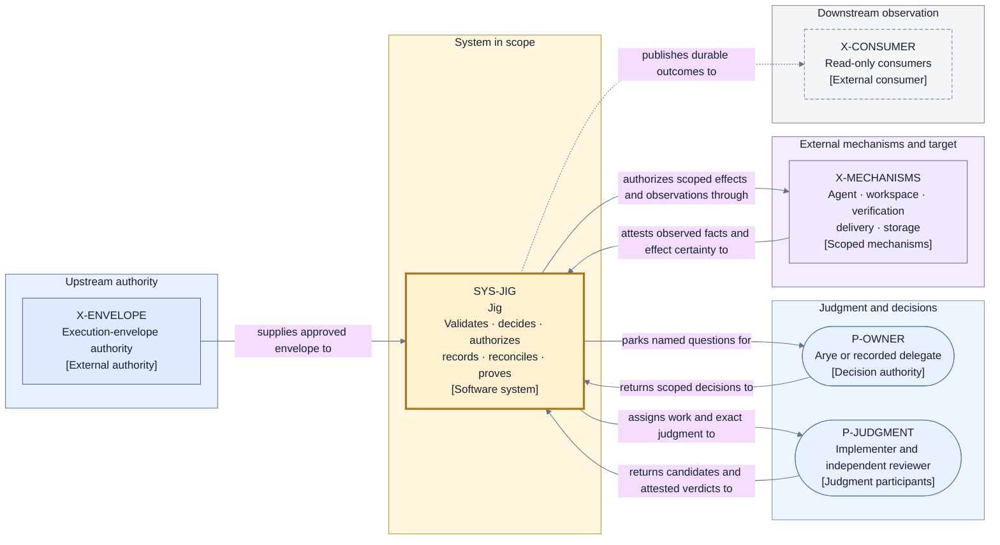

# Canonical design workspace

This directory holds the new canonical redesign, organized by abstraction level and view type
following the [architecture guide](../architecture-design-and-documentation-guide.md): one project
brief, one canonical model, and selective views over that model, each answering one question for one
audience. Approval still advances one layer at a time; the layer gates are recorded per artifact and
in the [review and approval record](./decisions/review-and-approval-record.md).

## Architecture at a glance

Jig owns the deterministic **authority-and-proof boundary** that turns an already-approved
**Execution Envelope** into reviewed, landed work or a deliberate, durable, inspectable non-delivery
outcome. It owns preflight sufficiency, stable identity, lifecycle and concurrency decisions,
operation authorization, authoritative recording, exact-subject validation, reconciliation, landing
proof, escalation, and preservation-safe retirement.

External participants retain their proper expertise and mechanisms retain their proper effects:

- the envelope authority supplies the approved plan, policy, and configuration;
- the implementer produces an exact candidate and attributable evidence;
- the reviewer independently judges the complete exact candidate;
- configured agent, workspace, verification, delivery, and storage mechanisms perform or observe
  scoped work; and
- Arye or an explicitly recorded delegate answers only the decisions within their recorded scope.

Jig validates every input and attestation before it can affect control state. **Jig Control** is the
sole routine lifecycle authority. It records an accepted transition and its operation intents in a
durable ordered ledger before adopting live state or dispatching effects. Recovery fences stale
control, reconstructs that durable truth, and reconciles uncertain effects before another semantic
attempt.

Eligible implementation and review may progress concurrently within explicit scarce-resource
capacity. Target-changing finalization is serialized through one target-scoped authority and a
deterministic total order. A valid reviewer approval of the exact candidate creates `Accepted`;
only authoritative proof that the target contains that accepted result creates `Landed` and releases
dependent work. Business outcome and retirement remain separate, so cleanup cannot reverse landing
or delay dependency release.

### System summary view

- **Question:** At the highest level, who supplies, judges, decides, performs, and observes around
  Jig?
- **View type:** System summary; a deliberately simplified grouping of the full
  [system context view V1](./context.md).
- **Audience and purpose:** Every first-time reader; orient before opening any detailed page.
- **Scope and exclusions:** Grouped participants only. Individual mechanisms, relationship limits,
  and all internal structure are excluded; V1 owns the ungrouped context.
- **State:** Approved and locked with the Layer 1 candidate. **Owner:** Arye Kogan.

**Legend:** Rounded rectangles are people; ordinary rectangles are authorities, systems, mechanisms,
or consumers. The thick solid border marks the one system in scope; the dashed border marks a
read-only consumer. Solid directed lines carry authorized input, work, fact, or decision
relationships; the dashed line is publication with no control authority. `P-JUDGMENT` groups V1's
`P-IMPLEMENTER` and `P-REVIEWER`; `X-MECHANISMS` groups V1's `X-AGENT`, `X-WORKSPACE`, `X-VERIFY`,
`X-DELIVERY`, and `X-STORE`; every other ID matches [V1](./context.md) exactly. Color is redundant:
every node carries its stable ID and bracketed type.

## Read this first

- **Product or business reader:** [Project brief](./brief.md) → [System context](./context.md).
- **New engineer or architect:** [System context](./context.md) → [Canonical model](./model.md) →
  [Run and Story lifecycle](./flows/run-and-story-lifecycle.md).
- **Security reviewer:** [Authority and trust](./perspectives/authority-and-trust.md) →
  [Acceptance and evidence](./acceptance-and-evidence.md) →
  [Failure and liveness](./failure-and-liveness.md).
- **Operations reader:** [Run and Story lifecycle](./flows/run-and-story-lifecycle.md) →
  [State and recovery](./state-and-recovery.md) →
  [Failure and liveness](./failure-and-liveness.md).
- **Reviewer of this candidate:** [Decision index](./decisions/README.md) →
  [Invariants](./invariants.md) →
  [Review and approval record](./decisions/review-and-approval-record.md).
- **Layer 2 reader or author:** [Invariants](./invariants.md) →
  [D9 Layer 2 boundary](./decisions/D9-invariants-and-artifact-shape.md) →
  [Runtime architecture](./runtime.md) → [Layer 2 gate record](./decisions/layer2-gate-record.md).

## Document map

| Page                                                                    | Level or view type            | Question it answers                                                                              |
| ----------------------------------------------------------------------- | ----------------------------- | ------------------------------------------------------------------------------------------------ |
| [Project brief](./brief.md)                                             | Level 0 — project brief       | Why does the redesign exist, for whom, and under which constraints and quality scenarios?        |
| [Canonical model](./model.md)                                           | Canonical model               | What vocabulary, stable identities, and binding rules does every view reference?                 |
| [System context](./context.md)                                          | Level 1 — system context (V1) | What is inside Jig's authority-and-proof boundary, and what surrounds it?                        |
| [Authority and trust](./perspectives/authority-and-trust.md)            | Perspective (V2)              | Who holds which power, how is trust validated, and how far does compromise propagate?            |
| [Run and Story lifecycle](./flows/run-and-story-lifecycle.md)           | Dynamic flow (V3, V3a–V3c)    | How do a Run and its Stories progress, branch on failure, and stay authoritative?                |
| [Story delivery scenario](./flows/story-delivery.md)                    | Dynamic flow (V5, sequence)   | What happens, in order, when one Story goes from assignment to confirmed landing?                |
| [State and recovery](./state-and-recovery.md)                           | Supporting state view (V4)    | What is durably authoritative, what is replaceable, and how does recovery reconcile uncertainty? |
| [Acceptance and evidence](./acceptance-and-evidence.md)                 | Supporting view               | What judgment accepts an exact Candidate, which evidence counts, and what proves landing?        |
| [Concurrency and finalization](./concurrency-and-finalization.md)       | Supporting view               | How is concurrent work admitted deterministically and target change serialized?                  |
| [Failure and liveness](./failure-and-liveness.md)                       | Supporting view               | How are failures contained, waits bounded, liveness guaranteed, and work retired safely?         |
| [Invariants](./invariants.md)                                           | Contract                      | Which rules must every later design preserve, and where does each come from?                     |
| [Decision records](./decisions/README.md)                               | Decisions (D1–D9)             | Why was each direction selected, what was rejected, and which burdens are accepted?              |
| [Review and approval record](./decisions/review-and-approval-record.md) | Gate record                   | What was reviewed, what passed, and what remains before approval and lock become effective?      |

### Layer 2 document map (approved, not locked)

The Layer 2 pages consume the
[D9 consolidated deferrals](./decisions/D9-invariants-and-artifact-shape.md#consolidated-deliberate-layer-2-deferrals)
one category at a time; the
[Layer 2 gate record](./decisions/layer2-gate-record.md) owns the coverage traceability and gate
state.

| Page                                                                        | Level or view type                    | Question it answers                                                                         |
| --------------------------------------------------------------------------- | ------------------------------------- | ------------------------------------------------------------------------------------------- |
| [Envelope production](./envelope-production.md)                             | Product boundary view (V18)           | How do tracks, setup, work profiles, and Work Source become one approved envelope?          |
| [Runtime architecture](./runtime.md)                                        | Level 2 — runtime (V6, V6a)           | What runnable or stored units realize Jig, through which ports and processes?               |
| [Control plane components](./components/control-plane.md)                   | Level 3 — component (V7)              | How is the run controller internally organized, and which component holds which power?      |
| [Data and identity](./data-and-identity.md)                                 | Data view (V8)                        | How are identities, fences, and schemas represented and bound?                              |
| [Lifecycle catalogs](./lifecycle-catalogs.md)                               | State machines and catalogs (V9, V9a) | Which exhaustive states, events, Operations, and failure codes close the lifecycle?         |
| [Scheduling and bounds](./scheduling-and-bounds.md)                         | Supporting view (V10)                 | How are admission, reservations, waits, and budgets realized deterministically?             |
| [Persistence and projections](./persistence-and-projections.md)             | Supporting view (V11)                 | What contract makes the ledger durable, verifiable, and recoverable?                        |
| [Mechanism and provider contracts](./mechanism-and-provider-contracts.md)   | Supporting view (V12)                 | What must every configured mechanism satisfy before it can be trusted?                      |
| [Evidence handling](./evidence-handling.md)                                 | Supporting view (V13)                 | How is evidence stored, attributed, verified, redacted, and retained?                       |
| [Review and verification execution](./review-and-verification-execution.md) | Protocol view (V14)                   | How do the review protocol and policy-selected verification run in detail?                  |
| [Forge and landing](./forge-and-landing.md)                                 | Protocol view (V15)                   | Which forge Operations, strategies, and equivalence rules prove landing?                    |
| [Operations and observability](./operations-and-observability.md)           | Supporting view (V16)                 | How do escalation, read models, exports, and alerts surface durable truth?                  |
| [Architecture conformance](./architecture-conformance.md)                   | Contract (V17)                        | Which suites make the invariants executable for any realization?                            |
| [D10–D14 decision records](./decisions/README.md)                           | Decisions and readiness amendments    | Why were the runtime, ledger, mechanism, envelope, and provider-permission shapes selected? |
| [Layer 2 gate record](./decisions/layer2-gate-record.md)                    | Gate record                           | How Layer 2 was authored, reviewed, corrected, and approved, and what its gate covers?      |
| [Product readiness gate](./decisions/product-readiness-gate-record.md)      | Gate record                           | What closes every imported commitment, and when does that lock activate?                    |

### Reconciliation artifacts

The explicit owner decision of 2026-07-16 imported the five product guarantees into the redesign
under D1's import mechanism. These artifacts record the original import, the explicit
provider-permission correction to SEC-2 and its related FENCE, DOOR, CFG, DRIVE, and SEE
commitments, and the complete owner-approved readiness amendment.

| Page                                                                      | Level or view type      | Question it answers                                                                    |
| ------------------------------------------------------------------------- | ----------------------- | -------------------------------------------------------------------------------------- |
| [Product guarantee import](./decisions/product-guarantee-import.md)       | Imported promise record | What was imported from the product layer, from where, why, and at what accepted cost?  |
| [Product guarantee reconciliation](./product-guarantee-reconciliation.md) | Traceability matrix     | Which redesign element carries each imported commitment after the explicit correction? |

## Layer gate status

| Layer gate                        | Canonical or proposed artifacts                                                                 | Status                                                                                                                                                       |
| --------------------------------- | ----------------------------------------------------------------------------------------------- | ------------------------------------------------------------------------------------------------------------------------------------------------------------ |
| Layer 0 — project definition      | [Project brief](./brief.md)                                                                     | Approved; content unchanged by the 2026-07-15 relocation; governing input for Layer 1                                                                        |
| Layer 1 — high-level architecture | All Layer 1 pages in the document map, the decision records, and the invariants                 | Approved and locked; the 2026-07-15 fresh independent review of the exact candidate set returned `PASS` (see the review record)                              |
| Layer 2 — detailed architecture   | The Layer 2 document map above, D10–D12, and the Layer 2 gate record                            | Approved, not locked — the corrected candidate passed the 2026-07-16 round-4 verification recheck and Arye's explicit approval (see the Layer 2 gate record) |
| Product readiness amendment       | D13–D14, V18, amended Layer 2 contracts, product correction, reconciliation, and readiness gate | Complete owner-approved lock candidate; deterministic checks and exact independent review required before lock activation; PR remains unmerged               |

Arye retains all material product and architecture decision ownership. The bounded review
delegation permits an independent reviewer to approve only faithful organization and re-expression
of already-established intent; a `PASS` on the exact candidate set makes the recorded Layer 1
approval and lock effective without a separate owner-selection step. Layer 2 was authored under
the explicit owner continuation instruction of 2026-07-15 with D1–D9 and I1–I21 as fixed inputs,
and closed its gate on 2026-07-16 with Arye's explicit approval — approved, not locked — after
independent review, the ten-finding owner PR review, four correction passes, and the recorded
verification recheck.

The [raw provenance manifest](../raw/README.md) identifies binding decisions and historical
evidence; it does not make the prior presentation canonical.
