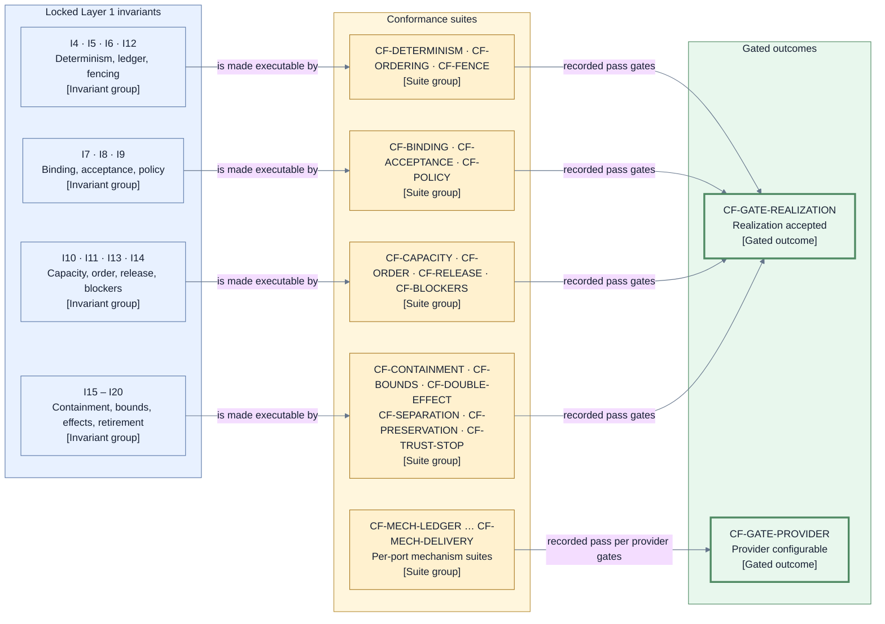

# Architecture conformance — executable suites for the locked invariants

This page consumes [D9](./decisions/D9-invariants-and-artifact-shape.md) category 13 (architecture
verification and conformance suites). Its purpose is to make [I1–I21](./invariants.md) executable:
each locked invariant maps to at least one conformance suite that any realization must pass, and
each suite tests the contract — observable decisions, records, and rejections — not the
implementation detail behind it. A realization may change internally without touching a suite;
a suite may not be weakened to admit a realization (the gate-integrity posture of I21).

## Suite catalog (`CF-*`)

| Suite                   | What it exercises                                                                                                                                                                                                                                                                                                                                                                                                                                                                                                                                                                                                                                                                                                                                                                                                                                                                                                                                                                                                                                                                                                                                                                                                                                                                                                                                                                                                                                                                                                                                                                                                                                                                                                                                                                                                   | Invariants        |
| ----------------------- | ------------------------------------------------------------------------------------------------------------------------------------------------------------------------------------------------------------------------------------------------------------------------------------------------------------------------------------------------------------------------------------------------------------------------------------------------------------------------------------------------------------------------------------------------------------------------------------------------------------------------------------------------------------------------------------------------------------------------------------------------------------------------------------------------------------------------------------------------------------------------------------------------------------------------------------------------------------------------------------------------------------------------------------------------------------------------------------------------------------------------------------------------------------------------------------------------------------------------------------------------------------------------------------------------------------------------------------------------------------------------------------------------------------------------------------------------------------------------------------------------------------------------------------------------------------------------------------------------------------------------------------------------------------------------------------------------------------------------------------------------------------------------------------------------------------------- | ----------------- |
| `CF-DETERMINISM`        | Replaying `SCH-EVENT` records in Run-ledger commit order — the sole I4 trigger order — reproduces identical decisions and Operation intents; producer-scoped dedup keys and controller derivation bases suppress duplicates, and arrival/provider-time permutations cannot change the result.                                                                                                                                                                                                                                                                                                                                                                                                                                                                                                                                                                                                                                                                                                                                                                                                                                                                                                                                                                                                                                                                                                                                                                                                                                                                                                                                                                                                                                                                                                                       | I4                |
| `CF-ORDERING`           | No live-state adoption and no effect dispatch happen before the corresponding ledger commit is confirmed.                                                                                                                                                                                                                                                                                                                                                                                                                                                                                                                                                                                                                                                                                                                                                                                                                                                                                                                                                                                                                                                                                                                                                                                                                                                                                                                                                                                                                                                                                                                                                                                                                                                                                                           | I5                |
| `CF-FENCE`              | Stale controller or finalization fences are rejected; an effectful same-identity retry occurs only after confirmed absence and recorded reauthorization refreshes every generation component, while an effect-free replacement receives a new identity.                                                                                                                                                                                                                                                                                                                                                                                                                                                                                                                                                                                                                                                                                                                                                                                                                                                                                                                                                                                                                                                                                                                                                                                                                                                                                                                                                                                                                                                                                                                                                             | I6, I12           |
| `CF-BINDING`            | Wrong-subject, wrong-basis, and wrong-fence results cannot advance state; every mismatch fails closed. Rework probes bind the fresh logical `ID-SESSION`, committed rework ordinal, exact Candidate/verdict/check basis, assignment acknowledgement, and current controller fence; replaying a prior-turn result, substituting provider-process correlation, or presenting a different assignment fails without collection or state advance.                                                                                                                                                                                                                                                                                                                                                                                                                                                                                                                                                                                                                                                                                                                                                                                                                                                                                                                                                                                                                                                                                                                                                                                                                                                                                                                                                                        | I7                |
| `CF-ACCEPTANCE`         | Acceptance requires a valid reviewer verdict on the exact `SCH-CANDIDATE` plus Jig validation, never Jig re-judgment; probes verify its complete content/basis/closed-metadata/manifest linkage, `candidateContentDigest`, `deliveryMetadataDigest`, and exact `RP-PACKAGE-DIGEST` inputs before acceptance; reject wrong content, basis, message, commit metadata, or publication observation; and prove byte-equivalent duplicate or lost-acknowledgement Candidate creation resolves the existing identity without another append while same-key/different-bytes reuse fails closed. Every `ID-FINDING` is exact-package-bound and exercises the complete open/resolved/reopened/superseded transition set, including reopened-to-resolved, without auto-resolution on Candidate change.                                                                                                                                                                                                                                                                                                                                                                                                                                                                                                                                                                                                                                                                                                                                                                                                                                                                                                                                                                                                                         | I8                |
| `CF-POLICY`             | Configuration and providers cannot lower or silently change policy-selected final verification or the policy-selected integration mode; a repository floor may forbid weaker modes and composition cannot weaken it. An accepted envelope cannot omit the final-verification posture, required check-class set, or integration-mode selection, or carry an unknown or forbidden value. It also proves that the design-owned acceptance, evidence-integrity, authority, landing, and preservation forbidden set is unrepresentable in an accepted envelope's non-gating classification.                                                                                                                                                                                                                                                                                                                                                                                                                                                                                                                                                                                                                                                                                                                                                                                                                                                                                                                                                                                                                                                                                                                                                                                                                              | I9                |
| `CF-CAPACITY`           | Preflight and admission use each Story's declared per-class path-to-safe-point demand plus the configured reserve; defaults/ranges are enforced, infeasible plans reject, and every admitted path preserves progress. Capacity-admission and structural `RC-FINALIZER` queue waits both use `BND-WAIT-CAPACITY`, preserve their continuous-starvation start, and exhaust into the cataloged `FC-CAPACITY` park. Finalizer contenders are ordered under `C-ORDER` rather than configurable reserve. Rework setup reserves `RC-SESSION` before open and `RC-IMPL-TURN` before assignment acknowledgement; same-assignment reconnect/replacement neither double-consumes nor frees capacity early, while every later rework ordinal consumes a fresh logical session/turn path.                                                                                                                                                                                                                                                                                                                                                                                                                                                                                                                                                                                                                                                                                                                                                                                                                                                                                                                                                                                                                                        | I10               |
| `CF-ORDER`              | Admission, finalization, and attribution tie-breaks follow the immutable comparator under permuted arrival order.                                                                                                                                                                                                                                                                                                                                                                                                                                                                                                                                                                                                                                                                                                                                                                                                                                                                                                                                                                                                                                                                                                                                                                                                                                                                                                                                                                                                                                                                                                                                                                                                                                                                                                   | I11               |
| `CF-RELEASE`            | Only confirmed landing releases dependents; approval, publication, checks, integration response, terminal stop, Settlement-overlay progress/sealing, or cleanup do not. Probes stop a Run from every nonterminal Story position and verify the preserved states, overlay duties, review/workspace/session retirement, authority-fence reconciliation, and final sealing never release a dependency or manufacture a business outcome.                                                                                                                                                                                                                                                                                                                                                                                                                                                                                                                                                                                                                                                                                                                                                                                                                                                                                                                                                                                                                                                                                                                                                                                                                                                                                                                                                                               | I13               |
| `CF-BLOCKERS`           | Multi-root outcomes carry the complete ordered direct-root `Blocked` or `Rejected` set; either terminal root yields `Not run — dependency blocked`.                                                                                                                                                                                                                                                                                                                                                                                                                                                                                                                                                                                                                                                                                                                                                                                                                                                                                                                                                                                                                                                                                                                                                                                                                                                                                                                                                                                                                                                                                                                                                                                                                                                                 | I14               |
| `CF-CONTAINMENT`        | For every `FC-*` code and durable subject-fact combination, the taxonomy yields exactly one containment scope and outcome. Probes distinguish owner-changeable parked cases from cases with no authorized advancing action, which directly block, and trust-root failures, which first fence/halt and surface external recovery. They establish that `FC-LIVENESS` is park-or-block only and never selects terminal `Stopped`; `FC-TRUST` is the sole failure selector for `Stopped`, whose record requires a trustworthy witnessed append basis or later external recovery, and every other terminal stop requires an explicit owner `EV-RUN-TERMINAL-STOP-DECISION` from `Suspended`. Both in-ledger entry paths open exactly one `SCH-SETTLEMENT`; absence of a trustworthy append basis permits neither the phase claim nor an overlay claim.                                                                                                                                                                                                                                                                                                                                                                                                                                                                                                                                                                                                                                                                                                                                                                                                                                                                                                                                                                   | I15, I16          |
| `CF-BOUNDS`             | Every one of the twelve `BND-*` classes accepts only its numeric or duration default and allowed range, and all sixteen normalized bounded-progress/wait surfaces name accountable owner, durable reason, wake/completion, class, reset/retry, and exhaustion. Capability-proof and pre-Run configuration-artifact exchanges consume `BND-WAIT-MECHANISM` plus `BND-RETRY`; capacity-admission and finalizer-queue waits consume `BND-WAIT-CAPACITY`; required-gate, merge-queue, and branch-protection holds consume `BND-WAIT-TARGET`. Rework probes prove entry allocates one `BND-REWORK` ordinal, capacity/open retries and same-assignment replacement retain it, a later turn cannot reuse it, and exhaustion blocks without another session. Story Retirement and terminal-stop overlay duties both consume `BND-RETIRE`. A live `open` Residual Obligation consumes `BND-WAIT-DECISION`: creation records its original start/deadline, exact handoff or resolution wakes it, no transition resets it, and one idempotent `EV-BOUND-EXHAUSTED` re-escalates the same identity and owner-only authority without changing status.                                                                                                                                                                                                                                                                                                                                                                                                                                                                                                                                                                                                                                                                             | I16               |
| `CF-DOUBLE-EFFECT`      | No second semantic effect is attempted before the earlier uncertain effect is known absent or reconciled; effect-free replacement always records a new Operation identity, while same-identity retry is effectful-only after confirmed absence; `Superseded` and `Cancelled` remain durable outcomes.                                                                                                                                                                                                                                                                                                                                                                                                                                                                                                                                                                                                                                                                                                                                                                                                                                                                                                                                                                                                                                                                                                                                                                                                                                                                                                                                                                                                                                                                                                               | I17               |
| `CF-SEPARATION`         | Cleanup and Retirement can neither reverse a recorded landing nor delay dependency release.                                                                                                                                                                                                                                                                                                                                                                                                                                                                                                                                                                                                                                                                                                                                                                                                                                                                                                                                                                                                                                                                                                                                                                                                                                                                                                                                                                                                                                                                                                                                                                                                                                                                                                                         | I18               |
| `CF-PRESERVATION`       | Work and evidence are preserved before resource destruction; unresolved Retirement or terminal-stop Settlement duty becomes a Residual Obligation. Terminal-stop permutations prove one `ID-SETTLEMENT` opens with the exact preserved Story snapshot/duty/fence set, every progress record retires only its exact holder after evidence-backed completion, uncertainty keeps the conservative holder/fence, exhaustion remains `open`, owner acceptance is the only handoff substitute, and sealing occurs only after all duties complete or are accepted-handoff.                                                                                                                                                                                                                                                                                                                                                                                                                                                                                                                                                                                                                                                                                                                                                                                                                                                                                                                                                                                                                                                                                                                                                                                                                                                 | I19               |
| `CF-TRUST-STOP`         | After authoritative-store or decision-authority compromise the realization immediately fences/halt and surfaces external recovery; an explicit named stop records only on a trustworthy witnessed append basis or later through that recovery. A changed, missing, or unverifiable protected/disposable artifact-provider context binding, or a missing, behind, forked, digest-mismatched, or unverifiable acknowledged disposable pin-lookup head, is the same `FC-TRUST` stop: no affected adoption, release, or disposal proceeds until externally governed reconciliation.                                                                                                                                                                                                                                                                                                                                                                                                                                                                                                                                                                                                                                                                                                                                                                                                                                                                                                                                                                                                                                                                                                                                                                                                                                     | I20               |
| `CF-RULE-SURFACE`       | Adversarial Candidates that alter, rename, or remove governing paths park and invalidate prior acceptance until exact re-approval and fresh evidence; the owner decision follows each affected `Accepted`, `Waiting`, or `Finalizing` Story's cataloged full-review transition.                                                                                                                                                                                                                                                                                                                                                                                                                                                                                                                                                                                                                                                                                                                                                                                                                                                                                                                                                                                                                                                                                                                                                                                                                                                                                                                                                                                                                                                                                                                                     | I7, I8, I9, I15   |
| `CF-LIVENESS`           | Boundary cases derive deterministic thinking iff a responsive session has a qualifying committed fact within `BND-IDLE`, otherwise deterministic stuck at expiry, plus silence/repetition/approval-deadline outcomes; a work-profile checkpoint qualifies only through its declared cataloged mechanism-produced durable event, never session self-report; `BND-REFRESH` exhaustion always reaches the parked target-instability path and never releases dependents.                                                                                                                                                                                                                                                                                                                                                                                                                                                                                                                                                                                                                                                                                                                                                                                                                                                                                                                                                                                                                                                                                                                                                                                                                                                                                                                                                | I4, I16           |
| `CF-NOTICE-EXPORT`      | Every parked, blocked, stale, overdue, residual, and terminal-stop Settlement-duty condition projects an actionable notice at the configured urgency target. Terminal settlement authorizes the create-once export put; its receipt/failure is a post-terminal administrative fact, and any resulting `open` export obligation has the cataloged post-terminal owner-handoff and completion exits. Exports completely cover the ledger through the terminal-settlement position, including the preserved Story snapshot and sealed overlay for `Stopped`, exclude post-terminal receipt/obligation records, and are redacted, range-complete, and digest-verifiable; closes SEE-5/6.                                                                                                                                                                                                                                                                                                                                                                                                                                                                                                                                                                                                                                                                                                                                                                                                                                                                                                                                                                                                                                                                                                                                | I16, I19          |
| `CF-OBSERVABILITY`      | Reconstruct decisions, authorizations, gates, evidence references, Doorbell requests/answers, Transitions, waits, outcomes, obligations, rework logical assignment lineage, and terminal-stop Settlement position/duties/fences from structured ledger facts at a stated position; `ask why` uses the same digest-bound evidence consumed by decisions, works without controller memory or extra tooling, distinguishes preserved Story state from business outcome, and excludes provider-internal review; closes SEE-1..4.                                                                                                                                                                                                                                                                                                                                                                                                                                                                                                                                                                                                                                                                                                                                                                                                                                                                                                                                                                                                                                                                                                                                                                                                                                                                                        | I4, I5, I7        |
| `CF-RUN-CONTROL`        | Every V3a edge exercises its cataloged trigger/event candidate, guard, and persisted fact, including the pre-Run acknowledgement cut and settlement; probes verify deterministic `ID-CAND` minting as the successor of the owning Story's highest committed Candidate ordinal and `candidateCreationKey` derivation/persistence for both the tagged `EV-SESSION-RESULT` and refresh `EV-WORKSPACE-FACT` paths. They prove byte-equivalent duplicate/lost-ack replay identity, reject same-key/different-bytes and missing-key creation before commit, and require both paths to create the same complete, two-digest-verified `SCH-CANDIDATE` shape. Suspension preserves Story states and resume requires a new generation plus `RC-RESUME-INTEGRITY`. For both owner-decision and witnessed `FC-TRUST` terminal-stop entries, setup reaches every nonterminal Story position with and without live sessions, review venues, workspaces, disposable holders, and certain/uncertain target effects; the expected Transition atomically enters `Stopped`, opens exactly one `SCH-SETTLEMENT`, fences business dispatch, and then accepts every duty-fact ordering with duplicate/crash replay. It seals only at the empty/accepted-handoff duty set, has no resume edge, and no overlay or later post-terminal administrative Transition may alter phase, Story state, business-final cut, outcome, dependency, or authority except durable reconciliation/release of the retained fence. A derived catalog-to-consumer completeness check proves that every cataloged event triggers a named lifecycle, phase-preserving, terminal-stop-overlay, post-terminal administrative, or control-administrative Transition, with no uncataloged trigger; every state-advancing event triggers a state-changing Transition. | I4, I5, I6, I20   |
| `CF-OPERATOR-ACTIONS`   | Stop, resume, notice acknowledgement/snooze, owner decisions, handoffs, `EV-OBLIGATION-RESOLVED`, and export retrieval use their cataloged `PORT-DECIDE` event or effect-free artifact read; obligation probes cover creation in `open`, including audit-export failure after the terminal cut; its original `BND-WAIT-DECISION` start/deadline and exact handoff/resolution wakes; one idempotent overdue `EV-BOUND-EXHAUSTED` re-escalation with no reset, status change, or authority widening; owner acceptance into `accepted-handoff`; terminal resolution from either non-terminal status before or after that cut; exact duplicate suppression; rejection after `resolved`; and the rule that only `accepted-handoff` satisfies an incomplete settlement duty. Post-terminal probes prove that overdue re-escalation, handoff acceptance, or resolution changes no Run phase, Story state, business-final cut, outcome, authority, or dependency fact. Closure requires obligation identity, responder/current grant, and digest-verified resolution evidence, while `PORT-PUBLISH` accepts no control input.                                                                                                                                                                                                                                                                                                                                                                                                                                                                                                                                                                                                                                                                                               | I2, I3, I4, I5    |
| `CF-EVIDENCE-LIFECYCLE` | Boundary probes enforce configured evidence size/oversize behavior, retention range, open-obligation preservation override, digest-verified byte-disposal evidence, and adoption only after the matching `EV-ARTIFACT-FACT` and lookup-witness advance commit. The exhaustive eleven-holder inventory is partitioned deterministically by existing holder class: envelope, work-profile, configuration-artifact, intake-acknowledgement, and capability-proof references use the protected configuration/intake context; evidence, audit-export, pre-adoption artifact-fact, verdict/review-package, decision, and obligation references use the disposable evidence context. For each disposable adoption, `OPC-ART-PUT` atomically registers the exact temporary-event/intended-holder two-pin set before adoption; digest-only or partial-set replay is rejected. Adoption changes no lookup: its Transition retires the temporary tuple and authorizes post-commit `release-pin`; rejection retires/releases both. Later exact holder retirement uses the cataloged Story `Retiring` self-loop or, for post-terminal retention expiry, the administrative holder-retirement row; both precede mode-bound `release-pin`, which never deletes bytes and retains a conservative pin on uncertainty. Only `dispose-bytes` requires the exact owner decision and complete preservation, retention, obligation, audit-hold, no-live-pin, and current-witness guards. Every mutation returns `EV-ARTIFACT-FACT` with lookup head; `CP-TRANSITION` alone advances `LG-WITNESS` through `PORT-LEDGER` before acknowledgement. Pin-set registration versus byte disposal is atomic. Restore mismatch, missing state, fork, or unverifiability is `FC-TRUST`; a holder scan cannot substitute.                             | I7, I16, I19, I20 |
| `CF-SECRET-ABSENCE`     | End-to-end probes inspect worker-visible assignment inputs, environment, filesystem bindings, logs, evidence, and outputs and find no credential material; an Agent manifest, session binding, or attestation naming forge or privileged-delivery credentials is structurally rejected as `FC-AUTHORITY`.                                                                                                                                                                                                                                                                                                                                                                                                                                                                                                                                                                                                                                                                                                                                                                                                                                                                                                                                                                                                                                                                                                                                                                                                                                                                                                                                                                                                                                                                                                           | I2, I7, I15, I20  |
| `CF-DELEGATION`         | A delegated decision requires a current, unrevoked, in-scope per-Run `ID-GRANT`; no pre-Run grant, delegated envelope approval, or delegated provider-authority-manifest approval exists. `EP-APPROVE` accepts only Arye's authenticated `PORT-CONSUMER` principal and exact proposal digest/scope. The distinct provider-authority-manifest approval method accepts the same exact bound principal plus exact manifest digest and scope and validates the existing owner-approval fields; neither method can substitute for the other or create a Run, grant, event, Transition, envelope approval, or dispatch. Issuance naming product/architecture import or approval, gate-verdict, layer-reopen, or implicit-subdelegation scope is rejected as `FC-AUTHORITY`, as is expired, revoked, superseded, or escaped use.                                                                                                                                                                                                                                                                                                                                                                                                                                                                                                                                                                                                                                                                                                                                                                                                                                                                                                                                                                                           | I2, I3, I7, I20   |
| `CF-CONSUMER`           | CLI, private-MCP, and SDK adapters reach Jig only through `PORT-CONSUMER`; each caller must bind to exactly one configured principal or fails closed. Preview invokes effect-free `EP-PREVIEW`; pre-Run proposal approval invokes `EP-APPROVE` only for Arye's bound principal and produces the exact proposal-bound owner-approval record. A distinct method approves only the exact provider-authority-manifest digest and scope and returns the existing validated owner-approval fields; changed content invalidates that approval, and neither approval method substitutes for the other. These calls prove no Run, grant, event, Transition, ledger append, envelope approval by the manifest method, or dispatch. Submission/core actions then delegate to `PORT-INTAKE`, `PORT-DECIDE`, or `PORT-PUBLISH` without bypass.                                                                                                                                                                                                                                                                                                                                                                                                                                                                                                                                                                                                                                                                                                                                                                                                                                                                                                                                                                                   | I2, I3            |

The imported guarantees add required product-readiness suites without changing I1–I21:

| Suite                    | What it exercises                                                                                                                                                                                                                                                                                                                                                                                                                                                                                                                                                                                                                                                                                                                                                                                                                                                                                                                                                                                                                                                                                                                                                                                                                                                                                                                                                                                                                                                                                                                                                  | Closes                                    |
| ------------------------ | ------------------------------------------------------------------------------------------------------------------------------------------------------------------------------------------------------------------------------------------------------------------------------------------------------------------------------------------------------------------------------------------------------------------------------------------------------------------------------------------------------------------------------------------------------------------------------------------------------------------------------------------------------------------------------------------------------------------------------------------------------------------------------------------------------------------------------------------------------------------------------------------------------------------------------------------------------------------------------------------------------------------------------------------------------------------------------------------------------------------------------------------------------------------------------------------------------------------------------------------------------------------------------------------------------------------------------------------------------------------------------------------------------------------------------------------------------------------------------------------------------------------------------------------------------------------ | ----------------------------------------- |
| `CF-ENVELOPE`            | Floor-preserving composition; `SCH-PLAN` acyclicity, reference, done-condition/check-class, exactly-one-track, demand/reserve validation; Arye-only exact approval through authenticated `PORT-CONSUMER`; effect-free preview; bounded capability-proof exchange and pre-Run configuration-artifact reads through the shared `LG-PREFLIGHT-ATTEMPT` commit primitive; successor-Run replanning; digest-keyed intake; duplicate/lost-ack lookup; staged claim-then-terminal-ack digest production; and changed Work Source content producing a new immutable Candidate. It proves that each exchange-attempt key derives deterministic start/result variant keys and immutable conditional create/readback, and that missing, mismatched, timed-out, exhausted, predecessor-invalid, or tampered attempts fail before Run creation without granting authority. Successor race setup submits two valid different composition digests naming the same predecessor/cut: exactly one atomic `SCH-INTAKE-ACK` plus `SCH-INTAKE-CUT-CLAIM` pair is accepted and witnessed, the loser receives a durable rejection naming the winner and no `ID-RUN`, and all crash points reconcile to that result without an ack-only accepted successor or claim-only orphan. Same-composition replay is byte-equivalent. Successors differing only by predecessor identity, re-plan reason, affected Story/root-blocker set, or quarantine cut have distinct composition digests and `ID-RUN`s; invalid lineage or unknown legacy configuration fails closed with actionable guidance. | CFG-2/3/4/5/6/8, ISO-1/2, STACK-2         |
| `CF-PROVIDER-PERMISSION` | Provider-internal outcomes create no Jig decision; a human-needed request follows durable `ID-PARK` to the current same-principal session, or closes through recorded cancel-and-reissue lineage after unrecoverable context loss, without widening posture or authority.                                                                                                                                                                                                                                                                                                                                                                                                                                                                                                                                                                                                                                                                                                                                                                                                                                                                                                                                                                                                                                                                                                                                                                                                                                                                                          | FENCE-1/2, DOOR-1/2/3, SEC-2, CFG-10      |
| `CF-SETUP-FRESHNESS`     | Exact recipe/input/host receipts suppress setup; any relevant mismatch or stale receipt authorizes one reconciled setup effect and emits a fresh receipt.                                                                                                                                                                                                                                                                                                                                                                                                                                                                                                                                                                                                                                                                                                                                                                                                                                                                                                                                                                                                                                                                                                                                                                                                                                                                                                                                                                                                          | CFG-9                                     |
| `CF-PROVIDER-AUTHORITY`  | Bindings can only narrow an exhaustive manifest approved through the distinct authenticated `PORT-CONSUMER` method for Arye's exact principal, manifest digest, and scope; build, manifest, environment, proof-age, or approval changes close the provider gate until requalified. Each compose-time capability-proof attempt has immutable `SCH-CAPABILITY-PROOF` start/result variants binding exact request key/basis, provider/build/manifest/environment, ordinal, deadline, result, and `BND-WAIT-MECHANISM`/`BND-RETRY` consumption, durably created and recovered through `LG-PREFLIGHT-ATTEMPT`. Probes require same-variant-key byte-equivalent discovery after loss/crash, no reset, and composition/preflight failure after mismatch, invalid predecessor, tampering, or exhaustion. Agent manifests and bindings cannot represent forge or privileged-delivery credential classes.                                                                                                                                                                                                                                                                                                                                                                                                                                                                                                                                                                                                                                                                    | EARN-1, DRIVE-2, FENCE-3, SEC-3           |
| `CF-BLOCK-SURFACING`     | A real integration request receives one idempotent status/comment block when authorized; surfacing failure preserves `Blocked` and creates a notice and residual obligation.                                                                                                                                                                                                                                                                                                                                                                                                                                                                                                                                                                                                                                                                                                                                                                                                                                                                                                                                                                                                                                                                                                                                                                                                                                                                                                                                                                                       | MERGE-5                                   |
| `CF-REVIEW-PUBLICATION`  | Review-scoped Operations can publish the exact Candidate, maintain one draft/non-mergeable request, and post stable-marker updates; terminal Story outcomes or the exact terminal-stop Settlement overlay authorize only the four cataloged retirement classes, whose failure records an obligation. Probes prove neither publication nor retirement can merge, touch the lineage anchor, acquire finalization authority, land work, or change a preserved Story state.                                                                                                                                                                                                                                                                                                                                                                                                                                                                                                                                                                                                                                                                                                                                                                                                                                                                                                                                                                                                                                                                                            | Product pre-acceptance review publication |

Per-port mechanism suites verify the `MC-*` clauses and the port family duties of the
[mechanism and provider contracts](./mechanism-and-provider-contracts.md) against a concrete
provider:

| Suite               | Port             | Gates                                                                                                                                                                                                                                                                                                                                                                                                                                                                                                                                                                                                                                                                                                                                                                                                                                                                                                                                                                                                                                                                                                                                                                                                                                                                                                                                                                                                                                                                                                                                                                                                                                                                                                                                                                                                                                   |
| ------------------- | ---------------- | --------------------------------------------------------------------------------------------------------------------------------------------------------------------------------------------------------------------------------------------------------------------------------------------------------------------------------------------------------------------------------------------------------------------------------------------------------------------------------------------------------------------------------------------------------------------------------------------------------------------------------------------------------------------------------------------------------------------------------------------------------------------------------------------------------------------------------------------------------------------------------------------------------------------------------------------------------------------------------------------------------------------------------------------------------------------------------------------------------------------------------------------------------------------------------------------------------------------------------------------------------------------------------------------------------------------------------------------------------------------------------------------------------------------------------------------------------------------------------------------------------------------------------------------------------------------------------------------------------------------------------------------------------------------------------------------------------------------------------------------------------------------------------------------------------------------------------------- |
| `CF-MECH-LEDGER`    | `PORT-LEDGER`    | Registry-realization identity attestation and mismatch rejection; staged digest-domain validation for every `SCH-REGISTRY-RECORD`, including expected-position-plus-one and exclusion of post-append acknowledgement/witness evidence; assigned-position equality; waiter/withdrawal/grant/release/atomic-rebind conditional appends; stale-eligibility and grant-withdrawal races; no-gap rebind; premature-release rejection; durable acknowledgement; five-way readback classification; registry-first mirror repair; and `LG-WITNESS` currency, including Run-ledger, registry, intake-index, and the approved artifact provider's configured deployment-wide disposable evidence resource-scope pin-lookup head plus rollback-restore detection. Intake probes validate both non-circular digest domains: claim content excludes assigned position/witness handles; terminal-ack content includes the claim key/digest but excludes itself, `ID-RUN`, assigned position, and derived handles. They exercise atomic accepted-successor pair append, unique predecessor/cut contention, same-composition replay, deterministic loser rejection with winner binding, witness-before-return, and crash/readback at before-append, pair-durable-before-witness, witness-durable-before-response, and response-loss points. No accepted ack-only successor, claim-only orphan, second winner, or loser `ID-RUN` is representable; behind/forked/mismatched partial readback is `FC-TRUST`. Snapshot writes, disposable archive segment moves, and backup copies remain subordinate internal physical-storage maintenance: probes prove they cannot create or mutate a semantic record or authority and that restore still obeys the existing witnessed commit, context binding, pin-currency, projection, and deliberate-stop contracts. |
| `CF-MECH-ARTIFACT`  | `PORT-ARTIFACT`  | Run-scoped effects are mediated Operations whose results, certainty, and failures return only through validated `EV-ARTIFACT-FACT`. `OPC-ART-PUT` binds immutable put-or-verify plus the exact temporary-event/intended-holder two-pin set; `OPC-ART-GET` is effect-free; mode-bound `OPC-ART-DISPOSE release-pin` follows committed tuple retirement and cannot delete bytes; and `dispose-bytes` alone is destructive and owner-guarded. Each registration or release result carries the flushed lookup head; `CP-TRANSITION` advances independent `LG-WITNESS` before adoption or release acknowledgement. Probes cover exact set/mode Operation echo and fence, adoption without lookup mutation, post-commit temporary/rejected/expired-holder release, idempotent reconciliation, conservative uncertainty, atomic pin-set-versus-byte-disposal, protected-context rejection, and fail-closed restore. Separately, `CP-INTAKE` configuration-read attempts use the protected context, bounds, and `LG-PREFLIGHT-ATTEMPT`; they create no Operation, event, Run, authority, Transition, or dispatch and must pass immutable conditional-create/readback, predecessor/deadline, terminal-binding, and integrity probes. `CF-PROVIDER-AUTHORITY` applies the same protected-context oracles to capability-proof attempts.                                                                                                                                                                                                                                                                                                                                                                                                                                                                                                            |
| `CF-MECH-SESSION`   | `PORT-SESSION`   | Assignment idempotency; `EV-SESSION-FACT` open/bound/active/reconnect/replacement/cancel/loss/close attestations with deduplication and same-assignment successor lineage; posture stability; principal/session result attribution; request-follows-principal answer delivery; cancel-and-reissue after context loss; preservation of every pending request. Rework setup supplies Story, role, kind, committed turn ordinal, exact Candidate/verdict/check basis, and authorizing Transition; expected results prove one fresh logical `ID-SESSION`, open then bind then assignment acknowledgement then active collection, even when the provider process is reused. Adversarial probes reject prior-turn reconnect/replacement, ordinal reuse, pre-bind assignment, pre-ack collection, provider-correlation substitution, wrong basis/fence, double capacity consumption, and stale results. A human-client session mechanism is configurable only after passing this suite, binds one authenticated human `ID-PRINCIPAL` per session, and carries results, verdicts, and liveness through the identical validation rows; an adversarial manifest or binding naming forge or privileged-delivery credentials is rejected as `FC-AUTHORITY`.                                                                                                                                                                                                                                                                                                                                                                                                                                                                                                                                                                                         |
| `CF-MECH-WORKSPACE` | `PORT-WORKSPACE` | Effect idempotency, basis and cleanliness facts, setup receipt/freshness behavior, and preservation; host-specific probes make native-posture enforcement observable, prove workspace/host identity remains stably bound across process replacement, and prove swapping to a different manifest-qualified host provider requires no design, port, or controller change.                                                                                                                                                                                                                                                                                                                                                                                                                                                                                                                                                                                                                                                                                                                                                                                                                                                                                                                                                                                                                                                                                                                                                                                                                                                                                                                                                                                                                                                                 |
| `CF-MECH-SOURCE`    | `PORT-SOURCE`    | `ID-SOURCE-REQ` echo, recorded cursor/revision basis, per-attempt `BND-WAIT-MECHANISM` deadline, bounded `BND-RETRY`, duplicate normalization, changed-content immutability, and pre-Run envelope-production failure after exhaustion.                                                                                                                                                                                                                                                                                                                                                                                                                                                                                                                                                                                                                                                                                                                                                                                                                                                                                                                                                                                                                                                                                                                                                                                                                                                                                                                                                                                                                                                                                                                                                                                                  |
| `CF-MECH-VERIFY`    | `PORT-VERIFY`    | Exact-subject observation, effect-free replacement under a new Operation identity, result retrieval, and enforced effect-freedom; any effect-needing check is rejected from this port.                                                                                                                                                                                                                                                                                                                                                                                                                                                                                                                                                                                                                                                                                                                                                                                                                                                                                                                                                                                                                                                                                                                                                                                                                                                                                                                                                                                                                                                                                                                                                                                                                                                  |
| `CF-MECH-DELIVERY`  | `PORT-DELIVERY`  | Effect idempotency or lookup, no auto-replay, target-anchor atomicity, disjoint review/finalization bindings, stable-marker surfacing, and fail-closed cross-binding use.                                                                                                                                                                                                                                                                                                                                                                                                                                                                                                                                                                                                                                                                                                                                                                                                                                                                                                                                                                                                                                                                                                                                                                                                                                                                                                                                                                                                                                                                                                                                                                                                                                                               |

The joint `CF-MECH-ARTIFACT`/`CF-MECH-LEDGER` probes exercise the six-class disposable route. A
set-bound `OPC-ART-PUT` or mode-bound `OPC-ART-DISPOSE release-pin` returns `EV-ARTIFACT-FACT` with
the exact flushed lookup head; `CP-TRANSITION` validates and advances the matching witness line
through `PORT-LEDGER`, and only then may holder adoption or release acknowledgement occur. Missing,
mismatched, or uncertain completion fails closed and grants no authority. Separate probes prove the five-class
protected context has no disposal, move, alias, or witness crossing; no autonomous replacement or
restore; and `FC-TRUST` before use if its exact append-only resource-scope continuity is changed or
unverifiable.

Every `CF-MECH-*` suite contains reusable adversarial probes, not only happy-path examples. At a
minimum the shared probe library exercises forged caller/principal identities and attestations, scope widening
stale fences, duplicate and late results, timeout and reconnect ambiguity, declared-posture
mismatch or undeclared credential use, and retry-after-uncertain-effect behavior; port-specific
suites add hostile basis, setup, anchor, publication, and redaction cases. Bundled and future
providers pass the same suite and probe versions. A provider-specific waiver cannot make a
provider configurable.

Governance invariants are covered without a runtime suite: I1 and I21 are verified by the layer
gates and the review record itself, and I2 and I3 are enforced structurally by the D10 port model —
`CF-BINDING` and the per-port suites observe that no undeclared control path exists and no
participant power widens through output.

## Execution posture and gated outcomes

Conformance must prove `OPC-ART-PUT` exact temporary-event/intended-holder two-pin-set registration
before adoption, post-retirement `release-pin` that cannot delete, and guarded `dispose-bytes`, including returned lookup
position/head, ledger-owned witness advance, lost-ack conservative reconciliation, and fail-closed
restore. It must also prove the first exact exhausted open obligation is a no-settlement disposition:
no automatic handoff, resolution, settlement, terminal audit-export authorization, or disposal,
with later owner acceptance or evidence-backed resolution as the only settlement wake.

- Suites run against a realization's port contracts. Control-plane suites use scripted or fake
  mechanisms so every replay is deterministic; mechanism suites additionally require recorded
  real-provider evidence for the concrete provider being gated.
- A conformance result is recorded evidence carrying the exact provider build digest, suite and
  adversarial-probe versions, provider-authority manifest digest, and relevant environment
  fingerprint — the exact-subject discipline of I7 applies to conformance evidence too. A claim
  without that exact recorded pass gates nothing.
- Every Run receives a positive immutable `SCH-CAPABILITY-PROOF` produced by `EP-PROVIDERS` through
  the provider's own configured mechanism-port exchange, binding exact request key/basis,
  provider identity/build, approved `ID-MANIFEST`, environment fingerprint, requested capability,
  policy minimum, result, proof-basis/evidence reference, production position/age basis, and bound
  consumption. Every positive, failed, or timed-out attempt commits and recovers through
  `LG-PREFLIGHT-ATTEMPT` under its deterministic start/result variant keys before a later ordinal can advance;
  `PORT-INTAKE` independently revalidates freshness and subject binding. Missing, stale, negative,
  subject-mismatched, replay-mismatched, or predecessor-invalid proof follows the existing
  autonomy-reduction rule and otherwise fails preflight closed after
  `BND-WAIT-MECHANISM`/`BND-RETRY` exhaustion.
- `CF-GATE-REALIZATION` — a realization is accepted only when every invariant suite above passes
  at its recorded version against that exact realization.
- `CF-GATE-PROVIDER` — a provider becomes configurable behind a port only when that port's
  `CF-MECH-*` suite passes against that exact provider, per the
  [conformance gating rule](./mechanism-and-provider-contracts.md).
- `CF-GATE-PRODUCT` — its input set is fixed and enumerated: the recorded-version results for
  `CF-DETERMINISM`, `CF-ORDERING`, `CF-FENCE`, `CF-BINDING`, `CF-ACCEPTANCE`, `CF-POLICY`,
  `CF-CAPACITY`, `CF-ORDER`, `CF-RELEASE`, `CF-BLOCKERS`, `CF-CONTAINMENT`, `CF-BOUNDS`,
  `CF-DOUBLE-EFFECT`, `CF-SEPARATION`, `CF-PRESERVATION`, `CF-TRUST-STOP`, `CF-RULE-SURFACE`,
  `CF-LIVENESS`, `CF-NOTICE-EXPORT`, `CF-OBSERVABILITY`, `CF-RUN-CONTROL`,
  `CF-OPERATOR-ACTIONS`, `CF-EVIDENCE-LIFECYCLE`, `CF-SECRET-ABSENCE`, `CF-DELEGATION`,
  `CF-CONSUMER`, `CF-ENVELOPE`, `CF-PROVIDER-PERMISSION`, `CF-SETUP-FRESHNESS`,
  `CF-PROVIDER-AUTHORITY`, `CF-BLOCK-SURFACING`, `CF-REVIEW-PUBLICATION`, `CF-MECH-LEDGER`,
  `CF-MECH-ARTIFACT`, `CF-MECH-SESSION`, `CF-MECH-WORKSPACE`, `CF-MECH-SOURCE`,
  `CF-MECH-VERIFY`, and `CF-MECH-DELIVERY`; plus every named element of every 44-row `PC-*`
  minimal proof-route set in the [reconciliation inventory](./product-guarantee-reconciliation.md#round-6-minimal-route-audit).
  The gate result is the pure conjunction of those inputs: every suite result must be a pass and
  every route element must pass or its cited governance record must hold. No judgment step selects,
  omits, or substitutes inputs. An implementation cannot claim product readiness unless that
  conjunction is true; imported-guarantee coverage alone is insufficient. The
  [delegation register](./delegation-register.md) defines which deliberately delegated seams are
  already closed rather than missing gate inputs.

`CF-PROVIDER-PERMISSION` closes the revised SEC-2 by proving the Jig/provider protocol and exact
posture selection that Jig governs. It does not independently certify the provider's sandbox or
establish that an arbitrary provider contains no undisclosed phone-home path. D14 deliberately
places that enforcement inside the trusted Agent-provider and Execution Host boundary.

## View V17 — invariants to suites to gated outcomes

- **Question:** Which suite groups make each invariant group executable, and what do their passes
  gate?
- **View type:** Verification mapping view over the conformance catalog.
- **Audience and purpose:** Engineers and reviewers; see the shortest path from a locked rule to
  the evidence that a realization or provider honors it.
- **Scope and exclusions:** Invariant groups, suite groups, and gated outcomes only. Individual
  test cases, frameworks, and schedules are excluded.
- **State:** Approved (not locked).
- **Owner:** Arye Kogan.
- **Sources:** D9 category 13, D12; [I1–I21](./invariants.md); [V12](./mechanism-and-provider-contracts.md).
- **Related views:** [V6](./runtime.md) names the ports the mechanism suites exercise;
  [V12](./mechanism-and-provider-contracts.md) owns the `MC-*` clauses those suites verify.

**V17 legend:** All nodes are rectangles; shape carries no distinction at this level. Blue nodes
are locked invariant groups (their `I*` IDs are owned by the [invariants page](./invariants.md)),
yellow nodes are conformance suite groups (`CF-*`), and green thick-bordered nodes are the two
gated outcomes those recorded passes unlock. All lines are solid because every relationship here is
a normal gating flow; there is no failure or uncertainty path in this view — a missing or failed
pass simply leaves a gate closed. Color is redundant with the stable IDs and bracketed types. The
mechanism suite group additionally verifies the structural I2/I3 boundary, per the governance note
above. `CF` means conformance suite.

## Exclusions

- Suite implementations, test frameworks, harness layout, and execution schedules.
- The `MC-*` clause definitions and provider duties — owned by
  [mechanism and provider contracts](./mechanism-and-provider-contracts.md).
- Evidence storage, retention, and integrity rules for recorded passes — owned by the evidence
  pages built on [acceptance and evidence](./acceptance-and-evidence.md).
- Delivery sequencing of when suites are built; conformance shape is architecture, its schedule is
  not.

## Where to go next

- The clauses the mechanism suites verify:
  [mechanism and provider contracts](./mechanism-and-provider-contracts.md).
- The canonical invariant wording every suite traces to: [invariants](./invariants.md).
- The components whose behavior the invariant suites replay:
  [control plane components](./components/control-plane.md).
- Why conformance gating was selected over trust-by-configuration:
  [D12 — mechanism contract model](./decisions/D12-mechanism-contract-model.md).
