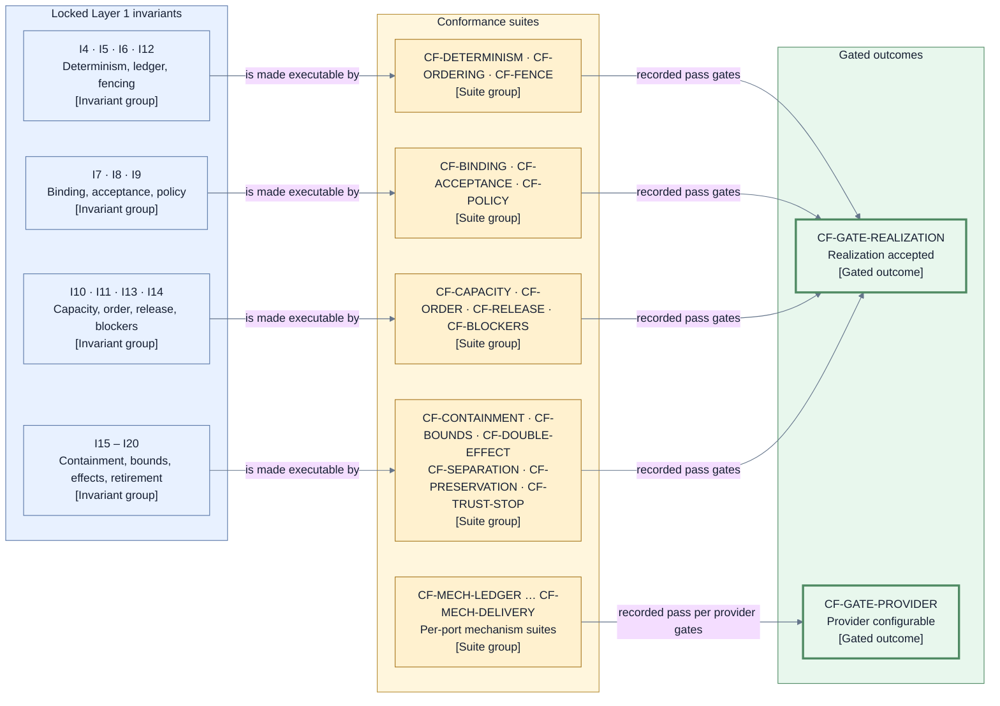

# Architecture conformance — executable suites for the locked invariants

This page consumes [D9](./decisions/D9-invariants-and-artifact-shape.md) category 13 (architecture
verification and conformance suites). Its purpose is to make [I1–I21](./invariants.md) executable:
each locked invariant maps to at least one conformance suite that any realization must pass, and
each suite tests the contract — observable decisions, records, and rejections — not the
implementation detail behind it. A realization may change internally without touching a suite;
a suite may not be weakened to admit a realization (the gate-integrity posture of I21).

## Suite catalog (`CF-*`)

| Suite              | What it exercises                                                                                                        | Invariants |
| ------------------ | ------------------------------------------------------------------------------------------------------------------------ | ---------- |
| `CF-DETERMINISM`   | Replaying the same ledger and ordered validated triggers reproduces identical decisions and Operation intents.           | I4         |
| `CF-ORDERING`      | No live-state adoption and no effect dispatch happen before the corresponding ledger commit is confirmed.                | I5         |
| `CF-FENCE`         | Results and dispatches under a stale controller generation or stale finalization-authority fence are rejected.           | I6, I12    |
| `CF-BINDING`       | Wrong-subject, wrong-basis, and wrong-fence results cannot advance state; every mismatch fails closed.                   | I7         |
| `CF-ACCEPTANCE`    | Acceptance requires a valid reviewer verdict on the exact Candidate plus Jig validation, never Jig re-judgment.          | I8         |
| `CF-POLICY`        | Configuration and providers cannot lower or silently change the policy-selected final verification.                      | I9         |
| `CF-CAPACITY`      | Admission by scarce resource class always preserves the progress reserve for admitted work.                              | I10        |
| `CF-ORDER`         | Admission, finalization, and attribution tie-breaks follow the immutable comparator under permuted arrival order.        | I11        |
| `CF-RELEASE`       | Only confirmed landing releases dependents; approval, publication, checks, integration response, or cleanup do not.      | I13        |
| `CF-BLOCKERS`      | Multi-root dependency outcomes carry the complete canonically ordered reachable direct-root blocker set.                 | I14        |
| `CF-CONTAINMENT`   | Faults land at the smallest safe scope — Story, target, Run — and insufficiency always fails closed.                     | I15        |
| `CF-BOUNDS`        | Every retry, rework, refresh, wait, Recovery, and Retirement path is bounded and reaches its explicit exhaustion action. | I16        |
| `CF-DOUBLE-EFFECT` | No second semantic effect is attempted before the earlier uncertain effect is known absent or reconciled.                | I17        |
| `CF-SEPARATION`    | Cleanup and Retirement can neither reverse a recorded landing nor delay dependency release.                              | I18        |
| `CF-PRESERVATION`  | Work and evidence are preserved before resource destruction; unresolved Retirement becomes a Residual Obligation.        | I19        |
| `CF-TRUST-STOP`    | After authoritative-store or decision-authority compromise the realization fails closed with an explicit named stop.     | I20        |

Per-port mechanism suites verify the `MC-*` clauses and the port family duties of the
[mechanism and provider contracts](./mechanism-and-provider-contracts.md) against a concrete
provider:

| Suite               | Port             | Gates                                                              |
| ------------------- | ---------------- | ------------------------------------------------------------------ |
| `CF-MECH-LEDGER`    | `PORT-LEDGER`    | Conditional-append, position lookup, and unknown-ack resolution.   |
| `CF-MECH-ARTIFACT`  | `PORT-ARTIFACT`  | Immutable writes and digest-verified reads.                        |
| `CF-MECH-SESSION`   | `PORT-SESSION`   | Assignment idempotency, session lookup, resume or attested loss.   |
| `CF-MECH-WORKSPACE` | `PORT-WORKSPACE` | Effect idempotency, basis and cleanliness facts, preservation.     |
| `CF-MECH-VERIFY`    | `PORT-VERIFY`    | Exact-subject observation, repeatability, result retrieval.        |
| `CF-MECH-DELIVERY`  | `PORT-DELIVERY`  | Effect idempotency or lookup, certainty reporting, no auto-replay. |

Governance invariants are covered without a runtime suite: I1 and I21 are verified by the layer
gates and the review record itself, and I2 and I3 are enforced structurally by the D10 port model —
`CF-BINDING` and the per-port suites observe that no undeclared control path exists and no
participant power widens through output.

## Execution posture and gated outcomes

- Suites run against a realization's port contracts. Control-plane suites use scripted or fake
  mechanisms so every replay is deterministic; mechanism suites additionally require recorded
  real-provider evidence for the concrete provider being gated.
- A conformance result is recorded evidence carrying the exact suite version and the subject
  digest of what passed — the exact-subject discipline of I7 applies to conformance evidence too.
  A claim without its recorded pass gates nothing.
- `CF-GATE-REALIZATION` — a realization is accepted only when every invariant suite above passes
  at its recorded version against that exact realization.
- `CF-GATE-PROVIDER` — a provider becomes configurable behind a port only when that port's
  `CF-MECH-*` suite passes against that exact provider, per the
  [conformance gating rule](./mechanism-and-provider-contracts.md).

## View V17 — invariants to suites to gated outcomes

- **Question:** Which suite groups make each invariant group executable, and what do their passes
  gate?
- **View type:** Verification mapping view over the conformance catalog.
- **Audience and purpose:** Engineers and reviewers; see the shortest path from a locked rule to
  the evidence that a realization or provider honors it.
- **Scope and exclusions:** Invariant groups, suite groups, and gated outcomes only. Individual
  test cases, frameworks, and schedules are excluded.
- **State:** Proposed.
- **Owner:** Arye Kogan.
- **Sources:** D9 category 13, D12; [I1–I21](./invariants.md); [V12](./mechanism-and-provider-contracts.md).
- **Related views:** [V6](./runtime.md) names the ports the mechanism suites exercise;
  [V12](./mechanism-and-provider-contracts.md) owns the `MC-*` clauses those suites verify.

**V17 legend:** All nodes are rectangles; shape carries no distinction at this level. Blue nodes
are locked invariant groups (their `I*` IDs are owned by the [invariants page](./invariants.md)),
yellow nodes are conformance suite groups (`CF-*`), and green thick-bordered nodes are the two
gated outcomes those recorded passes unlock. All lines are solid because every relationship here is
a normal gating flow; there is no failure or uncertainty path in this view — a missing or failed
pass simply leaves a gate closed. Color is redundant with the stable IDs and bracketed types. The
mechanism suite group additionally verifies the structural I2/I3 boundary, per the governance note
above. `CF` means conformance suite.

## Exclusions

- Suite implementations, test frameworks, harness layout, and execution schedules.
- The `MC-*` clause definitions and provider duties — owned by
  [mechanism and provider contracts](./mechanism-and-provider-contracts.md).
- Evidence storage, retention, and integrity rules for recorded passes — owned by the evidence
  pages built on [acceptance and evidence](./acceptance-and-evidence.md).
- Delivery sequencing of when suites are built; conformance shape is architecture, its schedule is
  not.

## Where to go next

- The clauses the mechanism suites verify:
  [mechanism and provider contracts](./mechanism-and-provider-contracts.md).
- The canonical invariant wording every suite traces to: [invariants](./invariants.md).
- The components whose behavior the invariant suites replay:
  [control plane components](./components/control-plane.md).
- Why conformance gating was selected over trust-by-configuration:
  [D12 — mechanism contract model](./decisions/D12-mechanism-contract-model.md).
