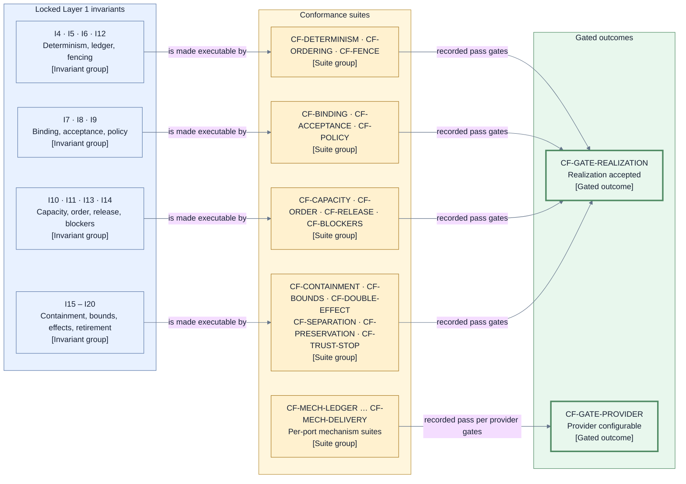

# Architecture conformance — executable suites for the locked invariants

This page consumes [D9](./decisions/D9-invariants-and-artifact-shape.md) category 13 (architecture
verification and conformance suites). Its purpose is to make [I1–I21](./invariants.md) executable:
each locked invariant maps to at least one conformance suite that any realization must pass, and
each suite tests the contract — observable decisions, records, and rejections — not the
implementation detail behind it. A realization may change internally without touching a suite;
a suite may not be weakened to admit a realization (the gate-integrity posture of I21).

## Suite catalog (`CF-*`)

| Suite                   | What it exercises                                                                                                                                                                                                                                                                                                                                                                                                                                                                                                                                                                                                                                                                       | Invariants       |
| ----------------------- | --------------------------------------------------------------------------------------------------------------------------------------------------------------------------------------------------------------------------------------------------------------------------------------------------------------------------------------------------------------------------------------------------------------------------------------------------------------------------------------------------------------------------------------------------------------------------------------------------------------------------------------------------------------------------------------- | ---------------- |
| `CF-DETERMINISM`        | Replaying `SCH-EVENT` records in Run-ledger commit order — the sole I4 trigger order — reproduces identical decisions and Operation intents; producer-scoped dedup keys and controller derivation bases suppress duplicates, and arrival/provider-time permutations cannot change the result.                                                                                                                                                                                                                                                                                                                                                                                           | I4               |
| `CF-ORDERING`           | No live-state adoption and no effect dispatch happen before the corresponding ledger commit is confirmed.                                                                                                                                                                                                                                                                                                                                                                                                                                                                                                                                                                               | I5               |
| `CF-FENCE`              | Stale controller or finalization fences are rejected; an effectful same-identity retry occurs only after confirmed absence and recorded reauthorization refreshes every generation component, while an effect-free replacement receives a new identity.                                                                                                                                                                                                                                                                                                                                                                                                                                 | I6, I12          |
| `CF-BINDING`            | Wrong-subject, wrong-basis, and wrong-fence results cannot advance state; every mismatch fails closed.                                                                                                                                                                                                                                                                                                                                                                                                                                                                                                                                                                                  | I7               |
| `CF-ACCEPTANCE`         | Acceptance requires a valid reviewer verdict on the exact Candidate plus Jig validation, never Jig re-judgment; every `ID-FINDING` is exact-package-bound and exercises the complete open/resolved/reopened/superseded transition set without auto-resolution on Candidate change.                                                                                                                                                                                                                                                                                                                                                                                                      | I8               |
| `CF-POLICY`             | Configuration and providers cannot lower or silently change policy-selected final verification or the policy-selected integration mode; a repository floor may forbid weaker modes and composition cannot weaken it. It also proves that the design-owned acceptance, evidence-integrity, authority, landing, and preservation forbidden set is unrepresentable in an accepted envelope's non-gating classification.                                                                                                                                                                                                                                                                    | I9               |
| `CF-CAPACITY`           | Preflight and admission use each Story's declared per-class path-to-safe-point demand plus the configured reserve; defaults/ranges are enforced, infeasible plans reject, and every admitted path preserves progress. The structural `RC-FINALIZER` singleton is tested under `C-ORDER` rather than configurable reserve.                                                                                                                                                                                                                                                                                                                                                               | I10              |
| `CF-ORDER`              | Admission, finalization, and attribution tie-breaks follow the immutable comparator under permuted arrival order.                                                                                                                                                                                                                                                                                                                                                                                                                                                                                                                                                                       | I11              |
| `CF-RELEASE`            | Only confirmed landing releases dependents; approval, publication, checks, integration response, or cleanup do not.                                                                                                                                                                                                                                                                                                                                                                                                                                                                                                                                                                     | I13              |
| `CF-BLOCKERS`           | Multi-root outcomes carry the complete ordered direct-root `Blocked` or `Rejected` set; either terminal root yields `Not run — dependency blocked`.                                                                                                                                                                                                                                                                                                                                                                                                                                                                                                                                     | I14              |
| `CF-CONTAINMENT`        | For every `FC-*` code and durable subject-fact combination, the taxonomy yields exactly one containment scope and outcome. Probes distinguish owner-changeable parked cases from cases with no authorized advancing action, which directly block, and trust-root failures, which first fence/halt and surface external recovery. They establish that `FC-LIVENESS` is park-or-block only and never selects terminal `Stopped`; `FC-TRUST` is the sole failure selector for `Stopped`, whose record requires a trustworthy witnessed append basis or later external recovery, and every other terminal stop requires an explicit owner `EV-RUN-TERMINAL-STOP-DECISION` from `Suspended`. | I15, I16         |
| `CF-BOUNDS`             | Every one of the eleven `BND-*` classes accepts only its numeric or duration default and allowed range, every bounded path reaches its declared exhaustion action, and required-gate, merge-queue, and branch-protection holds consume `BND-WAIT-TARGET`.                                                                                                                                                                                                                                                                                                                                                                                                                               | I16              |
| `CF-DOUBLE-EFFECT`      | No second semantic effect is attempted before the earlier uncertain effect is known absent or reconciled; effect-free replacement always records a new Operation identity, while same-identity retry is effectful-only after confirmed absence; `Superseded` and `Cancelled` remain durable outcomes.                                                                                                                                                                                                                                                                                                                                                                                   | I17              |
| `CF-SEPARATION`         | Cleanup and Retirement can neither reverse a recorded landing nor delay dependency release.                                                                                                                                                                                                                                                                                                                                                                                                                                                                                                                                                                                             | I18              |
| `CF-PRESERVATION`       | Work and evidence are preserved before resource destruction; unresolved Retirement becomes a Residual Obligation.                                                                                                                                                                                                                                                                                                                                                                                                                                                                                                                                                                       | I19              |
| `CF-TRUST-STOP`         | After authoritative-store or decision-authority compromise the realization immediately fences/halt and surfaces external recovery; an explicit named stop records only on a trustworthy witnessed append basis or later through that recovery.                                                                                                                                                                                                                                                                                                                                                                                                                                          | I20              |
| `CF-RULE-SURFACE`       | Adversarial Candidates that alter, rename, or remove governing paths park and invalidate prior acceptance until exact re-approval and fresh evidence; the owner decision follows each affected `Accepted`, `Waiting`, or `Finalizing` Story's cataloged full-review transition.                                                                                                                                                                                                                                                                                                                                                                                                         | I7, I8, I9, I15  |
| `CF-LIVENESS`           | Boundary cases derive deterministic thinking iff a responsive session has a qualifying committed fact within `BND-IDLE`, otherwise deterministic stuck at expiry, plus silence/repetition/approval-deadline outcomes; a work-profile checkpoint qualifies only through its declared cataloged mechanism-produced durable event, never session self-report; `BND-REFRESH` exhaustion always reaches the parked target-instability path and never releases dependents.                                                                                                                                                                                                                    | I4, I16          |
| `CF-NOTICE-EXPORT`      | Every parked, blocked, stale, overdue, and residual condition projects an actionable notice at the configured urgency target. Terminal settlement authorizes the create-once export put; its receipt/failure is a post-terminal administrative fact. Exports completely cover the ledger through the terminal-settlement position, exclude post-terminal receipt/obligation records, and are redacted, range-complete, and digest-verifiable; closes SEE-5/6.                                                                                                                                                                                                                           | I16, I19         |
| `CF-OBSERVABILITY`      | Reconstruct decisions, authorizations, gates, evidence references, Doorbell requests/answers, Transitions, waits, outcomes, and obligations from structured ledger facts at a stated position; `ask why` uses the same digest-bound evidence consumed by decisions, works without controller memory or extra tooling, and excludes provider-internal review; closes SEE-1..4.                                                                                                                                                                                                                                                                                                           | I4, I5, I7       |
| `CF-RUN-CONTROL`        | Every V3a edge exercises its cataloged trigger/event candidate, guard, and persisted fact, including the pre-Run acknowledgement cut and settlement; suspension preserves Story states, resume requires a new generation plus `RC-RESUME-INTEGRITY`, terminal stop has no resume edge, and post-terminal administrative Transitions cannot alter phase, Story state, business-final cut, or outcome.                                                                                                                                                                                                                                                                                    | I4, I5, I6, I20  |
| `CF-OPERATOR-ACTIONS`   | Stop, resume, notice acknowledgement/snooze, owner decisions, handoffs, `EV-OBLIGATION-RESOLVED`, and export retrieval use their cataloged `PORT-DECIDE` event or effect-free artifact read; obligation closure requires identity, responder/current grant, and digest-verified resolution evidence, while `PORT-PUBLISH` accepts no control input.                                                                                                                                                                                                                                                                                                                                     | I2, I3, I4, I5   |
| `CF-EVIDENCE-LIFECYCLE` | Boundary probes enforce the configured evidence size/oversize behavior, retention range, open-obligation preservation override, digest-verified disposal evidence, and adoption only after the matching `EV-ARTIFACT-FACT` commits.                                                                                                                                                                                                                                                                                                                                                                                                                                                     | I7, I16, I19     |
| `CF-SECRET-ABSENCE`     | End-to-end probes inspect worker-visible assignment inputs, environment, filesystem bindings, logs, evidence, and outputs and find no credential material; an Agent manifest, session binding, or attestation naming forge or privileged-delivery credentials is structurally rejected as `FC-AUTHORITY`.                                                                                                                                                                                                                                                                                                                                                                               | I2, I7, I15, I20 |
| `CF-DELEGATION`         | A delegated decision requires a current, unrevoked, in-scope per-Run `ID-GRANT`; no pre-Run grant or delegated envelope approval exists, and issuance naming product/architecture import or approval, gate-verdict, layer-reopen, or implicit-subdelegation scope is rejected as `FC-AUTHORITY`, as is expired, revoked, superseded, or escaped use.                                                                                                                                                                                                                                                                                                                                    | I2, I3, I7, I20  |
| `CF-CONSUMER`           | CLI, private-MCP, and SDK adapters reach Jig only through `PORT-CONSUMER`; each caller must bind to exactly one configured principal or fails closed. Preview invokes effect-free `EP-PREVIEW` and proves no `ID-RUN`, `LG-INTAKE`, ledger append, or dispatch, while start/core actions delegate to `PORT-INTAKE`, `PORT-DECIDE`, or `PORT-PUBLISH` without bypass.                                                                                                                                                                                                                                                                                                                    | I2, I3           |

The imported guarantees add required product-readiness suites without changing I1–I21:

| Suite                    | What it exercises                                                                                                                                                                                                                                                                                                                                                                                                                                                                                                                                                                                                                                                                                                                                                                                                                                                                         | Closes                                    |
| ------------------------ | ----------------------------------------------------------------------------------------------------------------------------------------------------------------------------------------------------------------------------------------------------------------------------------------------------------------------------------------------------------------------------------------------------------------------------------------------------------------------------------------------------------------------------------------------------------------------------------------------------------------------------------------------------------------------------------------------------------------------------------------------------------------------------------------------------------------------------------------------------------------------------------------- | ----------------------------------------- |
| `CF-ENVELOPE`            | Floor-preserving composition; `SCH-PLAN` acyclicity, reference, done-condition/check-class, exactly-one-track, demand/reserve validation; owner-only exact approval; effect-free preview; successor-Run replanning; digest-keyed conditional intake; duplicate/lost-ack lookup; and changed Work Source content producing a new immutable Candidate. It proves that successors differing only by predecessor identity, re-plan reason, affected Story/root-blocker set, or quarantine cut have distinct composition digests and distinct `ID-RUN`s; missing, mismatched, or incomplete predecessor quarantine proof, a successor naming no existing predecessor acknowledgement/Run, and a genesis envelope carrying lineage all fail preflight closed. Unknown legacy configuration also fails closed with actionable upgrade or correction guidance rather than guessed interpretation. | CFG-2/3/4/5/6/8, ISO-1/2, STACK-2         |
| `CF-PROVIDER-PERMISSION` | Provider-internal outcomes create no Jig decision; a human-needed request follows durable `ID-PARK` to the current same-principal session, or closes through recorded cancel-and-reissue lineage after unrecoverable context loss, without widening posture or authority.                                                                                                                                                                                                                                                                                                                                                                                                                                                                                                                                                                                                                 | FENCE-1/2, DOOR-1/2/3, SEC-2, CFG-10      |
| `CF-SETUP-FRESHNESS`     | Exact recipe/input/host receipts suppress setup; any relevant mismatch or stale receipt authorizes one reconciled setup effect and emits a fresh receipt.                                                                                                                                                                                                                                                                                                                                                                                                                                                                                                                                                                                                                                                                                                                                 | CFG-9                                     |
| `CF-PROVIDER-AUTHORITY`  | Bindings can only narrow an exhaustive approved manifest; build, manifest, environment, proof-age, and approval changes close the provider gate until requalified. Agent manifests and bindings cannot represent forge or privileged-delivery credential classes.                                                                                                                                                                                                                                                                                                                                                                                                                                                                                                                                                                                                                         | EARN-1, DRIVE-2, FENCE-3, SEC-3           |
| `CF-BLOCK-SURFACING`     | A real integration request receives one idempotent status/comment block when authorized; surfacing failure preserves `Blocked` and creates a notice and residual obligation.                                                                                                                                                                                                                                                                                                                                                                                                                                                                                                                                                                                                                                                                                                              | MERGE-5                                   |
| `CF-REVIEW-PUBLICATION`  | Review-scoped Operations can publish the exact Candidate, maintain one draft/non-mergeable request, and post stable-marker updates; terminal outcomes authorize only the four cataloged retirement classes, whose failure records an obligation. Probes prove neither publication nor retirement can merge, touch the lineage anchor, acquire finalization authority, or land work.                                                                                                                                                                                                                                                                                                                                                                                                                                                                                                       | Product pre-acceptance review publication |

Per-port mechanism suites verify the `MC-*` clauses and the port family duties of the
[mechanism and provider contracts](./mechanism-and-provider-contracts.md) against a concrete
provider:

| Suite               | Port             | Gates                                                                                                                                                                                                                                                                                                                                                                                                                                                                                                                                                                                                                                                                                       |
| ------------------- | ---------------- | ------------------------------------------------------------------------------------------------------------------------------------------------------------------------------------------------------------------------------------------------------------------------------------------------------------------------------------------------------------------------------------------------------------------------------------------------------------------------------------------------------------------------------------------------------------------------------------------------------------------------------------------------------------------------------------------- |
| `CF-MECH-LEDGER`    | `PORT-LEDGER`    | Registry-realization identity attestation and mismatch rejection; conditional-append rejection; durable acknowledgement; the five-way readback classification (own commit adopted once; empty-position absence retried with the same identity; a competing generation's occupant adopted with the proposer fenced and never retried; same-generation/different-digest failing closed as integrity loss; indeterminate halting); and `LG-WITNESS` currency: independent trust, monotonicity, advance-before-acknowledgement, rollback-restore detection, including `LG-INTAKE` intake-index-head witness coverage and witness-verified intake recovery readback.                             |
| `CF-MECH-ARTIFACT`  | `PORT-ARTIFACT`  | Immutable writes and digest-verified reads; put/get/dispose results, certainty, and failures return only through validated `EV-ARTIFACT-FACT`; disposal requires exact owner decision plus preservation, retention, and obligation guards; no manifest adoption precedes that event's commit. A verified deployment-wide guard proves no other non-disposed Run's recorded evidence manifest or export manifest references a disposal digest; a foreign live reference fails closed and identifies the owning Runs.                                                                                                                                                                         |
| `CF-MECH-SESSION`   | `PORT-SESSION`   | Assignment idempotency; `EV-SESSION-FACT` open/bound/active/reconnect/replacement/cancel/loss/close attestations with deduplication and successor lineage; posture stability; principal/session result attribution; request-follows-principal answer delivery; cancel-and-reissue after context loss; preservation of every pending request. A human-client session mechanism is configurable only after passing this suite, binds one authenticated human `ID-PRINCIPAL` per session, and carries results, verdicts, and liveness through the identical validation rows; an adversarial manifest or binding naming forge or privileged-delivery credentials is rejected as `FC-AUTHORITY`. |
| `CF-MECH-WORKSPACE` | `PORT-WORKSPACE` | Effect idempotency, basis and cleanliness facts, setup receipt/freshness behavior, and preservation; host-specific probes make native-posture enforcement observable, prove workspace/host identity remains stably bound across process replacement, and prove swapping to a different manifest-qualified host provider requires no design, port, or controller change.                                                                                                                                                                                                                                                                                                                     |
| `CF-MECH-SOURCE`    | `PORT-SOURCE`    | `ID-SOURCE-REQ` echo, recorded cursor/revision basis, per-attempt `BND-WAIT-MECHANISM` deadline, bounded `BND-RETRY`, duplicate normalization, changed-content immutability, and pre-Run envelope-production failure after exhaustion.                                                                                                                                                                                                                                                                                                                                                                                                                                                      |
| `CF-MECH-VERIFY`    | `PORT-VERIFY`    | Exact-subject observation, effect-free replacement under a new Operation identity, result retrieval, and enforced effect-freedom; any effect-needing check is rejected from this port.                                                                                                                                                                                                                                                                                                                                                                                                                                                                                                      |
| `CF-MECH-DELIVERY`  | `PORT-DELIVERY`  | Effect idempotency or lookup, no auto-replay, target-anchor atomicity, disjoint review/finalization bindings, stable-marker surfacing, and fail-closed cross-binding use.                                                                                                                                                                                                                                                                                                                                                                                                                                                                                                                   |

Every `CF-MECH-*` suite contains reusable adversarial probes, not only happy-path examples. At a
minimum the shared probe library exercises forged caller/principal identities and attestations, scope widening
stale fences, duplicate and late results, timeout and reconnect ambiguity, declared-posture
mismatch or undeclared credential use, and retry-after-uncertain-effect behavior; port-specific
suites add hostile basis, setup, anchor, publication, and redaction cases. Bundled and future
providers pass the same suite and probe versions. A provider-specific waiver cannot make a
provider configurable.

Governance invariants are covered without a runtime suite: I1 and I21 are verified by the layer
gates and the review record itself, and I2 and I3 are enforced structurally by the D10 port model —
`CF-BINDING` and the per-port suites observe that no undeclared control path exists and no
participant power widens through output.

## Execution posture and gated outcomes

- Suites run against a realization's port contracts. Control-plane suites use scripted or fake
  mechanisms so every replay is deterministic; mechanism suites additionally require recorded
  real-provider evidence for the concrete provider being gated.
- A conformance result is recorded evidence carrying the exact provider build digest, suite and
  adversarial-probe versions, provider-authority manifest digest, and relevant environment
  fingerprint — the exact-subject discipline of I7 applies to conformance evidence too. A claim
  without that exact recorded pass gates nothing.
- Every Run receives an immutable `SCH-CAPABILITY-PROOF` produced by `EP-PROVIDERS` through the
  provider's own configured mechanism-port exchange, binding exact provider identity/build,
  approved `ID-MANIFEST`, environment fingerprint, requested capability, policy minimum, result,
  proof-basis/evidence reference, and production position/age basis. `PORT-INTAKE` independently
  revalidates freshness and subject binding; missing, stale, negative, or subject-mismatched proof
  follows the existing autonomy-reduction rule and otherwise fails preflight closed. A lost proof
  re-acquires under `BND-RETRY`.
- `CF-GATE-REALIZATION` — a realization is accepted only when every invariant suite above passes
  at its recorded version against that exact realization.
- `CF-GATE-PROVIDER` — a provider becomes configurable behind a port only when that port's
  `CF-MECH-*` suite passes against that exact provider, per the
  [conformance gating rule](./mechanism-and-provider-contracts.md).
- `CF-GATE-PRODUCT` — its input set is fixed and enumerated: the recorded-version results for
  `CF-DETERMINISM`, `CF-ORDERING`, `CF-FENCE`, `CF-BINDING`, `CF-ACCEPTANCE`, `CF-POLICY`,
  `CF-CAPACITY`, `CF-ORDER`, `CF-RELEASE`, `CF-BLOCKERS`, `CF-CONTAINMENT`, `CF-BOUNDS`,
  `CF-DOUBLE-EFFECT`, `CF-SEPARATION`, `CF-PRESERVATION`, `CF-TRUST-STOP`, `CF-RULE-SURFACE`,
  `CF-LIVENESS`, `CF-NOTICE-EXPORT`, `CF-OBSERVABILITY`, `CF-RUN-CONTROL`,
  `CF-OPERATOR-ACTIONS`, `CF-EVIDENCE-LIFECYCLE`, `CF-SECRET-ABSENCE`, `CF-DELEGATION`,
  `CF-CONSUMER`, `CF-ENVELOPE`, `CF-PROVIDER-PERMISSION`, `CF-SETUP-FRESHNESS`,
  `CF-PROVIDER-AUTHORITY`, `CF-BLOCK-SURFACING`, `CF-REVIEW-PUBLICATION`, `CF-MECH-LEDGER`,
  `CF-MECH-ARTIFACT`, `CF-MECH-SESSION`, `CF-MECH-WORKSPACE`, `CF-MECH-SOURCE`,
  `CF-MECH-VERIFY`, and `CF-MECH-DELIVERY`; plus every named element of every 44-row `PC-*`
  minimal proof-route set in the [reconciliation inventory](./product-guarantee-reconciliation.md#round-6-minimal-route-audit).
  The gate result is the pure conjunction of those inputs: every suite result must be a pass and
  every route element must pass or its cited governance record must hold. No judgment step selects,
  omits, or substitutes inputs. An implementation cannot claim product readiness unless that
  conjunction is true; imported-guarantee coverage alone is insufficient. The
  [delegation register](./delegation-register.md) defines which deliberately delegated seams are
  already closed rather than missing gate inputs.

`CF-PROVIDER-PERMISSION` closes the revised SEC-2 by proving the Jig/provider protocol and exact
posture selection that Jig governs. It does not independently certify the provider's sandbox or
establish that an arbitrary provider contains no undisclosed phone-home path. D14 deliberately
places that enforcement inside the trusted Agent-provider and Execution Host boundary.

## View V17 — invariants to suites to gated outcomes

- **Question:** Which suite groups make each invariant group executable, and what do their passes
  gate?
- **View type:** Verification mapping view over the conformance catalog.
- **Audience and purpose:** Engineers and reviewers; see the shortest path from a locked rule to
  the evidence that a realization or provider honors it.
- **Scope and exclusions:** Invariant groups, suite groups, and gated outcomes only. Individual
  test cases, frameworks, and schedules are excluded.
- **State:** Approved (not locked).
- **Owner:** Arye Kogan.
- **Sources:** D9 category 13, D12; [I1–I21](./invariants.md); [V12](./mechanism-and-provider-contracts.md).
- **Related views:** [V6](./runtime.md) names the ports the mechanism suites exercise;
  [V12](./mechanism-and-provider-contracts.md) owns the `MC-*` clauses those suites verify.

**V17 legend:** All nodes are rectangles; shape carries no distinction at this level. Blue nodes
are locked invariant groups (their `I*` IDs are owned by the [invariants page](./invariants.md)),
yellow nodes are conformance suite groups (`CF-*`), and green thick-bordered nodes are the two
gated outcomes those recorded passes unlock. All lines are solid because every relationship here is
a normal gating flow; there is no failure or uncertainty path in this view — a missing or failed
pass simply leaves a gate closed. Color is redundant with the stable IDs and bracketed types. The
mechanism suite group additionally verifies the structural I2/I3 boundary, per the governance note
above. `CF` means conformance suite.

## Exclusions

- Suite implementations, test frameworks, harness layout, and execution schedules.
- The `MC-*` clause definitions and provider duties — owned by
  [mechanism and provider contracts](./mechanism-and-provider-contracts.md).
- Evidence storage, retention, and integrity rules for recorded passes — owned by the evidence
  pages built on [acceptance and evidence](./acceptance-and-evidence.md).
- Delivery sequencing of when suites are built; conformance shape is architecture, its schedule is
  not.

## Where to go next

- The clauses the mechanism suites verify:
  [mechanism and provider contracts](./mechanism-and-provider-contracts.md).
- The canonical invariant wording every suite traces to: [invariants](./invariants.md).
- The components whose behavior the invariant suites replay:
  [control plane components](./components/control-plane.md).
- Why conformance gating was selected over trust-by-configuration:
  [D12 — mechanism contract model](./decisions/D12-mechanism-contract-model.md).
