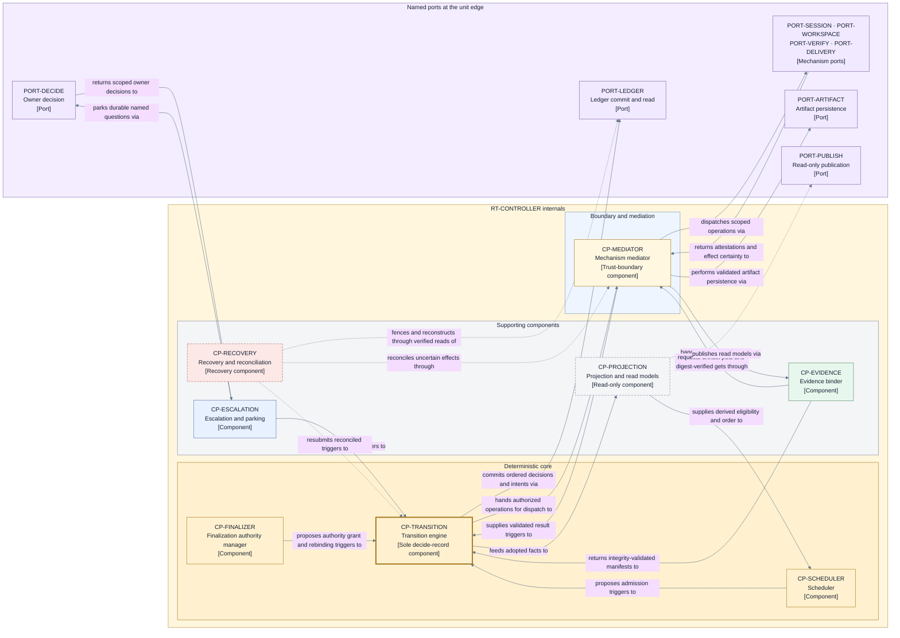

# Control plane — component view of the run controller

This page opens one runtime unit: `RT-CONTROLLER` from the
[runtime architecture](../runtime.md). It consumes
[D9 category 1](../decisions/D9-invariants-and-artifact-shape.md) (component decomposition) and
realizes the power ownership that [D3](../decisions/D3-responsibilities-trust-authority.md)
explicitly did not defer: every Jig Control power lands in exactly one named component. Package
and module structure inside the unit remains a D10 realization deferral.

## Component responsibilities

`CP-INTAKE` is a pre-controller component hosted by `RT-OPERATOR`, not an
`RT-CONTROLLER` component. It validates the complete envelope, runs preflight, and conditionally
creates or looks up `LG-INTAKE`; that `SCH-INTAKE-ACK` conditional-create is its only durable
write and the single intake commit point. Only after an **accepted** acknowledgement exists may the operator
idempotently create the derived Run ledger and spawn the per-Run controller. Recovery recreates a
missing Run ledger or projection/index entry from the acknowledgement; an index never establishes
intake authority.

| ID              | Component                         | Responsibility                                                                                                                                                                                                                                                                                                                                                                                                | Realizes (Layer 1)                                                                     | Ports touched                                                                                                                      |
| --------------- | --------------------------------- | ------------------------------------------------------------------------------------------------------------------------------------------------------------------------------------------------------------------------------------------------------------------------------------------------------------------------------------------------------------------------------------------------------------- | -------------------------------------------------------------------------------------- | ---------------------------------------------------------------------------------------------------------------------------------- |
| `CP-TRANSITION` | Transition engine                 | Executes the single-transition cycle for every accepted trigger: validate lifecycle/grant, classify rule surfaces, decide, record, then adopt and dispatch. It alone authorizes review-publication intents from `Reviewing`/`Blocked` without finalization authority.                                                                                                                                         | `FLOW-VALIDATE`, `FLOW-DECIDE`, `FLOW-RECORD`, `FLOW-ADOPT` (V3c); I4, I5.             | `PORT-LEDGER` (sole Run Transition-ledger writer; conditional ordered appends).                                                    |
| `CP-SCHEDULER`  | Scheduler                         | Derives eligibility from the projection and admits work within scarce resource-class capacity using the immutable total comparator; proposes admission triggers only.                                                                                                                                                                                                                                         | `C-CAPACITY`, `C-ORDER` (V4); I10, I11.                                                | None directly; in-process proposals to `CP-TRANSITION`.                                                                            |
| `CP-FINALIZER`  | Finalization authority manager    | Manages the single target-scoped finalization authority: registry acquisition in deterministic order, fence binding, bounded refresh, rebinding, and release. It proposes only post-acceptance target-changing or landing `OPC-DEL-*` intents while it holds sole target authority and is never involved in review publication; authorization still exists only inside `CP-TRANSITION`'s recorded Transition. | `C-FINALIZER` (V4); I12.                                                               | None directly; authorized target effects dispatch through `CP-MEDIATOR`.                                                           |
| `CP-MEDIATOR`   | Mechanism mediator                | The trust boundary inside the unit: narrows each provider-authority manifest into an Operation binding, dispatches authorized Operations, and validates results, liveness, and Agent-provider human-needed requests before any can become a trigger.                                                                                                                                                          | `R-VALIDATE` (V2); I7.                                                                 | Sole inbound gate for the mediated `PORT-SESSION`, `PORT-WORKSPACE`, `PORT-VERIFY`, `PORT-DELIVERY`, and `PORT-ARTIFACT` ports.    |
| `CP-EVIDENCE`   | Evidence binder                   | Assembles evidence manifests, binds each artifact to its exact subject, persists immutable artifacts, and validates availability and integrity before decision use.                                                                                                                                                                                                                                           | `A-EVIDENCE` roles and the exact-subject binding of `A-CANDIDATE` (V4); I7.            | `PORT-ARTIFACT` through `CP-MEDIATOR` (immutable writes; digest-verified reads).                                                   |
| `CP-ESCALATION` | Escalation and operator decisions | Owns parked requests, per-Run delegation grants, suspend/resume/terminal-stop and notice events; validates responder, current grant, exact subject, and lifecycle position before proposing a trigger or session-response Operation.                                                                                                                                                                          | `RUN-PARK`, `RUN-SUSPEND`, `RUN-STOP` (V3) and the human-interaction identity binding. | `PORT-DECIDE`; provider requests arrive through `PORT-SESSION`, and scoped answers follow `ID-PARK` through that boundary.         |
| `CP-RECOVERY`   | Recovery and reconciliation       | Acquires the controller generation, fences stale control, reconstructs canonical state from the ledger, and reconciles uncertain operations before dispatch resumes.                                                                                                                                                                                                                                          | `S-RECOVERY`, `FLOW-RECONCILE` (V4, V3c); I6, I17.                                     | `PORT-LEDGER` (verified reads through the transition engine's commit protocol); reconciliation observations through `CP-MEDIATOR`. |
| `CP-PROJECTION` | Projection and read models        | Maintains the live projection, unified actionable notices, and terminal audit-export material recomputed from adopted durable facts; read-only, replaceable, and never independently authoritative.                                                                                                                                                                                                           | `S-PROJECTION`, `S-DERIVED` (V4).                                                      | `PORT-PUBLISH` (read-only publication out).                                                                                        |

## Power ownership realized

D3 fixed who owns each power; this table places each power inside the unit without redistributing it.

| Power (V2)          | Owning component           | Realization rule                                                                                                                                                                                                                                                                                                                      |
| ------------------- | -------------------------- | ------------------------------------------------------------------------------------------------------------------------------------------------------------------------------------------------------------------------------------------------------------------------------------------------------------------------------------- |
| Authorize           | `CP-TRANSITION`            | Operation intents exist only inside a recorded Transition; `CP-SCHEDULER` and `CP-FINALIZER` propose. Landing and target-changing Operations are proposed only by `CP-FINALIZER` while it holds sole target authority and, like every Operation, are authorized only inside that recorded Transition.                                 |
| Decide              | `CP-TRANSITION`            | `FLOW-DECIDE` is calculated deterministically from authoritative state and one `SCH-EVENT` trigger in Run-ledger commit order, the sole I4 ordering (I4).                                                                                                                                                                             |
| Record              | `CP-TRANSITION`            | `FLOW-RECORD` is the only Run Transition-ledger conditional append path (I5). `LG-INTAKE` conditional-create and target-registry arbitration are separate named authority structures with their declared writers.                                                                                                                     |
| Reconcile           | `CP-RECOVERY`              | Reconciliation outcomes still enter durable truth only as triggers appended through `CP-TRANSITION`.                                                                                                                                                                                                                                  |
| Boundary validation | Responsible boundary owner | `CP-MEDIATOR` owns mediated Operation ports, operator-hosted `CP-INTAKE` owns intake, `CP-ESCALATION` owns decisions, controller derivation validation owns wakes, and the `PORT-LEDGER` primitive is validated inside `CP-TRANSITION`'s commit protocol. `CP-TRANSITION` revalidates lifecycle position inside `FLOW-VALIDATE` (I7). |

## Interaction rules

- Every lifecycle state change routes through `CP-TRANSITION`, the sole Run Transition-ledger
  writer, so record-before-adopt/dispatch (I5) has exactly one enforcement point.
- `CP-MEDIATOR` is the sole gatekeeper for inbound messages on the mediated mechanism ports,
  including `PORT-ARTIFACT`, whose mechanism acts under a per-Operation `CB-STORE`
  capability binding and whose responses are validated like any other attestation. A message that
  fails identity, role, exact-subject, lifecycle, fence, or capability validation creates no
  trigger and no fact. `CP-INTAKE` and `CP-ESCALATION` separately own intake and decision
  validation, while controller-derived wakes pass deterministic derivation validation.
- `PORT-LEDGER` is the one deliberate exception, because its conditional append is the commit
  primitive that records Transitions and cannot itself be a mediated Operation
  ([persistence and projections](../persistence-and-projections.md)). Its equivalent validation is
  built in where the port is used: `CP-INTAKE` validates and mints the single-key binding for
  `LG-INTAKE`; the transition engine's commit protocol owns Run-ledger, registry, and witness
  validation/binding, including identity, expected position, and digests under the `LG-*` clauses;
  `CP-RECOVERY` performs verified reads through that latter facility rather than owning a second
  validator. This narrows the mediator claim of
  [D12](../decisions/D12-mechanism-contract-model.md) explicitly rather than silently.
- `CP-PROJECTION` is read-only and replaceable. Any component may read it; none may treat it as
  authority; losing it loses nothing durable.
- `CP-RECOVERY` runs first on every controller start and restart: generation acquisition, ledger
  verification, reconstruction, and reconciliation complete before any dispatch (I6, I17); operator
  resume from `Suspended` is a restart for this rule. It
  alone owns reconciliation, and no other component retries an uncertain effect.
- `RC-RESUME-INTEGRITY` is the mandatory Recovery comparison over the frozen envelope digest,
  provider build and authority-manifest identities, environment/capability proof, rule-surface
  manifest, target basis, and active fences. Any safety-relevant mismatch invalidates dependent
  evidence, verdicts, acceptance, or authority, and parks for exact owner re-approval plus fresh
  evidence; unchanged assumptions resume from durable truth.
- `CP-ESCALATION` validates every owner/operator event against exact subject, lifecycle position,
  responder, and current per-Run grant. For a provider request, the answer follows `ID-PARK` to the
  session currently bound to the originating principal/assignment. Attested session loss either
  rebinds a same-principal replacement with provenance or closes and reissues the request with
  lineage; no request is silently dropped and no Jig-side permission judgment is created.
- `PORT-CONSUMER` terminates at `RT-OPERATOR`; no control-plane component implements or trusts that
  facade directly. Commands reach these components only after delegation to `PORT-INTAKE`,
  `PORT-DECIDE`, or read-only `PORT-PUBLISH`.
- `CP-TRANSITION` compares every Candidate changed-path set with the frozen rule-surface manifest.
  Any touch records `EV-RULE-SURFACE-TOUCHED`, parks the Run, invalidates prior acceptance and
  dependent evidence, and requires owner approval of the exact new manifest and fresh evidence.
- Worker runtime permissions are provider-owned under D14. Provider-internal allowed,
  automatically reviewed, or rejected requests create no Jig trigger. Only a provider request
  marked human-required crosses `PORT-SESSION`; Jig routes it through the Doorbell and never
  reclassifies, auto-answers, or performs the requested worker action. Jig-owned delivery,
  rule-surface, policy, acceptance, and recovery decisions retain their existing human and policy
  gates.
- Components communicate in-process only by proposing triggers to `CP-TRANSITION` and reading
  `CP-PROJECTION`; no component mutates another component's state. This is the immutability
  posture: shared truth advances only by recorded transition.

The rejected alternative — one monolithic control loop without internal seams — would make power
ownership, the trust boundary, and the recovery-first rule conventions rather than contracts.

## View V7 — control-plane components

- **Question:** How is `RT-CONTROLLER` internally organized, and how do its components carry one
  trigger through validation, decision, record, dispatch, and recovery?
- **View type:** Component view (Level 3) of one runtime unit.
- **Audience and purpose:** Engineers and architects realizing or reviewing the controller; see the
  internal seams and the single authority path before opening schemas or algorithms.
- **Scope and exclusions:** The eight controller components, their in-process relationships, and the port
  endpoints at the unit edge. Schemas, algorithms, budgets, storage, and provider detail are
  excluded and owned by the sibling pages.
- **State:** Approved (not locked).
- **Owner:** Arye Kogan.
- **Sources:** D3, D9 category 1, D10; I4–I7, I10–I12, I17; V2, V3c, V4, [V6](../runtime.md).
- **Related views:** [V6](../runtime.md) places this unit among the runtime units; V3c defines the
  transition cycle this view distributes across components.

**V7 legend:** All nodes are rectangles: purple `PORT-*` nodes are the named port endpoints at the
unit edge (the grouped mechanism-ports node keeps this view at one level; each port keeps its own
identity in the [runtime architecture](../runtime.md)); every `CP-*` node is one controller
component. The thick yellow border marks `CP-TRANSITION`, the only component that decides, records,
and authorizes; the pale-yellow `CP-MEDIATOR` is the trust boundary; yellow core nodes propose but
never record; blue nodes are ordinary components; green is the evidence binder. Solid arrows are
the normal trigger, decision, record, and dispatch cycle. Dashed borders and dashed lines carry
only two meanings: the red `CP-RECOVERY` recovery/reconciliation path and the gray `CP-PROJECTION`
read-only publication. Color is redundant with IDs and bracketed types. `CP` means control-plane
component and `PORT` a named port.

## What this component view deliberately excludes

- Identity forms and record schemas crossing these seams: [data and identity](../data-and-identity.md).
- Algorithms and budget classes: [scheduling and bounds](../scheduling-and-bounds.md).
- Storage and projection realization: [persistence and projections](../persistence-and-projections.md).
- What each mechanism behind `CP-MEDIATOR`'s ports must guarantee:
  [mechanism and provider contracts](../mechanism-and-provider-contracts.md).

## Where to go next

- The unit this view opens, its ports, and its process model: [runtime architecture](../runtime.md).
- Why this unit and port shape was selected: [D10 — runtime decomposition](../decisions/D10-runtime-decomposition.md).
- The fixed power allocation this view realizes:
  [D3 — responsibilities, trust, and authority](../decisions/D3-responsibilities-trust-authority.md).
