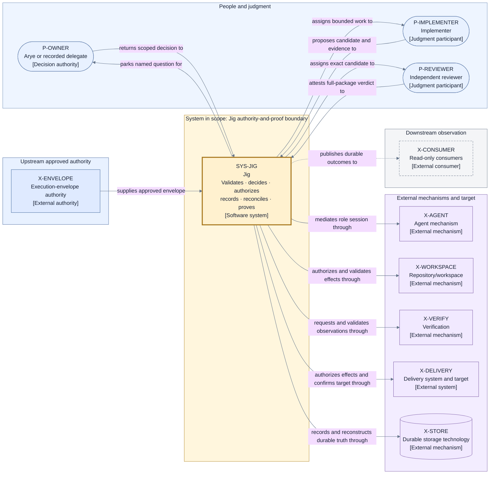

# System context — Jig authority-and-proof boundary

## Boundary rule

Jig's system boundary follows **authority and proof responsibility**, not packaging. A provider,
library, process, repository mechanism, or storage technology may be bundled with Jig and still
remain outside its decision-authority boundary. Conversely, Jig retains responsibility for a
semantic guarantee even when an external mechanism performs the work.

Jig owns:

- Execution Envelope intake, stable Run identity, deterministic preflight, and frozen Run definition;
- Story eligibility, admission, lifecycle, concurrency, finalization, outcome, and Retirement
  decisions;
- stable Transition and Operation identities, authorization, validation, fencing, and reconciliation;
- authoritative live projection and durable ordered recording;
- implementer and reviewer assignment and result validation;
- acceptance recording, exact-subject evidence binding, and evidence-integrity validation;
- semantic mediation of agent, workspace, verification, delivery, and storage mechanisms;
- landing confirmation, dependency release, preservation, and safe Retirement coordination;
- durable parking, escalation, scoped owner-decision intake, and deterministic continuation; and
- durable attributable outcomes and Residual Obligations.

External participants and systems do not gain those powers merely by returning a result.

## Named external relationships

| External participant or system | Relationship with Jig                                                                                         | Authority or proof limit                                                                        |
| ------------------------------ | ------------------------------------------------------------------------------------------------------------- | ----------------------------------------------------------------------------------------------- |
| Execution-envelope authority   | Supplies an already-approved plan, policy, and configuration.                                                 | Cannot implicitly mutate an accepted Run.                                                       |
| Arye or recorded delegate      | Receives a named escalation and returns an explicit scoped decision.                                          | Delegation does not imply product or architecture approval authority.                           |
| Implementer                    | Receives a bounded assignment and returns an exact Candidate, self-report, and evidence.                      | Cannot accept its own work, change lifecycle state, or authorize delivery.                      |
| Reviewer                       | Independently judges the exact Candidate and complete delivery package.                                       | Cannot edit the Candidate, perform delivery, or attest future target facts.                     |
| Agent mechanism                | Hosts role-specific work behind Jig's assignment and validation boundary.                                     | Cannot choose role, route, lifecycle, or authority.                                             |
| Repository/workspace mechanism | Performs isolation and repository effects and reports content, basis, cleanliness, and preservation facts.    | Cannot judge acceptance or mutate the authoritative target without separate delivery authority. |
| Verification mechanism         | Executes configured checks on the exact subject and returns observations.                                     | Cannot select required checks, judge overall sufficiency, or authorize delivery.                |
| Delivery system and target     | Performs authorized publication or integration and reports target, gate, effect-certainty, and landing facts. | Cannot choose whether delivery is allowed or declare lifecycle completion.                      |
| Durable storage technology     | Persists Jig-created records and reports durability or integrity.                                             | Cannot select semantic facts, transitions, retries, or recovery outcomes.                       |
| Read-only downstream consumers | Consume durable views, explanations, outcomes, and obligations.                                               | Cannot become an undeclared control path.                                                       |

## View V1 — system context and authority boundary

- **Question:** What is inside Jig's authority-and-proof boundary, and how do people, upstream
  authority, external mechanisms, the target, and downstream consumers relate to it?
- **View type:** System context and authority boundary.
- **Audience and purpose:** Arye, architecture reviewers, engineering, security, and operations;
  establish the system boundary and proof ownership before any detailed decomposition.
- **Scope and exclusions:** People and directly related systems at Layer 1. Internal components,
  ports, transports, deployment, technology, and provider topology are excluded.
- **State:** Proposed.
- **Owner:** Arye Kogan.
- **Sources:** Approved project brief O1–O9 and C1–C14; D1–D3; I1–I3, I20–I21.
- **Related views:** [V2 power/trust view](./perspectives/authority-and-trust.md),
  [V3 lifecycle/information-flow view](./flows/run-and-story-lifecycle.md), and
  [V4 state through finalization view](./state-and-recovery.md).
- **Stable IDs:** `P-OWNER`, `P-IMPLEMENTER`, `P-REVIEWER`, `X-ENVELOPE`, `SYS-JIG`, `X-AGENT`,
  `X-WORKSPACE`, `X-VERIFY`, `X-DELIVERY`, `X-STORE`, `X-CONSUMER`.
- **Relationship labels:** Every arrow has a directed verb phrase. Solid arrows carry authorized
  input, work, fact, or effect relationships; dashed arrows carry read-only publication.

**V1 legend:** Rounded rectangles are people; ordinary rectangles are authorities, systems,
mechanisms, or consumers; the cylinder is durable storage technology. The thick solid border marks
the one system in scope. A dashed border marks a read-only consumer. Blue `P-*`/`X-ENVELOPE` nodes
are people or upstream authority, yellow `SYS-*` is Jig, purple `X-*` nodes are external mechanisms,
and gray is downstream observation. Color is redundant: every node carries its stable ID and
bracketed type. Solid directed lines are authorized input, assignment, fact, or effect relationships;
the dashed directed line is publication with no control authority. `P` means person, `X` external,
and `SYS` software system; there are no other abbreviations.

## Where to go next

- Who may propose, perform, observe, attest, authorize, decide, record, and reconcile:
  [authority and trust](./perspectives/authority-and-trust.md).
- How a Run and its Stories progress across this boundary:
  [Run and Story lifecycle](./flows/run-and-story-lifecycle.md).
- Why the boundary is drawn this way, with rejected alternatives:
  [D2 — system boundary](./decisions/D2-system-boundary.md).
