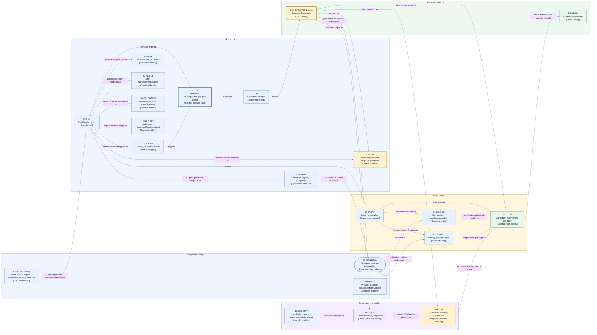

# Data and identity — identity representation, fences, and schema families

This page consumes [D9](./decisions/D9-invariants-and-artifact-shape.md) deferral categories 2
(schemas) and 6 (controller, Operation, finalization-authority, Candidate, target, and effect-fence
representation). It realizes the identity and binding table of the [canonical model](./model.md) as
concrete representations; the binding rule itself — a stale, duplicate, late, wrong-role,
wrong-subject, wrong-basis, or wrong-fence result cannot advance state — stays fixed (I7). Every
statement here is a proposed Layer 2 selection, not a current-state claim.

## Identity representation

Every canonical identity kind is represented as a **hierarchical, human-readable, collision-free
path**. The rejected alternatives were flat opaque unique tokens (provenance would migrate into
mutable metadata that recovery cannot trust) and identities derived from names such as branches or
titles (a rename would silently break exact binding).

| ID kind         | Model identity         | Path pattern                                                   | Collision-free scoping rule                                                                                                                                                                                                                                                                                                                                                                                                |
| --------------- | ---------------------- | -------------------------------------------------------------- | -------------------------------------------------------------------------------------------------------------------------------------------------------------------------------------------------------------------------------------------------------------------------------------------------------------------------------------------------------------------------------------------------------------------------- |
| `ID-RUN`        | Run identity           | `run-<sortable unique token>`                                  | Minted only by the first conditional create for an envelope composition digest. That digest is the submission identity: duplicates and lost-ack lookups return the same acknowledgement and `ID-RUN`; a different digest is a new submission.                                                                                                                                                                              |
| `ID-STORY`      | Story identity         | `<run>/story/<plan story key>`                                 | Plan story keys are frozen and unique in the approved plan; preflight rejects duplicates before any Story effect.                                                                                                                                                                                                                                                                                                          |
| `ID-TXN`        | Transition identity    | `<run>/txn/<position>/<gen>` plus record digest                | Position claim qualified by the proposing controller generation; valid only together with the record digest, so competing proposals at one head can never share an identity.                                                                                                                                                                                                                                               |
| `ID-EVENT`      | Event identity         | `<run>/event/<ledger position>`                                | Minted only after the responsible boundary owner validates the event — `CP-MEDIATOR` for mechanism ports, `CP-INTAKE` for intake, `CP-ESCALATION` for decisions, or controller derivation validation for wakes — and `CP-TRANSITION` commits it. The ledger position is both collision-free ordinal and sole trigger-ordering key. Before validation-commit it has no identity or effect.                                  |
| `ID-OP`         | Operation identity     | `<txn>/op/<ordinal>`                                           | Ordinal within the first authorizing Transition. An effectful Operation may retain this identity and payload basis only for a retry after confirmed absence under a fresh recorded reauthorization; an effect-free observation replacement always receives a new identity.                                                                                                                                                 |
| `ID-CAND`       | Candidate identity     | `<story>/cand/<ordinal>` plus content digest                   | Ordinal within the owning Story; the identity is only valid together with its exact content digest.                                                                                                                                                                                                                                                                                                                        |
| `ID-GEN`        | Controller generation  | `<run>/gen/<ordinal>` plus instance token                      | Claimed by conditional append of a generation-claim record carrying a unique controller instance token; the ordinal is valid only together with its recorded token, so racing restarts can never share a current generation (I6).                                                                                                                                                                                          |
| `ID-PRINCIPAL`  | Participant principal  | `principal/<configured participant key>`                       | The stable configured identity of one human or agent participant. The local execution context (the user-run deployment's local OS user) plus its configured participant key is the local trust root; `PORT-DECIDE` and `PORT-CONSUMER` bind each authenticated caller to exactly one configured principal or fail closed. Every role session binds to exactly one principal, and the binding survives session replacement. |
| `ID-SESSION`    | Role session           | `<story>/session/<role>/<ordinal>`                             | Monotonic within one Story and role. Each session binds one `ID-PRINCIPAL`, assignment, provider, manifest, and posture; a replacement receives a new identity and records predecessor/successor lineage while result attribution retains both session and principal.                                                                                                                                                      |
| `ID-FINDING`    | Reviewer finding       | `<story>/finding/<ordinal>`                                    | Monotonic per Story so one finding survives Candidate rework. It binds its introduction package, exact subject anchor, severity, requirement/risk trace, description, resolution history, and any superseding finding.                                                                                                                                                                                                     |
| `ID-GRANT`      | Delegation grant       | `<run>/grant/<ordinal>`                                        | Monotonic per Run; binds issuer and delegate principals, exact operational event/decision and subject scope, validity window, and revocation/supersession lineage. Product/architecture imports or approval, gate verdicts, and layer reopens are non-delegable.                                                                                                                                                           |
| `ID-SOURCE-REQ` | Work Source request    | `source/<provider digest>/request/<request-basis digest>`      | Stable for one normalized pre-Run source request basis. Retry preserves it; a changed request basis receives a new identity.                                                                                                                                                                                                                                                                                               |
| `ID-REGISTRY`   | Authority registry     | `registry/<realization descriptor digest>`                     | Derived from the storage mechanism's provider-attested canonical realization descriptor — provider identity, immutable backend instance/namespace identity, and normalized non-secret authority endpoint — so copied configuration labels cannot make distinct registry realizations share an identity.                                                                                                                    |
| `ID-TARGET`     | Configured target      | `target/<canonical target key>`                                | Canonical and cross-Run: derived from the configured target's normalized locator, so two Runs naming the same target derive the same identity. Preflight freezes and validates it per Run.                                                                                                                                                                                                                                 |
| `ID-AUTH`       | Finalization authority | `<target>/auth/<ordinal>`                                      | Monotonic per canonical target across all Runs, allocated only by the target's one realization-bound registry; the ordinal is valid only together with its allocating `ID-REGISTRY`, and exactly one ordinal is current for a target (I12).                                                                                                                                                                                |
| `ID-EVSUBJ`     | Evidence subject       | URI embedding exactly one existing identity path               | Names one Run, Story, Candidate, Operation, or target fact plus one claim name; never a free-form subject.                                                                                                                                                                                                                                                                                                                 |
| `ID-PARK`       | Human interaction      | `<run>/park/<ordinal>`                                         | Monotonic per Run; binds the exact request, originating principal/assignment and session provenance, authorized responder scope, current rebound session, selected answer, closure reason, and predecessor/successor lineage for cancel-and-reissue.                                                                                                                                                                       |
| `ID-OBLIGATION` | Residual Obligation    | `<run>/obligation/<ordinal>`                                   | Monotonic per Run; minted when an automatic Retirement, preservation, surfacing, or export duty is handed off. It binds the affected resource or proof, originating position, reason, accountable owner, completion criteria, evidence, and status; later resolution retains this identity.                                                                                                                                |
| `ID-MANIFEST`   | Provider authority     | `provider/<provider digest>/authority/<manifest digest>`       | Identifies the exact approved runtime, filesystem, network, and credential authority declaration; any byte change creates a distinct identity and requires fresh owner approval.                                                                                                                                                                                                                                           |
| `ID-NOTICE`     | Actionable notice      | `<run>/notice/<condition kind>/<subject digest>`               | Stable for one durable attention condition; acknowledgement and snooze state may change, but a materially different condition receives a different identity.                                                                                                                                                                                                                                                               |
| `ID-EXPORT`     | Terminal audit export  | `<run>/export/<terminal-settlement position>/<content digest>` | Content-addressed identity over the business-final terminal-settlement position, exact covered ledger range, export schema, redacted payload, and manifest; the same content resolves to the same object and different content can never overwrite it.                                                                                                                                                                     |

Representation rules:

- **Intake is conditional-create by composition digest.** The first submission durably creates one
  digest-to-`SCH-INTAKE-ACK` mapping. A duplicate returns that exact acknowledgement and `ID-RUN`;
  a lost acknowledgement is recovered by digest lookup; a different digest is a new submission.
  No duplicate intake event or second Run may be created for the same digest.

- **Transition identity is a qualified position claim.** `ID-TXN` combines the expected position
  with the proposing controller generation and is valid only together with the record digest.
  Lost-acknowledgement readback therefore resolves "by stable identity and expected prior
  position" ([D5](./decisions/D5-state-authority-and-recovery.md),
  [state and recovery](./state-and-recovery.md)) with a strict match rule that stays inside the
  locked three readback outcomes: this proposal is **confirmed committed** only when position,
  proposing generation, and record digest all match; it is **confirmed absent** only when the
  expected position is **empty**, which is exactly the locked same-identity retry case because the
  proposer's generation is still current; and an untrustworthy read is **indeterminate**. A
  position occupied by a **competing generation's** record is not this proposal's absence case —
  it is the confirmed commit of that competing record: the occupant is adopted exactly once, the
  superseded proposer is fenced (I6), and the current generation recomputes at the new head, so a
  position-bound identity is never retried into an occupied position. A position occupied by a
  **same-generation, different-digest** record is impossible under a correct single-writer
  generation and is treated as corruption or generation duplication: fail closed to Recovery and,
  unresolved, the trust-root stop (I20, `FC-TRUST`)
  ([persistence and projections](./persistence-and-projections.md) owns the full rule). An
  identity match alone never proves commitment.
- **Ownership tokens arbitrate; they never decide.** The controller instance token inside a
  generation claim exists only to distinguish racing claimants at the conditional append; it is
  excluded from deterministic decision inputs (I4) and acts purely as a fence component.
- **Target identity and finalization authority are cross-Run.** `ID-TARGET` is canonical to the
  target, not to a Run, and `ID-AUTH` ordinals are allocated from one durable, conditional-append
  **target-authority registry** keyed by canonical target identity and shared by every Run the
  deployment hosts. A controller acquires and releases finalization authority through the registry
  (the authoritative cross-Run arbiter, satisfying the same commit-primitive contract as the Run
  ledger) and mirrors each acquisition and release into its own Run ledger for audit. Two Runs
  naming the same target therefore contend for one authority line instead of deriving independent
  ones (QS4, I12, D6). The registry scope rule is checkable end to end: the frozen configuration
  declares exactly one expected `ID-REGISTRY` per canonical target; preflight opens that registry
  through `PORT-LEDGER`, verifies the provider-attested canonical realization descriptor, derives
  its digest, and fails closed when the attested identity differs from the expected identity. A
  human label or copied configuration value is never identity proof. Every authority grant carries
  its allocating realization-bound registry identity in the fence; every landing records that
  identity in its delivery metadata; and before any Candidate-changing landing effect under a grant,
  the finalizer verifies **registry lineage** against the **target lineage anchor** — a durable
  marker at the target itself naming the governing realization-bound `ID-REGISTRY`, created
  when absent by an atomic conditional-create through `PORT-DELIVERY`
  ([forge and landing](./forge-and-landing.md) owns the operation). The anchor is what closes the
  first-touch race without waiving I12/QS4: the target is the one medium every deployment that
  can change it necessarily shares, so its atomic conditional-create serializes competing
  registry realizations — exactly one claim can succeed, the loser observes the winner's distinct
  realization identity and parks (`FC-AUTHORITY`), and no Candidate-changing landing effect is
  ever authorized before the anchor names this grant's registry realization. A delivery mechanism
  must attest support for atomic conditional anchor
  creation, and preflight fails closed a Run whose target's mechanism cannot
  ([mechanism and provider contracts](./mechanism-and-provider-contracts.md)); serialization is
  therefore never assumed, only inherited from a verified primitive.
- **Identity strings never encode secrets.** Path segments carry only frozen envelope facts and
  controller-assigned ordinals or positions; credential or secret material is never a segment
  (project-brief QS10).
- **Renames are impossible** because identities are never derived from mutable names. A branch,
  title, or provider display name may change without touching any identity or binding.
- Identities are immutable once minted, and a child path is minted only under an existing parent,
  so every identity carries its complete provenance chain in its own string.

## Effect-fence representation

The effect fence deferred by D5 and D6 is an **explicit recorded tuple**, persisted with the
Operation intent and echoed by every result:

1. the current controller generation (`ID-GEN`);
2. the finalization-authority generation (`ID-AUTH`) together with its allocating registry
   identity (`ID-REGISTRY`) where the Operation is target-scoped, omitted otherwise;
3. the exact Candidate content digest where the Operation is Candidate-sensitive;
4. the target-basis digest the effect was computed against; and
5. the capability binding reference under which the mechanism was authorized; and
6. the approved provider-authority-manifest identity (`ID-MANIFEST`) from which that binding was
   derived, for a mechanism Operation.

The capability binding and manifest are defined in
[mechanism and provider contracts](./mechanism-and-provider-contracts.md). A changed manifest
cannot reuse a prior fence, conformance pass, owner approval, or Operation authorization.

Same-identity redispatch exists only for an **effectful** Operation after reconciliation proves
`ConfirmedAbsent`, and it is a fresh Jig authorization. Its authorizing Transition records the
retained identity/basis, current `ID-GEN`, and current `ID-AUTH` plus `ID-REGISTRY` where
finalization authority was reacquired, so audit identifies every dispatching generation.
Candidate, target basis, binding, and manifest remain exact and are revalidated. An effect-free
observation is never redispatched under the old `ID-OP`: replacement requires a newly authorized
Operation with a new identity over the same exact subject.
Review-publication Operations are Candidate-sensitive but not target-changing, so their fence omits
`ID-AUTH`; only finalization/landing Operations carry it. Retaining a stale generation fence is
exactly `FC-FENCE`, never a valid redispatch.

A result that does not carry the exact expected fence tuple fails closed and cannot advance state
(I7); a stale pre-interruption dispatcher is thereby rejected by content, not by timing (I6). The
fence is validated by `CP-MEDIATOR` at the port boundary before any trigger reaches the transition
engine; for the ledger commit primitive, the equivalent identity, position, and digest validation
is performed by the transition engine's commit protocol itself
([control plane](./components/control-plane.md)).

## Schema families

| ID                       | Schema family                            | Covers                                                                                                                                                                                                                                                                                                                                                                                                                                                                                                                                                                                                                                                                                                                                                                          |
| ------------------------ | ---------------------------------------- | ------------------------------------------------------------------------------------------------------------------------------------------------------------------------------------------------------------------------------------------------------------------------------------------------------------------------------------------------------------------------------------------------------------------------------------------------------------------------------------------------------------------------------------------------------------------------------------------------------------------------------------------------------------------------------------------------------------------------------------------------------------------------------- |
| `SCH-PLAN`               | Execution Plan                           | Story set with unique stable Story keys; dependency edges; per-Story done conditions referencing frozen-policy check classes; exactly one track/policy reference; per-Story path-to-safe-point demand by configurable scarce-resource class, defaulting to one unit for every class the path uses; and the plan digest. The semantic contract and validation are design-owned and non-delegable; wire encoding and serialization are delegated to engineering.                                                                                                                                                                                                                                                                                                                  |
| `SCH-ENVELOPE`           | Execution Envelope                       | Track and approved-plan digests; composed repo floors and track policy; named work profile; setup declaration; exact bound values and range-version references; target/configuration; provider identities, authority-manifest approvals, Agent-provider native permission-posture selection, conformance references, owner approval, successor lineage, and composition digest. `successorLineage` is exactly `absent` for a genesis envelope, or names the predecessor `ID-RUN`, predecessor envelope composition digest, durable re-plan reason, affected Story/root-blocker set, and `predecessorQuarantineCut`: a predecessor ledger position plus digest binding that set's preserved-and-parked or terminal facts at that position. Frozen at preflight as the Run basis. |
| `SCH-INTAKE-ACK`         | Durable intake acknowledgement           | Envelope composition digest, `ID-RUN`, accepted/rejected preflight disposition and reason, acknowledgement digest, and conditional-create or digest-lookup proof. An accepted acknowledgement also embeds the canonical frozen `SCH-ENVELOPE` bytes, including its explicit `successorLineage` or `absent` genesis value, and complete Run-ledger genesis/rebuild basis; recovery needs no mutable or separately authoritative input. Same-digest readback is byte-equivalent.                                                                                                                                                                                                                                                                                                  |
| `SCH-SOURCE-EXCHANGE`    | Work Source request and result           | `ID-SOURCE-REQ`, provider/source identity, normalized request-basis digest, stable item key, recorded cursor/revision, content digest, provenance, provider attestation, attempt ordinal, and `BND-RETRY` reference. The result identity is the request, item, revision/cursor, and content tuple.                                                                                                                                                                                                                                                                                                                                                                                                                                                                              |
| `SCH-WORK-PROFILE`       | Work profile                             | Model/provider selection, effort and cost posture, versioned prompt-strategy references, implementer/reviewer role realization, and an optional exhaustive qualifying-checkpoint list; the frozen profile digest binds that list. No safety-floor field is representable.                                                                                                                                                                                                                                                                                                                                                                                                                                                                                                       |
| `SCH-PROVIDER-AUTHORITY` | Provider authority manifest              | Exact provider identity and declared runtime, filesystem, network, credential, subprocess, external-service authority, and supported native permission postures; for an Agent provider, each posture declares filesystem, command, approval-review, and network semantics, while forge and privileged-delivery credential classes are structurally unrepresentable and rejected as `FC-AUTHORITY`; owner approval identity and scope; manifest digest and supersession state.                                                                                                                                                                                                                                                                                                   |
| `SCH-RULE-SURFACE`       | Rule-governing surface manifest          | Versioned classification inputs for policy, verification, integration, release, provider-authority, and architecture-conformance surfaces; exact path/rule set and digest frozen in the envelope.                                                                                                                                                                                                                                                                                                                                                                                                                                                                                                                                                                               |
| `SCH-SETUP-RECEIPT`      | Workspace setup receipt                  | Setup-recipe digest, declared input-fingerprint digest, workspace/host identity, authorized effect basis, completion observation, and resulting freshness fingerprint.                                                                                                                                                                                                                                                                                                                                                                                                                                                                                                                                                                                                          |
| `SCH-LIVENESS`           | Session liveness observation             | `ID-SESSION`, Operation identity, observer identity, last qualifying progress, heartbeat/silence facts, approval-wait state, bound class, and deterministic classification basis.                                                                                                                                                                                                                                                                                                                                                                                                                                                                                                                                                                                               |
| `SCH-SESSION`            | Role-session lifecycle                   | `ID-SESSION`, Story, role and assignment, `ID-PRINCIPAL`, provider, `ID-MANIFEST`, selected posture, state, open/active/terminal positions, predecessor/successor session identities, result lineage, and terminal disposition.                                                                                                                                                                                                                                                                                                                                                                                                                                                                                                                                                 |
| `SCH-EVENT`              | Validated event record                   | `ID-EVENT`, event type, producer identity, exact subject, validated payload digest, producer-scoped deduplication key or controller derivation basis, and commit position. It is committed atomically inside the same `LG-RECORD` as its `SCH-TRANSITION`; the position is the sole ordering key, and duplicate validation resolves to the existing `ID-EVENT` and appends nothing.                                                                                                                                                                                                                                                                                                                                                                                             |
| `SCH-TRANSITION`         | Transition record                        | Ordered validated `ID-EVENT` trigger reference, deterministic decision, authorized Operation intents, expected prior position, and any effectful same-identity retry reauthorization facts naming retained Operation/payload basis and refreshed fence generation.                                                                                                                                                                                                                                                                                                                                                                                                                                                                                                              |
| `SCH-OPERATION`          | Operation record and result              | Intent, payload-basis digest, stable semantic identity, per-attempt recorded reauthorization/fence, dispatch attempt ordinal, attested result or failure, and effect certainty.                                                                                                                                                                                                                                                                                                                                                                                                                                                                                                                                                                                                 |
| `SCH-VERDICT`            | Reviewer verdict and finding             | Exact review-package binding (the `RP-PACKAGE-DIGEST` over content, basis, frozen requirements, evidence manifest, findings state, and delivery metadata), reviewer principal/session attribution, and each `ID-FINDING` tuple: introduction package, exact subject anchor, severity, requirement/risk trace, description, resolution state, resolution evidence and reviewer, and supersession lineage; approval or required changes.                                                                                                                                                                                                                                                                                                                                          |
| `SCH-EVIDENCE`           | Evidence manifest and artifact reference | Evidence subject URI, producer attribution, completeness claim, selected size/oversize-behavior class and bounded size, and digest references into `RT-EVIDENCE`.                                                                                                                                                                                                                                                                                                                                                                                                                                                                                                                                                                                                               |
| `SCH-ESCALATION`         | Escalation and parked request            | Origin kind (`jig` or `agent-provider`), request kind, exact Run/Story/request and originating principal/assignment binding, original/current session provenance, bounded prompt and choices or requested scope, authority scope, wake condition/deadline, closure reason, and predecessor/successor lineage.                                                                                                                                                                                                                                                                                                                                                                                                                                                                   |
| `SCH-DELEGATION-GRANT`   | Per-Run operational delegation grant     | `ID-GRANT`, issuer and delegate principals, exact allowed operational event/decision classes and subject selectors, valid-from/expiry, issue position, revocation/revoker/reason, and predecessor/supersession reference. Product/architecture imports or approval, gate verdicts, layer reopens, and implicit subdelegation are unrepresentable; issuance naming one is rejected as `FC-AUTHORITY`.                                                                                                                                                                                                                                                                                                                                                                            |
| `SCH-DECISION`           | Human/operator decision                  | Exact Run, parked-request, Story, notice, `ID-OBLIGATION`, or exact evidence-artifact digest subject; decision kind and reason; responder identity; for a non-owner, current `ID-GRANT`; exact request binding where applicable; scoped permission/question answer, continuation, reject-story, suspend, resume, terminal stop, acknowledgement, snooze, obligation resolution with evidence, or owner-only disposal authorization naming that artifact digest. Provider answers grant no Jig Operation and cannot change posture.                                                                                                                                                                                                                                              |
| `SCH-OBLIGATION`         | Residual Obligation                      | `ID-OBLIGATION`, affected resource or proof obligation, originating position and reason, preservation evidence, accountable owner, completion criteria, and `open`, `accepted-handoff`, or `resolved` status. Resolution retains the identity and records responder/grant, resolution evidence, and resolution position.                                                                                                                                                                                                                                                                                                                                                                                                                                                        |
| `SCH-NOTICE`             | Actionable attention notice              | Stable notice identity/version, durable source facts, subject, deterministic urgency class and delivery target, explanation, currently valid actions, wake/expiry condition, and acknowledgement identity/state or snooze wake condition derived only from the matching durable operator event.                                                                                                                                                                                                                                                                                                                                                                                                                                                                                 |
| `SCH-AUDIT-EXPORT`       | Terminal audit export                    | Run identity, terminal-settlement position and exact covered ledger range, schema/version, redacted payload and evidence references, export manifest, content digest, and verification instructions. The create-once receipt and any export-failure obligation are post-terminal administrative records outside the covered range.                                                                                                                                                                                                                                                                                                                                                                                                                                              |

Envelope schema rules are owned jointly with
[envelope production](./envelope-production.md): policy and work profile remain distinct named
artifacts; repo floors compose monotonically with track policy; every provider binding names an
approved `ID-MANIFEST`; and a setup recipe declares the inputs whose fingerprint determines
freshness. `SCH-RULE-SURFACE` is itself governed input — a Candidate that changes a classified
surface invalidates prior acceptance and cannot redefine the classifier that detects the change.

Schema style rules, uniform across the families:

- Every durable record is a **versioned, self-describing structured document** with an explicit
  `schemaVersion`; a record without a known version is rejected, never guessed at.
- Every inbound document is **validated at the port boundary before use** (I7); control records
  **reject unknown fields** so a compromised or drifted producer cannot smuggle meaning past
  validation.
- **Bulky payloads live in the evidence artifact store** and are referenced by digest from the
  ledger-side record; they are never inlined into control records.
- **Credentials and secrets are structurally unrepresentable**: no schema family defines a
  secret-bearing field, so redaction is not relied on for durable records (QS10).

Schema evolution is **additive versioning with upcast-on-read**: a new version may add optional
meaning, a reader upcasts older records deterministically at read time, and a durable record is
**never rewritten in place** — aligning with the ledger realization in
[persistence and projections](./persistence-and-projections.md). The rejected alternative,
migrate-by-rewrite, would destroy the audit property that recorded history is immutable (I5).

## View V8 — identity scopes and bindings

- **Question:** Which identity scope owns which identities, and what does each identity bind?
- **View type:** Data/identity structure view; the diagram form of the model.md binding table under
  this page's representations.
- **Audience and purpose:** Engineers and reviewers checking that every binding in the canonical
  model has exactly one represented identity and fence path.
- **Scope and exclusions:** Identity kinds, their scoping, and what they bind. Record layouts,
  ledger positions, storage, and lifecycle progression are excluded.
- **State:** Approved (not locked).
- **Owner:** Arye Kogan.
- **Sources:** [Canonical model](./model.md) identity table; D5, D6, D9 categories 2 and 6;
  I5–I7, I12, I17.
- **Related views:** [V6](./runtime.md) owns the units and ports these identities cross;
  [V9/V9a](./lifecycle-catalogs.md) own the lifecycles these identities progress through;
  [V4](./state-and-recovery.md) owns durable-authority classification.

**V8 legend:** Every rectangle is one identity kind from the table above, labeled with its `ID-*`
kind, a compact form of its path pattern (`n` abbreviates an ordinal, `…` a unique token, and
`gen`/`token`/`digest` the qualifying components), and a bracketed role; the rounded rectangle is
the participant principal, and the fence node is the recorded tuple inside `SCH-OPERATION`, not an
identity. Thick borders mark the two authoritative bindings: the qualified Transition position
claim and the fence tuple that every result must match exactly. Yellow nodes are control or
finalization authority, blue nodes plain identities or the principal, green nodes exact-subject
bindings, and the purple node the canonical cross-Run target; regions group identities by owning
scope, and the target scope is deliberately outside the Run scope because its authority line is
shared by all Runs through the target-authority registry. Color is redundant with IDs and types.
All edges are solid directed containment, numbering, authorization, or binding relationships; no
dashed style is used in this view. An `ID-EVSUBJ` URI names exactly one Run, Story, Candidate,
Operation, or target fact.

## Exclusions — owned by sibling pages

- Ledger record encoding, positions, snapshots, and projections (`LG-*`):
  [persistence and projections](./persistence-and-projections.md).
- Evidence integrity, redaction, retention, and access rules (`EVR-*`):
  [evidence handling](./evidence-handling.md).
- Event, Operation, and failure-code catalogs (`EV-*`, `OPC-*`, `FC-*`):
  [lifecycle catalogs](./lifecycle-catalogs.md).
- Capability bindings referenced by the fence tuple (`CB-*`):
  [mechanism and provider contracts](./mechanism-and-provider-contracts.md).

## Where to go next

- The lifecycles these identities progress through: [lifecycle catalogs](./lifecycle-catalogs.md).
- How these records are committed, read, and projected:
  [persistence and projections](./persistence-and-projections.md).
- How evidence artifacts behind `ID-EVSUBJ` and the digests are handled:
  [evidence handling](./evidence-handling.md).
- The runtime units and ports these identities cross: [runtime architecture](./runtime.md).
