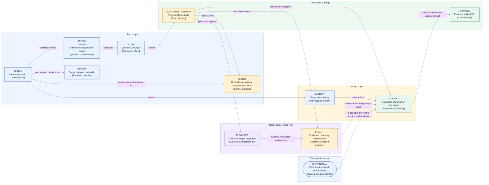

# Data and identity — identity representation, fences, and schema families

This page consumes [D9](./decisions/D9-invariants-and-artifact-shape.md) deferral categories 2
(schemas) and 6 (controller, Operation, finalization-authority, Candidate, target, and effect-fence
representation). It realizes the identity and binding table of the [canonical model](./model.md) as
concrete representations; the binding rule itself — a stale, duplicate, late, wrong-role,
wrong-subject, wrong-basis, or wrong-fence result cannot advance state — stays fixed (I7). Every
statement here is a proposed Layer 2 selection, not a current-state claim.

## Identity representation

Every canonical identity kind is represented as a **hierarchical, human-readable, collision-free
path**. The rejected alternatives were flat opaque unique tokens (provenance would migrate into
mutable metadata that recovery cannot trust) and identities derived from names such as branches or
titles (a rename would silently break exact binding).

| ID kind        | Model identity          | Path pattern                                     | Collision-free scoping rule                                                                                                                                                                                                       |
| -------------- | ----------------------- | ------------------------------------------------ | --------------------------------------------------------------------------------------------------------------------------------------------------------------------------------------------------------------------------------- |
| `ID-RUN`       | Run identity            | `run-<sortable unique token>`                    | Minted once at intake acknowledgement; the token class is time-sortable and unique in the controlled run scope.                                                                                                                   |
| `ID-STORY`     | Story identity          | `<run>/story/<plan story key>`                   | Plan story keys are frozen and unique in the approved plan; preflight rejects duplicates before any Story effect.                                                                                                                 |
| `ID-TXN`       | Transition identity     | `<run>/txn/<position>/<gen>` plus record digest  | Position claim qualified by the proposing controller generation; valid only together with the record digest, so competing proposals at one head can never share an identity.                                                      |
| `ID-OP`        | Operation identity      | `<txn>/op/<ordinal>`                             | Ordinal within the single authorizing Transition; it inherits the qualified Transition identity, and one semantic effect keeps one identity across redispatch.                                                                    |
| `ID-CAND`      | Candidate identity      | `<story>/cand/<ordinal>` plus content digest     | Ordinal within the owning Story; the identity is only valid together with its exact content digest.                                                                                                                               |
| `ID-GEN`       | Controller generation   | `<run>/gen/<ordinal>` plus instance token        | Claimed by conditional append of a generation-claim record carrying a unique controller instance token; the ordinal is valid only together with its recorded token, so racing restarts can never share a current generation (I6). |
| `ID-PRINCIPAL` | Participant principal   | `principal/<configured participant key>`         | The stable configured identity of one human or agent participant; every role session binds to exactly one principal, and the binding survives session replacement.                                                                |
| `ID-TARGET`    | Configured target       | `target/<canonical target key>`                  | Canonical and cross-Run: derived from the configured target's normalized locator, so two Runs naming the same target derive the same identity. Preflight freezes and validates it per Run.                                        |
| `ID-AUTH`      | Finalization authority  | `<target>/auth/<ordinal>`                        | Monotonic per canonical target across all Runs, allocated from the target-authority registry below; exactly one ordinal is current for a target (I12).                                                                            |
| `ID-EVSUBJ`    | Evidence subject        | URI embedding exactly one existing identity path | Names one Run, Story, Candidate, Operation, or target fact plus one claim name; never a free-form subject.                                                                                                                        |
| `ID-PARK`      | Owner decision identity | `<run>/park/<ordinal>`                           | Monotonic per Run; binds the exact question, authorized responder scope, and the later selected action.                                                                                                                           |

Representation rules:

- **Transition identity is a qualified position claim.** `ID-TXN` combines the expected position
  with the proposing controller generation and is valid only together with the record digest.
  Lost-acknowledgement readback therefore resolves "by stable identity and expected prior
  position" ([D5](./decisions/D5-state-authority-and-recovery.md),
  [state and recovery](./state-and-recovery.md)) with a strict match rule: **confirmed committed**
  only when position, proposing generation, and record digest all match; a record at the expected
  position with a different generation or digest confirms this proposal **absent** and fences the
  proposer. An identity match alone never proves commitment.
- **Ownership tokens arbitrate; they never decide.** The controller instance token inside a
  generation claim exists only to distinguish racing claimants at the conditional append; it is
  excluded from deterministic decision inputs (I4) and acts purely as a fence component.
- **Target identity and finalization authority are cross-Run.** `ID-TARGET` is canonical to the
  target, not to a Run, and `ID-AUTH` ordinals are allocated from one durable, conditional-append
  **target-authority registry** keyed by canonical target identity and shared by every Run the
  deployment hosts. A controller acquires and releases finalization authority through the registry
  (the authoritative cross-Run arbiter, satisfying the same commit-primitive contract as the Run
  ledger) and mirrors each acquisition and release into its own Run ledger for audit. Two Runs
  naming the same target therefore contend for one authority line instead of deriving independent
  ones (QS4, I12, D6). A target that no configured registry can arbitrate — for example the same
  remote target driven from uncoordinated deployments — is explicitly unarbitrated: preflight
  fails such a Run closed rather than letting it finalize on an assumption
  ([persistence and projections](./persistence-and-projections.md) owns the registry realization).
- **Identity strings never encode secrets.** Path segments carry only frozen envelope facts and
  controller-assigned ordinals or positions; credential or secret material is never a segment
  (project-brief QS10).
- **Renames are impossible** because identities are never derived from mutable names. A branch,
  title, or provider display name may change without touching any identity or binding.
- Identities are immutable once minted, and a child path is minted only under an existing parent,
  so every identity carries its complete provenance chain in its own string.

## Effect-fence representation

The effect fence deferred by D5 and D6 is an **explicit recorded tuple**, persisted with the
Operation intent and echoed by every result:

1. the current controller generation (`ID-GEN`);
2. the finalization-authority generation (`ID-AUTH`) where the Operation is target-scoped, omitted
   otherwise;
3. the exact Candidate content digest where the Operation is Candidate-sensitive;
4. the target-basis digest the effect was computed against; and
5. the capability binding reference under which the mechanism was authorized (defined in
   [mechanism and provider contracts](./mechanism-and-provider-contracts.md)).

A result that does not carry the exact expected fence tuple fails closed and cannot advance state
(I7); a stale pre-interruption dispatcher is thereby rejected by content, not by timing (I6). The
fence is validated by `CP-MEDIATOR` at the port boundary before any trigger reaches the transition
engine; for the ledger commit primitive, the equivalent identity, position, and digest validation
is performed by the transition engine's commit protocol itself
([control plane](./components/control-plane.md)).

## Schema families

| ID               | Schema family                            | Covers                                                                                                              |
| ---------------- | ---------------------------------------- | ------------------------------------------------------------------------------------------------------------------- |
| `SCH-ENVELOPE`   | Execution Envelope                       | Approved plan, frozen policy, and validated configuration; frozen at preflight as the Run basis.                    |
| `SCH-TRANSITION` | Transition record                        | Ordered validated trigger reference, deterministic decision, authorized Operation intents, expected prior position. |
| `SCH-OPERATION`  | Operation record and result              | Intent, payload-basis digest, the recorded fence tuple, attested result or failure, and effect certainty.           |
| `SCH-VERDICT`    | Reviewer verdict and finding             | Exact Candidate binding, reviewer attribution, findings with resolution state, approval or required changes.        |
| `SCH-EVIDENCE`   | Evidence manifest and artifact reference | Evidence subject URI, producer attribution, completeness claim, and digest references into `RT-EVIDENCE`.           |
| `SCH-ESCALATION` | Escalation and parked question           | The bounded named question, its authority scope, wake condition, and deadline class.                                |
| `SCH-DECISION`   | Owner decision                           | Responder identity, validated delegated scope, the selected action, and continuation or stop.                       |
| `SCH-OBLIGATION` | Residual Obligation                      | Affected resource or proof obligation, reason, preservation evidence, accountable owner, and residual status.       |

Schema style rules, uniform across the families:

- Every durable record is a **versioned, self-describing structured document** with an explicit
  `schemaVersion`; a record without a known version is rejected, never guessed at.
- Every inbound document is **validated at the port boundary before use** (I7); control records
  **reject unknown fields** so a compromised or drifted producer cannot smuggle meaning past
  validation.
- **Bulky payloads live in the evidence artifact store** and are referenced by digest from the
  ledger-side record; they are never inlined into control records.
- **Credentials and secrets are structurally unrepresentable**: no schema family defines a
  secret-bearing field, so redaction is not relied on for durable records (QS10).

Schema evolution is **additive versioning with upcast-on-read**: a new version may add optional
meaning, a reader upcasts older records deterministically at read time, and a durable record is
**never rewritten in place** — aligning with the ledger realization in
[persistence and projections](./persistence-and-projections.md). The rejected alternative,
migrate-by-rewrite, would destroy the audit property that recorded history is immutable (I5).

## View V8 — identity scopes and bindings

- **Question:** Which identity scope owns which identities, and what does each identity bind?
- **View type:** Data/identity structure view; the diagram form of the model.md binding table under
  this page's representations.
- **Audience and purpose:** Engineers and reviewers checking that every binding in the canonical
  model has exactly one represented identity and fence path.
- **Scope and exclusions:** Identity kinds, their scoping, and what they bind. Record layouts,
  ledger positions, storage, and lifecycle progression are excluded.
- **State:** Proposed.
- **Owner:** Arye Kogan.
- **Sources:** [Canonical model](./model.md) identity table; D5, D6, D9 categories 2 and 6;
  I5–I7, I12, I17.
- **Related views:** [V6](./runtime.md) owns the units and ports these identities cross;
  [V9/V9a](./lifecycle-catalogs.md) own the lifecycles these identities progress through;
  [V4](./state-and-recovery.md) owns durable-authority classification.

**V8 legend:** Every rectangle is one identity kind from the table above, labeled with its `ID-*`
kind, a compact form of its path pattern (`n` abbreviates an ordinal, `…` a unique token, and
`gen`/`token`/`digest` the qualifying components), and a bracketed role; the rounded rectangle is
the participant principal, and the fence node is the recorded tuple inside `SCH-OPERATION`, not an
identity. Thick borders mark the two authoritative bindings: the qualified Transition position
claim and the fence tuple that every result must match exactly. Yellow nodes are control or
finalization authority, blue nodes plain identities or the principal, green nodes exact-subject
bindings, and the purple node the canonical cross-Run target; regions group identities by owning
scope, and the target scope is deliberately outside the Run scope because its authority line is
shared by all Runs through the target-authority registry. Color is redundant with IDs and types.
All edges are solid directed containment, numbering, authorization, or binding relationships; no
dashed style is used in this view. An `ID-EVSUBJ` URI names exactly one Run, Story, Candidate,
Operation, or target fact.

## Exclusions — owned by sibling pages

- Ledger record encoding, positions, snapshots, and projections (`LG-*`):
  [persistence and projections](./persistence-and-projections.md).
- Evidence integrity, redaction, retention, and access rules (`EVR-*`):
  [evidence handling](./evidence-handling.md).
- Event, Operation, and failure-code catalogs (`EV-*`, `OPC-*`, `FC-*`):
  [lifecycle catalogs](./lifecycle-catalogs.md).
- Capability bindings referenced by the fence tuple (`CB-*`):
  [mechanism and provider contracts](./mechanism-and-provider-contracts.md).

## Where to go next

- The lifecycles these identities progress through: [lifecycle catalogs](./lifecycle-catalogs.md).
- How these records are committed, read, and projected:
  [persistence and projections](./persistence-and-projections.md).
- How evidence artifacts behind `ID-EVSUBJ` and the digests are handled:
  [evidence handling](./evidence-handling.md).
- The runtime units and ports these identities cross: [runtime architecture](./runtime.md).
