# Envelope production — tracks, configuration, setup, and Work Source

Jig has two deliberately different responsibility zones. The **Envelope Builder** is a bundled
product front end that helps an owner author and approve immutable Run input. `SYS-JIG` is the
authority-and-proof core that accepts that input and executes it. D2's `X-ENVELOPE` remains
external to the core's decision authority even when Jig ships both zones in one installation.

That separation is substantive: the builder may propose, explain, validate, and compose. It may
not authorize a Run Operation, append a lifecycle Transition, judge evidence sufficient, approve
its own proposal on the owner's behalf, or mutate an accepted Run.

## Envelope Builder responsibilities (`EP-*`)

| ID             | Responsibility                                                                                                                                                                                       | Authority limit                                                                                                                                |
| -------------- | ---------------------------------------------------------------------------------------------------------------------------------------------------------------------------------------------------- | ---------------------------------------------------------------------------------------------------------------------------------------------- |
| `EP-SOURCE`    | Invoke a configured Work Source through `PORT-SOURCE` under `ID-SOURCE-REQ`; validate the revision/cursor-bound result identity, content digest, provenance, and plan shape.                         | Candidate work is unapproved input. Retry is bounded; changed content creates a new candidate and cannot bypass validation or create a Run.    |
| `EP-TRACK`     | Resolve one track identity and its plan, policy, and work profile; reject ambiguous or cross-track composition.                                                                                      | One envelope carries exactly one track.                                                                                                        |
| `EP-FLOORS`    | Compose repo-policy floors with the track policy and emit a proof that every floor is preserved or tightened.                                                                                        | Composition cannot weaken a repo floor; an unknown rule fails closed.                                                                          |
| `EP-PROFILE`   | Validate the named work profile: model/provider choice, effort, prompt-strategy reference, and role realization.                                                                                     | A work profile may change cost or behavior but cannot lower policy, authority, provider-posture floors, evidence, or review requirements.      |
| `EP-PROVIDERS` | Bind each selected provider to an approved authority-manifest digest and qualifying conformance evidence; for the Agent provider, select one exact native permission posture and declared semantics. | A missing, changed, stale, insufficient, or policy-incompatible posture keeps the envelope unlaunchable.                                       |
| `EP-SETUP`     | Validate the declared workspace setup recipe, its input-fingerprint rule, and its required authority.                                                                                                | The builder declares setup; execution remains an authorized `PORT-WORKSPACE` Operation.                                                        |
| `EP-GUIDANCE`  | Offer versioned presets and explanations for policy, work profile, provider posture, and setup.                                                                                                      | Guidance is never authority and never becomes a hidden default.                                                                                |
| `EP-COMPOSE`   | Produce the canonical composition report and digest over every resolved input.                                                                                                                       | Any input change creates a new proposal and digest.                                                                                            |
| `EP-APPROVE`   | Present the exact proposal to the owner and bind the recorded approval to its digest and scope.                                                                                                      | Only the owner or an authorized configuration delegate may approve; the builder never self-approves.                                           |
| `EP-SUBMIT`    | Submit the approved `SCH-ENVELOPE` through `PORT-INTAKE`, using its composition digest as submission identity, and retain or recover `SCH-INTAKE-ACK`.                                               | Same-digest resubmission returns the existing acknowledgement/`ID-RUN`; a different digest is new. Submission never implies preflight success. |

## Canonical input composition

The builder produces one versioned `SCH-ENVELOPE` whose digest covers:

1. track identity and the exact approved execution-plan digest;
2. repo-policy-floor digest, track-policy digest, and their deterministic composition report;
3. the named work-profile digest and every referenced prompt/role artifact digest;
4. provider identities, capability requirements, approved authority-manifest digests, the exact
   Agent-provider native permission-posture reference and declared semantics, and qualifying
   conformance-evidence references;
5. target, integration strategy, capacity, storage, and other validated configuration;
6. the setup recipe and its freshness-input declaration; and
7. owner approval identity, scope, and proposal digest.

There is no ambient fallback. An omitted required artifact, unknown version, unverifiable
provenance, floor violation, changed authority manifest, or unbound reference makes the proposal
invalid. `PORT-INTAKE` independently validates the submitted envelope and freezes its digest; it
does not trust the builder's success claim.

### Intake idempotency

`PORT-INTAKE` conditionally creates `LG-INTAKE` by composition digest. The first submission binds
one immutable acknowledgement and `ID-RUN`; a duplicate returns that exact value, and a lost
acknowledgement is recovered by digest lookup. Only a different composition digest is a new
submission. The submitter can therefore retry after ambiguity without forking two Runs from one
approval.

## Policy and work profile

The split is structural rather than editorial:

- **Policy** owns governance: acceptance and review strength, authority categories, anti-gaming
  floors, escalation posture, confinement minima, required checks, capacity maxima, and bounds.
- **Work profile** owns realization: agent/model selection, effort and cost posture, versioned
  prompt strategy, and the participant/provider realization of implementer and reviewer roles.

The composition report proves that no work-profile field is consulted as a safety-floor value.
When a work-profile choice cannot satisfy policy — for example a provider lacks a required
capability or independent reviewer principal — the envelope fails before Run creation instead of
silently reducing the requirement.

## Guided setup and presets

Presets are immutable, versioned proposal inputs with a human-readable rationale, suitable-use
conditions, and explicit trade-offs. Applying one records its identifier and digest, expands it
into ordinary visible policy/profile/configuration fields, and lets the owner inspect and override
those fields. The expanded values, not the preset name, are authoritative.

Prompt strategies are versioned work-profile references. Dynamic, templated, and stable role
prompts are all legal when their exact content or generator version is digest-bound. Hidden
provider intuition is not configuration provenance.

## Work Source seam (`PORT-SOURCE`)

`PORT-SOURCE` is the fourth product-level swappable seam. It belongs to envelope production, not
the active Run authority core. A conforming Work Source:

- returns candidate work with stable source identity and provenance;
- accepts one stable `ID-SOURCE-REQ` over the normalized request basis and returns
  `SCH-SOURCE-EXCHANGE` with stable item key, revision/cursor, content digest, and attestation;
- supports repeatable lookup of that exact result identity, so refresh cannot silently substitute
  different work;
- retries within `BND-RETRY`; exhaustion fails the envelope-production request before any Run or
  Story exists;
- passes the same identity, authority-manifest, conformance, and adversarial-probe bar as other
  providers; and
- has no path to `PORT-INTAKE`, `CP-TRANSITION`, the ledger, or delivery Operations except through
  a newly composed and owner-approved envelope.

The hard input boundary remains an approved plan. A Work Source makes plan candidates easier to
obtain; it does not convert an issue, ticket, or provider assertion directly into executable work.
A refresh that returns a changed revision or content digest creates a new source result, candidate,
and envelope proposal. It never mutates an earlier candidate or approved envelope.

## Re-planning and successor Runs

The active envelope is immutable. Prevention-leaning policy may quarantine affected work and
request re-planning, but the result is a **successor envelope** and a **successor Run** carrying:

- the predecessor Run and envelope identities;
- the durable reason and affected Story/root-blocker set;
- the new plan, policy, work profile, and evidence bases; and
- a fresh owner approval over the successor composition digest.

The predecessor remains reconstructible and is never rewritten. Independent work may land before
the successor according to the predecessor's frozen policy; no successor fact is retroactively
inserted into it.

## View V18 — product front end to authority core

- **Question:** How do candidate work and owner configuration become an immutable approved envelope
  without giving the builder or Work Source active-Run authority?
- **View type:** Runtime/supporting boundary view across the Jig product front end and V1.
- **Audience and purpose:** Owners, implementers, provider authors, and security reviewers; locate
  configuration ownership and the fourth provider seam before implementation planning.
- **Scope and exclusions:** Envelope production and submission. Story execution, setup-command
  execution, review, finalization, and landing remain in the existing Layer 2 views.
- **State:** Owner-approved product-readiness amendment; lock pending exact-candidate review.
- **Owner:** Arye Kogan.
- **Sources:** CFG-2/3/5/6/8, STACK-2, D2, D13.
- **Related views:** [V1](./context.md) owns `X-ENVELOPE` and `SYS-JIG`; [V6](./runtime.md) opens the
  authority core; [V12](./mechanism-and-provider-contracts.md) owns provider trust.

```mermaid
%%{init: {"theme": "base", "themeVariables": {"fontFamily": "Inter, ui-sans-serif, system-ui", "primaryTextColor": "#172033", "lineColor": "#65758b"}}}%%
flowchart LR
    Owner(["P-OWNER<br/>Owner or configuration delegate<br/>[Approval authority]"])
    subgraph SourceZone["Candidate-work providers"]
        Source["X-WORK-SOURCE<br/>Configured Work Source<br/>[External provider]"]
    end
    subgraph FrontEnd["Jig product front end, outside Run authority"]
        Builder["EP-BUILDER<br/>Validate · compose · explain<br/>[Envelope Builder]"]
        Proposal["SCH-ENVELOPE<br/>Exact proposal and composition digest<br/>[Immutable proposal]"]
    end
    subgraph Core["SYS-JIG authority-and-proof boundary"]
        Intake["PORT-INTAKE<br/>Independent validation and freeze<br/>[Core port]"]
        Controller["RT-CONTROLLER<br/>Run lifecycle authority<br/>[Trusted runtime]"]
    end

    Source -->|"supplies candidate work and provenance through PORT-SOURCE to"| Builder
    Builder -->|"produces exact"| Proposal
    Proposal -->|"presents for approval to"| Owner
    Owner -->|"approves the exact composition digest of"| Proposal
    Proposal -->|"submits only after approval through"| Intake
    Intake -->|"freezes a valid envelope for"| Controller

    style SourceZone fill:#f3edff,stroke:#8a6eb0,color:#172033
    style FrontEnd fill:#eef5ff,stroke:#7a96bd,color:#172033
    style Core fill:#fff6dd,stroke:#b8903a,color:#172033
    classDef person fill:#e8f1ff,stroke:#5a78a8,color:#172033
    classDef provider fill:#f1e9ff,stroke:#8061a8,color:#172033
    classDef builder fill:#e8f1ff,stroke:#5a78a8,color:#172033
    classDef artifact fill:#edf8f0,stroke:#659574,color:#172033
    classDef core fill:#fff1cf,stroke:#a8781f,stroke-width:3px,color:#172033
    class Owner person
    class Source provider
    class Builder builder
    class Proposal artifact
    class Intake,Controller core
```

**V18 legend:** The rounded node is a person; rectangles are a provider, builder, artifact, port,
or runtime. Purple is the external Work Source zone, blue the product front end outside Run
authority, and yellow the trusted core. Thick yellow borders mark the authority boundary. Every
solid arrow carries candidate input, a proposal, approval, or validated intake; no Work Source
arrow reaches the core. Color is redundant with IDs and bracketed types. `EP` means
envelope-production responsibility and `SCH` a schema family.

## Exclusions and next reading

- Setup execution and freshness receipts: [mechanism and provider contracts](./mechanism-and-provider-contracts.md).
- Envelope and manifest schemas: [data and identity](./data-and-identity.md).
- Active-Run intake and controller processes: [runtime architecture](./runtime.md).
- Why this boundary was selected: [D13](./decisions/D13-envelope-production-boundary.md).
