# Evidence handling — storage, attribution, integrity, redaction, and retention

This page realizes the [acceptance and evidence](./acceptance-and-evidence.md) artifact rule at
Layer 2, consuming
[D9 category 8](./decisions/D9-invariants-and-artifact-shape.md#consolidated-deliberate-layer-2-deferrals)
(evidence storage, attribution, integrity, redaction, encryption, access, size, retention, and
archival). The evidence roles and the trusted-envelope boundary of
[D7](./decisions/D7-acceptance-and-evidence.md) are fixed inputs; this page decides only how
evidence is persisted, bound, protected, and kept.

## Storage model

- **`EVR-DIGEST`:** every evidence artifact is immutable and content-addressed: its SHA-256 content
  digest is its artifact identity. Two byte-identical artifacts are one artifact; a changed byte is
  a different artifact, never a new version of the old one.
- **`EVR-MANIFEST`:** artifacts live in `RT-EVIDENCE` behind `PORT-ARTIFACT`
  ([runtime](./runtime.md)); the ledger records bounded decision facts plus an evidence manifest —
  subject, producer, digest, size, kind, and completeness — and never inlines bulky payloads,
  realizing the Layer 1 rule that bulky evidence stays in immutable, bounded supporting artifacts.
- **`EVR-ADOPT`:** `CP-EVIDENCE` first proposes an `OPC-ART-PUT` or `OPC-ART-GET` intent;
  `CP-TRANSITION` commits that intent before `CP-MEDIATOR` dispatches it. The store's result,
  certainty, or failure returns only as validated `EV-ARTIFACT-FACT`. Only after that event and
  its adopting Transition commit may the manifest claim the artifact present, readable, or
  failed. A store receipt outside this path is not evidence.

Rejected alternatives: inlining evidence into ledger records (bloats the ordered authority) and
location-addressed mutable evidence (identity would not survive relocation or prove tampering).

## Attribution and subject binding

| ID             | Evidence rule       | Obligation                                                                                                                                                              |
| -------------- | ------------------- | ----------------------------------------------------------------------------------------------------------------------------------------------------------------------- |
| `EVR-PRODUCER` | Producer binding    | Every artifact is bound at write time to its producer identity — implementer, reviewer, or named mechanism — validated at the receiving port before persistence.        |
| `EVR-SUBJECT`  | Subject binding     | Every artifact is bound at write time to its exact evidence subject: the Run, Story, Candidate, Operation, or target fact whose claim it supports (I7).                 |
| `EVR-VALID`    | Binding is gating   | An artifact without a valid producer and subject binding is not evidence; it cannot satisfy any required-evidence obligation and cannot contribute to any decision.     |
| `EVR-ENVELOPE` | Envelope limit (D7) | Jig's trusted-envelope metadata proves provenance, correlation, completeness, and integrity; it never makes the underlying claim true merely because it is well formed. |

## Integrity

- **`EVR-VERIFY`:** every artifact read re-verifies content against the manifest digest; a read
  that cannot verify returns an integrity failure, never silently repaired or partial content.
- **`EVR-FAIL`:** a failed digest verification is an evidence-integrity failure: the depending
  decision fails closed (I7) rather than proceeding on unverifiable input.
- **`EVR-COMPLETE`:** manifests record completeness per decision, so a missing required artifact is
  a detectable, named gap — not a silent absence a decision can skip past.

## Redaction and secrecy

- **`EVR-REDACT`:** producers redact at source; a role session or mechanism must not emit
  credential or secret values as evidence in the first place.
- **`EVR-SCAN`:** the controller additionally validates candidate evidence against configured
  secret patterns in `CP-EVIDENCE` before persistence; trusting source redaction alone was
  rejected because one faulty producer would defeat QS10.
- **`EVR-QUARANTINE`:** a detected secret quarantines the artifact — never durably persisted — and
  raises a Story-scoped failure (I15); credential and secret values never appear in durable
  evidence or outcomes (QS10).

## Size, encryption, and access

Owner-reviewable defaults:

| Policy class           | Default             | Allowed range / alternatives | Deterministic behavior                                                                                                                                                                                       |
| ---------------------- | ------------------- | ---------------------------- | ------------------------------------------------------------------------------------------------------------------------------------------------------------------------------------------------------------ |
| Evidence artifact size | 10 MiB per artifact | 64 KiB–1 GiB                 | Default `reject`. Policy may select `truncate-with-recorded-loss` for non-completeness-critical kinds; truncation records original/retained sizes and can never satisfy a completeness-critical requirement. |

- **`EVR-SIZE`:** every evidence kind selects the bounded class above. Oversize evidence is either
  truncated with a named, recorded loss or rejected, per the
  kind's declared behavior — never silently dropped or silently trimmed.
- **`EVR-ENCRYPT`:** encryption at rest is a configuration option of the artifact-store mechanism
  behind `PORT-ARTIFACT`; its attested posture cannot silently downgrade a policy minimum.
- **`EVR-ACCESS`:** evidence access is read-only through the operator interface and `PORT-PUBLISH`
  projections, scoped to authorized readers; no reader path can mutate an artifact or its binding.

## Retention and archival

The **owner-reviewable default** retention window is 90 days after Run settlement; policy may
select seven days through seven years by evidence kind. An open obligation, preservation duty, or
unexpired audit requirement overrides the elapsed window and forbids disposal until it closes.

- **`EVR-RETAIN`:** an artifact is preserved at least until its Run completes and every depending
  obligation closes (I19); afterwards, policy retention classes govern each evidence kind.
- **`EVR-ARCHIVE`:** archival relocates artifacts with digests unchanged; because identity is the
  digest (`EVR-DIGEST`), identity and verifiability survive relocation.
- **`EVR-DISPOSE`:** destructive disposal is an explicit, owner-authorized retirement action with a
  durable record; it is never a side effect of cleanup, compaction, or storage convenience.

## Terminal audit export

The finished audit export uses the same immutable artifact path but is not decision evidence. Its
canonical redacted bytes cover the ledger from its first position through the
**terminal-settlement position**, the business-final cut, and `SCH-AUDIT-EXPORT` names that exact
range. The export receipt and any export-failure `ID-OBLIGATION` are post-terminal administrative
records outside the exported range, so neither is required to exist inside the bytes whose write
it reports. The bytes include the terminal-settlement position and manifest;
their SHA-256 digest is `ID-EXPORT`. `OPC-ART-PUT` is create-once by that digest: recovery may
verify an identical artifact or complete an absent write, but no path may replace existing bytes.
The post-terminal ledger record stores the digest, size, covered range, redaction-policy version,
and immutable store receipt. An unreadable or digest-mismatched export is an integrity failure and remains an
explicit residual obligation; the system never silently regenerates different terminal bytes.

### View V13 — evidence dataflow

- **Question:** How does one piece of evidence travel from its producer to the decisions that
  depend on it while staying attributable, bounded, redacted, and tamper-evident?
- **View type:** Component-level evidence dataflow across `PORT-ARTIFACT`.
- **Audience and purpose:** Engineers, architects, security, and operations; see where binding,
  redaction validation, persistence, and digest-verified reads happen before reading schema detail.
- **Scope and exclusions:** The dataflow from producers through redaction and validation into the
  durable stores and out to readers. Evidence schemas, reviewer protocol, storage backends, and
  operator read-model composition are excluded.
- **State:** Approved (not locked).
- **Owner:** Arye Kogan.
- **Sources:** D7, D9 category 8; I7, I15, I19; QS10;
  [acceptance and evidence](./acceptance-and-evidence.md); [runtime V6](./runtime.md).
- **Related views:** [V6](./runtime.md) places the stores; [V4](./state-and-recovery.md) owns the
  Layer 1 authority relationships; [V16](./operations-and-observability.md) owns the operator
  surfaces that read these artifacts.

```mermaid
%%{init: {"theme": "base", "themeVariables": {"fontFamily": "Inter, ui-sans-serif, system-ui", "primaryTextColor": "#172033", "lineColor": "#65758b"}}}%%
flowchart LR
    subgraph Producers["Evidence producers"]
        People(["P-IMPLEMENTER · P-REVIEWER<br/>Attributable judgment producers<br/>[Hosted roles]"])
        Mech["X-WORKSPACE · X-VERIFY · X-DELIVERY<br/>Observing mechanisms<br/>[External mechanisms]"]
    end

    subgraph Controller["RT-CONTROLLER evidence handling"]
        Binder["CP-EVIDENCE<br/>Evidence binder<br/>binds · redacts · validates<br/>[Controller component]"]
        Transition["CP-TRANSITION<br/>Commits artifact intent and result event<br/>[Authority component]"]
        Mediator["CP-MEDIATOR<br/>Dispatches and validates PORT-ARTIFACT<br/>[Boundary component]"]
        Quarantine["EVR-QUARANTINE<br/>Quarantined artifact<br/>never durably persisted<br/>[Story-scoped failure]"]
    end

    subgraph Durable["Durable stores"]
        Artifact[("RT-EVIDENCE<br/>Content-addressed artifacts<br/>SHA-256 digest is identity<br/>[Immutable artifact store]")]
        Ledger[("RT-LEDGER<br/>Evidence manifests and decision facts<br/>[Durable authority]")]
    end

    subgraph Readers["Evidence readers"]
        Decide["Acceptance · final verification · landing proof<br/>Digest-verified decision reads<br/>[Decision consumers]"]
        Observe["RT-OPERATOR and X-CONSUMER<br/>Read-only explanation reads<br/>[Read-only readers]"]
    end

    People -->|"submit attributed evidence via PORT-SESSION to"| Binder
    Mech -->|"attest observed facts via their ports to"| Binder
    Binder -->|"proposes OPC-ART-PUT/GET intent to"| Transition
    Transition -->|"commits intent before effect in"| Ledger
    Transition -->|"dispatches authorized artifact Operation through"| Mediator
    Mediator -->|"writes or reads via PORT-ARTIFACT"| Artifact
    Artifact -->|"returns result/certainty/failure as EV-ARTIFACT-FACT through"| Mediator
    Mediator -->|"submits validated artifact fact to"| Transition
    Transition -->|"commits event and adopted manifest in"| Ledger
    Binder -.->|"quarantines detected secret material and raises Story-scoped failure as"| Quarantine
    Artifact -->|"serves digest-verified artifact reads to"| Decide
    Ledger -->|"proves required-evidence completeness to"| Decide
    Artifact -.->|"publishes redacted read-only views via PORT-PUBLISH to"| Observe

    style Producers fill:#f3edff,stroke:#8a6eb0,color:#172033
    style Controller fill:#fff6dd,stroke:#b8903a,color:#172033
    style Durable fill:#eef5ff,stroke:#7a96bd,color:#172033
    style Readers fill:#edf8f0,stroke:#659574,color:#172033
    classDef person fill:#e8f1ff,stroke:#5a78a8,color:#172033
    classDef mechanism fill:#f1e9ff,stroke:#8061a8,color:#172033
    classDef component fill:#fff1cf,stroke:#a8781f,color:#172033
    classDef authority fill:#fff1cf,stroke:#a8781f,stroke-width:3px,color:#172033
    classDef fault fill:#fce8e6,stroke:#a7615b,stroke-dasharray:5 3,color:#172033
    classDef store fill:#e8f1ff,stroke:#5a78a8,stroke-width:3px,color:#172033
    classDef decision fill:#e8f7ed,stroke:#4f8a63,color:#172033
    classDef consumer fill:#f4f5f7,stroke:#7c8798,stroke-dasharray:5 3,color:#172033
    class People person
    class Mech mechanism
    class Binder,Mediator component
    class Transition authority
    class Quarantine fault
    class Artifact,Ledger store
    class Decide decision
    class Observe consumer
```

**V13 legend:** The rounded rectangle groups the human-judgment producers; ordinary rectangles are
mechanisms, components, or readers; cylinders are durable stores. Thick blue borders mark durable
stores whose recorded content is authoritative. The dashed red border and dashed quarantine edge
mark the detected-secret failure path, which never reaches durable storage; the dashed gray border
and dashed publication edge mark read-only access with no control authority. Solid lines are the
authoritative write and digest-verified read dataflow. Purple is external, yellow the controller
region, blue durable content, and green decision consumers; color is redundant with the stable IDs
and bracketed types. `EVR` abbreviates evidence rule and `CP` controller component.

## Exclusions

- Evidence and verdict schemas and manifest field shapes:
  [data and identity](./data-and-identity.md).
- Reviewer protocol and check execution:
  [review and verification execution](./review-and-verification-execution.md).
- Read models, exports, and alerting over evidence completeness:
  [operations and observability](./operations-and-observability.md).

## Where to go next

- The Layer 1 evidence roles and limits this page realizes:
  [acceptance and evidence](./acceptance-and-evidence.md).
- Why reviewer-principal acceptance bounds what evidence can prove:
  [D7 — acceptance and evidence](./decisions/D7-acceptance-and-evidence.md).
- The shapes these artifacts and manifests carry: [data and identity](./data-and-identity.md).
